# &#x1F9EC; EADS: Evolutionary Autonomous Development System

## &#x1F680; Paradigm-Shifting Software Engineering

EADS represents a revolutionary approach to autonomous software development, leveraging advanced AI, genetic programming, and adaptive learning to create a self-evolving software engineering ecosystem.

This project aims to build an Evolutionary Automated Development System (EADS) for generating, testing, and refining software applications through iterative evolution. EADS leverages the power of Large Language Models (LLMs), Genetic Programming (GP), and advanced analysis techniques to create robust and adaptable software.  This system is designed to be highly scalable, resilient, and adaptable to various software development tasks, exceeding the capabilities of traditional manual or even simpler automated systems.

### &#x1F52D; Core Innovation

At its heart, EADS is not just another development tool&#x2014;it's an intelligent, self-improving system that learns, adapts, and generates high-quality software with minimal human intervention.

## &#x2728; Key Features

### Intelligent Code Generation
- &#x1F9E0; LLM-powered code synthesis
- &#x1F9EC; Genetic programming for optimization
- &#x1F50D; Semantic understanding via advanced embeddings

### Robust Quality Assurance
- &#x1F4CA; Comprehensive testing frameworks
  - Unit Testing
  - Integration Testing
  - Performance Optimization
  - Security Hardening

### Advanced Learning Mechanisms
- &#x1F504; Recursive self-improvement cycle
- &#x1F4DA; Semantic knowledge base
- &#x1F916; Decentralized AI engine

## &#x1F3D7;&#xFE0F; System Architecture

### Components

1. **Genetic Programming Engine**
   - Population-based code evolution using DEAP
   - Individual representation with code and fitness attributes
   - Configurable evolution parameters (population size, generations, mutation/crossover rates)
   - FastAPI-based service for evolution operations

2. **NLP Service**
   - Sentence Transformer-based code analysis
   - Semantic code pattern matching
   - Code similarity computation
   - FastAPI-based service for NLP operations

3. **Knowledge Management**
   - Neo4j Graph Database integration
   - Asynchronous database operations
   - Structured code pattern storage
   - Environment-based configuration

4. **Testing & Quality Assurance**
   - Comprehensive test suite with pytest
   - Pre-commit hooks for code quality
   - Type checking with mypy
   - Linting with flake8 and black

## &#x1F31F; Unique Selling Points

- &#x1F510; Self-securing code generation
- &#x1F4A1; Adaptive learning paradigms
- &#x1F680; Reduced human intervention
- &#x1F30E; Scalable, cloud-native architecture

## &#x1F6E0;&#xFE0F; Technology Stack

- **Core Services**:
  - FastAPI
  - Python 3.10+
  - Pydantic
  - Uvicorn
- **Infrastructure**:
  - Docker
  - Docker Compose
  - PostgreSQL
- **Genetic Programming**:
  - DEAP
- **NLP & ML**:
  - Sentence Transformers
  - TensorFlow Keras
- **Database**:
  - Neo4j (AuraDB)
- **Development Tools**:
  - pre-commit
  - pytest
  - mypy
  - black
  - flake8
  - isort

## Technology Stack Details

| Component                    | Technology               | Description & Usage                                                                                           |
|-----------------------------|-------------------------|-------------------------------------------------------------------------------------------------------------|
| **Core Framework**          |                         |                                                                                                             |
| Web Framework               | FastAPI 0.110.0+        | High-performance async web framework for building APIs with automatic OpenAPI documentation                  |
| Python Runtime              | Python 3.8+             | Modern Python version with support for type hints and async/await                                           |
| API Documentation           | OpenAPI/Swagger         | Interactive API documentation and testing interface                                                         |
| Server                      | Uvicorn 0.27.0+        | Lightning-fast ASGI server implementation                                                                   |
| Configuration              | Pydantic 2.5.0+        | Data validation, settings management, and schema definition                                                 |
| **Infrastructure**          |                         |                                                                                                             |
| Containerization           | Docker                  | Container-based deployment with microservices architecture                                                  |
| Orchestration              | docker-compose          | Multi-container application orchestration                                                                   |
| Metadata Storage           | PostgreSQL              | Relational database for experiment tracking and metrics                                                     |
| **Genetic Programming**     |                         |                                                                                                             |
| Evolution Framework         | DEAP 1.4.1+            | Primary framework for evolutionary computation and genetic programming                                       |
| Alternative Framework       | PyGAD 3.2.0+           | Alternative genetic algorithm implementation for specific use cases                                         |
| **NLP & Machine Learning**  |                         |                                                                                                             |
| Text Embeddings            | Sentence Transformers 2.5.0+ | Neural network models for code embedding generation                                                    |
| Deep Learning              | TensorFlow 2.15.0+      | Deep learning framework for model training                                                                 |
| Code Analysis              | Tree-sitter 0.20.4+     | Fast, accurate code parsing and analysis                                                                   |
| **Knowledge & Storage**     |                         |                                                                                                             |
| Graph Database             | Neo4j 5.15.0+           | Graph database for code patterns and relationships                                                         |
| Vector Database            | Weaviate 4.4.0+         | Vector search and storage for code embeddings                                                              |
| Environment Variables      | python-dotenv 1.0.0+    | Configuration management for sensitive data                                                                |
| **ML Ops & Tracking**      |                         |                                                                                                             |
| Experiment Tracking        | MLflow 2.10.0+          | ML experiment tracking and model management                                                                |
| Version Control            | DVC 3.38.1+             | Data and model version control                                                                             |
| Distributed Computing      | Ray 2.9.0+              | Distributed computing framework for scaling ML workloads                                                    |
| **LLM Integration**        |                         |                                                                                                             |
| LLM Framework              | LangChain 0.1.0+        | Framework for building LLM applications                                                                    |
| RAG Framework              | LlamaIndex 0.9.15+      | Framework for building RAG applications                                                                    |
| **Development Tools**       |                         |                                                                                                             |
| Type Checking              | mypy 1.8.0+             | Static type checking with strict enforcement                                                               |
| Code Formatting            | black 23.12.0+          | Code formatting with consistent style                                                                      |
| Import Sorting             | isort 5.13.0+           | Python import organization                                                                                 |
| Linting                    | flake8 7.0.0+           | Code quality enforcement                                                                                   |
| Git Hooks                  | pre-commit 3.6.0+       | Automated code quality checks                                                                              |
| **Testing**                |                         |                                                                                                             |
| Testing Framework          | pytest 7.4.0+           | Testing framework with fixture support                                                                     |
| Async Testing              | pytest-asyncio 0.23.5+  | Async test support                                                                                        |
| Coverage                   | pytest-cov 4.1.0+       | Test coverage reporting                                                                                    |

### Planned Components

The following components are planned for future implementation:

1. **Infrastructure & Deployment**
   - Kubernetes orchestration for production scaling
   - Enhanced monitoring and logging
   - Service mesh implementation

2. **Code Analysis & Verification**
   - CBMC/KLEE for formal verification
   - DynamoRIO/Frida for dynamic analysis
   - Additional vector store integration (Pinecone)

3. **Enhanced ML Capabilities**
   - CodeBERT integration
   - Additional language support in Tree-sitter
   - Expanded RAG capabilities

Each component in our current stack has been carefully selected and integrated into the system. The stack is modular by design, allowing for easy updates and replacements as the project evolves.

## &#x1F4AC; Vision

To create a self-healing, continuously improving software ecosystem that autonomously adapts to emerging technological landscapes.

## &#x1F527; Setup & Installation

### Prerequisites

- Python 3.8 or higher
- Docker and Docker Compose
- Git
- Linux environment (recommended)
- System packages:
  ```bash
  sudo apt-get update
  sudo apt-get install -y python3-venv python3-pip
  ```

### Environment Setup

1. **Clone the Repository**
   ```bash
   git clone https://github.com/nshkrdotcom/EADS.git
   cd EADS
   ```

2. **Run Setup Script**
   ```bash
   chmod +x setup.sh
   ./setup.sh
   ```
   This script will:
   - Install required system packages
   - Create Python virtual environment
   - Make initialization scripts executable

3. **Activate Virtual Environment**
   ```bash
   source .venv/bin/activate
   ```

4. **Install Dependencies**
   ```bash
   ./install_requirements.sh
   ```
   This installs:
   - Core dependencies (FastAPI, DEAP, etc.)
   - Development tools (black, flake8, etc.)
   - ML libraries (TensorFlow, Sentence Transformers)

5. **Environment Configuration**
   ```bash
   cp .env.example .env
   ```
   Configure the following in your `.env`:
   - Database connections (Neo4j, PostgreSQL)
   - Weaviate settings
   - Ray cluster configuration
   - MLflow tracking
   - DVC remote storage

## &#x1F4BB; Development Setup

### Prerequisites

1. **System Requirements**
   - Python 3.8 or higher
   - Docker and Docker Compose
   - Git
   - 8GB RAM minimum (16GB recommended)
   - 20GB free disk space

2. **Python Dependencies**
   ```bash
   sudo apt-get update
   sudo apt-get install -y python3-venv python3-pip
   ```

3. **Docker Installation**
   ```bash
   # Install Docker
   curl -fsSL https://get.docker.com -o get-docker.sh
   sudo sh get-docker.sh

   # Install Docker Compose
   sudo curl -L "https://github.com/docker/compose/releases/latest/download/docker-compose-$(uname -s)-$(uname -m)" -o /usr/local/bin/docker-compose
   sudo chmod +x /usr/local/bin/docker-compose
   ```

### Initial Setup

1. **Clone the Repository**
   ```bash
   git clone https://github.com/yourusername/EADS.git
   cd EADS
   ```

2. **Environment Setup**
   ```bash
   # Make scripts executable
   chmod +x setup.sh init.sh install_requirements.sh

   # Run setup script
   ./setup.sh
   ```

3. **Configure Environment Variables**
   ```bash
   # Copy example environment file
   cp .env.example .env

   # Edit .env with your settings
   nano .env
   ```

### Development Workflow

1. **Start Development Environment**
   ```bash
   # Activate virtual environment
   source .venv/bin/activate

   # Initialize services
   ./init.sh
   ```

2. **Verify Services**
   ```bash
   # Check service status
   docker-compose ps

   # Access service endpoints:
   - Neo4j Browser: http://localhost:7474
   - NLP Service: http://localhost:8000/docs
   - GP Engine: http://localhost:8001/docs
   ```

3. **Development Commands**
   ```bash
   # Run tests
   pytest

   # Run type checking
   mypy .

   # Format code
   black .
   isort .

   # Run linting
   flake8
   ```

4. **Pre-commit Hooks**
   ```bash
   # Install pre-commit hooks
   pre-commit install

   # Run hooks manually
   pre-commit run --all-files
   ```

### Troubleshooting

1. **Docker Issues**
   ```bash
   # Reset all containers and volumes
   docker-compose down -v
   docker-compose up -d

   # View service logs
   docker-compose logs
   ```

2. **Database Issues**
   ```bash
   # Reset Neo4j database
   docker-compose down -v neo4j
   docker-compose up -d neo4j

   # Reset PostgreSQL database
   docker-compose down -v postgres
   docker-compose up -d postgres
   ```

3. **Common Problems**
   - **Services not starting**: Check Docker logs and ensure ports are not in use
   - **Neo4j connection failed**: Wait 45 seconds after startup for full initialization
   - **Permission errors**: Ensure Docker has proper permissions and user is in docker group
   - **Memory issues**: Check Docker memory allocation (minimum 4GB recommended)

### Development Best Practices

1. **Code Quality**
   - Run pre-commit hooks before committing
   - Maintain test coverage above 80%
   - Follow type hints strictly
   - Document new functions and classes

2. **Git Workflow**
   - Create feature branches from `main`
   - Keep commits atomic and well-described
   - Run tests before pushing
   - Use conventional commit messages

3. **Service Development**
   - Follow async/await patterns
   - Implement proper error handling
   - Add appropriate logging
   - Design for future message queue integration

### IDE Setup

1. **VSCode Configuration**
   ```json
   {
     "python.linting.enabled": true,
     "python.linting.flake8Enabled": true,
     "python.formatting.provider": "black",
     "editor.formatOnSave": true,
     "python.linting.mypyEnabled": true
   }
   ```

2. **PyCharm Configuration**
   - Enable Python type hints
   - Set Black as formatter
   - Enable Flake8 linting
   - Configure test runner for pytest

### Updating Dependencies

1. **Python Dependencies**
   ```bash
   # Update all packages
   pip install --upgrade -r requirements.txt

   # Update single package
   pip install --upgrade package_name
   ```

2. **Docker Images**
   ```bash
   # Pull latest images
   docker-compose pull

   # Rebuild services
   docker-compose build --no-cache
   ```

## &#x1F6E0;&#xFE0F; Message Queue Readiness & Roadmap

### Current Architecture
The EADS system currently uses direct HTTP communication between services, optimized for development and debugging. This approach provides:
- Simple request/response patterns
- Easy debugging and monitoring
- Direct error handling
- Straightforward local development

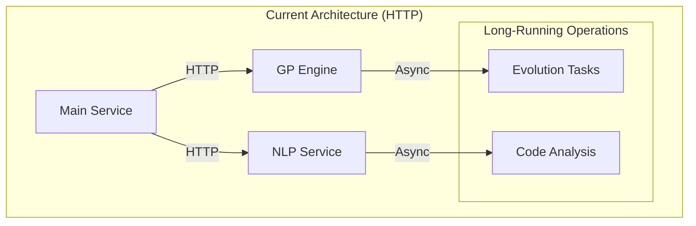

### Message Queue Ready Design
While using direct HTTP communication, our codebase is designed to be "message queue ready" through:

1. **Async Operation Pattern**
   - All long-running operations return job IDs
   - Status checking endpoints for all operations
   - Results retrievable via separate endpoints

2. **Decoupled Processing**
   - Services operate independently
   - State management via databases
   - No direct service-to-service dependencies

3. **Configurable Timeouts**
   - `REQUEST_TIMEOUT` environment variable
   - Adjustable worker processes
   - Async mode toggle

### Future Message Queue Architecture
When scaling needs arise, we'll transition to a message queue architecture:

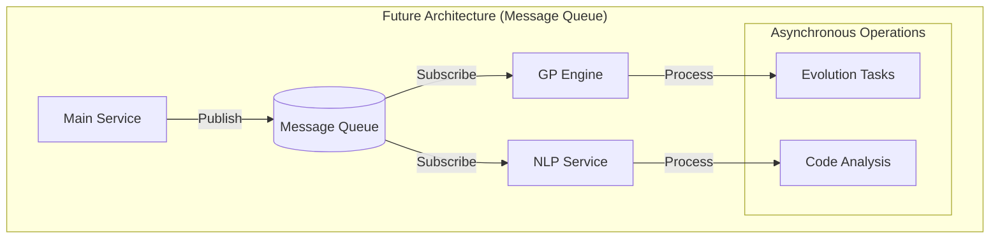

### Migration Path
1. **Phase 1: Current (HTTP with Async)**
   - HTTP communication
   - Async operation handling
   - Job status tracking
   - Configurable timeouts

2. **Phase 2: Message Queue Integration**
   - Add message queue service
   - Implement publishers/subscribers
   - Maintain HTTP endpoints
   - Parallel operation support

3. **Phase 3: Full Message Queue**
   - Scale out workers
   - Advanced retry policies
   - Dead letter queues
   - Event-driven processing

### Code Design Principles
To ensure smooth future migration to message queues, we follow these principles:

1. **Service Independence**
   ```python
   # Example service pattern
   class Service:
       async def process_task(self, task_id: str, payload: dict):
           # Can be triggered by HTTP or message queue
           job = await self.create_job(task_id, payload)
           await self.process_async(job)
           return job.id
   ```

2. **State Management**
   ```python
   # Example state handling
   class JobManager:
       async def get_job_status(self, job_id: str):
           # Consistent state checking regardless of trigger method
           return await self.db.get_job(job_id)
   ```

3. **Result Handling**
   ```python
   # Example result pattern
   class ResultHandler:
       async def store_result(self, job_id: str, result: dict):
           # Results stored in DB, retrievable via ID
           await self.db.store_result(job_id, result)
   ```

This design ensures that when we need to scale, the transition to a message queue system will be smooth and require minimal code changes.

## Detailed Message Queue Implementation

#### Message Queue Architecture Details
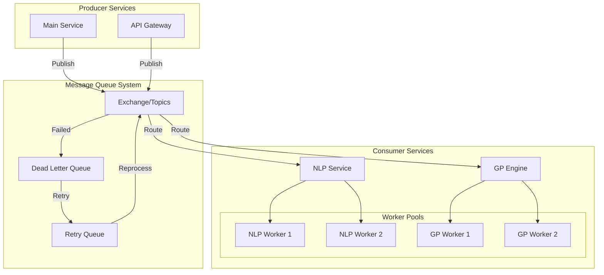

#### Message Types and Routing
1. **Code Analysis Messages**
   ```json
   {
     "message_type": "code_analysis",
     "priority": "high",
     "payload": {
       "code_id": "uuid",
       "repository": "repo_url",
       "file_paths": ["path1", "path2"],
       "analysis_type": "semantic"
     },
     "metadata": {
       "timestamp": "iso_timestamp",
       "retry_count": 0,
       "timeout": 300
     }
   }
   ```

2. **Evolution Task Messages**
   ```json
   {
     "message_type": "evolution_task",
     "priority": "normal",
     "payload": {
       "population_id": "uuid",
       "generation": 5,
       "individuals": ["ind1", "ind2"],
       "fitness_criteria": {
         "performance": 0.6,
         "maintainability": 0.4
       }
     },
     "metadata": {
       "timestamp": "iso_timestamp",
       "retry_count": 0,
       "timeout": 600
     }
   }
   ```

#### Queue Configuration
```yaml
# Future docker-compose.yml addition
services:
  rabbitmq:
    image: rabbitmq:3-management
    environment:
      - RABBITMQ_DEFAULT_USER=eads
      - RABBITMQ_DEFAULT_PASS=secure_password
      - RABBITMQ_VM_MEMORY_HIGH_WATERMARK=0.6
    configs:
      - source: rabbitmq_config
        target: /etc/rabbitmq/rabbitmq.conf

configs:
  rabbitmq_config:
    content: |
      queue.max_priority = 10
      queue.max_length = 100000
      consumer_timeout = 3600000
```

#### Error Handling and Retry Strategy
```python
# Future message handling pattern
class MessageProcessor:
    RETRY_DELAYS = [60, 300, 900, 3600]  # Exponential backoff

    async def process_message(self, message: dict):
        try:
            result = await self._process(message)
            await self.acknowledge(message)
            return result
        except TemporaryError as e:
            retry_count = message['metadata']['retry_count']
            if retry_count < len(self.RETRY_DELAYS):
                await self.retry_later(
                    message,
                    delay=self.RETRY_DELAYS[retry_count]
                )
            else:
                await self.move_to_dlq(message, str(e))
        except PermanentError as e:
            await self.move_to_dlq(message, str(e))
```

### Current Service Implementation Examples

#### NLP Service Pattern
```python
# src/nlp/service.py
from typing import Dict, Optional
from fastapi import FastAPI, BackgroundTasks
from pydantic import BaseModel

class CodeAnalysisRequest(BaseModel):
    code_id: str
    repository: str
    file_paths: List[str]
    analysis_type: str

class NLPService:
    def __init__(self):
        self.job_store = JobStore()  # Database-backed job storage
        self.result_store = ResultStore()  # Database-backed result storage

    async def analyze_code(
        self,
        request: CodeAnalysisRequest,
        background_tasks: BackgroundTasks
    ) -> Dict[str, str]:
        # Create job record - ready for message queue
        job_id = await self.job_store.create_job(
            task_type="code_analysis",
            payload=request.dict()
        )

        # Schedule async processing - mimics message queue consumer
        background_tasks.add_task(
            self._process_analysis,
            job_id,
            request
        )

        return {"job_id": job_id}

    async def _process_analysis(
        self,
        job_id: str,
        request: CodeAnalysisRequest
    ):
        try:
            # Process in worker - similar to future message queue worker
            result = await self.analyzer.analyze(
                repository=request.repository,
                file_paths=request.file_paths
            )

            # Store result - queue consumer will do the same
            await self.result_store.store_result(job_id, result)
            await self.job_store.mark_completed(job_id)
        except Exception as e:
            await self.job_store.mark_failed(job_id, str(e))

    async def get_job_status(self, job_id: str) -> Dict[str, Any]:
        # Status check - works the same with message queue
        return await self.job_store.get_status(job_id)
```

#### GP Engine Pattern
```python
# src/gp_engine/service.py
from typing import Dict, List, Optional
from fastapi import FastAPI, BackgroundTasks
from pydantic import BaseModel

class EvolutionRequest(BaseModel):
    population_id: str
    generation: int
    individuals: List[str]
    fitness_criteria: Dict[str, float]

class GPService:
    def __init__(self):
        self.evolution_store = EvolutionStore()  # Database-backed evolution storage
        self.population_store = PopulationStore()  # Database-backed population storage

    async def evolve_population(
        self,
        request: EvolutionRequest,
        background_tasks: BackgroundTasks
    ) -> Dict[str, str]:
        # Create evolution task - ready for message queue
        task_id = await self.evolution_store.create_task(
            population_id=request.population_id,
            generation=request.generation,
            payload=request.dict()
        )

        # Schedule async processing - mimics message queue consumer
        background_tasks.add_task(
            self._process_evolution,
            task_id,
            request
        )

        return {"task_id": task_id}

    async def _process_evolution(
        self,
        task_id: str,
        request: EvolutionRequest
    ):
        try:
            # Process in worker - similar to future message queue worker
            population = await self.population_store.get_population(
                request.population_id
            )
            
            result = await self.evolution_engine.evolve(
                population=population,
                fitness_criteria=request.fitness_criteria
            )

            # Store result - queue consumer will do the same
            await self.population_store.update_population(
                population_id=request.population_id,
                new_generation=result
            )
            await self.evolution_store.mark_completed(task_id)
        except Exception as e:
            await self.evolution_store.mark_failed(task_id, str(e))

    async def get_task_status(self, task_id: str) -> Dict[str, Any]:
        # Status check - works the same with message queue
        return await self.evolution_store.get_status(task_id)
```

These implementations show how our current services are designed with message queue patterns in mind, making future migration straightforward. The key aspects are:
1. Job/Task-based processing
2. Asynchronous execution
3. Status tracking
4. Result storage
5. Error handling

## &#x1F91D; Contribution

Passionate about autonomous systems? We're always looking for brilliant minds to push the boundaries of AI-driven software engineering!

### Prerequisites
- Strong understanding of machine learning
- Experience with genetic algorithms
- Python expertise
- Curiosity and passion for cutting-edge tech

## Configuration

The system uses environment variables for configuration. Copy the `.env.example` file to `.env` and adjust the values:

```bash
cp .env.example .env
```

Required settings:
- Neo4j: Database for knowledge graph (`NEO4J_*` variables)
- PostgreSQL: Database for metadata (`POSTGRES_*` variables)

## &#x1F063; System Architecture

EADS employs a modular microservices architecture:

1. **GP Service (`gp_engine`):**
   - Manages code evolution through genetic programming
   - Handles population initialization and evolution
   - Configurable evolution parameters
   - RESTful API endpoints for evolution operations

2. **NLP Service (`nlp`):**
   - Code analysis using transformer models
   - Pattern matching and similarity computation
   - RESTful API endpoints for NLP operations
   - Configurable model selection

3. **Knowledge Base:**
   - Neo4j Graph Database integration
   - Asynchronous database operations
   - Structured knowledge representation
   - Structured code pattern storage
   - Environment-based configuration

4. **Configuration Management:**
   - Environment variables for sensitive data
   - Service-specific configuration
   - Logging configuration
   - Development and production settings

```

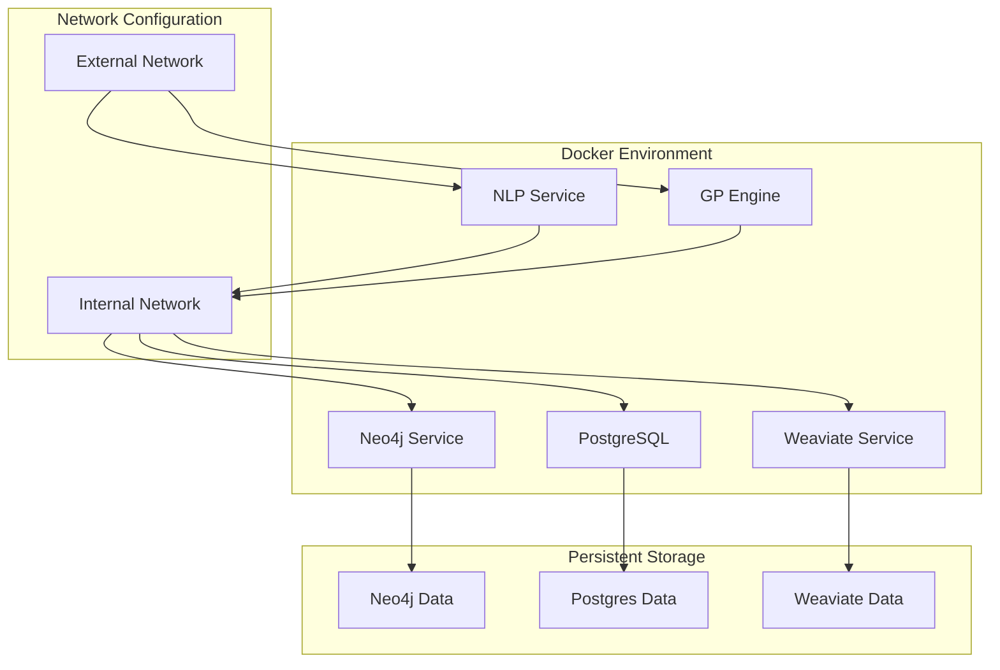

### Testing Strategy
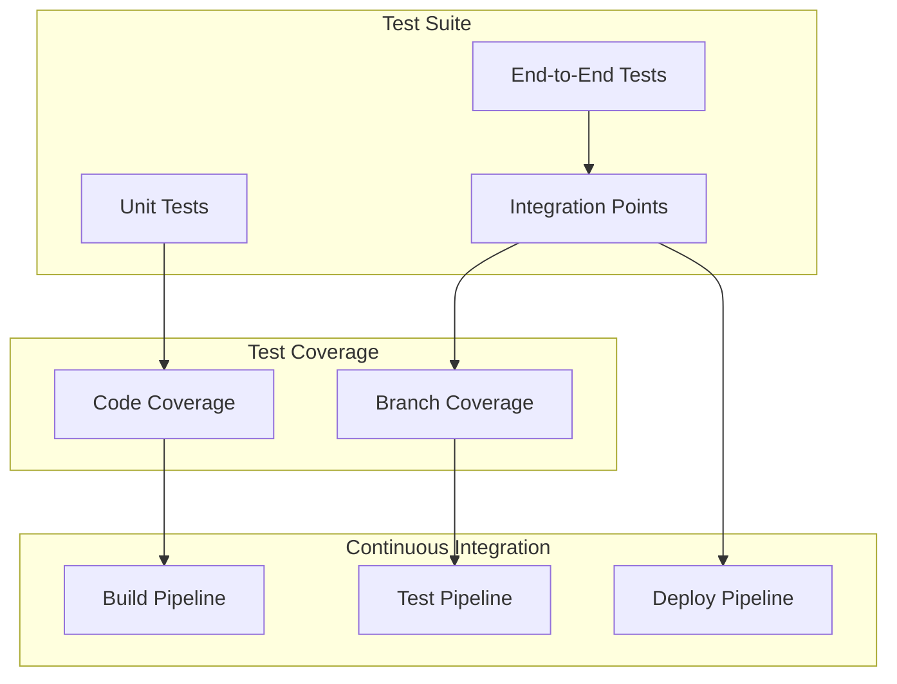

## &#x1F4C8; System Diagrams

### High-Level Component Architecture

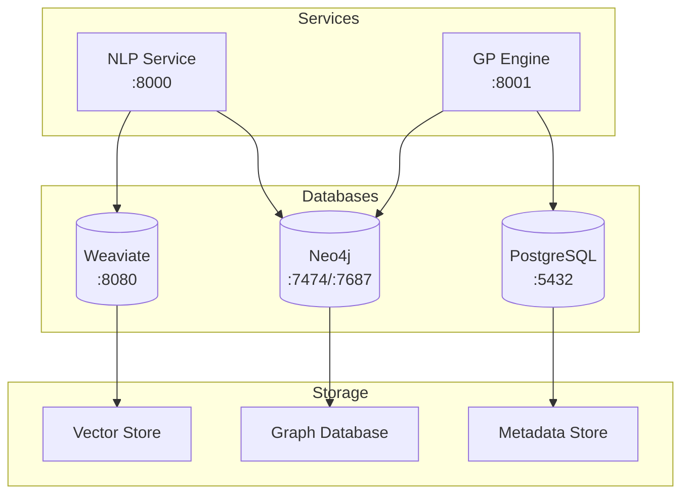

### Service Integration Flow

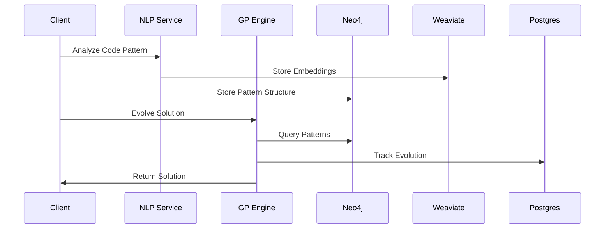

### Container Architecture

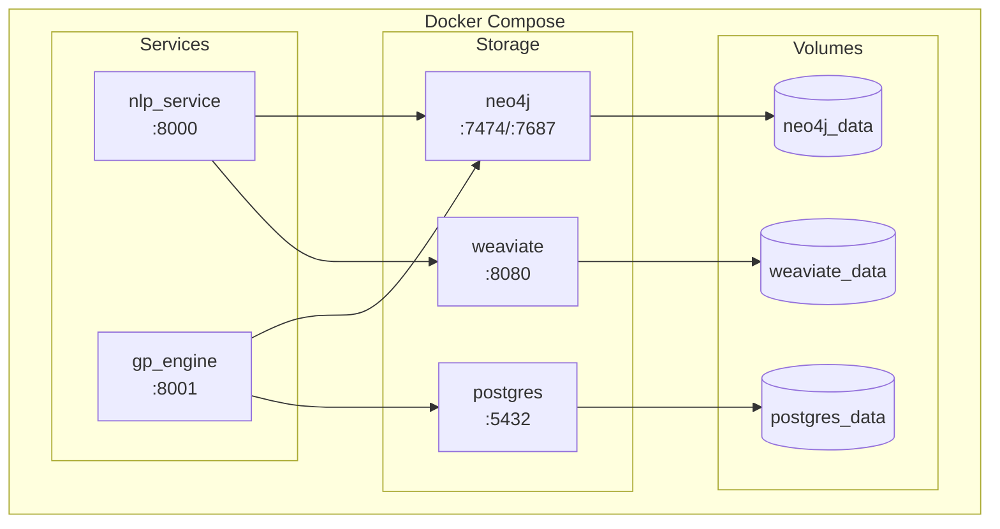

### Data Flow Architecture

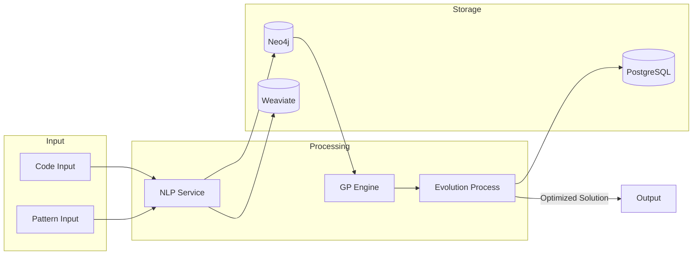

### Module Dependencies

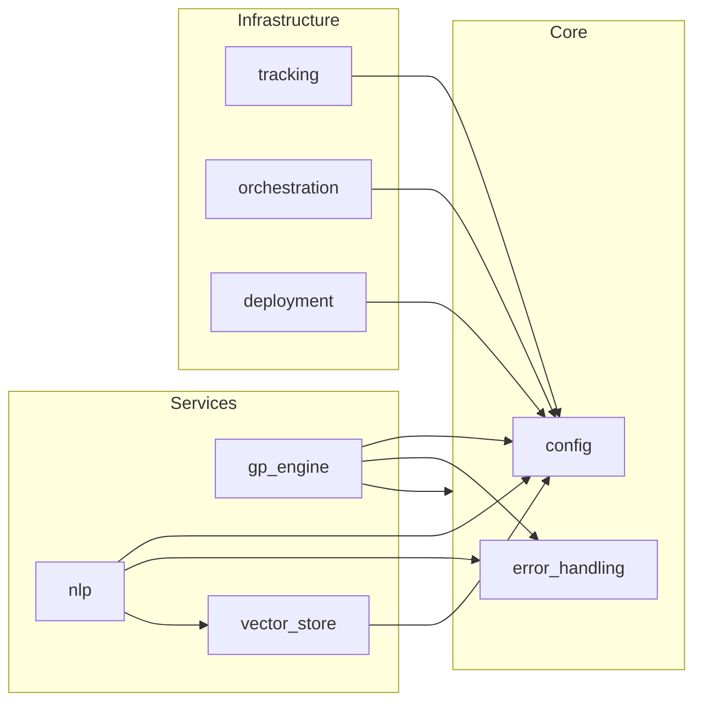

### Component Interaction Flow
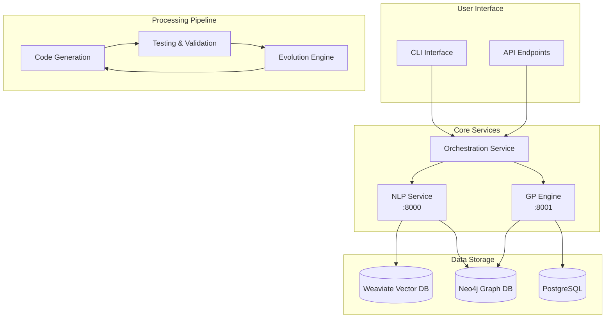

### Data Processing Pipeline
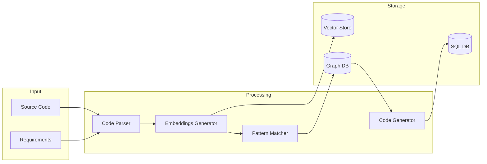

### Development Workflow
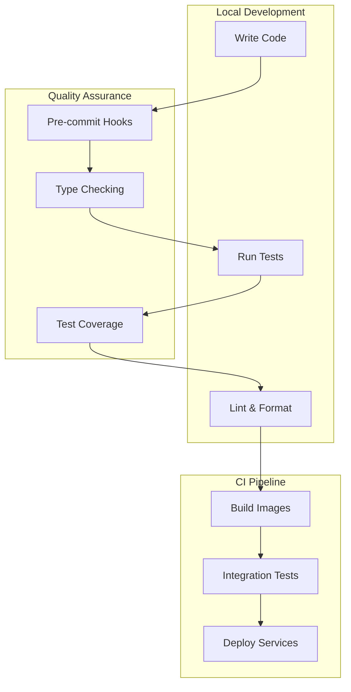

### Deployment Architecture


### Testing Strategy


## &#x1F6E0;&#xFE0F; Message Queue Readiness & Roadmap

### Current Architecture
The EADS system currently uses direct HTTP communication between services, optimized for development and debugging. This approach provides:
- Simple request/response patterns
- Easy debugging and monitoring
- Direct error handling
- Straightforward local development


### Message Queue Ready Design
While using direct HTTP communication, our codebase is designed to be "message queue ready" through:

1. **Async Operation Pattern**
   - All long-running operations return job IDs
   - Status checking endpoints for all operations
   - Results retrievable via separate endpoints

2. **Decoupled Processing**
   - Services operate independently
   - State management via databases
   - No direct service-to-service dependencies

3. **Configurable Timeouts**
   - `REQUEST_TIMEOUT` environment variable
   - Adjustable worker processes
   - Async mode toggle

### Future Message Queue Architecture
When scaling needs arise, we'll transition to a message queue architecture:


### Migration Path
1. **Phase 1: Current (HTTP with Async)**
   - HTTP communication
   - Async operation handling
   - Job status tracking
   - Configurable timeouts

2. **Phase 2: Message Queue Integration**
   - Add message queue service
   - Implement publishers/subscribers
   - Maintain HTTP endpoints
   - Parallel operation support

3. **Phase 3: Full Message Queue**
   - Scale out workers
   - Advanced retry policies
   - Dead letter queues
   - Event-driven processing

### Code Design Principles
To ensure smooth future migration to message queues, we follow these principles:

1. **Service Independence**
   ```python
   # Example service pattern
   class Service:
       async def process_task(self, task_id: str, payload: dict):
           # Can be triggered by HTTP or message queue
           job = await self.create_job(task_id, payload)
           await self.process_async(job)
           return job.id
   ```

2. **State Management**
   ```python
   # Example state handling
   class JobManager:
       async def get_job_status(self, job_id: str):
           # Consistent state checking regardless of trigger method
           return await self.db.get_job(job_id)
   ```

3. **Result Handling**
   ```python
   # Example result pattern
   class ResultHandler:
       async def store_result(self, job_id: str, result: dict):
           # Results stored in DB, retrievable via ID
           await self.db.store_result(job_id, result)
   ```

This design ensures that when we need to scale, the transition to a message queue system will be smooth and require minimal code changes.

## Detailed Message Queue Implementation

#### Message Queue Architecture Details


#### Message Types and Routing
1. **Code Analysis Messages**
   ```json
   {
     "message_type": "code_analysis",
     "priority": "high",
     "payload": {
       "code_id": "uuid",
       "repository": "repo_url",
       "file_paths": ["path1", "path2"],
       "analysis_type": "semantic"
     },
     "metadata": {
       "timestamp": "iso_timestamp",
       "retry_count": 0,
       "timeout": 300
     }
   }
   ```

2. **Evolution Task Messages**
   ```json
   {
     "message_type": "evolution_task",
     "priority": "normal",
     "payload": {
       "population_id": "uuid",
       "generation": 5,
       "individuals": ["ind1", "ind2"],
       "fitness_criteria": {
         "performance": 0.6,
         "maintainability": 0.4
       }
     },
     "metadata": {
       "timestamp": "iso_timestamp",
       "retry_count": 0,
       "timeout": 600
     }
   }
   ```

#### Queue Configuration
```yaml
# Future docker-compose.yml addition
services:
  rabbitmq:
    image: rabbitmq:3-management
    environment:
      - RABBITMQ_DEFAULT_USER=eads
      - RABBITMQ_DEFAULT_PASS=secure_password
      - RABBITMQ_VM_MEMORY_HIGH_WATERMARK=0.6
    configs:
      - source: rabbitmq_config
        target: /etc/rabbitmq/rabbitmq.conf

configs:
  rabbitmq_config:
    content: |
      queue.max_priority = 10
      queue.max_length = 100000
      consumer_timeout = 3600000
```

#### Error Handling and Retry Strategy
```python
# Future message handling pattern
class MessageProcessor:
    RETRY_DELAYS = [60, 300, 900, 3600]  # Exponential backoff

    async def process_message(self, message: dict):
        try:
            result = await self._process(message)
            await self.acknowledge(message)
            return result
        except TemporaryError as e:
            retry_count = message['metadata']['retry_count']
            if retry_count < len(self.RETRY_DELAYS):
                await self.retry_later(
                    message,
                    delay=self.RETRY_DELAYS[retry_count]
                )
            else:
                await self.move_to_dlq(message, str(e))
        except PermanentError as e:
            await self.move_to_dlq(message, str(e))
```

### Current Service Implementation Examples

#### NLP Service Pattern
```python
# src/nlp/service.py
from typing import Dict, Optional
from fastapi import FastAPI, BackgroundTasks
from pydantic import BaseModel

class CodeAnalysisRequest(BaseModel):
    code_id: str
    repository: str
    file_paths: List[str]
    analysis_type: str

class NLPService:
    def __init__(self):
        self.job_store = JobStore()  # Database-backed job storage
        self.result_store = ResultStore()  # Database-backed result storage

    async def analyze_code(
        self,
        request: CodeAnalysisRequest,
        background_tasks: BackgroundTasks
    ) -> Dict[str, str]:
        # Create job record - ready for message queue
        job_id = await self.job_store.create_job(
            task_type="code_analysis",
            payload=request.dict()
        )

        # Schedule async processing - mimics message queue consumer
        background_tasks.add_task(
            self._process_analysis,
            job_id,
            request
        )

        return {"job_id": job_id}

    async def _process_analysis(
        self,
        job_id: str,
        request: CodeAnalysisRequest
    ):
        try:
            # Process in worker - similar to future message queue worker
            result = await self.analyzer.analyze(
                repository=request.repository,
                file_paths=request.file_paths
            )

            # Store result - queue consumer will do the same
            await self.result_store.store_result(job_id, result)
            await self.job_store.mark_completed(job_id)
        except Exception as e:
            await self.job_store.mark_failed(job_id, str(e))

    async def get_job_status(self, job_id: str) -> Dict[str, Any]:
        # Status check - works the same with message queue
        return await self.job_store.get_status(job_id)
```

#### GP Engine Pattern
```python
# src/gp_engine/service.py
from typing import Dict, List, Optional
from fastapi import FastAPI, BackgroundTasks
from pydantic import BaseModel

class EvolutionRequest(BaseModel):
    population_id: str
    generation: int
    individuals: List[str]
    fitness_criteria: Dict[str, float]

class GPService:
    def __init__(self):
        self.evolution_store = EvolutionStore()  # Database-backed evolution storage
        self.population_store = PopulationStore()  # Database-backed population storage

    async def evolve_population(
        self,
        request: EvolutionRequest,
        background_tasks: BackgroundTasks
    ) -> Dict[str, str]:
        # Create evolution task - ready for message queue
        task_id = await self.evolution_store.create_task(
            population_id=request.population_id,
            generation=request.generation,
            payload=request.dict()
        )

        # Schedule async processing - mimics message queue consumer
        background_tasks.add_task(
            self._process_evolution,
            task_id,
            request
        )

        return {"task_id": task_id}

    async def _process_evolution(
        self,
        task_id: str,
        request: EvolutionRequest
    ):
        try:
            # Process in worker - similar to future message queue worker
            population = await self.population_store.get_population(
                request.population_id
            )
            
            result = await self.evolution_engine.evolve(
                population=population,
                fitness_criteria=request.fitness_criteria
            )

            # Store result - queue consumer will do the same
            await self.population_store.update_population(
                population_id=request.population_id,
                new_generation=result
            )
            await self.evolution_store.mark_completed(task_id)
        except Exception as e:
            await self.evolution_store.mark_failed(task_id, str(e))

    async def get_task_status(self, task_id: str) -> Dict[str, Any]:
        # Status check - works the same with message queue
        return await self.evolution_store.get_status(task_id)
```

These implementations show how our current services are designed with message queue patterns in mind, making future migration straightforward. The key aspects are:
1. Job/Task-based processing
2. Asynchronous execution
3. Status tracking
4. Result storage
5. Error handling

## &#x1F91D; Contribution

Passionate about autonomous systems? We're always looking for brilliant minds to push the boundaries of AI-driven software engineering!

### Prerequisites
- Strong understanding of machine learning
- Experience with genetic algorithms
- Python expertise
- Curiosity and passion for cutting-edge tech

## Configuration

The system uses environment variables for configuration. Copy the `.env.example` file to `.env` and adjust the values:

```bash
cp .env.example .env
```

Required settings:
- Neo4j: Database for knowledge graph (`NEO4J_*` variables)
- PostgreSQL: Database for metadata (`POSTGRES_*` variables)

## &#x1F063; System Architecture

EADS employs a modular microservices architecture:

1. **GP Service (`gp_engine`):**
   - Manages code evolution through genetic programming
   - Handles population initialization and evolution
   - Configurable evolution parameters
   - RESTful API endpoints for evolution operations

2. **NLP Service (`nlp`):**
   - Code analysis using transformer models
   - Pattern matching and similarity computation
   - RESTful API endpoints for NLP operations
   - Configurable model selection

3. **Knowledge Base:**
   - Neo4j Graph Database integration
   - Asynchronous database operations
   - Structured knowledge representation
   - Structured code pattern storage
   - Environment-based configuration

4. **Configuration Management:**
   - Environment variables for sensitive data
   - Service-specific configuration
   - Logging configuration
   - Development and production settings

```


### Testing Strategy


## &#x1F4C8; System Diagrams

### High-Level Component Architecture

```mermaid
graph TB
    subgraph Services
        NLP[NLP Service<br>:8000]
        GP[GP Engine<br>:8001]
    end

    subgraph Databases
        Neo4j[(Neo4j<br>:7474/:7687)]
        Postgres[(PostgreSQL<br>:5432)]
        Weaviate[(Weaviate<br>:8080)]
    end

    subgraph Storage
        VectorStore[Vector Store]
        GraphDB[Graph Database]
        MetadataDB[Metadata Store]
    end

    NLP --> Neo4j
    NLP --> Weaviate
    GP --> Neo4j
    GP --> Postgres

    Weaviate --> VectorStore
    Neo4j --> GraphDB
    Postgres --> MetadataDB
```

### Service Integration Flow

```mermaid
sequenceDiagram
    participant Client
    participant NLP as NLP Service
    participant GP as GP Engine
    participant Neo4j
    participant Weaviate
    participant Postgres

    Client->>NLP: Analyze Code Pattern
    NLP->>Weaviate: Store Embeddings
    NLP->>Neo4j: Store Pattern Structure

    Client->>GP: Evolve Solution
    GP->>Neo4j: Query Patterns
    GP->>Postgres: Track Evolution
    GP->>Client: Return Solution
```

### Container Architecture

```mermaid
graph TB
    subgraph Docker Compose
        subgraph Services
            nlp[nlp_service<br>:8000]
            gp[gp_engine<br>:8001]
        end

        subgraph Storage
            neo4j[neo4j<br>:7474/:7687]
            postgres[postgres<br>:5432]
            weaviate[weaviate<br>:8080]
        end

        subgraph Volumes
            neo4j_data[(neo4j_data)]
            postgres_data[(postgres_data)]
            weaviate_data[(weaviate_data)]
        end
    end

    nlp --> neo4j
    nlp --> weaviate
    gp --> neo4j
    gp --> postgres

    neo4j --> neo4j_data
    postgres --> postgres_data
    weaviate --> weaviate_data
```

### Data Flow Architecture

```mermaid
graph LR
    subgraph Input
        Code[Code Input]
        Pattern[Pattern Input]
    end

    subgraph Processing
        NLP[NLP Service]
        GP[GP Engine]
        Evolution[Evolution Process]
    end

    subgraph Storage
        Neo4j[(Neo4j)]
        Weaviate[(Weaviate)]
        Postgres[(PostgreSQL)]
    end

    Code --> NLP
    Pattern --> NLP
    NLP --> Weaviate
    NLP --> Neo4j
    Neo4j --> GP
    GP --> Evolution
    Evolution --> Postgres
    Evolution --> |Optimized Solution| Output
```

### Module Dependencies

```mermaid
graph LR
    subgraph Core
        Config[config]
        ErrorHandling[error_handling]
    end

    subgraph Services
        NLP[nlp]
        GP[gp_engine]
        VectorStore[vector_store]
    end

    subgraph Infrastructure
        Tracking[tracking]
        Orchestration[orchestration]
        Deployment[deployment]
    end

    NLP --> Config
    NLP --> ErrorHandling
    NLP --> VectorStore
    GP --> Config
    GP --> ErrorHandling
    GP --> Core
    VectorStore --> Config
    Tracking --> Config
    Orchestration --> Config
    Deployment --> Config
```

### Component Interaction Flow
```mermaid
graph TB
    subgraph User["User Interface"]
        CLI[CLI Interface]
        API[API Endpoints]
    end

    subgraph Core["Core Services"]
        NLP[NLP Service<br>:8000]
        GP[GP Engine<br>:8001]
        Orchestrator[Orchestration Service]
    end

    subgraph Storage["Data Storage"]
        Neo4j[(Neo4j Graph DB)]
        Postgres[(PostgreSQL)]
        Weaviate[(Weaviate Vector DB)]
    end

    subgraph Processing["Processing Pipeline"]
        CodeGen[Code Generation]
        Testing[Testing & Validation]
        Evolution[Evolution Engine]
    end

    CLI --> Orchestrator
    API --> Orchestrator
    Orchestrator --> NLP
    Orchestrator --> GP
    NLP --> Weaviate
    NLP --> Neo4j
    GP --> Neo4j
    GP --> Postgres
    CodeGen --> Testing
    Testing --> Evolution
    Evolution --> CodeGen
```

### Data Processing Pipeline
```mermaid
graph LR
    subgraph Input
        Code[Source Code]
        Specs[Requirements]
    end

    subgraph Processing
        Parse[Code Parser]
        Embed[Embeddings Generator]
        Match[Pattern Matcher]
        Gen[Code Generator]
    end

    subgraph Storage
        Vec[(Vector Store)]
        Graph[(Graph DB)]
        SQL[(SQL DB)]
    end

    Code --> Parse
    Specs --> Parse
    Parse --> Embed
    Embed --> Vec
    Embed --> Match
    Match --> Graph
    Graph --> Gen
    Gen --> SQL
```

### Development Workflow
```mermaid
graph TD
    subgraph Local["Local Development"]
        Code[Write Code]
        Test[Run Tests]
        Lint[Lint & Format]
    end

    subgraph CI["CI Pipeline"]
        Build[Build Images]
        IntTest[Integration Tests]
        Deploy[Deploy Services]
    end

    subgraph QA["Quality Assurance"]
        PreCommit[Pre-commit Hooks]
        TypeCheck[Type Checking]
        Coverage[Test Coverage]
    end

    Code --> PreCommit
    PreCommit --> TypeCheck
    TypeCheck --> Test
    Test --> Coverage
    Coverage --> Lint
    Lint --> Build
    Build --> IntTest
    IntTest --> Deploy
```

### Deployment Architecture
```mermaid
graph TB
    subgraph Docker["Docker Environment"]
        NLP[NLP Service]
        GP[GP Engine]
        Neo4j[Neo4j Service]
        Postgres[PostgreSQL]
        Weaviate[Weaviate Service]
    end

    subgraph Network["Network Configuration"]
        Internal[Internal Network]
        External[External Network]
    end

    subgraph Volumes["Persistent Storage"]
        Neo4jData[Neo4j Data]
        PostgresData[Postgres Data]
        WeaviateData[Weaviate Data]
    end

    External --> NLP
    External --> GP
    NLP --> Internal
    GP --> Internal
    Internal --> Neo4j
    Internal --> Postgres
    Internal --> Weaviate
    Neo4j --> Neo4jData
    Postgres --> PostgresData
    Weaviate --> WeaviateData
```

### Testing Strategy
```mermaid
graph TB
    subgraph Tests["Test Suite"]
        Unit[Unit Tests]
        Integration[Integration Tests]
        E2E[End-to-End Tests]
    end

    subgraph Coverage["Test Coverage"]
        Code[Code Coverage]
        Branch[Branch Coverage]
        Integration[Integration Points]
    end

    subgraph CI["Continuous Integration"]
        Build[Build Pipeline]
        Test[Test Pipeline]
        Deploy[Deploy Pipeline]
    end

    Unit --> Code
    Integration --> Branch
    E2E --> Integration
    Code --> Build
    Branch --> Test
    Integration --> Deploy
```

## &#x1F6E0;&#xFE0F; Message Queue Readiness & Roadmap

### Current Architecture
The EADS system currently uses direct HTTP communication between services, optimized for development and debugging. This approach provides:
- Simple request/response patterns
- Easy debugging and monitoring
- Direct error handling
- Straightforward local development

```mermaid
graph TB
    subgraph Current["Current Architecture (HTTP)"]
        direction LR
        Main[Main Service] -->|HTTP| NLP[NLP Service]
        Main -->|HTTP| GP[GP Engine]
        
        subgraph Operations["Long-Running Operations"]
            GPOp[Evolution Tasks]
            NLPOp[Code Analysis]
        end
        
        GP -->|Async| GPOp
        NLP -->|Async| NLPOp
    end
```

### Message Queue Ready Design
While using direct HTTP communication, our codebase is designed to be "message queue ready" through:

1. **Async Operation Pattern**
   - All long-running operations return job IDs
   - Status checking endpoints for all operations
   - Results retrievable via separate endpoints

2. **Decoupled Processing**
   - Services operate independently
   - State management via databases
   - No direct service-to-service dependencies

3. **Configurable Timeouts**
   - `REQUEST_TIMEOUT` environment variable
   - Adjustable worker processes
   - Async mode toggle

### Future Message Queue Architecture
When scaling needs arise, we'll transition to a message queue architecture:

```mermaid
graph TB
    subgraph Future["Future Architecture (Message Queue)"]
        direction LR
        Main[Main Service] -->|Publish| Queue[(Message Queue)]
        Queue -->|Subscribe| NLP[NLP Service]
        Queue -->|Subscribe| GP[GP Engine]
        
        subgraph AsyncOps["Asynchronous Operations"]
            GPOp[Evolution Tasks]
            NLPOp[Code Analysis]
        end
        
        GP -->|Process| GPOp
        NLP -->|Process| NLPOp
    end
```

### Migration Path
1. **Phase 1: Current (HTTP with Async)**
   - HTTP communication
   - Async operation handling
   - Job status tracking
   - Configurable timeouts

2. **Phase 2: Message Queue Integration**
   - Add message queue service
   - Implement publishers/subscribers
   - Maintain HTTP endpoints
   - Parallel operation support

3. **Phase 3: Full Message Queue**
   - Scale out workers
   - Advanced retry policies
   - Dead letter queues
   - Event-driven processing

### Code Design Principles
To ensure smooth future migration to message queues, we follow these principles:

1. **Service Independence**
   ```python
   # Example service pattern
   class Service:
       async def process_task(self, task_id: str, payload: dict):
           # Can be triggered by HTTP or message queue
           job = await self.create_job(task_id, payload)
           await self.process_async(job)
           return job.id
   ```

2. **State Management**
   ```python
   # Example state handling
   class JobManager:
       async def get_job_status(self, job_id: str):
           # Consistent state checking regardless of trigger method
           return await self.db.get_job(job_id)
   ```

3. **Result Handling**
   ```python
   # Example result pattern
   class ResultHandler:
       async def store_result(self, job_id: str, result: dict):
           # Results stored in DB, retrievable via ID
           await self.db.store_result(job_id, result)
   ```

This design ensures that when we need to scale, the transition to a message queue system will be smooth and require minimal code changes.

## Detailed Message Queue Implementation

#### Message Queue Architecture Details
```mermaid
graph TB
    subgraph Producer["Producer Services"]
        Main[Main Service]
        API[API Gateway]
    end

    subgraph Queue["Message Queue System"]
        Exchange[Exchange/Topics]
        DLQ[Dead Letter Queue]
        RetryQ[Retry Queue]
    end

    subgraph Consumers["Consumer Services"]
        NLP[NLP Service]
        GP[GP Engine]
        subgraph Workers["Worker Pools"]
            NLPWork1[NLP Worker 1]
            NLPWork2[NLP Worker 2]
            GPWork1[GP Worker 1]
            GPWork2[GP Worker 2]
        end
    end

    Main -->|Publish| Exchange
    API -->|Publish| Exchange
    Exchange -->|Route| NLP
    Exchange -->|Route| GP
    Exchange -->|Failed| DLQ
    DLQ -->|Retry| RetryQ
    RetryQ -->|Reprocess| Exchange
    
    NLP --> NLPWork1
    NLP --> NLPWork2
    GP --> GPWork1
    GP --> GPWork2
```

#### Message Types and Routing
1. **Code Analysis Messages**
   ```json
   {
     "message_type": "code_analysis",
     "priority": "high",
     "payload": {
       "code_id": "uuid",
       "repository": "repo_url",
       "file_paths": ["path1", "path2"],
       "analysis_type": "semantic"
     },
     "metadata": {
       "timestamp": "iso_timestamp",
       "retry_count": 0,
       "timeout": 300
     }
   }
   ```

2. **Evolution Task Messages**
   ```json
   {
     "message_type": "evolution_task",
     "priority": "normal",
     "payload": {
       "population_id": "uuid",
       "generation": 5,
       "individuals": ["ind1", "ind2"],
       "fitness_criteria": {
         "performance": 0.6,
         "maintainability": 0.4
       }
     },
     "metadata": {
       "timestamp": "iso_timestamp",
       "retry_count": 0,
       "timeout": 600
     }
   }
   ```

#### Queue Configuration
```yaml
# Future docker-compose.yml addition
services:
  rabbitmq:
    image: rabbitmq:3-management
    environment:
      - RABBITMQ_DEFAULT_USER=eads
      - RABBITMQ_DEFAULT_PASS=secure_password
      - RABBITMQ_VM_MEMORY_HIGH_WATERMARK=0.6
    configs:
      - source: rabbitmq_config
        target: /etc/rabbitmq/rabbitmq.conf

configs:
  rabbitmq_config:
    content: |
      queue.max_priority = 10
      queue.max_length = 100000
      consumer_timeout = 3600000
```

#### Error Handling and Retry Strategy
```python
# Future message handling pattern
class MessageProcessor:
    RETRY_DELAYS = [60, 300, 900, 3600]  # Exponential backoff

    async def process_message(self, message: dict):
        try:
            result = await self._process(message)
            await self.acknowledge(message)
            return result
        except TemporaryError as e:
            retry_count = message['metadata']['retry_count']
            if retry_count < len(self.RETRY_DELAYS):
                await self.retry_later(
                    message,
                    delay=self.RETRY_DELAYS[retry_count]
                )
            else:
                await self.move_to_dlq(message, str(e))
        except PermanentError as e:
            await self.move_to_dlq(message, str(e))
```

### Current Service Implementation Examples

#### NLP Service Pattern
```python
# src/nlp/service.py
from typing import Dict, Optional
from fastapi import FastAPI, BackgroundTasks
from pydantic import BaseModel

class CodeAnalysisRequest(BaseModel):
    code_id: str
    repository: str
    file_paths: List[str]
    analysis_type: str

class NLPService:
    def __init__(self):
        self.job_store = JobStore()  # Database-backed job storage
        self.result_store = ResultStore()  # Database-backed result storage

    async def analyze_code(
        self,
        request: CodeAnalysisRequest,
        background_tasks: BackgroundTasks
    ) -> Dict[str, str]:
        # Create job record - ready for message queue
        job_id = await self.job_store.create_job(
            task_type="code_analysis",
            payload=request.dict()
        )

        # Schedule async processing - mimics message queue consumer
        background_tasks.add_task(
            self._process_analysis,
            job_id,
            request
        )

        return {"job_id": job_id}

    async def _process_analysis(
        self,
        job_id: str,
        request: CodeAnalysisRequest
    ):
        try:
            # Process in worker - similar to future message queue worker
            result = await self.analyzer.analyze(
                repository=request.repository,
                file_paths=request.file_paths
            )

            # Store result - queue consumer will do the same
            await self.result_store.store_result(job_id, result)
            await self.job_store.mark_completed(job_id)
        except Exception as e:
            await self.job_store.mark_failed(job_id, str(e))

    async def get_job_status(self, job_id: str) -> Dict[str, Any]:
        # Status check - works the same with message queue
        return await self.job_store.get_status(job_id)
```

#### GP Engine Pattern
```python
# src/gp_engine/service.py
from typing import Dict, List, Optional
from fastapi import FastAPI, BackgroundTasks
from pydantic import BaseModel

class EvolutionRequest(BaseModel):
    population_id: str
    generation: int
    individuals: List[str]
    fitness_criteria: Dict[str, float]

class GPService:
    def __init__(self):
        self.evolution_store = EvolutionStore()  # Database-backed evolution storage
        self.population_store = PopulationStore()  # Database-backed population storage

    async def evolve_population(
        self,
        request: EvolutionRequest,
        background_tasks: BackgroundTasks
    ) -> Dict[str, str]:
        # Create evolution task - ready for message queue
        task_id = await self.evolution_store.create_task(
            population_id=request.population_id,
            generation=request.generation,
            payload=request.dict()
        )

        # Schedule async processing - mimics message queue consumer
        background_tasks.add_task(
            self._process_evolution,
            task_id,
            request
        )

        return {"task_id": task_id}

    async def _process_evolution(
        self,
        task_id: str,
        request: EvolutionRequest
    ):
        try:
            # Process in worker - similar to future message queue worker
            population = await self.population_store.get_population(
                request.population_id
            )
            
            result = await self.evolution_engine.evolve(
                population=population,
                fitness_criteria=request.fitness_criteria
            )

            # Store result - queue consumer will do the same
            await self.population_store.update_population(
                population_id=request.population_id,
                new_generation=result
            )
            await self.evolution_store.mark_completed(task_id)
        except Exception as e:
            await self.evolution_store.mark_failed(task_id, str(e))

    async def get_task_status(self, task_id: str) -> Dict[str, Any]:
        # Status check - works the same with message queue
        return await self.evolution_store.get_status(task_id)
```

These implementations show how our current services are designed with message queue patterns in mind, making future migration straightforward. The key aspects are:
1. Job/Task-based processing
2. Asynchronous execution
3. Status tracking
4. Result storage
5. Error handling

## &#x1F91D; Contribution

Passionate about autonomous systems? We're always looking for brilliant minds to push the boundaries of AI-driven software engineering!

### Prerequisites
- Strong understanding of machine learning
- Experience with genetic algorithms
- Python expertise
- Curiosity and passion for cutting-edge tech

## Configuration

The system uses environment variables for configuration. Copy the `.env.example` file to `.env` and adjust the values:

```bash
cp .env.example .env
```

Required settings:
- Neo4j: Database for knowledge graph (`NEO4J_*` variables)
- PostgreSQL: Database for metadata (`POSTGRES_*` variables)

## &#x1F063; System Architecture

EADS employs a modular microservices architecture:

1. **GP Service (`gp_engine`):**
   - Manages code evolution through genetic programming
   - Handles population initialization and evolution
   - Configurable evolution parameters
   - RESTful API endpoints for evolution operations

2. **NLP Service (`nlp`):**
   - Code analysis using transformer models
   - Pattern matching and similarity computation
   - RESTful API endpoints for NLP operations
   - Configurable model selection

3. **Knowledge Base:**
   - Neo4j Graph Database integration
   - Asynchronous database operations
   - Structured knowledge representation
   - Structured code pattern storage
   - Environment-based configuration

4. **Configuration Management:**
   - Environment variables for sensitive data
   - Service-specific configuration
   - Logging configuration
   - Development and production settings

```

```mermaid
graph TB
    subgraph Docker["Docker Environment"]
        NLP[NLP Service]
        GP[GP Engine]
        Neo4j[Neo4j Service]
        Postgres[PostgreSQL]
        Weaviate[Weaviate Service]
    end

    subgraph Network["Network Configuration"]
        Internal[Internal Network]
        External[External Network]
    end

    subgraph Volumes["Persistent Storage"]
        Neo4jData[Neo4j Data]
        PostgresData[Postgres Data]
        WeaviateData[Weaviate Data]
    end

    External --> NLP
    External --> GP
    NLP --> Internal
    GP --> Internal
    Internal --> Neo4j
    Internal --> Postgres
    Internal --> Weaviate
    Neo4j --> Neo4jData
    Postgres --> PostgresData
    Weaviate --> WeaviateData
```

### Testing Strategy
```mermaid
graph TB
    subgraph Tests["Test Suite"]
        Unit[Unit Tests]
        Integration[Integration Tests]
        E2E[End-to-End Tests]
    end

    subgraph Coverage["Test Coverage"]
        Code[Code Coverage]
        Branch[Branch Coverage]
        Integration[Integration Points]
    end

    subgraph CI["Continuous Integration"]
        Build[Build Pipeline]
        Test[Test Pipeline]
        Deploy[Deploy Pipeline]
    end

    Unit --> Code
    Integration --> Branch
    E2E --> Integration
    Code --> Build
    Branch --> Test
    Integration --> Deploy
```

## &#x1F4C8; System Diagrams

### High-Level Component Architecture

```mermaid
graph TB
    subgraph Services
        NLP[NLP Service<br>:8000]
        GP[GP Engine<br>:8001]
    end

    subgraph Databases
        Neo4j[(Neo4j<br>:7474/:7687)]
        Postgres[(PostgreSQL<br>:5432)]
        Weaviate[(Weaviate<br>:8080)]
    end

    subgraph Storage
        VectorStore[Vector Store]
        GraphDB[Graph Database]
        MetadataDB[Metadata Store]
    end

    NLP --> Neo4j
    NLP --> Weaviate
    GP --> Neo4j
    GP --> Postgres

    Weaviate --> VectorStore
    Neo4j --> GraphDB
    Postgres --> MetadataDB
```

### Service Integration Flow

```mermaid
sequenceDiagram
    participant Client
    participant NLP as NLP Service
    participant GP as GP Engine
    participant Neo4j
    participant Weaviate
    participant Postgres

    Client->>NLP: Analyze Code Pattern
    NLP->>Weaviate: Store Embeddings
    NLP->>Neo4j: Store Pattern Structure

    Client->>GP: Evolve Solution
    GP->>Neo4j: Query Patterns
    GP->>Postgres: Track Evolution
    GP->>Client: Return Solution
```

### Container Architecture

```mermaid
graph TB
    subgraph Docker Compose
        subgraph Services
            nlp[nlp_service<br>:8000]
            gp[gp_engine<br>:8001]
        end

        subgraph Storage
            neo4j[neo4j<br>:7474/:7687]
            postgres[postgres<br>:5432]
            weaviate[weaviate<br>:8080]
        end

        subgraph Volumes
            neo4j_data[(neo4j_data)]
            postgres_data[(postgres_data)]
            weaviate_data[(weaviate_data)]
        end
    end

    nlp --> neo4j
    nlp --> weaviate
    gp --> neo4j
    gp --> postgres

    neo4j --> neo4j_data
    postgres --> postgres_data
    weaviate --> weaviate_data
```

### Data Flow Architecture

```mermaid
graph LR
    subgraph Input
        Code[Code Input]
        Pattern[Pattern Input]
    end

    subgraph Processing
        NLP[NLP Service]
        GP[GP Engine]
        Evolution[Evolution Process]
    end

    subgraph Storage
        Neo4j[(Neo4j)]
        Weaviate[(Weaviate)]
        Postgres[(PostgreSQL)]
    end

    Code --> NLP
    Pattern --> NLP
    NLP --> Weaviate
    NLP --> Neo4j
    Neo4j --> GP
    GP --> Evolution
    Evolution --> Postgres
    Evolution --> |Optimized Solution| Output
```

### Module Dependencies

```mermaid
graph LR
    subgraph Core
        Config[config]
        ErrorHandling[error_handling]
    end

    subgraph Services
        NLP[nlp]
        GP[gp_engine]
        VectorStore[vector_store]
    end

    subgraph Infrastructure
        Tracking[tracking]
        Orchestration[orchestration]
        Deployment[deployment]
    end

    NLP --> Config
    NLP --> ErrorHandling
    NLP --> VectorStore
    GP --> Config
    GP --> ErrorHandling
    GP --> Core
    VectorStore --> Config
    Tracking --> Config
    Orchestration --> Config
    Deployment --> Config
```

### Component Interaction Flow
```mermaid
graph TB
    subgraph User["User Interface"]
        CLI[CLI Interface]
        API[API Endpoints]
    end

    subgraph Core["Core Services"]
        NLP[NLP Service<br>:8000]
        GP[GP Engine<br>:8001]
        Orchestrator[Orchestration Service]
    end

    subgraph Storage["Data Storage"]
        Neo4j[(Neo4j Graph DB)]
        Postgres[(PostgreSQL)]
        Weaviate[(Weaviate Vector DB)]
    end

    subgraph Processing["Processing Pipeline"]
        CodeGen[Code Generation]
        Testing[Testing & Validation]
        Evolution[Evolution Engine]
    end

    CLI --> Orchestrator
    API --> Orchestrator
    Orchestrator --> NLP
    Orchestrator --> GP
    NLP --> Weaviate
    NLP --> Neo4j
    GP --> Neo4j
    GP --> Postgres
    CodeGen --> Testing
    Testing --> Evolution
    Evolution --> CodeGen
```

### Data Processing Pipeline
```mermaid
graph LR
    subgraph Input
        Code[Source Code]
        Specs[Requirements]
    end

    subgraph Processing
        Parse[Code Parser]
        Embed[Embeddings Generator]
        Match[Pattern Matcher]
        Gen[Code Generator]
    end

    subgraph Storage
        Vec[(Vector Store)]
        Graph[(Graph DB)]
        SQL[(SQL DB)]
    end

    Code --> Parse
    Specs --> Parse
    Parse --> Embed
    Embed --> Vec
    Embed --> Match
    Match --> Graph
    Graph --> Gen
    Gen --> SQL
```

### Development Workflow
```mermaid
graph TD
    subgraph Local["Local Development"]
        Code[Write Code]
        Test[Run Tests]
        Lint[Lint & Format]
    end

    subgraph CI["CI Pipeline"]
        Build[Build Images]
        IntTest[Integration Tests]
        Deploy[Deploy Services]
    end

    subgraph QA["Quality Assurance"]
        PreCommit[Pre-commit Hooks]
        TypeCheck[Type Checking]
        Coverage[Test Coverage]
    end

    Code --> PreCommit
    PreCommit --> TypeCheck
    TypeCheck --> Test
    Test --> Coverage
    Coverage --> Lint
    Lint --> Build
    Build --> IntTest
    IntTest --> Deploy
```

### Deployment Architecture
```mermaid
graph TB
    subgraph Docker["Docker Environment"]
        NLP[NLP Service]
        GP[GP Engine]
        Neo4j[Neo4j Service]
        Postgres[PostgreSQL]
        Weaviate[Weaviate Service]
    end

    subgraph Network["Network Configuration"]
        Internal[Internal Network]
        External[External Network]
    end

    subgraph Volumes["Persistent Storage"]
        Neo4jData[Neo4j Data]
        PostgresData[Postgres Data]
        WeaviateData[Weaviate Data]
    end

    External --> NLP
    External --> GP
    NLP --> Internal
    GP --> Internal
    Internal --> Neo4j
    Internal --> Postgres
    Internal --> Weaviate
    Neo4j --> Neo4jData
    Postgres --> PostgresData
    Weaviate --> WeaviateData
```

### Testing Strategy
```mermaid
graph TB
    subgraph Tests["Test Suite"]
        Unit[Unit Tests]
        Integration[Integration Tests]
        E2E[End-to-End Tests]
    end

    subgraph Coverage["Test Coverage"]
        Code[Code Coverage]
        Branch[Branch Coverage]
        Integration[Integration Points]
    end

    subgraph CI["Continuous Integration"]
        Build[Build Pipeline]
        Test[Test Pipeline]
        Deploy[Deploy Pipeline]
    end

    Unit --> Code
    Integration --> Branch
    E2E --> Integration
    Code --> Build
    Branch --> Test
    Integration --> Deploy
```

## &#x1F6E0;&#xFE0F; Message Queue Readiness & Roadmap

### Current Architecture
The EADS system currently uses direct HTTP communication between services, optimized for development and debugging. This approach provides:
- Simple request/response patterns
- Easy debugging and monitoring
- Direct error handling
- Straightforward local development

```mermaid
graph TB
    subgraph Current["Current Architecture (HTTP)"]
        direction LR
        Main[Main Service] -->|HTTP| NLP[NLP Service]
        Main -->|HTTP| GP[GP Engine]
        
        subgraph Operations["Long-Running Operations"]
            GPOp[Evolution Tasks]
            NLPOp[Code Analysis]
        end
        
        GP -->|Async| GPOp
        NLP -->|Async| NLPOp
    end
```

### Message Queue Ready Design
While using direct HTTP communication, our codebase is designed to be "message queue ready" through:

1. **Async Operation Pattern**
   - All long-running operations return job IDs
   - Status checking endpoints for all operations
   - Results retrievable via separate endpoints

2. **Decoupled Processing**
   - Services operate independently
   - State management via databases
   - No direct service-to-service dependencies

3. **Configurable Timeouts**
   - `REQUEST_TIMEOUT` environment variable
   - Adjustable worker processes
   - Async mode toggle

### Future Message Queue Architecture
When scaling needs arise, we'll transition to a message queue architecture:
