# &#x1F9EC; EADS: Evolutionary Autonomous Development System

## &#x1F680; Paradigm-Shifting Software Engineering

EADS is a revolutionary approach to autonomous software development using AI, genetic programming, and adaptive learning to create a self-evolving software engineering ecosystem.  The project aims to build an Evolutionary Automated Development System (EADS) for generating, testing, and refining software applications through iterative evolution.  EADS leverages Large Language Models (LLMs), Genetic Programming (GP), and advanced analysis techniques to create robust and adaptable software.  The system is highly scalable, resilient, and adaptable to various software development tasks, exceeding traditional manual or simpler automated systems.

### &#x1F52D; Core Innovation

EADS is an intelligent, self-improving system that learns, adapts, and generates high-quality software with minimal human intervention.

## &#x2728; Key Features

### Intelligent Code Generation
- &#x1F9E0; LLM-powered code synthesis
- &#x1F9EC; Genetic programming for optimization
- &#x1F50D; Semantic understanding via advanced embeddings

### Robust Quality Assurance
- &#x1F4CA; Comprehensive testing frameworks: Unit Testing, Integration Testing, Performance Optimization, Security Hardening
- &#x1F6E1;&#xFE0F; Fault Tolerance: Circuit breaker pattern, Retry with exponential backoff, Fallback strategies with caching

### Advanced Learning Mechanisms
- &#x1F504; Recursive self-improvement cycle
- &#x1F4DA; Semantic knowledge base
- &#x1F916; Decentralized AI engine

## &#x1F3D7;&#xFE0F; System Architecture

### Components

1. **Genetic Programming Engine:** Population-based code evolution using DEAP; Individual representation with code and fitness attributes; Configurable evolution parameters (population size, generations, mutation/crossover rates); FastAPI-based service for evolution operations.
2. **NLP Service:** Sentence Transformer-based code analysis; Semantic code pattern matching; Code similarity computation; FastAPI-based service for NLP operations.
3. **Knowledge Management:** Neo4j Graph Database integration; Asynchronous database operations; Structured code pattern storage; Environment-based configuration.
4. **Testing & Quality Assurance:** Comprehensive test suite with pytest; Pre-commit hooks for code quality; Type checking with mypy; Linting with flake8 and black.

## &#x1F31F; Unique Selling Points

- &#x1F510; Self-securing code generation
- &#x1F4A1; Adaptive learning paradigms
- &#x1F680; Reduced human intervention
- &#x1F30E; Scalable, cloud-native architecture

## Technology Stack

| Component                  | Technology              | Description                                                                                                 |
|---------------------------|-------------------------|-------------------------------------------------------------------------------------------------------------|
| **Core Framework**         |                         |                                                                                                             |
| Core Framework            | FastAPI 0.110.0+        | High-performance async web framework                                                                        |
| HTTP Client              | httpx 0.26.0/0.27.0     | Modern async HTTP client for service communication                                                          |
| Fault Tolerance          | tenacity 8.2.3+         | Retrying library for Python (more Pythonic than resilience4j)                                               |
| Cache Management         | cachetools 5.3.2+       | TTL caching for fallback responses                                                                          |
| **Storage**               |                         |                                                                                                             |
| Graph Database            | Neo4j 5.15.0+           | Knowledge graph storage                                                                                     |
| Vector Database           | Weaviate 4.4.0+         | Vector embeddings storage                                                                                   |
| Relational Database       | PostgreSQL 16+          | Metadata and experiment tracking                                                                            |
| **Machine Learning**       |                         |                                                                                                             |
| Deep Learning             | PyTorch 2.2.0+          | Neural network implementations                                                                              |
| NLP Models                | sentence-transformers   | Code analysis and understanding                                                                             |
| ML Pipeline               | scikit-learn 1.4.0+     | Feature processing and traditional ML                                                                       |
| Experiment Tracking       | MLflow 2.10.0+          | ML experiment versioning and tracking                                                                       |
| **Genetic Programming**    |                         |                                                                                                             |
| Evolution Framework       | DEAP 1.4.1+             | Primary framework for evolutionary computation                                                              |
| Alternative Framework     | PyGAD 3.2.0+            | Alternative genetic algorithm implementation                                                                |
| **Development Tools**      |                         |                                                                                                             |
| Code Quality              | black, ruff             | Code formatting and linting (ruff replaces flake8 & isort)                                                 |
| Type Checking            | mypy 1.8.0+             | Static type checking                                                                                        |
| Testing                  | pytest 8.0.0+           | Testing framework with fixture support                                                                      |
| Async Testing            | pytest-asyncio 0.23.5+  | Async test support                                                                                         |
| Coverage                 | pytest-cov 4.1.0+       | Test coverage reporting                                                                                     |
| Dependency Management    | pip-tools 7.4.0+        | Dependency pinning and resolution                                                                          |

## Python Version Management

This project uses Python 3.11 throughout all environments due to ML library compatibility:

### Development Environment
- Uses Python 3.11 in virtual environment
- ML libraries (TensorFlow, Ray, etc.) require Python < 3.12
- Direct installation from `requirements/*.txt`

### Production Services
- Docker containers run Python 3.11
- Uses locked dependencies via `requirements/*.lock`
- Ensures reproducible builds

### Lock File Generation
Lock files are generated in an isolated Python 3.11 Docker container:
```bash
# Generate lock files for all requirements
./requirements/generate_locks.sh
```

### Development Setup on WSL2/Ubuntu 24.04

EADS requires Python 3.11 due to ML library compatibility. If you're on Ubuntu 24.04 (which comes with Python 3.12), follow these steps to set up your development environment:

```bash
# Install Python 3.11
sudo apt update
sudo apt install software-properties-common -y
sudo add-apt-repository ppa:deadsnakes/ppa -y
sudo apt update
sudo apt install python3.11 python3.11-venv python3.11-dev -y

# Create Python 3.11 virtual environment
python3.11 -m venv .venv

# Activate virtual environment
source .venv/bin/activate

# Install dependencies
pip install -r requirements/dev.txt
```

### Testing Strategy
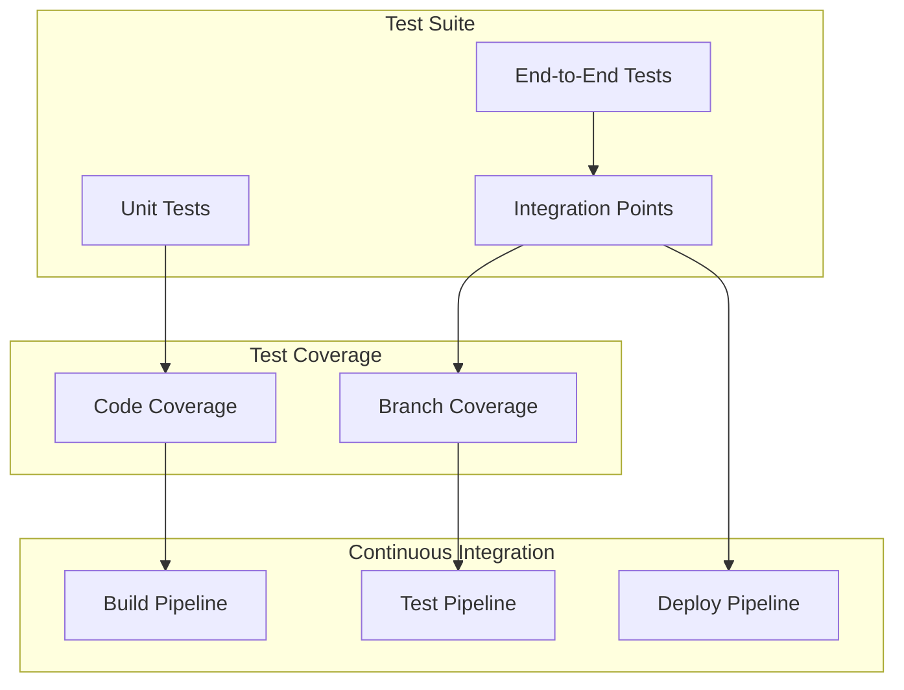

## &#x1F680; Quick Start

### Prerequisites
- Python 3.8+
- Docker and Docker Compose
- Git

### One-Line Setup (Linux/WSL)
```bash
curl -sSL https://raw.githubusercontent.com/nshkrdotcom/EADS/main/setup.sh | bash
```

### Manual Setup (All Platforms)
1. Clone and setup:
   ```bash
   git clone https://github.com/nshkrdotcom/EADS.git
   cd EADS
   python3 -m venv .venv
   source .venv/bin/activate  # On Windows: .venv\Scripts\activate
   pip install -r requirements/dev.txt
   pre-commit install
   ```

2. Start services:
   ```bash
   docker-compose -f docker/docker-compose.yml up -d
   ```

3. Verify setup:
   ```bash
   pytest
   ```

### Development
- Format code: `black . && isort .`
- Run tests: `pytest`
- Type check: `mypy .`
- Lint: `flake8`
- Run all checks: `pre-commit run --all-files`

### Troubleshooting
- Services not starting? Run `docker-compose -f docker/docker-compose.yml down -v && docker-compose -f docker/docker-compose.yml up -d`
- Database issues? Wait 45 seconds after startup for Neo4j to initialize
- Port conflicts? Check and stop services using ports 7474, 8000, 8001

## &#x1F4AC; Vision

To create a self-healing, continuously improving software ecosystem that autonomously adapts to emerging technological landscapes.

## &#x1F527; Setup & Installation

### Prerequisites

- Python 3.8 or higher
- Docker and Docker Compose
- Git
- Linux environment (recommended)
- System packages: `sudo apt-get update && sudo apt-get install -y python3-venv python3-pip`

### Environment Setup

1. **Clone the Repository:** `git clone https://github.com/nshkrdotcom/EADS.git && cd EADS`
2. **Run Setup Script:** `chmod +x setup.sh init.sh install_requirements.sh requirements/lock_deps.sh && ./setup.sh` (Installs system packages, creates a Python virtual environment, and makes initialization scripts executable).
3. **Activate Virtual Environment:** `source .venv/bin/activate`
4. **Install Dependencies:** `./install_requirements.sh` (Installs core dependencies, development tools, and ML libraries).
5. **Environment Configuration:** `cp .env.example .env` (Configure database connections, Weaviate settings, Ray cluster configuration, MLflow tracking, and DVC remote storage).


## Dependency Management

The project uses service-specific dependency management to handle conflicting requirements:

```bash
requirements/
├── nlp.txt      # NLP service dependencies
├── nlp.lock     # Locked versions for NLP
├── gp.txt       # GP Engine dependencies
├── gp.lock      # Locked versions for GP
├── dev.txt      # Development environment (includes all)
└── dev.lock     # Locked versions for development
```

Generate locked dependencies:
```bash
./requirements/lock_deps.sh  # Creates .lock files with exact versions
```

- Each service has its own requirements to handle conflicts (e.g., different httpx versions)
- Development environment includes all dependencies for local work
- Lock files should be committed to version control

### Development Workflow

1. **System Requirements:** Python 3.8 or higher; Docker and Docker Compose; Git; 8GB RAM minimum (16GB recommended); 20GB free disk space.
2. **Python Dependencies:** `sudo apt-get update && sudo apt-get install -y python3-venv python3-pip`
3. **Docker Installation:**
   ```bash
   curl -fsSL https://get.docker.com -o get-docker.sh
   sudo sh get-docker.sh
   sudo curl -L "https://github.com/docker/compose/releases/latest/download/docker-compose-$(uname -s)-$(uname -m)" -o /usr/local/bin/docker-compose
   sudo chmod +x /usr/local/bin/docker-compose
   ```

### Initial Setup

1. **Clone the Repository:** `git clone https://github.com/yourusername/EADS.git && cd EADS`
2. **Environment Setup:** `chmod +x setup.sh init.sh install_requirements.sh requirements/lock_deps.sh && ./setup.sh`
3. **Configure Environment Variables:** `cp .env.example .env && nano .env`

### Development Workflow

1. **Start Development Environment:** `source .venv/bin/activate && ./init.sh`
2. **Verify Services:** `docker-compose -f docker/docker-compose.yml ps`; Access service endpoints: Neo4j Browser (http://localhost:7474), NLP Service (http://localhost:8000/docs), GP Engine (http://localhost:8001/docs).
3. **Development Commands:**  `pytest` (run tests), `mypy .` (run type checking), `black . && isort .` (format code), `flake8` (run linting).
4. **Pre-commit Hooks:** `pre-commit install` and `pre-commit run --all-files`.

### Troubleshooting

1. **Docker Issues:** `docker-compose -f docker/docker-compose.yml down -v && docker-compose -f docker/docker-compose.yml up -d`
2. **Database Issues:**  `docker-compose -f docker/docker-compose.yml down -v neo4j && docker-compose -f docker/docker-compose.yml up -d neo4j`; `docker-compose -f docker/docker-compose.yml down -v postgres && docker-compose -f docker/docker-compose.yml up -d postgres`
3. **Common Problems:** Services not starting (check Docker logs and ensure ports are not in use); Neo4j connection failed (wait 45 seconds after startup); Permission errors (ensure Docker has proper permissions); Memory issues (check Docker memory allocation).

### Development Best Practices

1. **Code Quality:** Run pre-commit hooks; Maintain test coverage above 80%; Follow type hints; Document new functions and classes.
2. **Git Workflow:** Create feature branches from `main`; Keep commits atomic; Run tests before pushing; Use conventional commit messages.
3. **Service Development:** Follow async/await patterns; Implement proper error handling; Add appropriate logging; Design for future message queue integration.


### IDE Setup

1. **VSCode Configuration:**
   ```json
   {
     "python.linting.enabled": true,
     "python.linting.flake8Enabled": true,
     "python.formatting.provider": "black",
     "editor.formatOnSave": true,
     "python.linting.mypyEnabled": true
   }
   ```
2. **PyCharm Configuration:** Enable Python type hints; Set Black as formatter; Enable Flake8 linting; Configure test runner for pytest.

### Updating Dependencies

1. **Python Dependencies:** `pip install --upgrade -r requirements/dev.txt` or `pip install --upgrade package_name`
2. **Docker Images:** `docker-compose -f docker/docker-compose.yml pull && docker-compose -f docker/docker-compose.yml build --no-cache`

# EADS Logging and Instrumentation Guide

## Overview

EADS uses structured logging and instrumentation to provide comprehensive visibility into service operations, performance, and errors during development. The system is built on **structlog** for structured logging with JSON output, making it easy to analyze and debug issues.

## Core Features

- Structured JSON logging with timing and context
- Request/response tracking across all services
- Operation-specific metrics and error tracking
- Performance timing built into all operations
- Automatic sensitive data filtering
- Service-specific logging patterns

## Quick Start

### Basic Operation Logging

```python
from eads_core.logging import log_operation

def process_text(text: str) -> dict:
    with log_operation("process_text", text_length=len(text)) as ctx:
        result = do_processing(text)
        ctx.update(result_size=len(result))
        return result
```

**Output:**
```json
{"event": "process_text_started", "text_length": 150, "service": "nlp", "timestamp": "2024-02-20T10:30:45Z"}
{"event": "process_text_completed", "text_length": 150, "result_size": 42, "elapsed_seconds": 0.125, "service": "nlp", "timestamp": "2024-02-20T10:30:45Z"}
```

### Service Setup

```python
from fastapi import FastAPI
from eads_core.logging import ServiceLogger

app = FastAPI()
logger = ServiceLogger("my_service")

# Log service startup
logger.log_startup({
    "service": "my_service",
    "config": {
        "host": "localhost",
        "port": 8080
    }
})

# Add request logging middleware
@app.middleware("http")
async def log_requests(request: Request, call_next):
    ctx = logger.log_request(request.method, request.url.path)
    response = await call_next(request)
    logger.log_response(response.status_code, request_id=ctx.get("request_id"))
    return response
```

## Common Use Cases

### 1. Error Tracking

```python
def analyze_code(code: str) -> dict:
    with log_operation("analyze_code", code_length=len(code)) as ctx:
        try:
            result = perform_analysis(code)
            ctx.update(num_findings=len(result["findings"]))
            return result
        except Exception as e:
            ctx.update(error=str(e))
            raise  # Log will include error and stack trace
```

### 2. Performance Monitoring

```python
def batch_process(items: List[str]) -> List[dict]:
    with log_operation("batch_process", batch_size=len(items)) as ctx:
        start_memory = get_memory_usage()
        results = [process_item(item) for item in items]
        ctx.update(
            memory_delta=get_memory_usage() - start_memory,
            processed_count=len(results)
        )
        return results
```

### 3. Complex Operations

```python
async def train_model(dataset: Dataset, epochs: int):
    with log_operation("model_training",
                      dataset_size=len(dataset),
                      epochs=epochs) as ctx:
        for epoch in range(epochs):
            loss = await train_epoch(dataset)
            ctx.update({f"loss_epoch_{epoch}": loss})
```

## Development Tools

### 1. Log Viewing

During development, logs are output in JSON format to stdout. Use jq for easy filtering and viewing:

```bash
# Watch all logs in pretty format
tail -f service.log | jq '.'

# Filter for specific events
tail -f service.log | jq 'select(.event | contains("model_training"))'

# Watch timing metrics
tail -f service.log | jq 'select(.elapsed_seconds != null)'
```

### 2. Performance Analysis

```bash
# Get average response times for each endpoint
cat service.log | jq -r 'select(.event == "http_response") | {path: .path, time: .elapsed_seconds}' | \
  jq -s 'group_by(.path) | map({path: .[0].path, avg_time: (map(.time) | add / length)})'
```

### 3. Error Investigation

```bash
# Find all errors with stack traces
cat service.log | jq 'select(.error != null)'

# Get error frequency by type
cat service.log | jq -r 'select(.error_type != null) | .error_type' | sort | uniq -c
```

## Best Practices

### Operation Context
- Always include relevant input sizes and counts
- Update context with operation-specific metrics
- Add timing for operations that might be slow

```python
with log_operation("process_document",
                  doc_size=len(document),
                  doc_type=document.type) as ctx:
    # Processing...
    ctx.update(
        sections_processed=len(sections),
        cache_hits=cache_hits,
        warnings=warning_count
    )
```

### Error Handling
- Log errors with full context
- Include relevant state information
- Use appropriate log levels

```python
try:
    result = risky_operation()
except ValueError as e:
    logger.warning("Invalid input", error=str(e), input_value=value)
except Exception as e:
    logger.error("Operation failed",
                error=str(e),
                state=current_state,
                traceback=traceback.format_exc())
```

### Performance Tracking
- Log resource usage for heavy operations
- Track timing for all network calls
- Monitor memory usage for large data processing

```python
with log_operation("data_processing") as ctx:
    ctx.update(initial_memory=get_memory_usage())
    result = process_large_dataset(data)
    ctx.update(
        final_memory=get_memory_usage(),
        records_processed=len(result)
    )
```

## Future Extensions

The logging system is designed to be extensible. Future additions might include:

- Integration with Grafana for metrics visualization
- OpenTelemetry integration for distributed tracing
- Custom log aggregation with Loki
- Automated performance regression detection
- Real-time alerting based on log patterns

## Technical Details

### Core Components

- **structlog**: Structured logging with JSON output
- **FastAPI middleware** for HTTP request tracking
- **Context managers** for operation tracking
- **Time and resource usage measurements**

### Configuration

The logging system is configured in `eads_core/logging.py` and provides:

- JSON formatting for machine readability
- ISO timestamp formatting
- Automatic context propagation
- Environment-based configuration
- Sensitive data filtering

### Performance Impact

The logging system is designed to have minimal overhead:

- JSON serialization is done asynchronously
- Context managers have microsecond-level overhead
- Log levels prevent unnecessary processing
- Sampling can be enabled for high-volume operations


## &#x1F6E0;&#xFE0F; Message Queue Readiness & Roadmap

### Current Architecture (HTTP)
The EADS system uses direct HTTP communication between services, optimized for development and debugging.  This provides simple request/response patterns, easy debugging and monitoring, direct error handling, and straightforward local development.

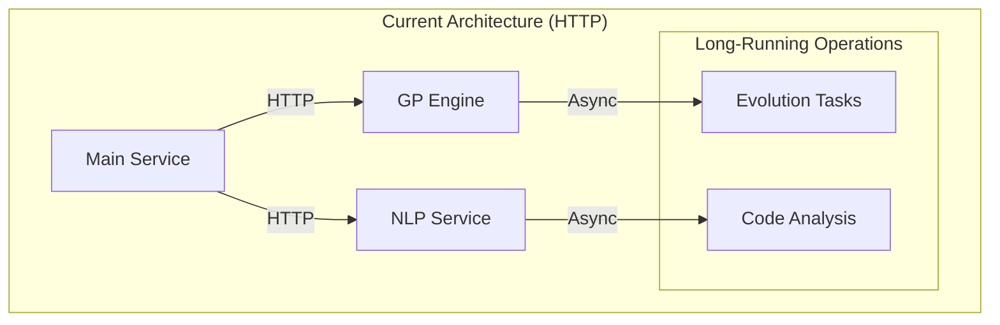

### Message Queue Ready Design

The codebase is designed to be "message queue ready" using:

1. **Async Operation Pattern:** Long-running operations return job IDs; Status checking endpoints; Results retrievable via separate endpoints.
2. **Decoupled Processing:** Services operate independently; State management via databases; No direct service-to-service dependencies.
3. **Configurable Timeouts:** `REQUEST_TIMEOUT` environment variable; Adjustable worker processes; Async mode toggle.

### Future Message Queue Architecture

For scaling, a message queue architecture will be implemented:

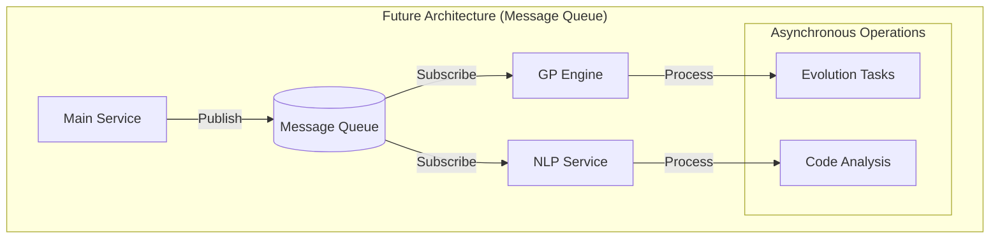

### Migration Path

1. **Phase 1: Current (HTTP with Async)**
2. **Phase 2: Message Queue Integration:** Add message queue service; Implement publishers/subscribers; Maintain HTTP endpoints; Parallel operation support.
3. **Phase 3: Full Message Queue:** Scale out workers; Advanced retry policies; Dead letter queues; Event-driven processing.

### Code Design Principles
To ensure smooth future migration to message queues, we follow these principles:

1. **Service Independence**
   ```python
   # Example service pattern
   class Service:
       async def process_task(self, task_id: str, payload: dict):
           # Can be triggered by HTTP or message queue
           job = await self.create_job(task_id, payload)
           await self.process_async(job)
           return job.id
   ```

2. **State Management**
   ```python
   # Example state handling
   class JobManager:
       async def get_job_status(self, job_id: str):
           # Consistent state checking regardless of trigger method
           return await self.db.get_job(job_id)
   ```

3. **Result Handling**
   ```python
   # Example result pattern
   class ResultHandler:
       async def store_result(self, job_id: str, result: dict):
           # Results stored in DB, retrievable via ID
           await self.db.store_result(job_id, result)
   ```

## Detailed Message Queue Implementation

#### Message Queue Architecture Details

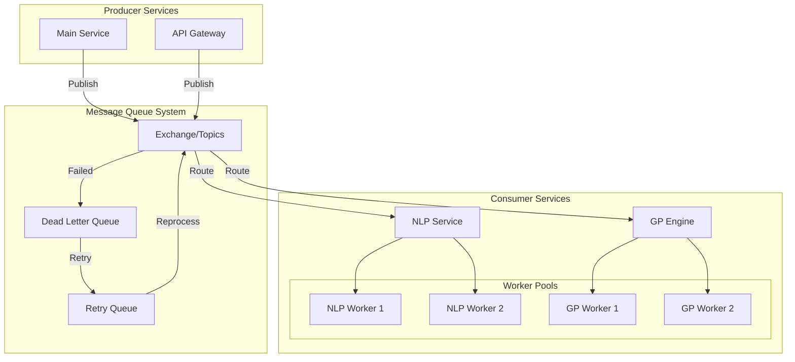

#### Message Types and Routing

1. **Code Analysis Messages:**  A JSON message specifying `message_type`, `priority`, `payload` (code_id, repository, file_paths, analysis_type), and `metadata` (timestamp, retry_count, timeout).
2. **Evolution Task Messages:** A JSON message specifying `message_type`, `priority`, `payload` (population_id, generation, individuals, fitness_criteria), and `metadata` (timestamp, retry_count, timeout).

#### Queue Configuration

```yaml
# Future docker-compose.yml addition
services:
  rabbitmq:
    image: rabbitmq:3-management
    environment:
      - RABBITMQ_DEFAULT_USER=eads
      - RABBITMQ_DEFAULT_PASS=secure_password
      - RABBITMQ_VM_MEMORY_HIGH_WATERMARK=0.6
    configs:
      - source: rabbitmq_config
        target: /etc/rabbitmq/rabbitmq.conf
configs:
  rabbitmq_config:
    content: |
      queue.max_priority = 10
      queue.max_length = 100000
      consumer_timeout = 3600000
```

#### Error Handling and Retry Strategy

```python
# Future message handling pattern
class MessageProcessor:
    RETRY_DELAYS = [60, 300, 900, 3600]  # Exponential backoff
    async def process_message(self, message: dict):
        try:
            result = await self._process(message)
            await self.acknowledge(message)
            return result
        except TemporaryError as e:
            retry_count = message['metadata']['retry_count']
            if retry_count < len(self.RETRY_DELAYS):
                await self.retry_later(message, delay=self.RETRY_DELAYS[retry_count])
            else:
                await self.move_to_dlq(message, str(e))
        except PermanentError as e:
            await self.move_to_dlq(message, str(e))
```

### Current Service Implementation Examples

#### NLP Service Pattern (Excerpt)

```python
# src/nlp/service.py
from typing import Dict, List, Optional
from fastapi import FastAPI, BackgroundTasks
from pydantic import BaseModel

class CodeAnalysisRequest(BaseModel):
    code_id: str
    repository: str
    file_paths: List[str]
    analysis_type: str

class NLPService:
    def __init__(self):
        self.job_store = JobStore()
        self.result_store = ResultStore()

    async def analyze_code(self, request: CodeAnalysisRequest, background_tasks: BackgroundTasks) -> Dict[str, str]:
        job_id = await self.job_store.create_job(task_type="code_analysis", payload=request.dict())
        background_tasks.add_task(self._process_analysis, job_id, request)
        return {"job_id": job_id}

    async def _process_analysis(self, job_id: str, request: CodeAnalysisRequest):
        try:
            result = await self.analyzer.analyze(repository=request.repository, file_paths=request.file_paths)
            await self.result_store.store_result(job_id, result)
            await self.job_store.mark_completed(job_id)
        except Exception as e:
            await self.job_store.mark_failed(job_id, str(e))

    async def get_job_status(self, job_id: str) -> Dict[str, Any]:
        return await self.job_store.get_status(job_id)
```

#### GP Engine Pattern (Excerpt)

```python
# src/gp_engine/service.py
from typing import Dict, List, Optional
from fastapi import FastAPI, BackgroundTasks
from pydantic import BaseModel

class EvolutionRequest(BaseModel):
    population_id: str
    generation: int
    individuals: List[str]
    fitness_criteria: Dict[str, float]

class GPService:
    def __init__(self):
        self.evolution_store = EvolutionStore()
        self.population_store = PopulationStore()

    async def evolve_population(self, request: EvolutionRequest, background_tasks: BackgroundTasks) -> Dict[str, str]:
        task_id = await self.evolution_store.create_task(population_id=request.population_id, generation=request.generation, payload=request.dict())
        background_tasks.add_task(self._process_evolution, task_id, request)
        return {"task_id": task_id}

    async def _process_evolution(self, task_id: str, request: EvolutionRequest):
        try:
            population = await self.population_store.get_population(request.population_id)
            result = await self.evolution_engine.evolve(population=population, fitness_criteria=request.fitness_criteria)
            await self.population_store.update_population(population_id=request.population_id, new_generation=result)
            await self.evolution_store.mark_completed(task_id)
        except Exception as e:
            await self.evolution_store.mark_failed(task_id, str(e))

    async def get_task_status(self, task_id: str) -> Dict[str, Any]:
        return await self.evolution_store.get_status(task_id)
```

These examples demonstrate how the services are designed with message queue patterns in mind, simplifying future migration.  Key aspects include job/task-based processing, asynchronous execution, status tracking, result storage, and error handling.


## Configuration

The system uses environment variables. Copy `.env.example` to `.env` and adjust the values (`cp .env.example .env`).  Required settings include Neo4j ( `NEO4J_*` variables) and PostgreSQL (`POSTGRES_*` variables).

## &#x1F063; System Architecture

EADS uses a modular microservices architecture: GP Service (`gp_engine`), NLP Service (`nlp`), Knowledge Base (Neo4j), and Configuration Management (environment variables).

1. **GP Service (`gp_engine`):**
   - Manages code evolution through genetic programming
   - Handles population initialization and evolution
   - Configurable evolution parameters
   - RESTful API endpoints for evolution operations

2. **NLP Service (`nlp`):**
   - Code analysis using transformer models
   - Pattern matching and similarity computation
   - RESTful API endpoints for NLP operations
   - Configurable model selection

3. **Knowledge Base:**
   - Neo4j Graph Database integration
   - Asynchronous database operations
   - Structured knowledge representation
   - Structured code pattern storage
   - Environment-based configuration

4. **Configuration Management:**
   - Environment variables for sensitive data
   - Service-specific configuration
   - Logging configuration
   - Development and production settings

## &#x1F4C8; System Diagrams

### High-Level Component Architecture

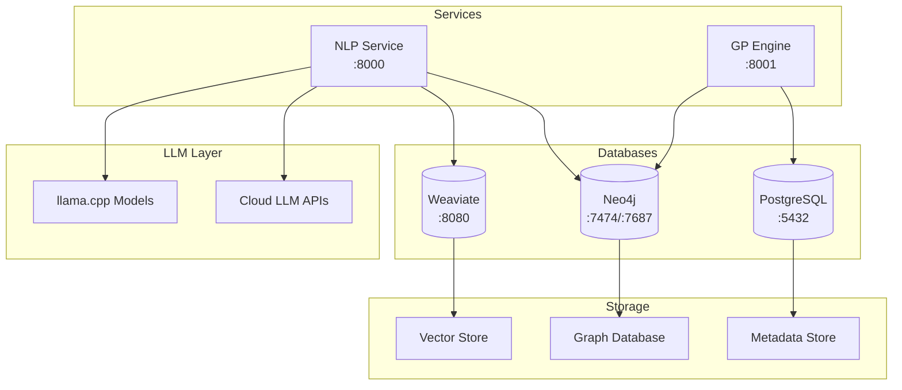

### Service Integration Flow

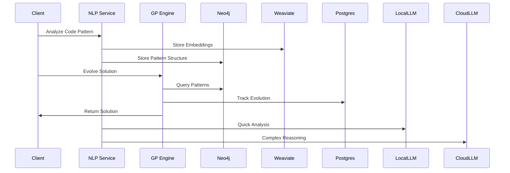

### Container Architecture

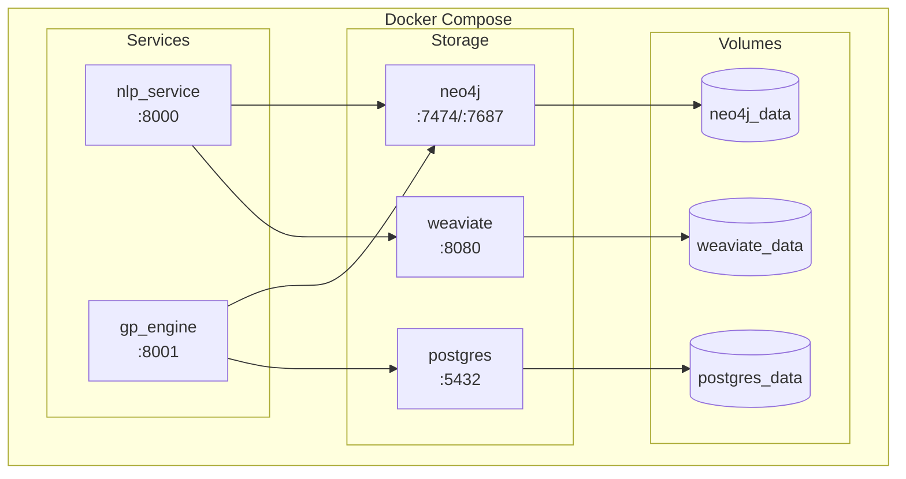

### Data Flow Architecture

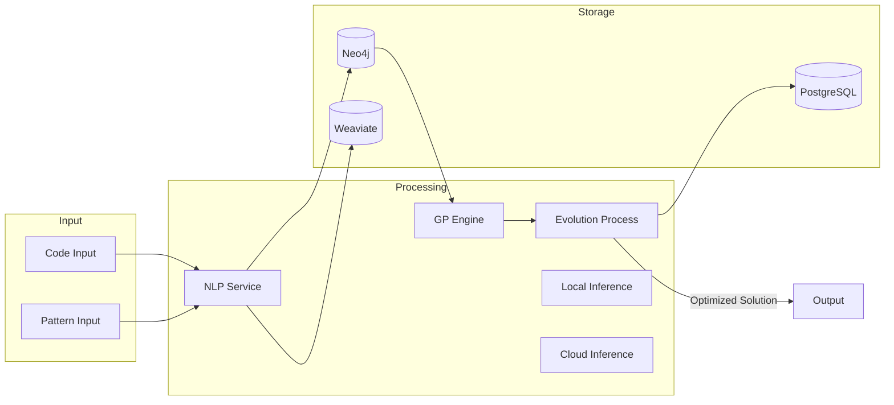

### Module Dependencies

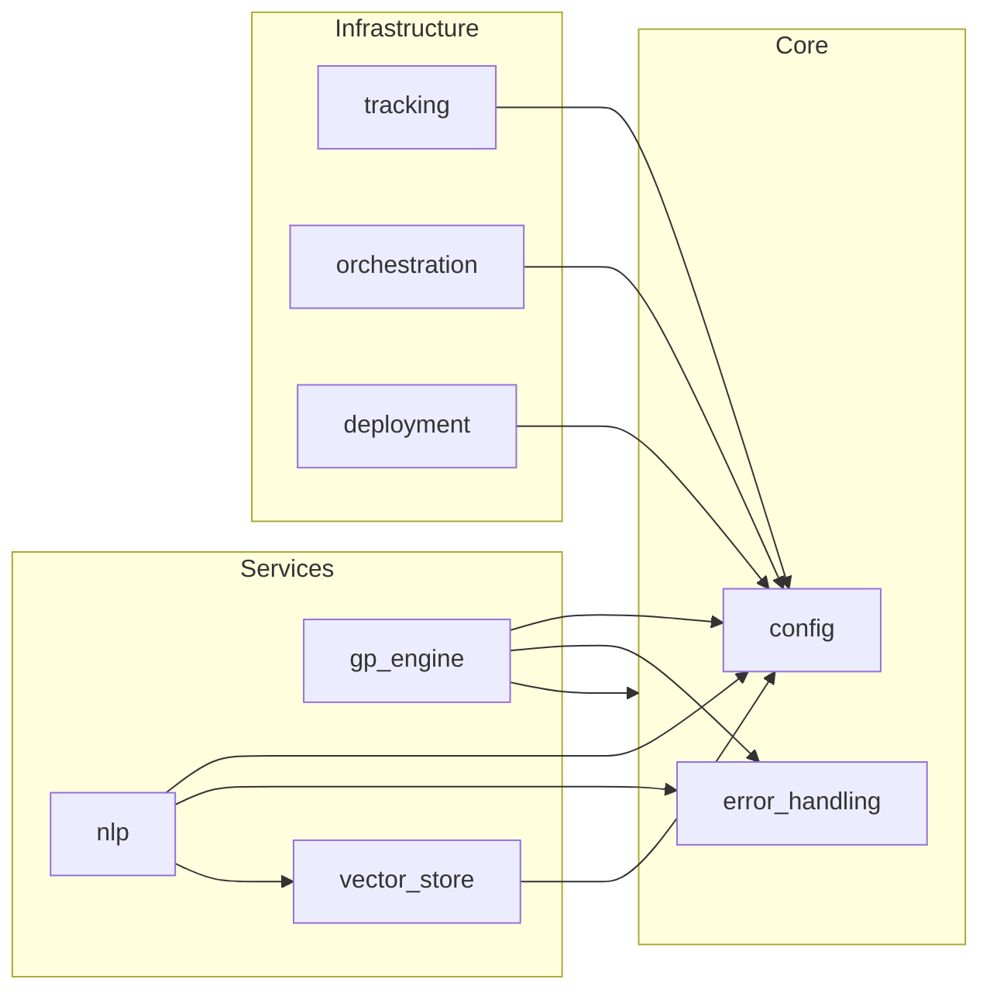

### Component Interaction Flow
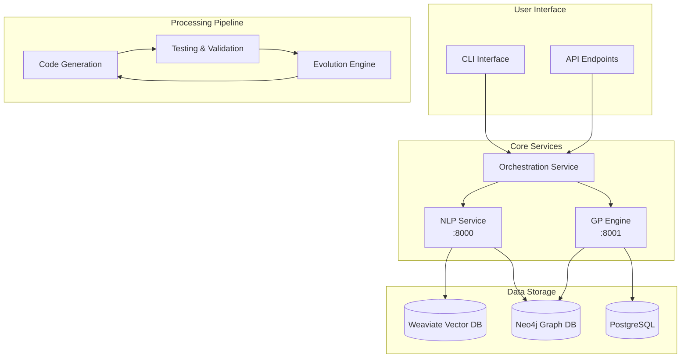

### Data Processing Pipeline
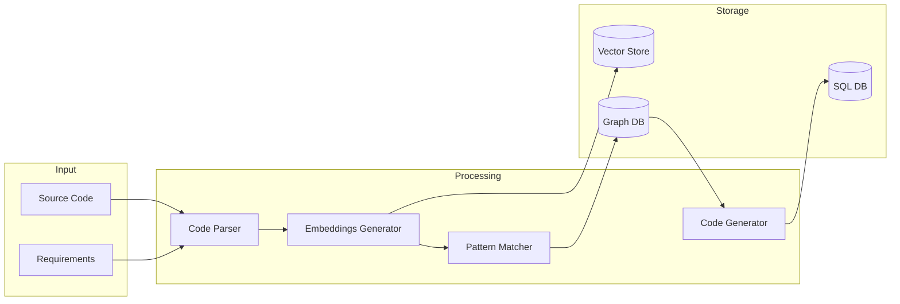

### Fault Tolerance Mechanism
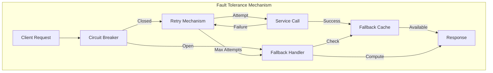

### Fault Tolerance Architecture
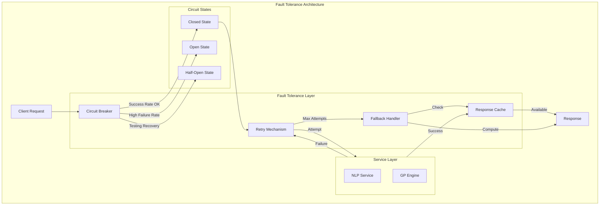

### Development Workflow
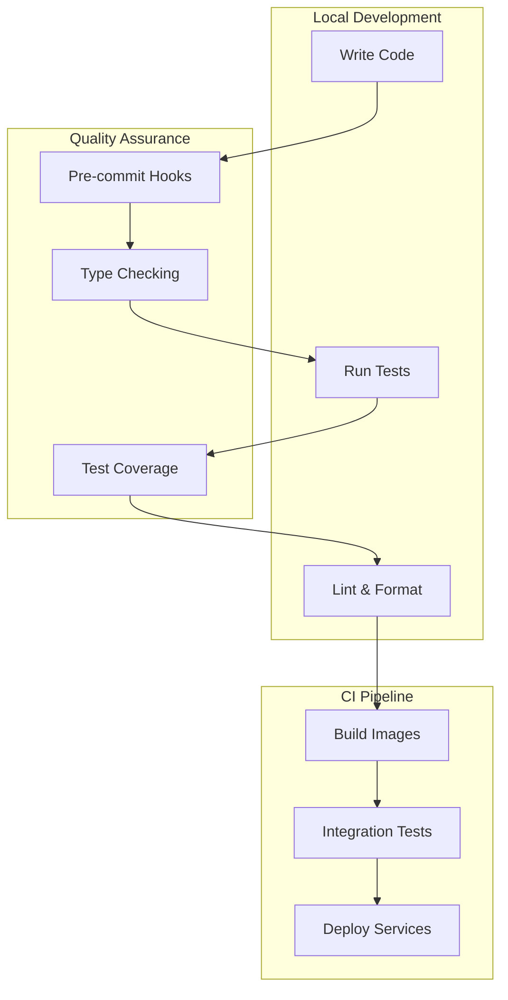

### Deployment Architecture
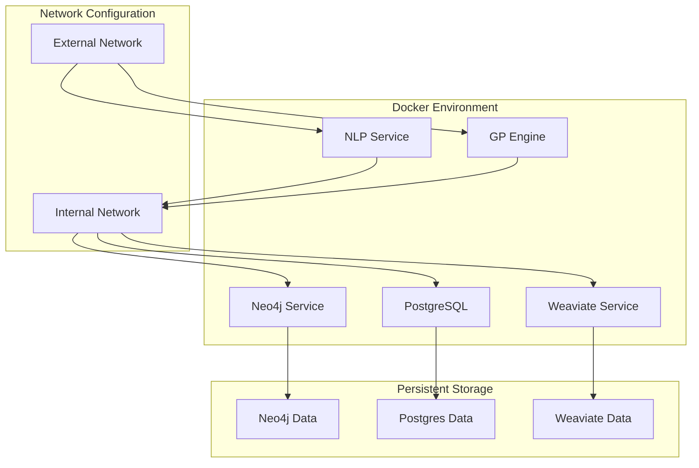

### Testing Strategy


# Assessment of the Initial Phase

## Strengths:

### Architecture Design
- Clean separation of services (NLP, GP Engine)
- Well-thought-out fault tolerance patterns (circuit breakers, retries)
- Message-queue ready design for future scaling

### Development Experience
- Comprehensive documentation
- Service-specific dependency management
- Good development tooling:
  - `pytest`
  - `mypy`
  - `black`
  - `flake8`

### Infrastructure
- Docker-based deployment
- Multiple database integrations:
  - Neo4j
  - PostgreSQL
  - Weaviate
- Environment-based configuration

## Areas for Consideration:

### Testing Infrastructure
- While the testing strategy is documented, not many actual tests are present yet.
- Consider adding integration test examples between NLP and GP services.
- Add performance benchmarking tests early.

### Monitoring & Observability
- Consider adding logging infrastructure.
- Add health check endpoints.
- Implement metrics collection.

### Development Flow
- Could benefit from example notebooks/scripts.
- Add more concrete examples of genetic programming patterns.
- Consider adding development environment setup scripts.

### Documentation
- Add API documentation.
- Include sequence diagrams for key flows.
- Add troubleshooting guides.

## Recommendations for Next Phase:

### Core Functionality
- Implement basic GP operations.
- Add NLP analysis patterns.
- Create initial integration points.

### Developer Experience
- Add example workflows.
- Create debugging tools.
- Implement development data generators.

### Quality Assurance
- Set up CI/CD pipeline.
- Add integration tests.
- Implement automated testing.

### Infrastructure
- Add monitoring stack.
- Implement proper logging.
- Set up development environment automation.
