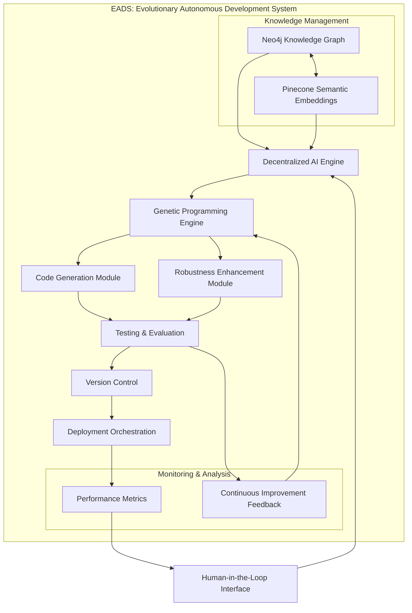
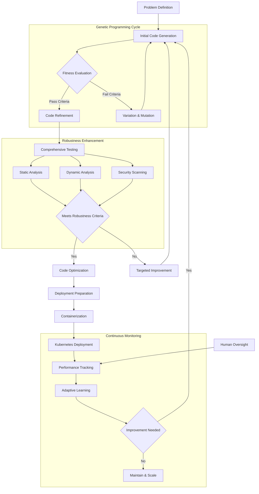
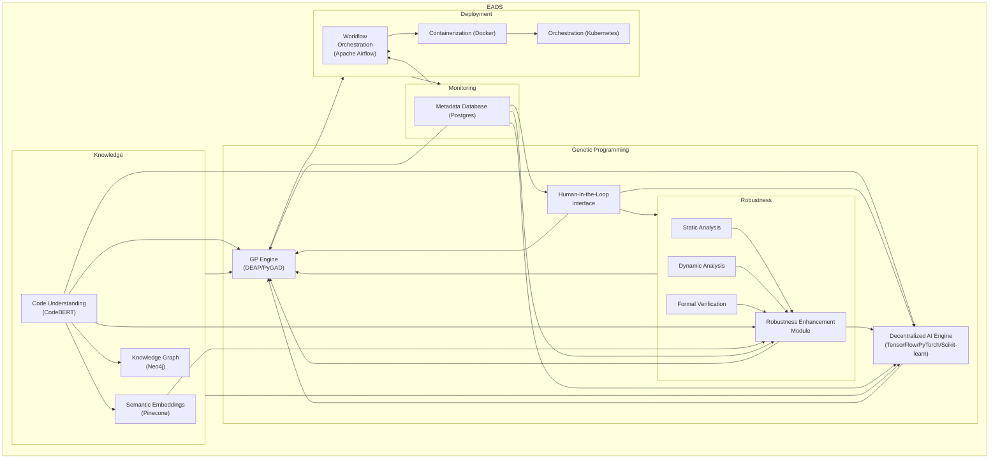

# &#x1F9EC; EADS: Evolutionary Autonomous Development System

## &#x1F680; Paradigm-Shifting Software Engineering

EADS represents a revolutionary approach to autonomous software development, leveraging advanced AI, genetic programming, and adaptive learning to create a self-evolving software engineering ecosystem.

This project aims to build an Evolutionary Automated Development System (EADS) for generating, testing, and refining software applications through iterative evolution. EADS leverages the power of Large Language Models (LLMs), Genetic Programming (GP), and advanced analysis techniques to create robust and adaptable software.  This system is designed to be highly scalable, resilient, and adaptable to various software development tasks, exceeding the capabilities of traditional manual or even simpler automated systems.

### &#x1F52D; Core Innovation

At its heart, EADS is not just another development tool&#x2014;it's an intelligent, self-improving system that learns, adapts, and generates high-quality software with minimal human intervention.

## &#x2728; Key Features

### Intelligent Code Generation
- &#x1F9E0; LLM-powered code synthesis
- &#x1F9EC; Genetic programming for optimization
- &#x1F50D; Semantic understanding via advanced embeddings

### Robust Quality Assurance
- &#x1F4CA; Comprehensive testing frameworks
  - Unit Testing
  - Integration Testing
  - Performance Optimization
  - Security Hardening

### Advanced Learning Mechanisms
- &#x1F504; Recursive self-improvement cycle
- &#x1F4DA; Semantic knowledge base
- &#x1F916; Decentralized AI engine

## &#x1F3D7;&#xFE0F; System Architecture

### Components
1. **Genetic Programming Engine**
   - Population management
   - Variation operators
   - Fitness evaluation
   - Intelligent selection

2. **Knowledge Management**
   - Neo4j Knowledge Graph
   - Pinecone Semantic Embeddings
   - NLP-enriched code taxonomy

3. **Robustness Enhancement**
   - Static &amp; Dynamic Analysis
   - Formal Verification
   - Continuous optimization

4. **Deployment &amp; Monitoring**
   - Apache Airflow Orchestration
   - Docker Containerization
   - Kubernetes Scaling
   - Postgres Metadata Tracking

## &#x1F31F; Unique Selling Points

- &#x1F510; Self-securing code generation
- &#x1F4A1; Adaptive learning paradigms
- &#x1F680; Reduced human intervention
- &#x1F30E; Scalable, cloud-native architecture

## &#x1F6E0;&#xFE0F; Technology Stack

- **AI/ML**: 
  - TensorFlow
  - PyTorch
  - Scikit-learn
- **Genetic Programming**:
  - DEAP
  - PyGAD
- **Knowledge Management**:
  - Neo4j
  - Pinecone
- **Deployment**:
  - Docker
  - Kubernetes
  - Apache Airflow

## &#x1F4AC; Vision

To create a self-healing, continuously improving software ecosystem that autonomously adapts to emerging technological landscapes.

## System Architecture

EADS employs a modular architecture, integrating several key components:

1. **Knowledge Base:**  A richly structured knowledge base encompassing code examples, design patterns, libraries, best practices, and security guidelines.  This is used to inform the AI Engine and the GP Engine.  This incorporates a robust and scalable Graph Database (Neo4j) to store code taxonomies and architectural knowledge, and a semantic embedding layer (Pinecone) to facilitate intelligent code search and retrieval.

2. **Decentralized AI Engine:** Multiple specialized AI modules (security, performance, maintainability, etc.), leveraging deep learning frameworks like TensorFlow or PyTorch, collaborate to generate, analyze, and optimize code.  This design enhances resilience and allows for focused expertise.

3. **Genetic Programming Engine:** This component utilizes a robust GP engine (DEAP or PyGAD) for code evolution. It uses sophisticated techniques like AST manipulation, semantic embedding-guided crossover, and LLM-enhanced mutation and code generation, leveraging the CodeBERT model for advanced code understanding.

4. **Robustness Enhancement Module:** Performs comprehensive code analysis (static and dynamic) and formal verification (where feasible) to identify potential issues.  It utilizes static analysis tools (PMD, FindBugs, SonarQube, etc.), dynamic instrumentation (DynamoRIO, Frida), and potentially model checkers (CBMC, KLEE).  This generates a robustness score and specific feedback.

5. **Deployment and Monitoring:** A robust pipeline (managed by Apache Airflow) that deploys the generated code to ASKA using Docker containers, and monitors performance, resource usage, security, and user feedback.  It integrates with Kubernetes for scaling and resilience.

6. **Metadata Management:**  A relational database (Postgres) stores experiment tracking data, version control information, fitness scores, metrics, logs, and compliance data.

7. **Human-Machine Interface:**  A user-friendly interface for developers to interact with and guide the EADS, providing feedback, setting goals, and reviewing results.

## Technology Stack

| Component                    | Technology               | Description                                                                                                    |
|-------------------------------|---------------------------|-------------------------------------------------------------------------------------------------------------|
| Knowledge Base                | Neo4j, Pinecone           | Graph database and vector database for code knowledge and semantic search.                                  |
| Decentralized AI Engine       | TensorFlow/PyTorch, Scikit-learn | Deep learning frameworks and machine learning library.                                                        |
| Genetic Programming Engine    | DEAP/PyGAD               | Evolutionary algorithm framework.                                                                             |
| Code Representation           | TreeSitter                | Parser for creating Abstract Syntax Trees (ASTs).                                                            |
| Static Analysis               | PMD, FindBugs, SonarQube  | Tools for static code analysis.                                                                              |
| Dynamic Analysis             | DynamoRIO, Frida          | Tools for dynamic code analysis.                                                                              |
| Formal Verification           | CBMC, KLEE (Optional)      | Model checkers for formal verification.                                                                         |
| Retrieval Augmented Generation (RAG) | LlamaIndex, LangChain | Data framework and framework for LLM-powered applications. |
| Code Understanding           | CodeBERT                 | Pre-trained LLM for enhanced code understanding.                                                           |
| Workflow Orchestration       | Apache Airflow            | Manages the EADS pipeline.                                                                                   |
| Containerization              | Docker                    | Creates isolated development environments.                                                                     |
| Orchestration                  | Kubernetes                | Manages container deployment and scaling.                                                                     |
| Metadata Database             | Postgres                  | Stores experiment data, metrics, and logs.                                                                  |

## &#x1F91D; Contribution

Passionate about autonomous systems? We're always looking for brilliant minds to push the boundaries of AI-driven software engineering!

### Prerequisites
- Strong understanding of machine learning
- Experience with genetic algorithms
- Python expertise
- Curiosity and passion for cutting-edge tech

## Getting Started

1. **Clone the Repository:**  `git clone <repository_url>`
2. **Install Dependencies:**  Refer to the `requirements.txt` file.
3. **Build Docker Images:**  `./build.sh`  (This script will handle building all Docker images using `docker-compose`).
4. **Start Containers:** `docker-compose up -d`  (Starts all containers in detached mode).
5. **Access Services:** Access databases and APIs via the ports specified in `docker-compose.yml`.

## &#x1F4DC; License

MIT License

## &#x1F4E7; Contact

Reach out if you're as excited about autonomous software evolution as we are!

---

*Inspired by the boundless potential of artificial intelligence and the art of software craftsmanship.*

## &#x1F4BB; Project Diagrams

### EADS System Architecture Diagram

### EADS Autonomous Development Workflow

### System Diagram

