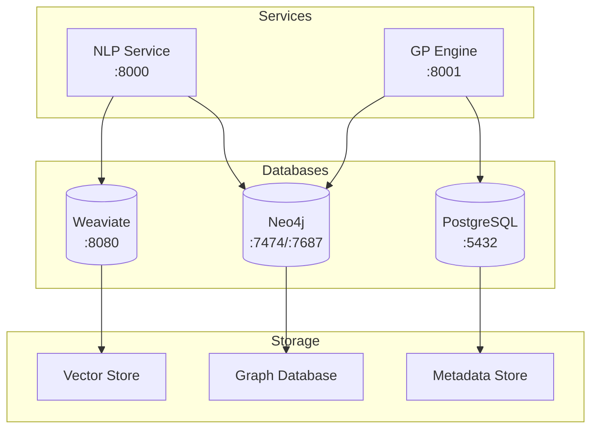
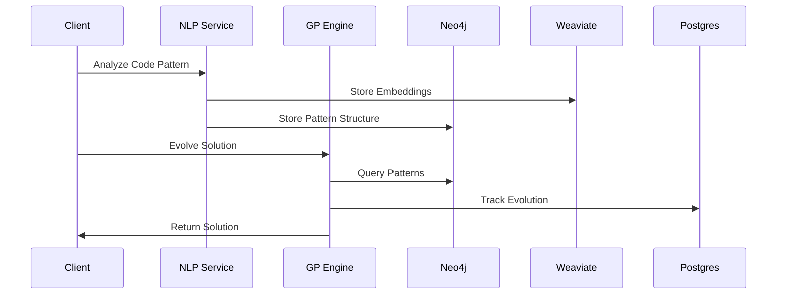
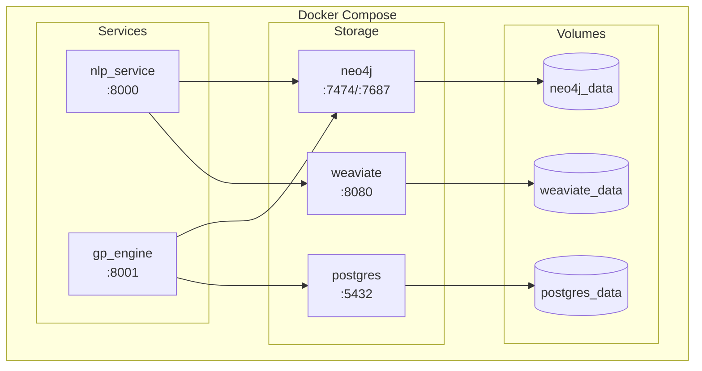
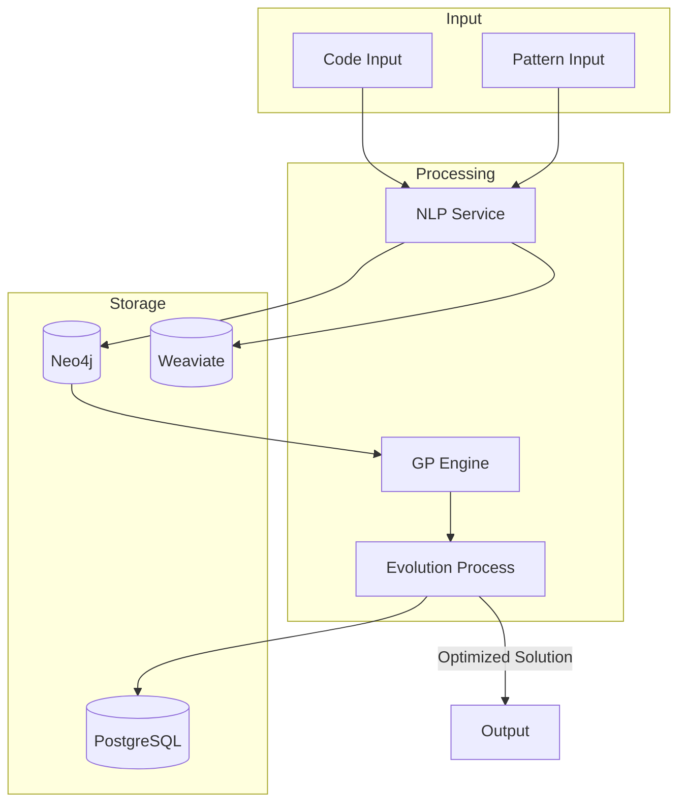
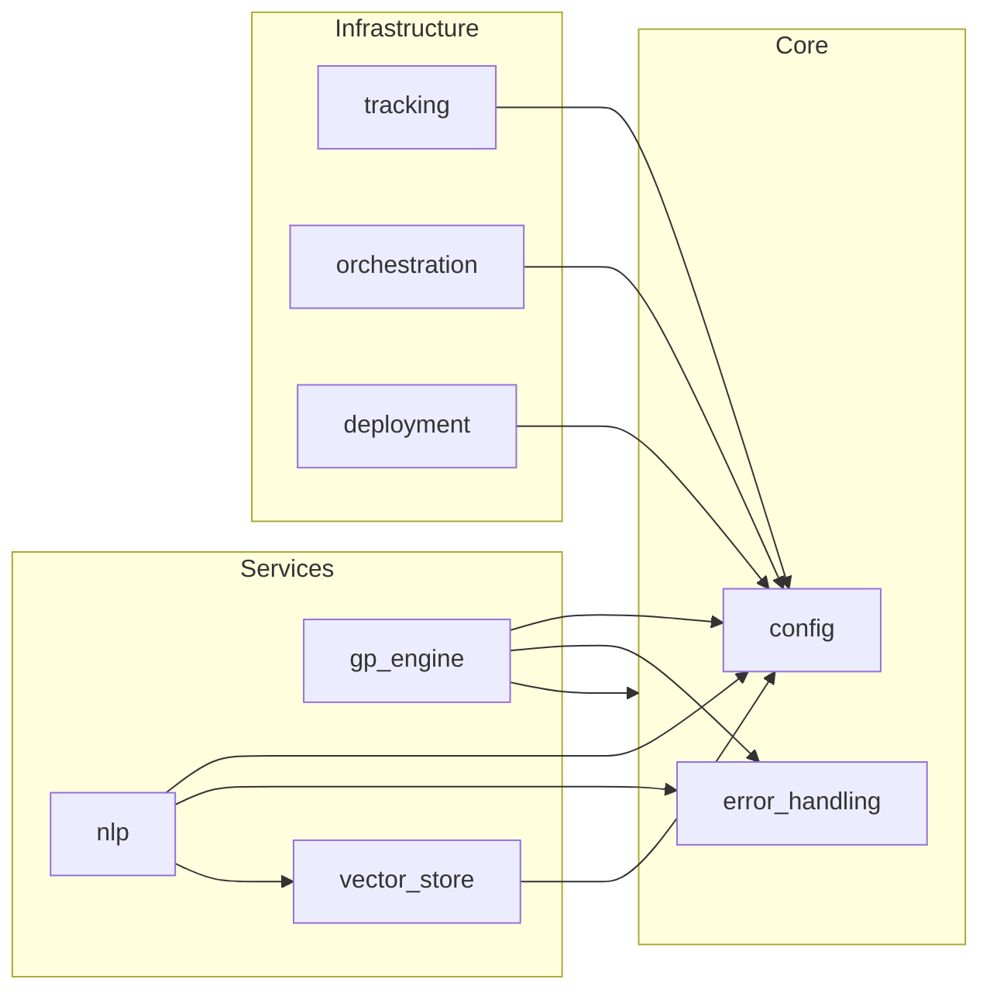

# &#x1F9EC; EADS: Evolutionary Autonomous Development System

## &#x1F680; Paradigm-Shifting Software Engineering

EADS represents a revolutionary approach to autonomous software development, leveraging advanced AI, genetic programming, and adaptive learning to create a self-evolving software engineering ecosystem.

This project aims to build an Evolutionary Automated Development System (EADS) for generating, testing, and refining software applications through iterative evolution. EADS leverages the power of Large Language Models (LLMs), Genetic Programming (GP), and advanced analysis techniques to create robust and adaptable software.  This system is designed to be highly scalable, resilient, and adaptable to various software development tasks, exceeding the capabilities of traditional manual or even simpler automated systems.

### &#x1F52D; Core Innovation

At its heart, EADS is not just another development tool&#x2014;it's an intelligent, self-improving system that learns, adapts, and generates high-quality software with minimal human intervention.

## &#x2728; Key Features

### Intelligent Code Generation
- &#x1F9E0; LLM-powered code synthesis
- &#x1F9EC; Genetic programming for optimization
- &#x1F50D; Semantic understanding via advanced embeddings

### Robust Quality Assurance
- &#x1F4CA; Comprehensive testing frameworks
  - Unit Testing
  - Integration Testing
  - Performance Optimization
  - Security Hardening

### Advanced Learning Mechanisms
- &#x1F504; Recursive self-improvement cycle
- &#x1F4DA; Semantic knowledge base
- &#x1F916; Decentralized AI engine

## &#x1F3D7;&#xFE0F; System Architecture

### Components

1. **Genetic Programming Engine**
   - Population-based code evolution using DEAP
   - Individual representation with code and fitness attributes
   - Configurable evolution parameters (population size, generations, mutation/crossover rates)
   - FastAPI-based service for evolution operations

2. **NLP Service**
   - Sentence Transformer-based code analysis
   - Semantic code pattern matching
   - Code similarity computation
   - FastAPI-based service for NLP operations

3. **Knowledge Management**
   - Neo4j Graph Database integration
   - Asynchronous database operations
   - Structured code pattern storage
   - Environment-based configuration

4. **Testing & Quality Assurance**
   - Comprehensive test suite with pytest
   - Pre-commit hooks for code quality
   - Type checking with mypy
   - Linting with flake8 and black

## &#x1F31F; Unique Selling Points

- &#x1F510; Self-securing code generation
- &#x1F4A1; Adaptive learning paradigms
- &#x1F680; Reduced human intervention
- &#x1F30E; Scalable, cloud-native architecture

## &#x1F6E0;&#xFE0F; Technology Stack

- **Core Services**:
  - FastAPI
  - Python 3.10+
  - Pydantic
  - Uvicorn
- **Infrastructure**:
  - Docker
  - Docker Compose
  - PostgreSQL
- **Genetic Programming**:
  - DEAP
- **NLP & ML**:
  - Sentence Transformers
  - TensorFlow Keras
- **Database**:
  - Neo4j (AuraDB)
- **Development Tools**:
  - pre-commit
  - pytest
  - mypy
  - black
  - flake8
  - isort

## Technology Stack Details

| Component                    | Technology               | Description & Usage                                                                                           |
|-----------------------------|-------------------------|-------------------------------------------------------------------------------------------------------------|
| **Core Framework**          |                         |                                                                                                             |
| Web Framework               | FastAPI 0.110.0+        | High-performance async web framework for building APIs with automatic OpenAPI documentation                  |
| Python Runtime              | Python 3.8+             | Modern Python version with support for type hints and async/await                                           |
| API Documentation           | OpenAPI/Swagger         | Interactive API documentation and testing interface                                                         |
| Server                      | Uvicorn 0.27.0+        | Lightning-fast ASGI server implementation                                                                   |
| Configuration              | Pydantic 2.5.0+        | Data validation, settings management, and schema definition                                                 |
| **Infrastructure**          |                         |                                                                                                             |
| Containerization           | Docker                  | Container-based deployment with microservices architecture                                                  |
| Orchestration              | docker-compose          | Multi-container application orchestration                                                                   |
| Metadata Storage           | PostgreSQL              | Relational database for experiment tracking and metrics                                                     |
| **Genetic Programming**     |                         |                                                                                                             |
| Evolution Framework         | DEAP 1.4.1+            | Primary framework for evolutionary computation and genetic programming                                       |
| Alternative Framework       | PyGAD 3.2.0+           | Alternative genetic algorithm implementation for specific use cases                                         |
| **NLP & Machine Learning**  |                         |                                                                                                             |
| Text Embeddings            | Sentence Transformers 2.5.0+ | Neural network models for code embedding generation                                                    |
| Deep Learning              | TensorFlow 2.15.0+      | Deep learning framework for model training                                                                 |
| Code Analysis              | Tree-sitter 0.20.4+     | Fast, accurate code parsing and analysis                                                                   |
| **Knowledge & Storage**     |                         |                                                                                                             |
| Graph Database             | Neo4j 5.15.0+           | Graph database for code patterns and relationships                                                         |
| Vector Database            | Weaviate 4.4.0+         | Vector search and storage for code embeddings                                                              |
| Environment Variables      | python-dotenv 1.0.0+    | Configuration management for sensitive data                                                                |
| **ML Ops & Tracking**      |                         |                                                                                                             |
| Experiment Tracking        | MLflow 2.10.0+          | ML experiment tracking and model management                                                                |
| Version Control            | DVC 3.38.1+             | Data and model version control                                                                             |
| Distributed Computing      | Ray 2.9.0+              | Distributed computing framework for scaling ML workloads                                                    |
| **LLM Integration**        |                         |                                                                                                             |
| LLM Framework              | LangChain 0.1.0+        | Framework for building LLM applications                                                                    |
| RAG Framework              | LlamaIndex 0.9.15+      | Framework for building RAG applications                                                                    |
| **Development Tools**       |                         |                                                                                                             |
| Type Checking              | mypy 1.8.0+             | Static type checking with strict enforcement                                                               |
| Code Formatting            | black 23.12.0+          | Code formatting with consistent style                                                                      |
| Import Sorting             | isort 5.13.0+           | Python import organization                                                                                 |
| Linting                    | flake8 7.0.0+           | Code quality enforcement                                                                                   |
| Git Hooks                  | pre-commit 3.6.0+       | Automated code quality checks                                                                              |
| **Testing**                |                         |                                                                                                             |
| Testing Framework          | pytest 7.4.0+           | Testing framework with fixture support                                                                     |
| Async Testing              | pytest-asyncio 0.23.5+  | Async test support                                                                                        |
| Coverage                   | pytest-cov 4.1.0+       | Test coverage reporting                                                                                    |

### Planned Components

The following components are planned for future implementation:

1. **Infrastructure & Deployment**
   - Kubernetes orchestration for production scaling
   - Enhanced monitoring and logging
   - Service mesh implementation

2. **Code Analysis & Verification**
   - CBMC/KLEE for formal verification
   - DynamoRIO/Frida for dynamic analysis
   - Additional vector store integration (Pinecone)

3. **Enhanced ML Capabilities**
   - CodeBERT integration
   - Additional language support in Tree-sitter
   - Expanded RAG capabilities

Each component in our current stack has been carefully selected and integrated into the system. The stack is modular by design, allowing for easy updates and replacements as the project evolves.

## &#x1F4AC; Vision

To create a self-healing, continuously improving software ecosystem that autonomously adapts to emerging technological landscapes.

## &#x1F527; Setup & Installation

### Prerequisites


### Development Setup

1. **Clone the Repository**
   ```bash
   git clone https://github.com/nshkrdotcom/EADS.git
   cd EADS
   ```

2. **Set Up Python Environment**
   ```bash
   # Set permissions
   chmod +x ./*.sh

   # Run setup script to create virtual environment
   ./setup.sh

   # Activate virtual environment
   source .venv/bin/activate

   # Install Python requirements
   ./install_requirements.sh
   ```

3. **Configure Environment**
   ```bash
   cp .env.example .env
   # The .env.example contains development defaults:
   # - Neo4j password: "password"
   # - Postgres password: "password"
   # You can keep these defaults for development
   ```

4. **Initialize System**
   ```bash
   # Initialize EADS components
   ./init.sh
   ```

5. **Build Docker Services** (Optional)
   ```bash
   # Only needed if you modified Dockerfiles
   ./build.sh
   ```

### Development Workflow

1. **Start Development Session**
   ```bash
   source .venv/bin/activate  # Activate virtual environment
   docker-compose up -d       # Start Docker services
   ```

2. **Connect to PostgreSQL**
   ```bash
   # Using psql CLI:
   psql -h localhost -p 5432 -U postgres -d eads
   # Password: password

   # Alternative GUI clients:
   # - pgAdmin 4: Popular PostgreSQL GUI (https://www.pgadmin.org/)
   # - DBeaver: Universal database tool (https://dbeaver.io/)
   # - DataGrip: JetBrains database IDE (https://www.jetbrains.com/datagrip/)
   ```

3. **Stop Development Session**
   ```bash
   docker-compose down  # Stop Docker services
   deactivate          # Exit virtual environment
   ```

### Development Tools

The project includes several development tools to maintain code quality.

#### Initial Setup

1. **Install System Packages** (Ubuntu/Debian)
   ```bash
   # Install pre-commit
   sudo apt install pre-commit

   # Install Python development tools
   sudo apt install python3-dev
   ```

2. **Install Python Development Requirements**
   ```bash
   # Make sure your virtual environment is active
   source .venv/bin/activate

   # Install requirements
   pip install -r requirements.txt
   ```

3. **Set Up Pre-commit Hooks**
   ```bash
   # Install the pre-commit hooks
   pre-commit install

   # Run all hooks initially
   pre-commit run --all-files
   ```

#### Using Development Tools

1. **Code Formatting**
   ```bash
   # Format code with black
   black .

   # Sort imports
   isort .
   ```

2. **Code Quality Checks**
   ```bash
   # Run flake8
   flake8 .

   # Run mypy type checking
   mypy .
   ```

3. **Testing**
   ```bash
   # Run tests with coverage
   pytest

   # View coverage report
   open htmlcov/index.html
   ```

4. **Pre-commit Hooks**
   ```bash
   # Install pre-commit hooks
   pre-commit install

   # Run hooks manually
   pre-commit run --all-files
   ```

These tools are automatically installed with the development requirements. The pre-commit hooks will run automatically on git commit to ensure code quality.

### Available Services

When running, you can access:
- Neo4j Browser: http://localhost:7474 (web interface)
- NLP Service: http://localhost:8000 (API endpoint)
- GP Engine: http://localhost:8001 (API endpoint)
- PostgreSQL: localhost:5432 (database server)
  ```
  Connection details:
  Host: localhost
  Port: 5432
  User: postgres
  Password: password
  Database: eads
  ```

### Troubleshooting

If you encounter Docker permission issues:
```bash
sudo usermod -aG docker $USER
sudo chmod 666 /var/run/docker.sock
# Log out and log back in for changes to take effect
```

## System Architecture Diagrams

### High-Level Component Architecture



### Service Integration Flow



### Container Architecture



### Data Flow Architecture



### Module Dependencies



## Configuration

The system uses environment variables for configuration. Copy the `.env.example` file to `.env` and adjust the values:

```bash
cp .env.example .env
```

Required settings:
- Neo4j: Database for knowledge graph (`NEO4J_*` variables)
- PostgreSQL: Database for metadata (`POSTGRES_*` variables)


## &#x1F063; System Architecture

EADS employs a modular microservices architecture:

1. **GP Service (`gp_engine`):**
   - Manages code evolution through genetic programming
   - Handles population initialization and evolution
   - Configurable evolution parameters
   - RESTful API endpoints for evolution operations

2. **NLP Service (`nlp`):**
   - Code analysis using transformer models
   - Pattern matching and similarity computation
   - RESTful API endpoints for NLP operations
   - Configurable model selection

3. **Knowledge Base:**
   - Neo4j graph database for storing code patterns, relationships, and metadata
   - Asynchronous database operations
   - Structured knowledge representation
   - Environment-based configuration

4. **Configuration Management:**
   - Environment variables for sensitive data
   - Service-specific configuration
   - Logging configuration
   - Development and production settings


## &#x1F91D; Contribution

Passionate about autonomous systems? We're always looking for brilliant minds to push the boundaries of AI-driven software engineering!

### Prerequisites
- Strong understanding of machine learning
- Experience with genetic algorithms
- Python expertise
- Curiosity and passion for cutting-edge tech

## Getting Started


## &#x1F4BB; Project Diagrams
