# &#x1F9EC; EADS: Evolutionary Autonomous Development System

## &#x1F680; Paradigm-Shifting Software Engineering

EADS represents a revolutionary approach to autonomous software development, leveraging advanced AI, genetic programming, and adaptive learning to create a self-evolving software engineering ecosystem.

This project aims to build an Evolutionary Automated Development System (EADS) for generating, testing, and refining software applications through iterative evolution. EADS leverages the power of Large Language Models (LLMs), Genetic Programming (GP), and advanced analysis techniques to create robust and adaptable software.  This system is designed to be highly scalable, resilient, and adaptable to various software development tasks, exceeding the capabilities of traditional manual or even simpler automated systems.

### &#x1F52D; Core Innovation

At its heart, EADS is not just another development tool&#x2014;it's an intelligent, self-improving system that learns, adapts, and generates high-quality software with minimal human intervention.

## &#x2728; Key Features

### Intelligent Code Generation
- &#x1F9E0; LLM-powered code synthesis
- &#x1F9EC; Genetic programming for optimization
- &#x1F50D; Semantic understanding via advanced embeddings

### Robust Quality Assurance
- &#x1F4CA; Comprehensive testing frameworks
  - Unit Testing
  - Integration Testing
  - Performance Optimization
  - Security Hardening

### Advanced Learning Mechanisms
- &#x1F504; Recursive self-improvement cycle
- &#x1F4DA; Semantic knowledge base
- &#x1F916; Decentralized AI engine

## &#x1F3D7;&#xFE0F; System Architecture

### Components
1. **Genetic Programming Engine**
   - Population management
   - Variation operators
   - Fitness evaluation
   - Intelligent selection

2. **Knowledge Management**
   - Neo4j Knowledge Graph
   - Pinecone Semantic Embeddings
   - NLP-enriched code taxonomy

3. **Robustness Enhancement**
   - Static &amp; Dynamic Analysis
   - Formal Verification
   - Continuous optimization

4. **Deployment &amp; Monitoring**
   - Apache Airflow Orchestration
   - Docker Containerization
   - Kubernetes Scaling
   - Postgres Metadata Tracking

## &#x1F31F; Unique Selling Points

- &#x1F510; Self-securing code generation
- &#x1F4A1; Adaptive learning paradigms
- &#x1F680; Reduced human intervention
- &#x1F30E; Scalable, cloud-native architecture

## &#x1F6E0;&#xFE0F; Technology Stack

- **AI/ML**:
  - TensorFlow
  - PyTorch
  - Scikit-learn
- **Genetic Programming**:
  - DEAP
  - PyGAD
- **Knowledge Management**:
  - Neo4j
  - Pinecone
- **Deployment**:
  - Docker
  - Kubernetes
  - Apache Airflow

## &#x1F4AC; Vision

To create a self-healing, continuously improving software ecosystem that autonomously adapts to emerging technological landscapes.

## &#x1F527; Setup & Installation

### Prerequisites
- Python 3.12 or higher
- Docker and Docker Compose (for running services)
- Git for version control
- Sufficient disk space for Docker images and volumes
- PostgreSQL client (choose one):
  ```bash
  # Ubuntu/Debian:
  sudo apt install postgresql-client-common postgresql-client

  # macOS:
  brew install libpq

  # Windows:
  # Install pgAdmin 4 from https://www.pgadmin.org/
  ```

### Development Setup

1. **Clone the Repository**
   ```bash
   git clone https://github.com/nshkrdotcom/EADS.git
   cd EADS
   ```

2. **Set Up Python Environment**
   ```bash
   # Set permissions
   chmod +x ./*.sh

   # Run setup script to create virtual environment
   ./setup.sh

   # Activate virtual environment
   source .venv/bin/activate

   # Install Python requirements
   ./install_requirements.sh
   ```

3. **Configure Environment**
   ```bash
   cp .env.example .env
   # The .env.example contains development defaults:
   # - Neo4j password: "password"
   # - Postgres password: "password"
   # You can keep these defaults for development
   ```

4. **Initialize System**
   ```bash
   # Initialize EADS components
   ./init.sh
   ```

5. **Build Docker Services** (Optional)
   ```bash
   # Only needed if you modified Dockerfiles
   ./build.sh
   ```

### Development Workflow

1. **Start Development Session**
   ```bash
   source .venv/bin/activate  # Activate virtual environment
   docker-compose up -d       # Start Docker services
   ```

2. **Connect to PostgreSQL**
   ```bash
   # Using psql CLI:
   psql -h localhost -p 5432 -U postgres -d eads
   # Password: password

   # Alternative GUI clients:
   # - pgAdmin 4: Popular PostgreSQL GUI (https://www.pgadmin.org/)
   # - DBeaver: Universal database tool (https://dbeaver.io/)
   # - DataGrip: JetBrains database IDE (https://www.jetbrains.com/datagrip/)
   ```

3. **Stop Development Session**
   ```bash
   docker-compose down  # Stop Docker services
   deactivate          # Exit virtual environment
   ```

### Development Tools

The project includes several development tools to maintain code quality.

#### Initial Setup

1. **Install System Packages** (Ubuntu/Debian)
   ```bash
   # Install pre-commit
   sudo apt install pre-commit

   # Install Python development tools
   sudo apt install python3-dev
   ```

2. **Install Python Development Requirements**
   ```bash
   # Make sure your virtual environment is active
   source .venv/bin/activate

   # Install requirements
   pip install -r requirements.txt
   ```

3. **Set Up Pre-commit Hooks**
   ```bash
   # Install the pre-commit hooks
   pre-commit install

   # Run all hooks initially
   pre-commit run --all-files
   ```

#### Using Development Tools

1. **Code Formatting**
   ```bash
   # Format code with black
   black .

   # Sort imports
   isort .
   ```

2. **Code Quality Checks**
   ```bash
   # Run flake8
   flake8 .

   # Run mypy type checking
   mypy .
   ```

3. **Testing**
   ```bash
   # Run tests with coverage
   pytest

   # View coverage report
   open htmlcov/index.html
   ```

4. **Pre-commit Hooks**
   ```bash
   # Install pre-commit hooks
   pre-commit install

   # Run hooks manually
   pre-commit run --all-files
   ```

These tools are automatically installed with the development requirements. The pre-commit hooks will run automatically on git commit to ensure code quality.

### Code Organization

- `main.py`: Main entry point
- `code_generation.py`: Code generation module
- `genetic_programming.py`: GP engine implementation
- `robustness_enhancements.py`: Code robustness tools
- `deployment.py`: Deployment utilities
- `gp_engine/`: Genetic Programming engine components
- `nlp/`: Natural Language Processing services
- `tests/`: Test cases

### Available Services

When running, you can access:
- Neo4j Browser: http://localhost:7474 (web interface)
- NLP Service: http://localhost:8000 (API endpoint)
- GP Engine: http://localhost:8001 (API endpoint)
- PostgreSQL: localhost:5432 (database server)
  ```
  Connection details:
  Host: localhost
  Port: 5432
  User: postgres
  Password: password
  Database: eads
  ```

### Troubleshooting

If you encounter Docker permission issues:
```bash
sudo usermod -aG docker $USER
sudo chmod 666 /var/run/docker.sock
# Log out and log back in for changes to take effect
```

## Configuration

The system uses environment variables for configuration. Copy the `.env.example` file to `.env` and adjust the values:

```bash
cp .env.example .env
```

Required settings:
- Neo4j: Database for knowledge graph (`NEO4J_*` variables)
- PostgreSQL: Database for metadata (`POSTGRES_*` variables)

Optional settings:
- Pinecone: Vector database for code embeddings
  - Set `PINECONE_API_KEY` if you want to use vector similarity search
  - Get your API key from [Pinecone](https://www.pinecone.io/)
  - The system will work without Pinecone, but some advanced features may be limited

## &#x1F063; System Architecture

EADS employs a modular architecture, integrating several key components:

1. **Knowledge Base:**  A richly structured knowledge base encompassing code examples, design patterns, libraries, best practices, and security guidelines.  This is used to inform the AI Engine and the GP Engine.  This incorporates a robust and scalable Graph Database (Neo4j) to store code taxonomies and architectural knowledge, and a semantic embedding layer (Pinecone) to facilitate intelligent code search and retrieval.


2. **Decentralized AI Engine:** Multiple specialized AI modules (security, performance, maintainability, etc.), leveraging deep learning frameworks like TensorFlow or PyTorch, collaborate to generate, analyze, and optimize code.  This design enhances resilience and allows for focused expertise.


3. **Genetic Programming Engine:** This component utilizes a robust GP engine (DEAP or PyGAD) for code evolution. It uses sophisticated techniques like AST manipulation, semantic embedding-guided crossover, and LLM-enhanced mutation and code generation, leveraging the CodeBERT model for advanced code understanding.


4. **Robustness Enhancement Module:** Performs comprehensive code analysis (static and dynamic) and formal verification (where feasible) to identify potential issues.  It utilizes static analysis tools (PMD, FindBugs, SonarQube, etc.), dynamic instrumentation (DynamoRIO, Frida), and potentially model checkers (CBMC, KLEE).  This generates a robustness score and specific feedback.


5. **Deployment and Monitoring:** A robust pipeline (managed by Apache Airflow) that deploys the generated code to ASKA using Docker containers, and monitors performance, resource usage, security, and user feedback.  It integrates with Kubernetes for scaling and resilience.


6. **Metadata Management:**  A relational database (Postgres) stores experiment tracking data, version control information, fitness scores, metrics, logs, and compliance data.


7. **Human-Machine Interface:**  A user-friendly interface for developers to interact with and guide the EADS, providing feedback, setting goals, and reviewing results.

## Technology Stack

| Component                    | Technology               | Description                                                                                                    |
|-------------------------------|---------------------------|-------------------------------------------------------------------------------------------------------------|
| Knowledge Base                | Neo4j, Pinecone           | Graph database and vector database for code knowledge and semantic search.                                  |
| Decentralized AI Engine       | TensorFlow/PyTorch, Scikit-learn | Deep learning frameworks and machine learning library.                                                        |
| Genetic Programming Engine    | DEAP/PyGAD               | Evolutionary algorithm framework.                                                                             |
| Code Representation           | TreeSitter                | Parser for creating Abstract Syntax Trees (ASTs).                                                            |
| Static Analysis               | PMD, FindBugs, SonarQube  | Tools for static code analysis.                                                                              |
| Dynamic Analysis             | DynamoRIO, Frida          | Tools for dynamic code analysis.                                                                              |
| Formal Verification           | CBMC, KLEE (Optional)      | Model checkers for formal verification.                                                                         |
| Retrieval Augmented Generation (RAG) | LlamaIndex, LangChain | Data framework and framework for LLM-powered applications. |
| Code Understanding           | CodeBERT                 | Pre-trained LLM for enhanced code understanding.                                                           |
| Workflow Orchestration       | Apache Airflow            | Manages the EADS pipeline.                                                                                   |
| Containerization              | Docker                    | Creates isolated development environments.                                                                     |
| Orchestration                  | Kubernetes                | Manages container deployment and scaling.                                                                     |
| Metadata Database             | Postgres                  | Stores experiment data, metrics, and logs.                                                                  |

## &#x1F91D; Contribution

Passionate about autonomous systems? We're always looking for brilliant minds to push the boundaries of AI-driven software engineering!

### Prerequisites
- Strong understanding of machine learning
- Experience with genetic algorithms
- Python expertise
- Curiosity and passion for cutting-edge tech

## Getting Started

1. **Clone the Repository:**  `git clone <repository_url>`
2. **Install Dependencies:**  Refer to the `requirements.txt` file.
3. **Build Docker Images:**  `./build.sh`  (This script will handle building all Docker images using `docker-compose`).
4. **Start Containers:** `docker-compose up -d`  (Starts all containers in detached mode).
5. **Access Services:** Access databases and APIs via the ports specified in `docker-compose.yml`.
6. **Run Main Code:** Execute the main pipeline script:
   ```bash
   docker-compose exec app python run_pipeline.py input.pdf output.tex
   ```
7. **Run Robustness Enhancement Module:** Execute the robustness enhancement script:
   ```bash
   docker-compose exec app python run_robustness.py
   ```
8. **Run Genetic Programming Module:** Execute the genetic programming script:
   ```bash
   docker-compose exec app python run_gp.py
   ```
9. **Run Deployment Module:** Execute the deployment script:
   ```bash
   docker-compose exec app python run_deployment.py
   ```

## &#x1F4BB; Project Diagrams

### EADS System Architecture Diagram

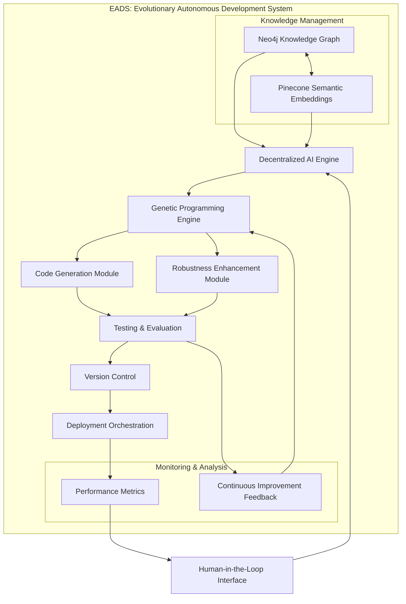
```mermaid
flowchart TB
    subgraph "EADS:&nbsp;Evolutionary&nbsp;Autonomous&nbsp;Development&nbsp;System"
        A[Decentralized AI Engine] --> B[Genetic Programming Engine]
        B --> C[Code Generation Module]
        B --> D[Robustness Enhancement Module]

        subgraph "Knowledge Management"
            E[Neo4j Knowledge Graph]
            F[Pinecone Semantic Embeddings]
            E <--> F
        end

        C --> G[Testing & Evaluation]
        D --> G
        E & F --> A

        G --> H[Version Control]
        H --> I[Deployment Orchestration]

        subgraph "Monitoring & Analysis"
            J[Performance Metrics]
            K[Continuous Improvement Feedback]
        end

        I --> J
        G --> K
        K --> B
    end

    M[Human-in-the-Loop Interface] --> A
    J --> M
```

### EADS Autonomous Development Workflow

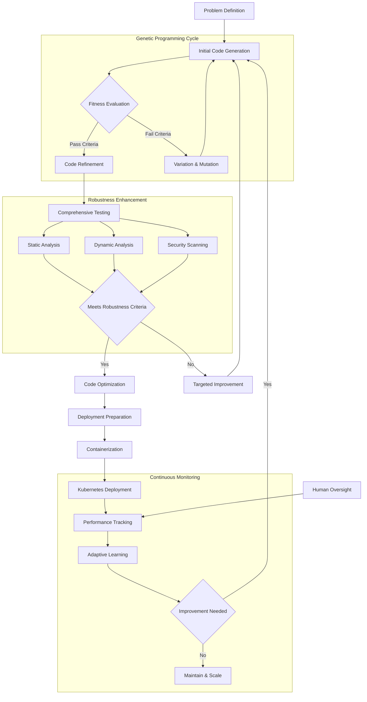
```mermaid
flowchart TD
    A[Problem Definition] --> B[Initial Code Generation]

    subgraph "Genetic Programming Cycle"
        B --> C{Fitness Evaluation}
        C -->|Pass Criteria| D[Code Refinement]
        C -->|Fail Criteria| E[Variation & Mutation]
        E --> B
    end

    D --> F[Comprehensive Testing]

    subgraph "Robustness Enhancement"
        F --> G[Static Analysis]
        F --> H[Dynamic Analysis]
        F --> I[Security Scanning]
        G & H & I --> J{Meets Robustness Criteria}
    end

    J -->|Yes| K[Code Optimization]
    J -->|No| L[Targeted Improvement]
    L --> B

    K --> M[Deployment Preparation]
    M --> N[Containerization]
    N --> O[Kubernetes Deployment]

    subgraph "Continuous Monitoring"
        O --> P[Performance Tracking]
        P --> Q[Adaptive Learning]
        Q --> R{Improvement Needed}
        R -->|Yes| B
        R -->|No| S[Maintain & Scale]
    end

    T[Human Oversight] --> P
```

### System Diagram

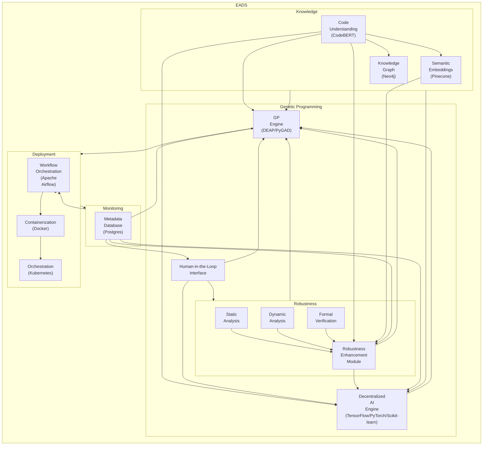
```mermaid
graph TD
    subgraph EADS
        subgraph Knowledge
            Neo4j["Knowledge<br>Graph<br>(Neo4j)"]
            Pinecone["Semantic<br>Embeddings<br>(Pinecone)"]
            CodeBERT["Code<br>Understanding<br>(CodeBERT)"] --> Neo4j & Pinecone
        end

        subgraph "Genetic&nbsp;Programming"
            DEAP["GP<br>Engine<br>(DEAP/PyGAD)"]
            AI["Decentralized<br>AI<br>Engine<br>(TensorFlow/PyTorch/Scikit-learn)"] --> DEAP
            CodeBERT --> AI & DEAP
            HCI["Human-in-the-Loop<br>Interface"] --> AI & DEAP & Robustness
        end

        subgraph Robustness
            direction TB
            SA["Static<br>Analysis"] --> REM
            DA["Dynamic<br>Analysis"] --> REM
            FV["Formal<br>Verification"] --> REM
            CodeBERT --> REM
            Pinecone --> REM
            REM["Robustness<br>Enhancement<br>Module"] --> DEAP & AI

        end

        subgraph Deployment
            Airflow["Workflow<br>Orchestration<br>(Apache<br>Airflow)"] --> Docker["Containerization<br>(Docker)"]
            Docker --> Kubernetes["Orchestration<br>(Kubernetes)"]
        end

        subgraph Monitoring
           MD["Metadata<br>Database<br>(Postgres)"]
           MD --> DEAP & AI & REM & HCI
        end

        DEAP --> Deployment

    end
    Knowledge --> DEAP & AI
    Robustness --> DEAP
    Monitoring --> Airflow
    Deployment --> Monitoring &  EADS["EADS Output"]
```

### Language Game Example

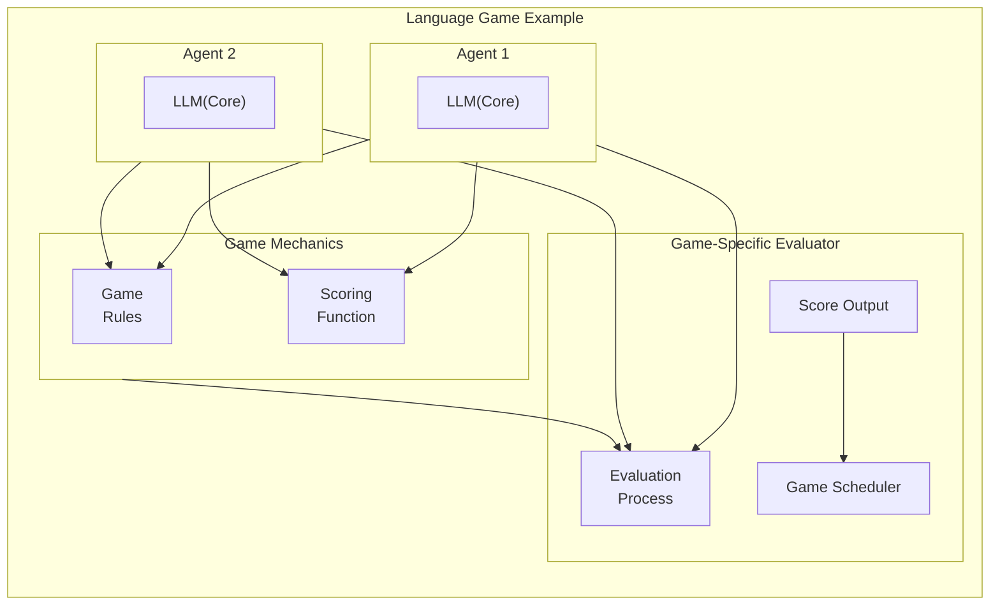
```mermaid
graph LR
    subgraph LanguageGame["Language&nbsp;Game&nbsp;Example"]
        subgraph Agent1["Agent 1"]
            LLM1["LLM(Core)"]
        end
        subgraph Agent2["Agent&nbsp;2"]
            LLM2["LLM(Core)"]
        end

        subgraph GameMechanics["Game&nbsp;Mechanics"]
            Rules["Game<br>Rules"]
            ScoringFunction["Scoring<br>Function"]
        end

        subgraph Evaluator["Game#8209;Specific&nbsp;Evaluator"]
            EvaluationProcess["Evaluation<br>Process"]
            ScoreOutput["Score Output"] --> GameScheduler["Game&nbsp;Scheduler"]
        end


        Agent1 --> Rules
        Agent2 --> Rules
        Agent1 --> ScoringFunction
        Agent2 --> ScoringFunction
        Agent1 --> EvaluationProcess
        Agent2 --> EvaluationProcess
        GameMechanics --> EvaluationProcess
    end
```

### Meta Game Dynamics


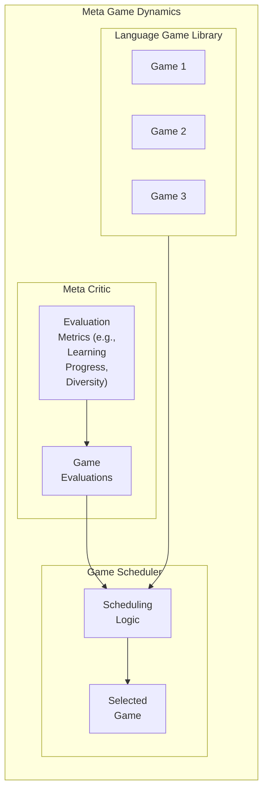
```mermaid
graph LR
    subgraph MetaGameDynamics["Meta Game Dynamics"]

        subgraph GameScheduler["Game Scheduler"]
            SchedulingLogic["Scheduling<br>Logic"]
            SelectedGame["Selected<br>Game"]
        end

        subgraph MetaCritic["Meta Critic"]
            EvaluationMetrics["Evaluation<br>Metrics (e.g.,<br>Learning<br>Progress,<br>Diversity)"]
            GameEvaluations["Game<br>Evaluations"]
        end

        subgraph GameLibrary["Language Game Library"]
            Game1["Game 1"]
            Game2["Game 2"]
            Game3["Game 3"]
        end

        EvaluationMetrics --> GameEvaluations
        GameEvaluations --> SchedulingLogic
        GameLibrary ----> SchedulingLogic
        SchedulingLogic --> SelectedGame
    end
```

### Agent Learning Process

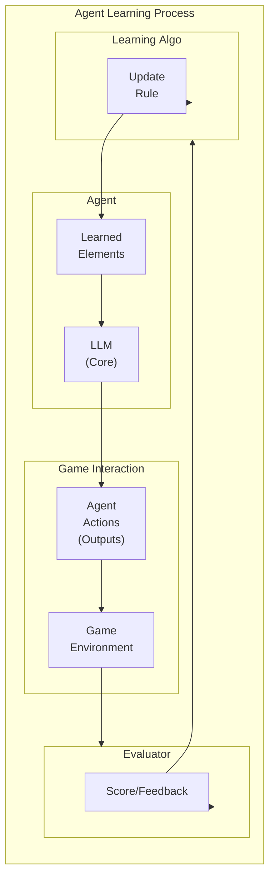
```mermaid
graph LR
    subgraph AgentLearning["Agent&nbsp;Learning&nbsp;Process"]

        subgraph Agent["Agent"]
            LLM["LLM<br>(Core)"]
            LearnedElements["Learned<br>Elements"]
        end

        subgraph Game["Game&nbsp;Interaction"]
            AgentActions["Agent<br>Actions<br>(Outputs)"]
            GameEnvironment["Game<br>Environment"]
        end

        subgraph Evaluator["Evaluator"]
            Score["Score/Feedback"]
        end

        subgraph LearningAlgorithm["Learning&nbsp;Algo"]
            UpdateRule["Update<br>Rule"]
        end

        LLM --> AgentActions
        AgentActions --> GameEnvironment
        GameEnvironment --> Evaluator
        Evaluator --> Score
        Score --> LearningAlgorithm
        LearningAlgorithm --> UpdateRule
        UpdateRule --> LearnedElements
        LearnedElements --> LLM
    end
```

### State Diagram (Boundless Socratic Learning)

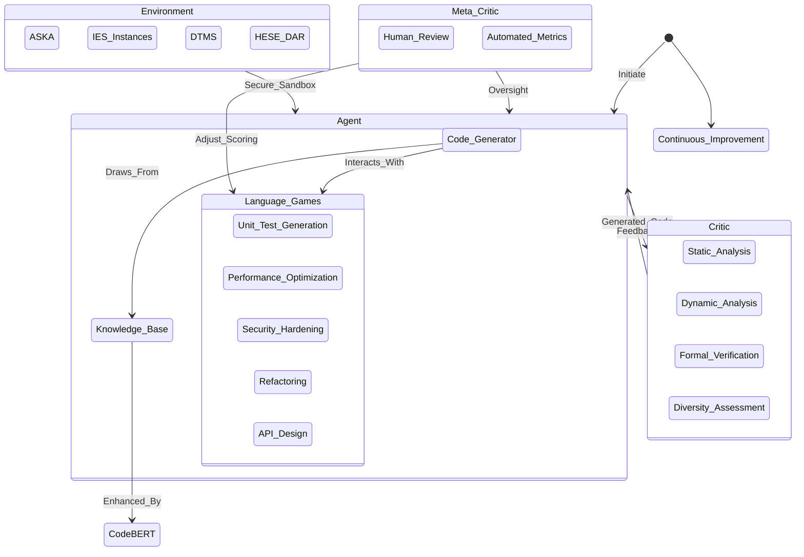
```mermaid
stateDiagram-v2
    direction TB

    [*] --> Agent : Initiate

    state Agent {
        direction TB
        Code_Generator --> Knowledge_Base : Draws_From
        Code_Generator --> Language_Games : Interacts_With
    }

    state Language_Games {
        direction LR
        Unit_Test_Generation
        Performance_Optimization
        Security_Hardening
        Refactoring
        API_Design
    }

    Agent --> Critic : Generated_Code
    Critic --> Agent : Feedback

    state Critic {
        direction LR
        Static_Analysis
        Dynamic_Analysis
        Formal_Verification
        Diversity_Assessment
    }

    Meta_Critic --> Agent : Oversight
    Meta_Critic --> Language_Games : Adjust_Scoring

    state Meta_Critic {
        direction TB
        Human_Review
        Automated_Metrics
    }

    Environment --> Agent : Secure_Sandbox

    state Environment {
        ASKA
        IES_Instances
        DTMS
        HESE_DAR
    }

    Knowledge_Base --> CodeBERT : Enhanced_By

    [*] --> Continuous_Improvement
```

### Architectural Diagram (Boundless Socratic Learning)

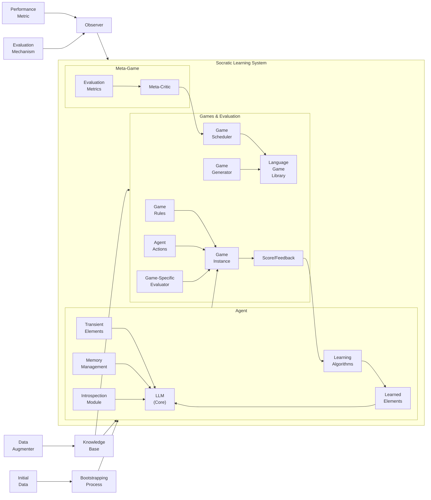
```mermaid
graph LR
    subgraph SocraticLearning["Socratic&nbsp;Learning&nbsp;System"]
        subgraph Agent["Agent"]
            LLM["LLM<br>(Core)"]
            LearnedElements["Learned<br>Elements"] --> LLM
            TransientElements["Transient<br>Elements"] --> LLM
            Memory["Memory<br>Management"] --> LLM
            Introspection["Introspection<br>Module"] --> LLM
            LearningAlgorithms["Learning<br>Algorithms"] --> LearnedElements
        end

        subgraph GamesAndEvaluation["Games&nbsp;&&nbsp;Evaluation"]
            GameLibrary["Language<br>Game<br>Library"]
            GameScheduler["Game<br>Scheduler"] --> GameLibrary
            GameGenerator["Game<br>Generator"] --> GameLibrary

            GameInstance["Game<br>Instance"]
            GameRules["Game<br>Rules"] --> GameInstance
            AgentActions["Agent<br>Actions"] --> GameInstance
            Evaluator["Game-Specific<br>Evaluator"] --> GameInstance
            Score["Score/Feedback"] --> LearningAlgorithms
        end

        subgraph Meta["Meta#8209;Game"]
            MetaCritic["Meta-Critic"] --> GameScheduler
            EvaluationMetrics["Evaluation<br>Metrics"] --> MetaCritic
        end

        Agent --> GameInstance
        GameInstance --> Score
    end

    Observer["Observer"]
    Performance["Performance<br>Metric"] --> Observer
    EvaluationMechanism["Evaluation<br>Mechanism"] --> Observer --> SocraticLearning
    Bootstrapping["Bootstrapping<br>Process"] --> Agent
    InitialData["Initial<br>Data"] --> Bootstrapping
    KnowledgeBase["Knowledge<br>Base"] --> Agent
    DataAugmenter["Data<br>Augmenter"] --> KnowledgeBase ----> GamesAndEvaluation
```

# Boundless Socratic Learning System for Software Development

## Abstract

The Boundless Socratic Learning System represents a revolutionary approach to autonomous software development, leveraging AI-driven recursive self-improvement through a carefully designed ecosystem of code generation, evaluation, and refinement.

## 1. System Architecture

### 1.1 Core Components

The system comprises five primary architectural components:

#### 1.1.1 The Agent (AI-Powered Code Generator)
- **Primary Function**: Autonomous code generation and manipulation
- **Key Capabilities**:
  - Deep understanding of programming languages
  - Comprehensive knowledge of software design principles
  - Active learning mechanism
  - Adaptive code generation

#### 1.1.2 Language Games
- **Definition**: Structured software development tasks with explicit scoring mechanisms
- **Purpose**: Provide context, challenges, and feedback for continuous learning

**Canonical Language Game Types**:
1. **Unit Test Generation Game**
   - Objective: Generate comprehensive unit tests
   - Scoring Metric: Code coverage achieved
   - Evaluation Criteria:
     - Line coverage
     - Branch coverage
     - Functional coverage

2. **Performance Optimization Game**
   - Objective: Optimize code execution efficiency
   - Scoring Metric: Reduction in execution time
   - Evaluation Criteria:
     - Computational complexity
     - Memory utilization
     - Algorithmic efficiency

3. **Security Hardening Game**
   - Objective: Identify and mitigate security vulnerabilities
   - Scoring Metric: Number of vulnerabilities addressed
   - Evaluation Criteria:
     - OWASP Top 10 compliance
     - Static code analysis results
     - Potential exploit mitigation

4. **Refactoring Game**
   - Objective: Improve code maintainability and readability
   - Scoring Metric: Reduction in code complexity
   - Evaluation Criteria:
     - Cyclomatic complexity
     - Cognitive complexity
     - Code duplication percentage

5. **API Design Game**
   - Objective: Design robust and intuitive APIs
   - Scoring Metric: API usability and completeness
   - Evaluation Criteria:
     - Adherence to design principles
     - Comprehensive documentation
     - Intuitive method signatures

#### 1.1.3 The Environment (ASKA-Powered Sandbox)
- **Core Characteristics**:
  - Secure and isolated execution environment
  - Controlled experiment space
  - Resource management
  - Comprehensive security boundaries

**Key Infrastructure Components**:
- IES (Intelligent Execution System) Instances
- DTMS (Dynamic Trust Management System)
- HESE-DAR (Highly Secure Data Access and Retrieval)

#### 1.1.4 The Critic (Robustness Enhancement Module)
- **Primary Responsibilities**:
  - Comprehensive code analysis
  - Feedback generation
  - Learning guidance

**Analytical Techniques**:
- Static code analysis
- Dynamic code execution monitoring
- Formal verification processes
- Diversity assessment

#### 1.1.5 Meta-Critic (Human Oversight & Metrics)
- **Oversight Mechanisms**:
  - Human review processes
  - Automated performance metrics
  - Strategic alignment validation

**Evaluation Dimensions**:
- Code quality metrics
- Bug reduction rates
- Developer productivity enhancement
- Long-term system alignment

### 1.2 Knowledge Management

#### 1.2.1 Knowledge Base
- **Powered by**: CodeBERT and advanced semantic understanding technologies
- **Characteristics**:
  - Continuously expanding code repository
  - Semantic code understanding
  - Best practices library
  - Design pattern catalog

### 2. Learning Mechanism

#### 2.1 Recursive Self-Improvement Cycle
1. Code Generation
2. Execution in Sandbox
3. Critic Evaluation
4. Feedback Integration
5. Knowledge Base Update

### 3. Challenges and Mitigations

#### 3.1 Potential Challenges
- Language game design complexity
- Maintaining exploration diversity
- Computational resource management
- Ensuring system security

#### 3.2 Mitigation Strategies
- Adaptive language game scoring
- Exploration-exploitation algorithms
- Cloud-native infrastructure
- Continuous security monitoring

## 4. Potential Impact

### 4.1 Transformative Capabilities
- Autonomous software evolution
- Enhanced security paradigms
- Accelerated development cycles
- Reduced human intervention

### 4.2 Long-Term Vision
Creating a self-healing, continuously improving software ecosystem that adapts to emerging technological landscapes.

## 5. Conclusion

The Boundless Socratic Learning System represents a paradigm shift in software development, moving from static, human-driven processes to dynamic, AI-powered autonomous evolution.

## References
- Schaul's Original Research on Boundless Socratic Learning
- CodeBERT Documentation

## Tech Exploration

### **Ontologies and Knowledge Graphs**
1. **Description Logics (DLs)**
   - Overview: [https://en.wikipedia.org/wiki/Description_logic](https://en.wikipedia.org/wiki/Description_logic)

2. **Web Ontology Language (OWL)**
   - Website: [https://www.w3.org/OWL/](https://www.w3.org/OWL/)

3. **Pellet (OWL Reasoner)**
   - Website: [https://github.com/stardog-union/pellet](https://github.com/stardog-union/pellet)

4. **HermiT (OWL Reasoner)**
   - Website: [http://www.hermit-reasoner.com/](http://www.hermit-reasoner.com/)

5. **FaCT++ (OWL Reasoner)**
   - Website: [https://github.com/owlcs/factplusplus](https://github.com/owlcs/factplusplus)

6. **Resource Description Framework (RDF)**
   - Website: [https://www.w3.org/RDF/](https://www.w3.org/RDF/)

7. **SPARQL (Query Language for RDF)**
   - Website: [https://www.w3.org/TR/sparql11-query/](https://www.w3.org/TR/sparql11-query/)

8. **RDF Schema (RDFS)**
   - Website: [https://www.w3.org/TR/rdf-schema/](https://www.w3.org/TR/rdf-schema/)

9. **Neo4j (Graph Database)**
   - Website: [https://neo4j.com/](https://neo4j.com/)

10. **JanusGraph (Graph Database)**
    - Website: [https://janusgraph.org/](https://janusgraph.org/)

11. **Amazon Neptune**
    - Website: [https://aws.amazon.com/neptune/](https://aws.amazon.com/neptune/)

---

### **Formal Methods**
12. **Z Notation**
    - Overview: [https://en.wikipedia.org/wiki/Z_notation](https://en.wikipedia.org/wiki/Z_notation)
    - Z/EVES Tool: [https://www.oracle.com/technetwork/systems/z-eves-index-098299.html](https://www.oracle.com/technetwork/systems/z-eves-index-098299.html)

13. **Alloy (Formal Specification Language)**
    - Website: [http://alloytools.org/](http://alloytools.org/)

14. **Event-B (System-Level Modeling)**
    - Website: [https://www.event-b.org/](https://www.event-b.org/)

15. **Rodin (Event-B Tool)**
    - Website: [https://www.event-b.org/tools/](https://www.event-b.org/tools/)

---

### **Program Analysis and Transformation**
16. **Abstract Syntax Trees (ASTs)**
    - TreeSitter: [https://tree-sitter.github.io/tree-sitter/](https://tree-sitter.github.io/tree-sitter/)
    - ANTLR: [https://www.antlr.org/](https://www.antlr.org/)

17. **Symbolic Execution**
    - Overview: [https://en.wikipedia.org/wiki/Symbolic_execution](https://en.wikipedia.org/wiki/Symbolic_execution)

---

### **Knowledge Representation and Reasoning**
18. **Prolog**
    - Website: [https://www.swi-prolog.org/](https://www.swi-prolog.org/)

19. **Drools (Rule Engine)**
    - Website: [https://www.drools.org/](https://www.drools.org/)

20. **Jess (Rule Engine)**
    - Website: [https://www.jessrules.com/jess/](https://www.jessrules.com/jess/)

---

### **Knowledge Representation and Reasoning (KRR) Systems and Logic Programming**
21. **NLTK (Natural Language Toolkit)**
    - Website: [https://www.nltk.org/](https://www.nltk.org/)

22. **Stanford CoreNLP**
    - Website: [https://stanfordnlp.github.io/CoreNLP/](https://stanfordnlp.github.io/CoreNLP/)

23. **Stanza**
    - Website: [https://stanfordnlp.github.io/stanza/](https://stanfordnlp.github.io/stanza/)

24. **Gensim**
    - Website: [https://radimrehurek.com/gensim/](https://radimrehurek.com/gensim/)

25. **AllenNLP**
    - Website: [https://allennlp.org/](https://allennlp.org/)

26. **Transformers (Hugging Face)**
    - Website: [https://huggingface.co/transformers/](https://huggingface.co/transformers/)

## &#x1F4DC; License

MIT License

## &#x1F4E7; Contact

Reach out if you're as excited about autonomous software evolution as we are!


# Discussion

** Use a multi agent framework

*** Use each agent to comprehend part of it

*** define policy for each Agent, keep track of entire state of the System

*** use an observer LLM to keep track of variables

*** smartest model should be observing

*** andrej karpethi talks about this

*** LEARN HOW DOES A MODEL INFER WITH THAT LIBRARY - how can i run an LLM without any exter

*** experiment with microsoft phi 2 - ecosystems

*** cosine similarity search, set up the vector store

*** vector: check out "timescale vector"

*** build an embedding service for myself

# Roadmap

## Package Distribution & Installation

- Create a proper MANIFEST.in to include non-Python files (e.g., py.typed, mypy.ini)
- Update setup.py to handle package data and ensure all dependencies are correctly specified
- Test package installation in a clean environment to verify all imports work correctly

## Documentation Enhancement

- Add docstring type hints to match mypy's strict settings
- Create module-level docstrings for each package component
- Document the package structure and module relationships
- Add examples of how the different components (nlp, gp_engine, etc.) interact

## Test Coverage

- Add more test cases to test_main.py, particularly for error conditions
- Add unit tests for individual components (nlp_service.py, gp_service.py)
- Add integration tests for the Neo4j database interactions
- Set up test coverage reporting

## CI/CD Pipeline

### Configure GitHub Actions to:

- Run pre-commit hooks
- Execute test suite
- Check package installation
- Verify Docker builds

### Add automated version bumping and release management

## Development Environment

- Document development setup steps
- Create development-specific configuration files
- Add debugging configurations for VS Code/PyCharm
- Add development tools to dev dependencies in setup.py

# The story thus far in diagrams

## High-Level Component Diagram:

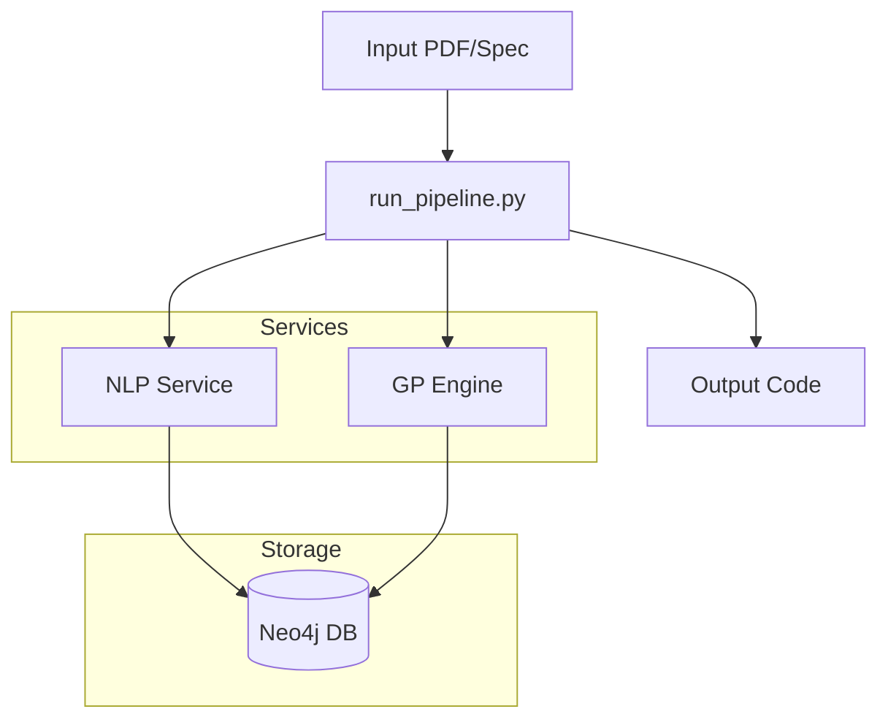
```mermaid
graph TD
    A[Input PDF/Spec] --> B[run_pipeline.py]
    B --> C[NLP Service]
    B --> D[GP Engine]
    C --> E[(Neo4j DB)]
    D --> E
    B --> F[Output Code]

    subgraph Services
        C
        D
    end

    subgraph Storage
        E
    end

```

## Service Integration Flow:

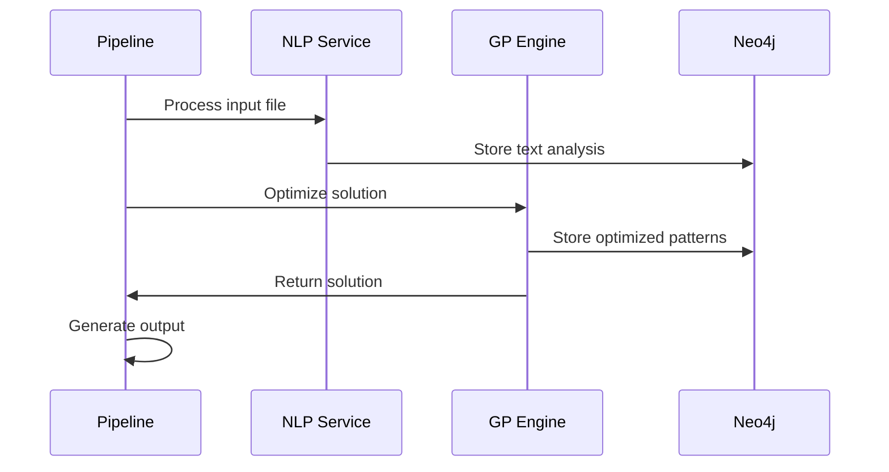
```mermaid
sequenceDiagram
    participant P as Pipeline
    participant NLP as NLP Service
    participant GP as GP Engine
    participant Neo as Neo4j

    P->>NLP: Process input file
    NLP->>Neo: Store text analysis
    P->>GP: Optimize solution
    GP->>Neo: Store optimized patterns
    GP->>P: Return solution
    P->>P: Generate output

```

## Code Function Dependencies:

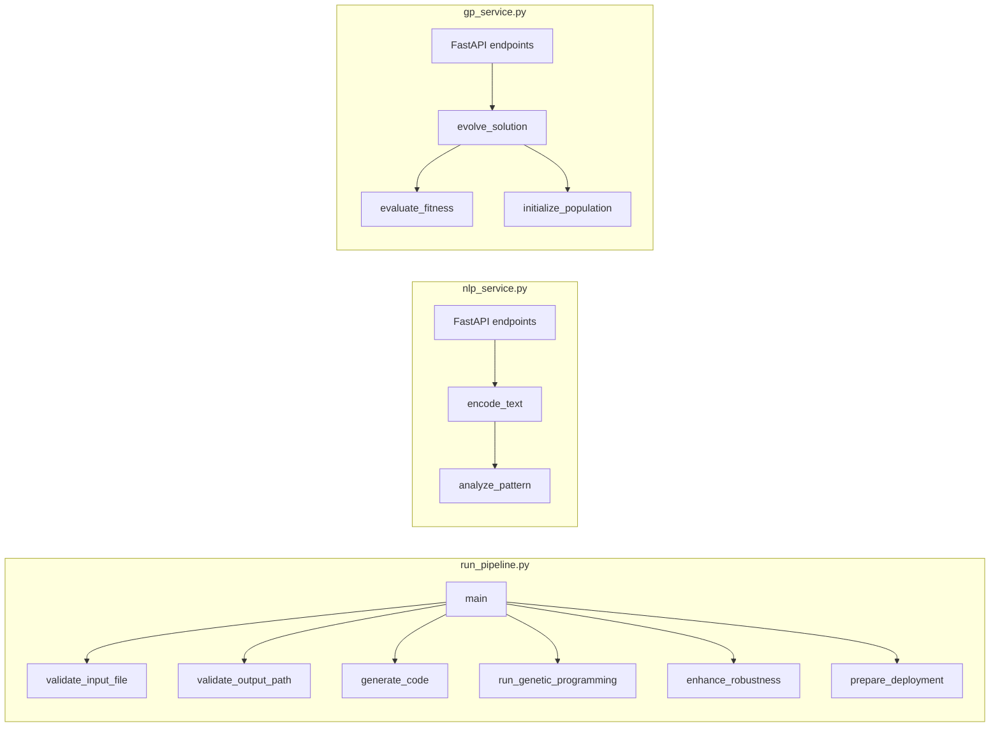
```mermaid
graph LR
    subgraph run_pipeline.py
        A[main] --> B[validate_input_file]
        A --> C[validate_output_path]
        A --> D[generate_code]
        A --> E[run_genetic_programming]
        A --> F[enhance_robustness]
        A --> G[prepare_deployment]
    end

    subgraph nlp_service.py
        H[encode_text] --> I[analyze_pattern]
        J[FastAPI endpoints] --> H
    end

    subgraph gp_service.py
        K[evolve_solution] --> L[evaluate_fitness]
        K --> M[initialize_population]
        N[FastAPI endpoints] --> K
    end

```

## Database Schema:

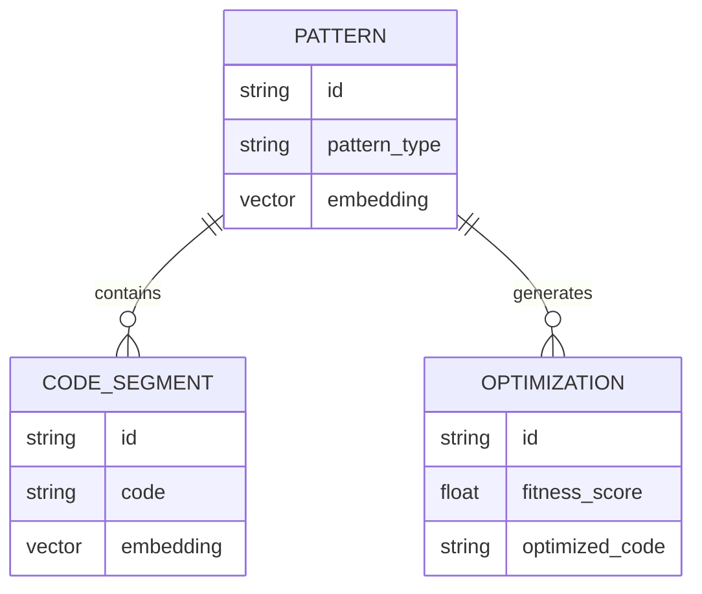
```mermaid
erDiagram
    PATTERN ||--o{ CODE_SEGMENT : contains
    PATTERN {
        string id
        string pattern_type
        vector embedding
    }
    CODE_SEGMENT {
        string id
        string code
        vector embedding
    }
    PATTERN ||--o{ OPTIMIZATION : generates
    OPTIMIZATION {
        string id
        float fitness_score
        string optimized_code
    }

```

## Service Configuration:

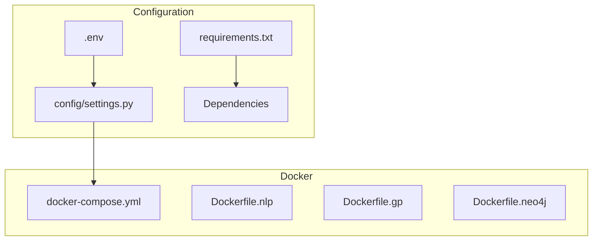
```mermaid
graph TD
    subgraph Configuration
        A[.env] --> B[config/settings.py]
        C[requirements.txt] --> D[Dependencies]
    end

    subgraph Docker
        E[docker-compose.yml]
        F[Dockerfile.nlp]
        G[Dockerfile.gp]
        H[Dockerfile.neo4j]
    end

    B --> E

```

# EADS Gap Analysis Summary of Gaps

## 1. Architecture Scope Gap
- **As-Is:** Simple pipeline with NLP and GP services
- **README:** Complex system with decentralized AI, meta-game dynamics

## 2. Component Integration Gap
- **As-Is:** Basic service communication
- **README:** Advanced orchestration and feedback loops

## 3. Storage Implementation Gap
- **As-Is:** Simple Neo4j schema
- **README:** Multi-database with Pinecone and PostgreSQL

## 4. Service Functionality Gap
- **As-Is:** Basic NLP and GP operations
- **README:** Advanced AI and evolutionary features

## 5. Deployment Infrastructure Gap
- **As-Is:** Basic Docker setup
- **README:** Kubernetes and Airflow integration

---

# Detailed Analysis

## 1. Architecture Scope Gap
- **Current Implementation:**
  - Linear pipeline flow
  - Two main services (NLP, GP)
  - Simple service communication
- **README Vision:**
  - Decentralized AI engine
  - Meta-game dynamics
  - Self-improving system
- **Missing Elements:**
  - Agent coordination system
  - Learning feedback loops
  - Meta-level optimization
  - System self-adaptation mechanisms

---

## 2. Component Integration Gap
- **Current Implementation:**
  - Direct service calls
  - Synchronous operations
  - Simple error handling
- **README Vision:**
  - Complex orchestration
  - Asynchronous processing
  - Advanced error recovery
- **Missing Elements:**
  - Event-driven communication
  - Service discovery
  - Circuit breakers
  - Load balancing
  - Retry mechanisms

---

## 3. Storage Implementation Gap
- **Current Implementation:**
  - Basic Neo4j schema
  - Simple relationships
  - Limited query patterns
- **README Vision:**
  - Multi-database architecture
  - Vector embeddings in Pinecone
  - Complex knowledge graphs
- **Missing Elements:**
  - Vector store integration
  - Cross-database consistency
  - Cache layers
  - Data versioning
  - Backup strategies

---

## 4. Service Functionality Gap
- **Current Implementation:**
  - Basic text analysis
  - Simple GP operations
  - Limited optimization
- **README Vision:**
  - Advanced AI capabilities
  - Complex evolutionary algorithms
  - Self-improvement mechanisms
- **Missing Elements:**
  - Advanced NLP features
  - Learning mechanisms
  - Adaptation strategies
  - Performance optimization
  - Security hardening

---

## 5. Deployment Infrastructure Gap
- **Current Implementation:**
  - Basic Docker containers
  - Simple compose setup
  - Manual scaling
- **README Vision:**
  - Kubernetes orchestration
  - Airflow workflows
  - Auto-scaling
- **Missing Elements:**
  - Container orchestration
  - CI/CD pipelines
  - Monitoring systems
  - Auto-scaling rules
  - Resource optimization

---

### **Summary Comparison Table**

| Database         | Pros                                               | Cons                                          |
|------------------|----------------------------------------------------|-----------------------------------------------|
| **Timescale Vector** | PostgreSQL integration, scalable, open-source    | Less specialized for vector search, complexity in setup |
| **Pinecone**      | Fully managed, highly scalable, fast search        | Not open-source, expensive for large-scale    |
| **Weaviate**      | Open-source, ML model integration, flexible API   | Complex setup, performance bottlenecks        |
| **FAISS**         | High performance, GPU support, flexible indexing   | Not a complete DB, requires integration, no built-in scaling |
| **Milvus**        | High performance, distributed, multiple indexing options | Complex setup, resource-intensive           |
| **Qdrant**        | Open-source, real-time updates, filtering support | Newer tool, still evolving                   |

---

### **Conclusion**
For **active development** with **minimal overhead** and **easy integration**:

- **Pinecone** is the best choice if you prefer a **fully managed solution** with **high scalability** and **fast vector search** without the need for manual setup.
- **Timescale Vector** is an excellent choice if you need both **time-series data support** and **vector search**, especially if you’re already using PostgreSQL.
- **FAISS** and **Milvus** are best for high-performance and large-scale vector search when you want **open-source solutions** but can handle more complex setups.

---

### **Unique Advantages for Your Vision**
- Dynamic agent configuration
- Scalable from laptop to cluster
- Native support for:
  * Concurrent processing
  * Distributed computing
  * Machine learning workflows

### **Recommended Next Steps**
1. Install Ray
2. Experiment with RLlib
3. Build small multi-agent systems
4. Gradually increase complexity

---

### **Deep Dive Recommendation**
I strongly recommend exploring Ray. It bridges the gap between your vision of:
- Flexible agent arrangements
- ML-focused computing
- Scalable architecture
- Local and distributed computing

---

### RLlib (Reinforcement Learning Library)
- **GitHub**: https://github.com/ray-project/ray/tree/master/rllib
- **Key Features**:
  - Supports multiple RL algorithms
  - Distributed training
  - Supports multiple frameworks (TensorFlow, PyTorch)
  - Algorithms include:
    * Proximal Policy Optimization (PPO)
    * Advantage Actor-Critic (A2C)
    * Deep Q-Network (DQN)
    * Soft Actor-Critic (SAC)

#### Example RLlib Code
```python
import ray
from ray import tune
from ray.rllib.agents.ppo import PPOTrainer

ray.init()

tune.run(
    PPOTrainer,
    config={
        "env": "CartPole-v0",
        "num_workers": 4,
        "train_batch_size": 4000,
        "sgd_minibatch_size": 256
    }
)
```

### Tune (Hyperparameter Tuning)
- **GitHub**: https://github.com/ray-project/ray/tree/master/python/ray/tune
- **Capabilities**:
  - Distributed hyperparameter search
  - Support for multiple search algorithms
  - Integration with ML frameworks
  - Visualization of results

#### Tune Example
```python
import ray
from ray import tune
from ray.tune.schedulers import ASHAScheduler

def objective(config):
    for _ in range(10):
        loss = config["a"] + config["b"]
        tune.report(loss=loss)

ray.init()
tune.run(
    objective,
    config={
        "a": tune.uniform(0, 10),
        "b": tune.uniform(0, 10)
    },
    scheduler=ASHAScheduler(metric="loss", mode="min")
)
```

### MLflow Integration
- Distributed experiment tracking
- Scalable model management
- Integrates with Ray for distributed ML workflows

### Neurips Benchmark Projects
Several machine learning benchmark projects use Ray for:
- Distributed training
- Scalable experimentation
- Complex algorithm testing

### Advanced ML Research Projects
1. **Distributed Neural Architecture Search**
   - Automatically finding optimal neural network architectures
   - Parallel exploration of model configurations
   - Genetic algorithm-like search strategies

2. **Multi-Agent Reinforcement Learning**
   - Simulating complex multi-agent environments
   - Distributed policy learning
   - Concurrent agent training

### Cutting-Edge Research Implementations
```python
import ray
import ray.rllib.agents.marl as marl

@ray.remote
class MultiAgentTrainingEnvironment:
    def __init__(self, num_agents):
        self.agents = [Agent.remote() for _ in range(num_agents)]

    def distributed_training(self):
        # Concurrent agent policy updates
        ray.get([agent.train.remote() for agent in self.agents])
```

### Unique Advantages for Your Vision
- Dynamic agent configuration
- Scalable from laptop to cluster
- Native support for:
  * Concurrent processing
  * Distributed computing
  * Machine learning workflows

### Recommended Next Steps
1. Install Ray
2. Experiment with RLlib
3. Build small multi-agent systems
4. Gradually increase complexity

---

### **NEW DESIGN using Ray + LlamaIndex**

## High-Level System Architecture:

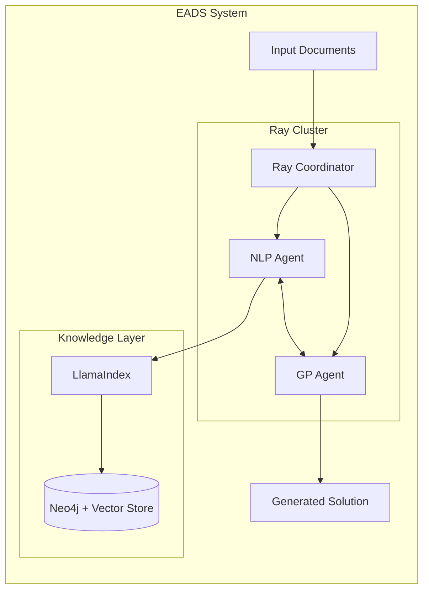
```mermaid
graph LR
    subgraph "EADS System"
        Input[Input Documents] --> Coord[Ray Coordinator]

        subgraph "Ray Cluster"
            Coord --> NLP[NLP Agent]
            Coord --> GP[GP Agent]
            NLP <--> GP
        end

        subgraph "Knowledge Layer"
            NLP --> LI[LlamaIndex]
            LI --> Neo[(Neo4j + Vector Store)]
        end

        GP --> Output[Generated Solution]
    end
```

## Agent Communication Flow:

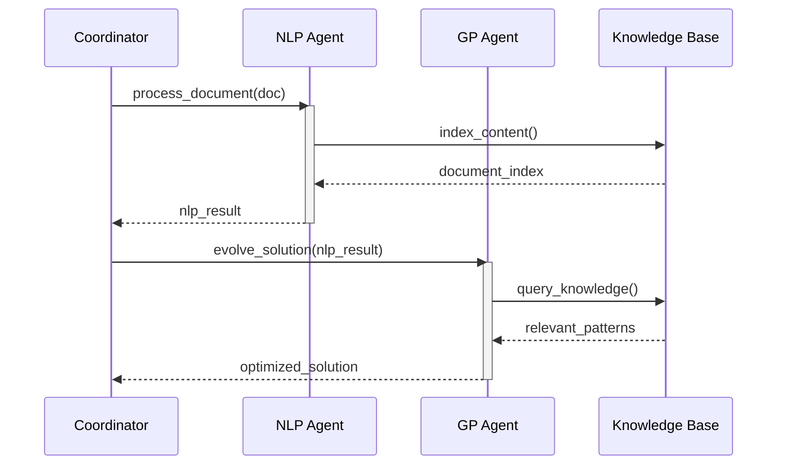
```mermaid
sequenceDiagram
    participant C as Coordinator
    participant NLP as NLP Agent
    participant GP as GP Agent
    participant KB as Knowledge Base

    C->>NLP: process_document(doc)
    activate NLP
    NLP->>KB: index_content()
    KB-->>NLP: document_index
    NLP-->>C: nlp_result
    deactivate NLP

    C->>GP: evolve_solution(nlp_result)
    activate GP
    GP->>KB: query_knowledge()
    KB-->>GP: relevant_patterns
    GP-->>C: optimized_solution
    deactivate GP
```

## Component Dependencies:

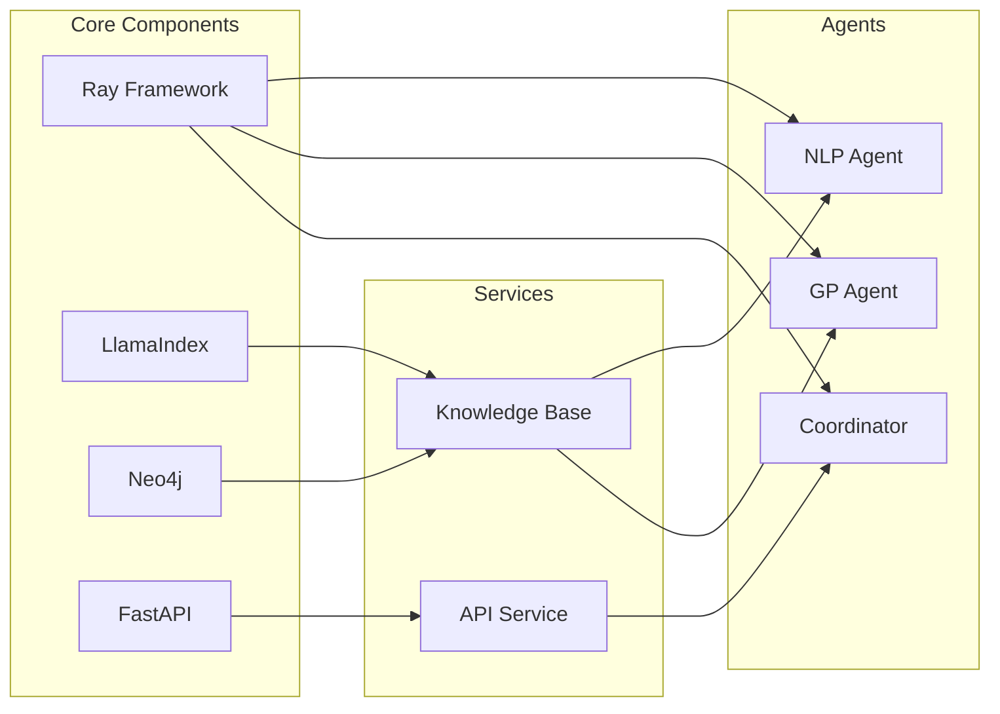
```mermaid
graph LR
    subgraph "Core Components"
        Ray[Ray Framework]
        LI[LlamaIndex]
        Neo[Neo4j]
        FA[FastAPI]
    end

    subgraph "Agents"
        NLP[NLP Agent]
        GP[GP Agent]
        Coord[Coordinator]
    end

    subgraph "Services"
        API[API Service]
        KB[Knowledge Base]
    end

    Ray --> NLP & GP & Coord
    LI --> KB
    Neo --> KB
    FA --> API
    KB --> NLP & GP
    API --> Coord
```

## Data Flow Architecture:

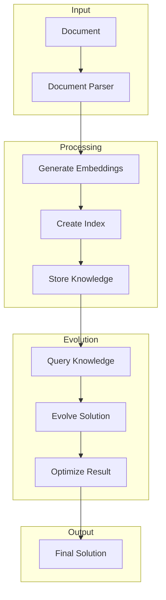
```mermaid
flowchart TD
    subgraph Input
        Doc[Document] --> Parser[Document Parser]
    end

    subgraph Processing
        Parser --> Embeddings[Generate Embeddings]
        Embeddings --> Index[Create Index]
        Index --> Store[Store Knowledge]
    end

    subgraph Evolution
        Store --> Query[Query Knowledge]
        Query --> Evolve[Evolve Solution]
        Evolve --> Optimize[Optimize Result]
    end

    subgraph Output
        Optimize --> Result[Final Solution]
    end
```

## Storage Architecture:

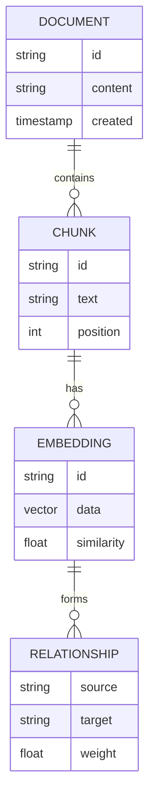
```mermaid
erDiagram
    DOCUMENT ||--o{ CHUNK : contains
    CHUNK ||--o{ EMBEDDING : has
    EMBEDDING ||--o{ RELATIONSHIP : forms

    DOCUMENT {
        string id
        string content
        timestamp created
    }

    CHUNK {
        string id
        string text
        int position
    }

    EMBEDDING {
        string id
        vector data
        float similarity
    }

    RELATIONSHIP {
        string source
        string target
        float weight
    }
```

## Ray Actor Hierarchy:

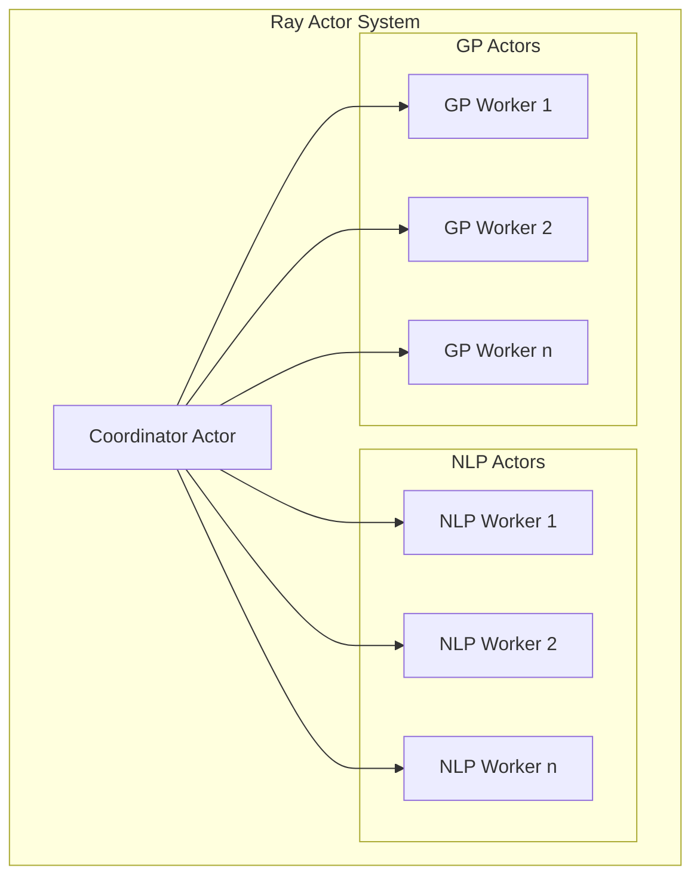
```mermaid
graph TD
    subgraph "Ray Actor System"
        Coord[Coordinator Actor]

        subgraph "NLP Actors"
            NLP1[NLP Worker 1]
            NLP2[NLP Worker 2]
            NLPn[NLP Worker n]
        end

        subgraph "GP Actors"
            GP1[GP Worker 1]
            GP2[GP Worker 2]
            GPn[GP Worker n]
        end

        Coord --> NLP1 & NLP2 & NLPn
        Coord --> GP1 & GP2 & GPn
    end
```

## Deployment Architecture:

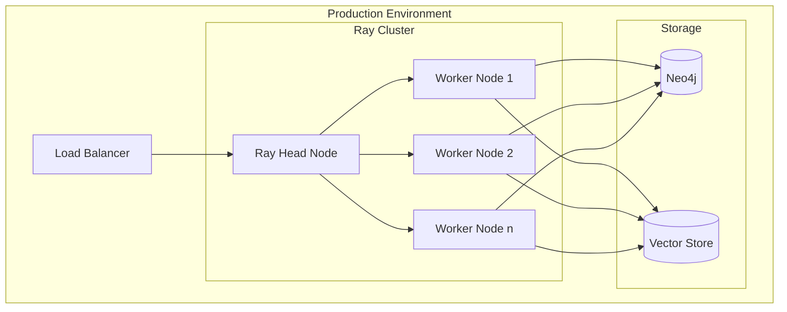
```mermaid
graph TB
    subgraph "Production Environment"
        LB[Load Balancer]

        subgraph "Ray Cluster"
            Head[Ray Head Node]
            W1[Worker Node 1]
            W2[Worker Node 2]
            Wn[Worker Node n]

            Head --> W1 & W2 & Wn
        end

        subgraph "Storage"
            Neo[(Neo4j)]
            Vec[(Vector Store)]
        end

        LB --> Head
        W1 & W2 & Wn --> Neo
        W1 & W2 & Wn --> Vec
    end
```

## Configuration Management:

```mermaid
graph LR
    subgraph "Config Management"
        Env[.env]
        Ray[Ray Config]
        Neo[Neo4j Config]
        LI[LlamaIndex Config]

        Env --> Ray & Neo & LI

        subgraph "Runtime Config"
            RC[Ray Context]
            NC[Neo4j Connection]
            LC[LlamaIndex Context]

            Ray --> RC
            Neo --> NC
            LI --> LC
        end
    end
```
## Update dept

```
# Add new dependencies
ray>=2.9.0
llama-index>=0.9.0
# Keep existing
neo4j>=5.14.0
fastapi>=0.109.0
```

## Refactor directory structure

```
EADS/
├── agents/                  # New
│   ├── __init__.py
│   ├── base.py             # Base agent classes
│   ├── nlp_agent.py        # Migrate from nlp_service.py
│   └── gp_agent.py         # Migrate from gp_service.py
├── knowledge/              # New
│   ├── __init__.py
│   ├── indexer.py          # LlamaIndex integration
│   └── store.py            # Neo4j integration
├── orchestration/          # New
│   ├── __init__.py
│   └── coordinator.py      # Ray orchestration
├── nlp/                    # Existing
├── gp_engine/             # Existing
└── run_pipeline.py        # To be updated
```

## NLP agent is now Ray Actor

```
# agents/nlp_agent.py
@ray.remote
class NLPAgent:
    def __init__(self):
        # Migrate from nlp_service.py
        self.tokenizer = AutoTokenizer.from_pretrained(MODEL_NAME)
        self.model = AutoModel.from_pretrained(MODEL_NAME)
        self.knowledge_base = EADSKnowledgeBase()

    async def process_text(self, text: str):
        # Migrate existing encode_text function
        embeddings = self.encode_text(text)
        # Add LlamaIndex processing
        doc_index = await self.knowledge_base.index_document(text)
        return {
            'embeddings': embeddings,
            'index': doc_index
        }

    # Migrate other methods from nlp_service.py
```

## GP Engine is now Ray Actor

```
# agents/gp_agent.py
@ray.remote
class GPAgent:
    def __init__(self):
        # Migrate from gp_service.py
        self.toolbox = deap.base.Toolbox()
        self.setup_gp_tools()

    async def evolve_solution(self, problem_space):
        # Migrate existing GP logic
        population = self.initialize_population()
        for gen in range(N_GENERATIONS):
            population = await self.evolve_generation(population)
        return self.get_best_solution(population)
```

## Knowledge Management

```
# knowledge/indexer.py
class EADSKnowledgeBase:
    def __init__(self):
        self.vector_store = Neo4jVectorStore(
            url=NEO4J_URI,
            username=NEO4J_USER,
            password=NEO4J_PASSWORD
        )
        self.service_context = ServiceContext.from_defaults()

    async def index_document(self, content):
        documents = self.preprocess(content)
        index = VectorStoreIndex.from_documents(
            documents,
            vector_store=self.vector_store,
            service_context=self.service_context
        )
        return index
```

## Orchestration - Ray management
```
# orchestration/coordinator.py
@ray.remote
class EADSCoordinator:
    def __init__(self):
        self.nlp_agent = NLPAgent.remote()
        self.gp_agent = GPAgent.remote()

    async def process_pipeline(self, input_file: str):
        # 1. Process with NLP
        nlp_result = await self.nlp_agent.process_text.remote(
            self.read_input(input_file)
        )

        # 2. Evolve solution
        solution = await self.gp_agent.evolve_solution.remote(
            nlp_result['index']
        )

        return solution
```

## Orchestration - Update pipeline runner
```
# run_pipeline.py
async def main(input_file: str, output_file: str):
    if not validate_input_file(input_file):
        return None

    try:
        # Initialize Ray
        ray.init()

        # Create coordinator
        coordinator = EADSCoordinator.remote()

        # Run pipeline
        result = await coordinator.process_pipeline.remote(input_file)

        # Save results
        save_output(result, output_file)

        return True
    except Exception as e:
        logger.error(f"Pipeline failed: {str(e)}")
        return False
    finally:
        ray.shutdown()
```

## API Update - FastAPI

```

# api/service.py
app = FastAPI()

@app.post("/process")
async def process_document(file: UploadFile):
    coordinator = EADSCoordinator.remote()
    result = await coordinator.process_pipeline.remote(
        await file.read()
    )
    return result
```

## Experimental flexibility and simplicity

1. Core Components:
- LlamaIndex (over LangChain) - You're right, it's better for your use case since you're building a knowledge-intensive system with complex query patterns
- Ray - Perfect for your multi-agent experiments; its Actor model will let you build arbitrarily complex agent interactions
- MLflow - For experiment tracking (simpler than W&B to start, but powerful enough)

2. Initial Architecture:
```python
import ray
from llama_index import VectorStoreIndex, SimpleDirectoryReader
from llama_index.vector_stores import SimpleVectorStore  # Start simple, can swap later

@ray.remote
class BaseAgent:
    def __init__(self, config):
        self.index = VectorStoreIndex([], vector_store=SimpleVectorStore())
        self.config = config

    async def process(self, input_data):
        # Extensible processing logic
        pass

@ray.remote
class Coordinator:
    def __init__(self):
        self.agents = {}

    def spawn_agent(self, agent_type, config):
        # Dynamic agent creation
        self.agents[agent_type] = BaseAgent.remote(config)
```

Key Benefits:
1. Starts simple but allows complexity:
   - SimpleVectorStore → Can upgrade to Neo4j/Pinecone later
   - Basic Ray actors → Can add complex coordination patterns
   - Local MLflow → Can scale to distributed tracking

2. Easy to experiment with:
   - Agent behaviors
   - Communication patterns
   - Different model architectures

## LlamaIndex Configuration

```
from llama_index import VectorStoreIndex, GraphStore, ServiceContext
from llama_index.storage.storage_context import StorageContext

# Assuming setup for Neo4j and vector database already done
neo4j_graph = your_neo4j_graph_connection()
vector_db = your_vector_database_connection()

# Set up with LlamaIndex
vector_index = VectorStoreIndex.from_documents(
    documents=your_documents,  # code snippets or documentation
    vector_store=vector_db
)
graph_store = GraphStore(graph=neo4j_graph)

storage_context = StorageContext.from_defaults(
    vector_store=vector_db,
    graph_store=graph_store
)

service_context = ServiceContext.from_defaults(
    llm_predictor=your_llm_model(),  # For enhanced query understanding if needed
    storage_context=storage_context
)

# Create a query engine
query_engine = vector_index.as_query_engine(
    service_context=service_context,
    similarity_top_k=5  # Or whatever fits your needs
)

# Example query
response = query_engine.query("Find code examples related to sorting algorithms.")
