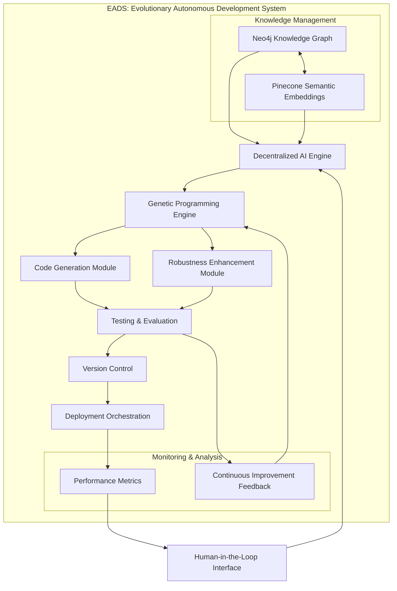
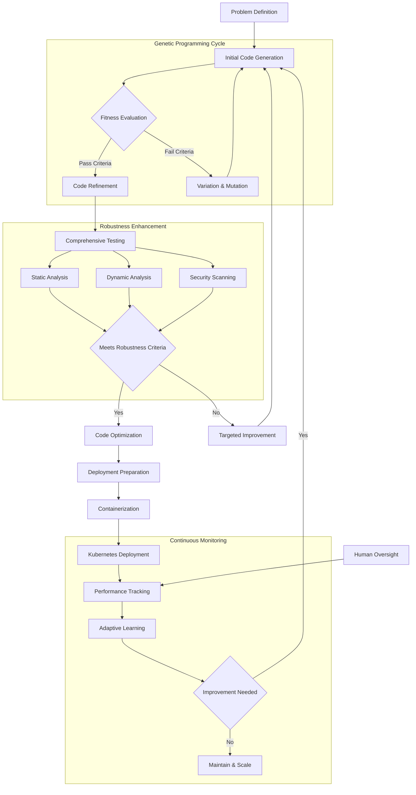
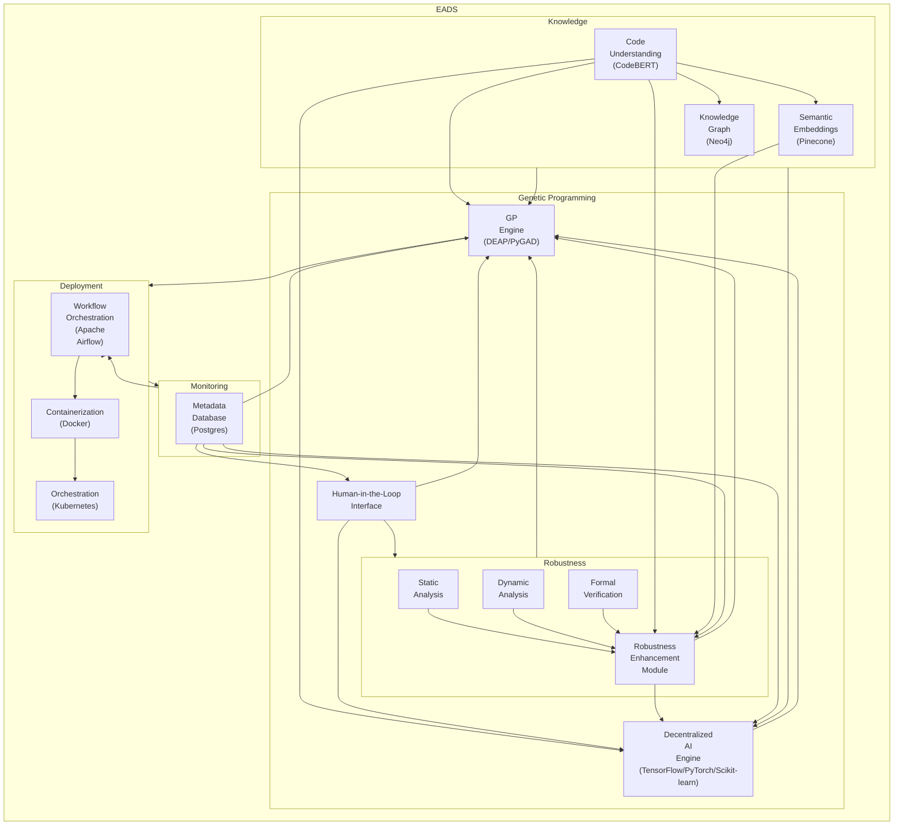
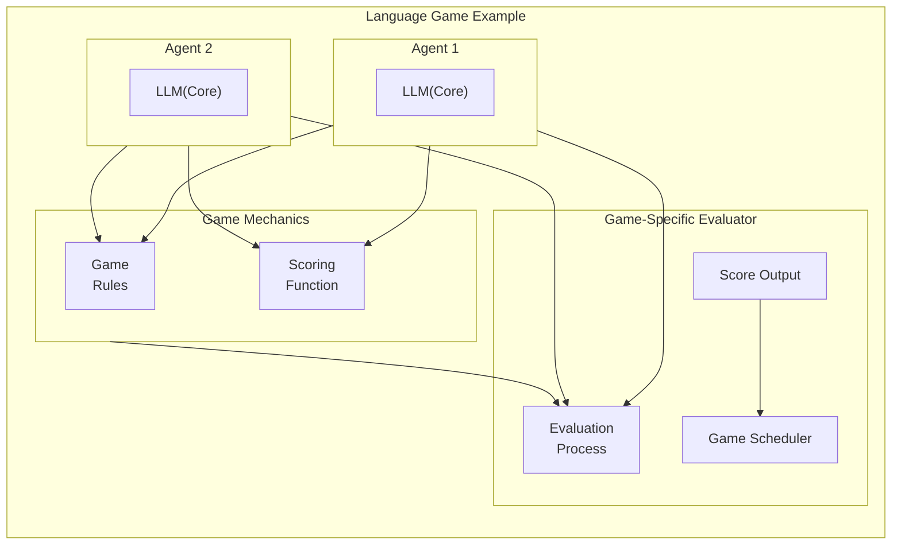
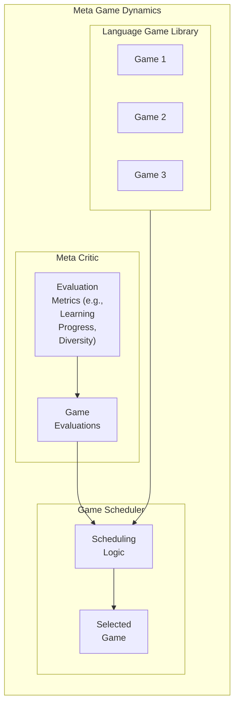
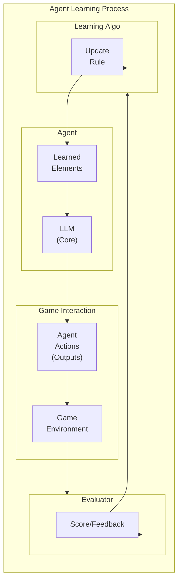
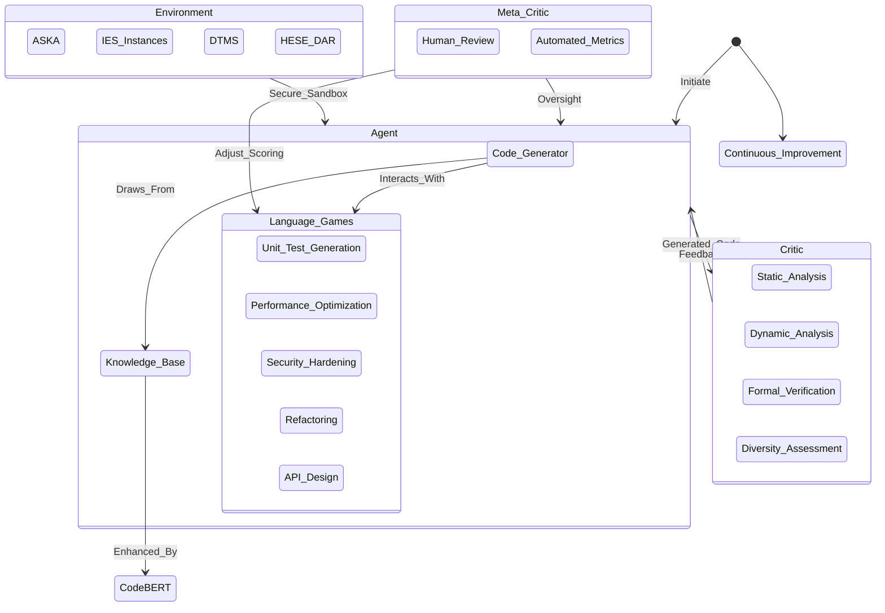
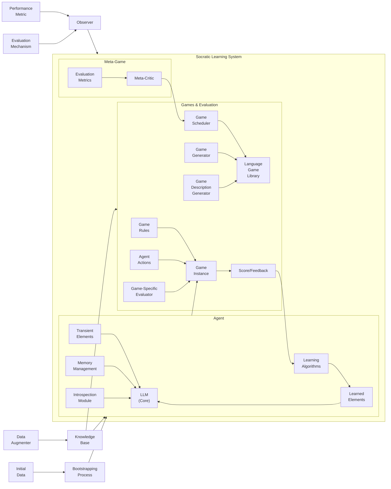

# &#x1F9EC; EADS: Evolutionary Autonomous Development System

## &#x1F680; Paradigm-Shifting Software Engineering

EADS represents a revolutionary approach to autonomous software development, leveraging advanced AI, genetic programming, and adaptive learning to create a self-evolving software engineering ecosystem.

This project aims to build an Evolutionary Automated Development System (EADS) for generating, testing, and refining software applications through iterative evolution. EADS leverages the power of Large Language Models (LLMs), Genetic Programming (GP), and advanced analysis techniques to create robust and adaptable software.  This system is designed to be highly scalable, resilient, and adaptable to various software development tasks, exceeding the capabilities of traditional manual or even simpler automated systems.

### &#x1F52D; Core Innovation

At its heart, EADS is not just another development tool&#x2014;it's an intelligent, self-improving system that learns, adapts, and generates high-quality software with minimal human intervention.

## &#x2728; Key Features

### Intelligent Code Generation
- &#x1F9E0; LLM-powered code synthesis
- &#x1F9EC; Genetic programming for optimization
- &#x1F50D; Semantic understanding via advanced embeddings

### Robust Quality Assurance
- &#x1F4CA; Comprehensive testing frameworks
  - Unit Testing
  - Integration Testing
  - Performance Optimization
  - Security Hardening

### Advanced Learning Mechanisms
- &#x1F504; Recursive self-improvement cycle
- &#x1F4DA; Semantic knowledge base
- &#x1F916; Decentralized AI engine

## &#x1F3D7;&#xFE0F; System Architecture

### Components
1. **Genetic Programming Engine**
   - Population management
   - Variation operators
   - Fitness evaluation
   - Intelligent selection

2. **Knowledge Management**
   - Neo4j Knowledge Graph
   - Pinecone Semantic Embeddings
   - NLP-enriched code taxonomy

3. **Robustness Enhancement**
   - Static &amp; Dynamic Analysis
   - Formal Verification
   - Continuous optimization

4. **Deployment &amp; Monitoring**
   - Apache Airflow Orchestration
   - Docker Containerization
   - Kubernetes Scaling
   - Postgres Metadata Tracking

## &#x1F31F; Unique Selling Points

- &#x1F510; Self-securing code generation
- &#x1F4A1; Adaptive learning paradigms
- &#x1F680; Reduced human intervention
- &#x1F30E; Scalable, cloud-native architecture

## &#x1F6E0;&#xFE0F; Technology Stack

- **AI/ML**: 
  - TensorFlow
  - PyTorch
  - Scikit-learn
- **Genetic Programming**:
  - DEAP
  - PyGAD
- **Knowledge Management**:
  - Neo4j
  - Pinecone
- **Deployment**:
  - Docker
  - Kubernetes
  - Apache Airflow

## &#x1F4AC; Vision

To create a self-healing, continuously improving software ecosystem that autonomously adapts to emerging technological landscapes.

## &#x1F527; Setup & Installation

### Prerequisites
- Docker and Docker Compose installed on your system
- Git for version control
- Sufficient disk space for Docker images and volumes
- Python 3.12 or higher

### Quick Start

1. **Clone the Repository**
   ```bash
   git clone https://github.com/nshkrdotcom/EADS.git
   cd EADS
   ```

2. **Run Setup Script**
   ```bash
   chmod +x setup.sh
   ./setup.sh
   ```

3. **Configure Environment**
   ```bash
   cp .env.example .env
   # Edit .env with your credentials
   ```

4. **Activate Virtual Environment**
   ```bash
   source .venv/bin/activate
   ```

5. **Initialize EADS**
   ```bash
   ./init.sh
   ```

6. **When Done**
   ```bash
   deactivate
   ```

### Accessing Services

Once the system is running, you can access various services:

- **Neo4j Browser**: http://localhost:7474
  - Default credentials: neo4j/your_password
- **NLP Service**: http://localhost:8000
- **GP Engine**: http://localhost:8001
- **PostgreSQL**: localhost:5432

### Development Workflow

1. **Start Development Session**
   ```bash
   source .venv/bin/activate
   docker-compose up -d
   ```

2. **Stop Development Session**
   ```bash
   docker-compose down
   deactivate
   ```

### Troubleshooting

If you encounter Docker permission issues:
```bash
sudo usermod -aG docker $USER
sudo chmod 666 /var/run/docker.sock
# Log out and log back in for changes to take effect
```

## &#x1F063; System Architecture

EADS employs a modular architecture, integrating several key components:

1. **Knowledge Base:**  A richly structured knowledge base encompassing code examples, design patterns, libraries, best practices, and security guidelines.  This is used to inform the AI Engine and the GP Engine.  This incorporates a robust and scalable Graph Database (Neo4j) to store code taxonomies and architectural knowledge, and a semantic embedding layer (Pinecone) to facilitate intelligent code search and retrieval.


2. **Decentralized AI Engine:** Multiple specialized AI modules (security, performance, maintainability, etc.), leveraging deep learning frameworks like TensorFlow or PyTorch, collaborate to generate, analyze, and optimize code.  This design enhances resilience and allows for focused expertise.


3. **Genetic Programming Engine:** This component utilizes a robust GP engine (DEAP or PyGAD) for code evolution. It uses sophisticated techniques like AST manipulation, semantic embedding-guided crossover, and LLM-enhanced mutation and code generation, leveraging the CodeBERT model for advanced code understanding.


4. **Robustness Enhancement Module:** Performs comprehensive code analysis (static and dynamic) and formal verification (where feasible) to identify potential issues.  It utilizes static analysis tools (PMD, FindBugs, SonarQube, etc.), dynamic instrumentation (DynamoRIO, Frida), and potentially model checkers (CBMC, KLEE).  This generates a robustness score and specific feedback.


5. **Deployment and Monitoring:** A robust pipeline (managed by Apache Airflow) that deploys the generated code to ASKA using Docker containers, and monitors performance, resource usage, security, and user feedback.  It integrates with Kubernetes for scaling and resilience.


6. **Metadata Management:**  A relational database (Postgres) stores experiment tracking data, version control information, fitness scores, metrics, logs, and compliance data.


7. **Human-Machine Interface:**  A user-friendly interface for developers to interact with and guide the EADS, providing feedback, setting goals, and reviewing results.

## Technology Stack

| Component                    | Technology               | Description                                                                                                    |
|-------------------------------|---------------------------|-------------------------------------------------------------------------------------------------------------|
| Knowledge Base                | Neo4j, Pinecone           | Graph database and vector database for code knowledge and semantic search.                                  |
| Decentralized AI Engine       | TensorFlow/PyTorch, Scikit-learn | Deep learning frameworks and machine learning library.                                                        |
| Genetic Programming Engine    | DEAP/PyGAD               | Evolutionary algorithm framework.                                                                             |
| Code Representation           | TreeSitter                | Parser for creating Abstract Syntax Trees (ASTs).                                                            |
| Static Analysis               | PMD, FindBugs, SonarQube  | Tools for static code analysis.                                                                              |
| Dynamic Analysis             | DynamoRIO, Frida          | Tools for dynamic code analysis.                                                                              |
| Formal Verification           | CBMC, KLEE (Optional)      | Model checkers for formal verification.                                                                         |
| Retrieval Augmented Generation (RAG) | LlamaIndex, LangChain | Data framework and framework for LLM-powered applications. |
| Code Understanding           | CodeBERT                 | Pre-trained LLM for enhanced code understanding.                                                           |
| Workflow Orchestration       | Apache Airflow            | Manages the EADS pipeline.                                                                                   |
| Containerization              | Docker                    | Creates isolated development environments.                                                                     |
| Orchestration                  | Kubernetes                | Manages container deployment and scaling.                                                                     |
| Metadata Database             | Postgres                  | Stores experiment data, metrics, and logs.                                                                  |

## &#x1F91D; Contribution

Passionate about autonomous systems? We're always looking for brilliant minds to push the boundaries of AI-driven software engineering!

### Prerequisites
- Strong understanding of machine learning
- Experience with genetic algorithms
- Python expertise
- Curiosity and passion for cutting-edge tech

## Getting Started

1. **Clone the Repository:**  `git clone <repository_url>`
2. **Install Dependencies:**  Refer to the `requirements.txt` file.
3. **Build Docker Images:**  `./build.sh`  (This script will handle building all Docker images using `docker-compose`).
4. **Start Containers:** `docker-compose up -d`  (Starts all containers in detached mode).
5. **Access Services:** Access databases and APIs via the ports specified in `docker-compose.yml`.
6. **Run Main Code:** Execute the main pipeline script:
   ```bash
   docker-compose exec app python run_pipeline.py input.pdf output.tex
   ```
7. **Run Robustness Enhancement Module:** Execute the robustness enhancement script:
   ```bash
   docker-compose exec app python run_robustness.py
   ```
8. **Run Genetic Programming Module:** Execute the genetic programming script:
   ```bash
   docker-compose exec app python run_gp.py
   ```
9. **Run Deployment Module:** Execute the deployment script:
   ```bash
   docker-compose exec app python run_deployment.py
   ```

## &#x1F4BB; Project Diagrams

### EADS System Architecture Diagram



### EADS Autonomous Development Workflow



### System Diagram



### Language Game Example



### Meta Game Dynamics




### Agent Learning Process



### State Diagram (Boundless Socratic Learning)



### Architectural Diagram (Boundless Socratic Learning)



# Boundless Socratic Learning System for Software Development

## Abstract

The Boundless Socratic Learning System represents a revolutionary approach to autonomous software development, leveraging AI-driven recursive self-improvement through a carefully designed ecosystem of code generation, evaluation, and refinement.

## 1. System Architecture

### 1.1 Core Components

The system comprises five primary architectural components:

#### 1.1.1 The Agent (AI-Powered Code Generator)
- **Primary Function**: Autonomous code generation and manipulation
- **Key Capabilities**:
  - Deep understanding of programming languages
  - Comprehensive knowledge of software design principles
  - Active learning mechanism
  - Adaptive code generation

#### 1.1.2 Language Games
- **Definition**: Structured software development tasks with explicit scoring mechanisms
- **Purpose**: Provide context, challenges, and feedback for continuous learning

**Canonical Language Game Types**:
1. **Unit Test Generation Game**
   - Objective: Generate comprehensive unit tests
   - Scoring Metric: Code coverage achieved
   - Evaluation Criteria:
     - Line coverage
     - Branch coverage
     - Functional coverage

2. **Performance Optimization Game**
   - Objective: Optimize code execution efficiency
   - Scoring Metric: Reduction in execution time
   - Evaluation Criteria:
     - Computational complexity
     - Memory utilization
     - Algorithmic efficiency

3. **Security Hardening Game**
   - Objective: Identify and mitigate security vulnerabilities
   - Scoring Metric: Number of vulnerabilities addressed
   - Evaluation Criteria:
     - OWASP Top 10 compliance
     - Static code analysis results
     - Potential exploit mitigation

4. **Refactoring Game**
   - Objective: Improve code maintainability and readability
   - Scoring Metric: Reduction in code complexity
   - Evaluation Criteria:
     - Cyclomatic complexity
     - Cognitive complexity
     - Code duplication percentage

5. **API Design Game**
   - Objective: Design robust and intuitive APIs
   - Scoring Metric: API usability and completeness
   - Evaluation Criteria:
     - Adherence to design principles
     - Comprehensive documentation
     - Intuitive method signatures

#### 1.1.3 The Environment (ASKA-Powered Sandbox)
- **Core Characteristics**:
  - Secure and isolated execution environment
  - Controlled experiment space
  - Resource management
  - Comprehensive security boundaries

**Key Infrastructure Components**:
- IES (Intelligent Execution System) Instances
- DTMS (Dynamic Trust Management System)
- HESE-DAR (Highly Secure Data Access and Retrieval)

#### 1.1.4 The Critic (Robustness Enhancement Module)
- **Primary Responsibilities**:
  - Comprehensive code analysis
  - Feedback generation
  - Learning guidance

**Analytical Techniques**:
- Static code analysis
- Dynamic code execution monitoring
- Formal verification processes
- Diversity assessment

#### 1.1.5 Meta-Critic (Human Oversight & Metrics)
- **Oversight Mechanisms**:
  - Human review processes
  - Automated performance metrics
  - Strategic alignment validation

**Evaluation Dimensions**:
- Code quality metrics
- Bug reduction rates
- Developer productivity enhancement
- Long-term system alignment

### 1.2 Knowledge Management

#### 1.2.1 Knowledge Base
- **Powered by**: CodeBERT and advanced semantic understanding technologies
- **Characteristics**:
  - Continuously expanding code repository
  - Semantic code understanding
  - Best practices library
  - Design pattern catalog

### 2. Learning Mechanism

#### 2.1 Recursive Self-Improvement Cycle
1. Code Generation
2. Execution in Sandbox
3. Critic Evaluation
4. Feedback Integration
5. Knowledge Base Update

### 3. Challenges and Mitigations

#### 3.1 Potential Challenges
- Language game design complexity
- Maintaining exploration diversity
- Computational resource management
- Ensuring system security

#### 3.2 Mitigation Strategies
- Adaptive language game scoring
- Exploration-exploitation algorithms
- Cloud-native infrastructure
- Continuous security monitoring

## 4. Potential Impact

### 4.1 Transformative Capabilities
- Autonomous software evolution
- Enhanced security paradigms
- Accelerated development cycles
- Reduced human intervention

### 4.2 Long-Term Vision
Creating a self-healing, continuously improving software ecosystem that adapts to emerging technological landscapes.

## 5. Conclusion

The Boundless Socratic Learning System represents a paradigm shift in software development, moving from static, human-driven processes to dynamic, AI-powered autonomous evolution.

## References
- Schaul's Original Research on Boundless Socratic Learning
- CodeBERT Documentation

## Tech Exploration

### **Ontologies and Knowledge Graphs**
1. **Description Logics (DLs)**  
   - Overview: [https://en.wikipedia.org/wiki/Description_logic](https://en.wikipedia.org/wiki/Description_logic)

2. **Web Ontology Language (OWL)**  
   - Website: [https://www.w3.org/OWL/](https://www.w3.org/OWL/)

3. **Pellet (OWL Reasoner)**  
   - Website: [https://github.com/stardog-union/pellet](https://github.com/stardog-union/pellet)

4. **HermiT (OWL Reasoner)**  
   - Website: [http://www.hermit-reasoner.com/](http://www.hermit-reasoner.com/)

5. **FaCT++ (OWL Reasoner)**  
   - Website: [https://github.com/owlcs/factplusplus](https://github.com/owlcs/factplusplus)

6. **Resource Description Framework (RDF)**  
   - Website: [https://www.w3.org/RDF/](https://www.w3.org/RDF/)

7. **SPARQL (Query Language for RDF)**  
   - Website: [https://www.w3.org/TR/sparql11-query/](https://www.w3.org/TR/sparql11-query/)

8. **RDF Schema (RDFS)**  
   - Website: [https://www.w3.org/TR/rdf-schema/](https://www.w3.org/TR/rdf-schema/)

9. **Neo4j (Graph Database)**  
   - Website: [https://neo4j.com/](https://neo4j.com/)

10. **JanusGraph (Graph Database)**  
    - Website: [https://janusgraph.org/](https://janusgraph.org/)

11. **Amazon Neptune**  
    - Website: [https://aws.amazon.com/neptune/](https://aws.amazon.com/neptune/)

---

### **Formal Methods**
12. **Z Notation**  
    - Overview: [https://en.wikipedia.org/wiki/Z_notation](https://en.wikipedia.org/wiki/Z_notation)  
    - Z/EVES Tool: [https://www.oracle.com/technetwork/systems/z-eves-index-098299.html](https://www.oracle.com/technetwork/systems/z-eves-index-098299.html)

13. **Alloy (Formal Specification Language)**  
    - Website: [http://alloytools.org/](http://alloytools.org/)

14. **Event-B (System-Level Modeling)**  
    - Website: [https://www.event-b.org/](https://www.event-b.org/)

15. **Rodin (Event-B Tool)**  
    - Website: [https://www.event-b.org/tools/](https://www.event-b.org/tools/)

---

### **Program Analysis and Transformation**
16. **Abstract Syntax Trees (ASTs)**  
    - TreeSitter: [https://tree-sitter.github.io/tree-sitter/](https://tree-sitter.github.io/tree-sitter/)  
    - ANTLR: [https://www.antlr.org/](https://www.antlr.org/)

17. **Symbolic Execution**  
    - Overview: [https://en.wikipedia.org/wiki/Symbolic_execution](https://en.wikipedia.org/wiki/Symbolic_execution)

---

### **Knowledge Representation and Reasoning**
18. **Prolog**  
    - Website: [https://www.swi-prolog.org/](https://www.swi-prolog.org/)

19. **Drools (Rule Engine)**  
    - Website: [https://www.drools.org/](https://www.drools.org/)

20. **Jess (Rule Engine)**  
    - Website: [https://www.jessrules.com/jess/](https://www.jessrules.com/jess/)

---

### **Knowledge Representation and Reasoning (KRR) Systems and Logic Programming**  
21. **NLTK (Natural Language Toolkit)**  
    - Website: [https://www.nltk.org/](https://www.nltk.org/)

22. **Stanford CoreNLP**  
    - Website: [https://stanfordnlp.github.io/CoreNLP/](https://stanfordnlp.github.io/CoreNLP/)

23. **Stanza**  
    - Website: [https://stanfordnlp.github.io/stanza/](https://stanfordnlp.github.io/stanza/)

24. **Gensim**  
    - Website: [https://radimrehurek.com/gensim/](https://radimrehurek.com/gensim/)

25. **AllenNLP**  
    - Website: [https://allennlp.org/](https://allennlp.org/)

26. **Transformers (Hugging Face)**  
    - Website: [https://huggingface.co/transformers/](https://huggingface.co/transformers/)

## &#x1F4DC; License

MIT License

## &#x1F4E7; Contact

Reach out if you're as excited about autonomous software evolution as we are!

---

*Inspired by the boundless potential of artificial intelligence and the art of software craftsmanship.*