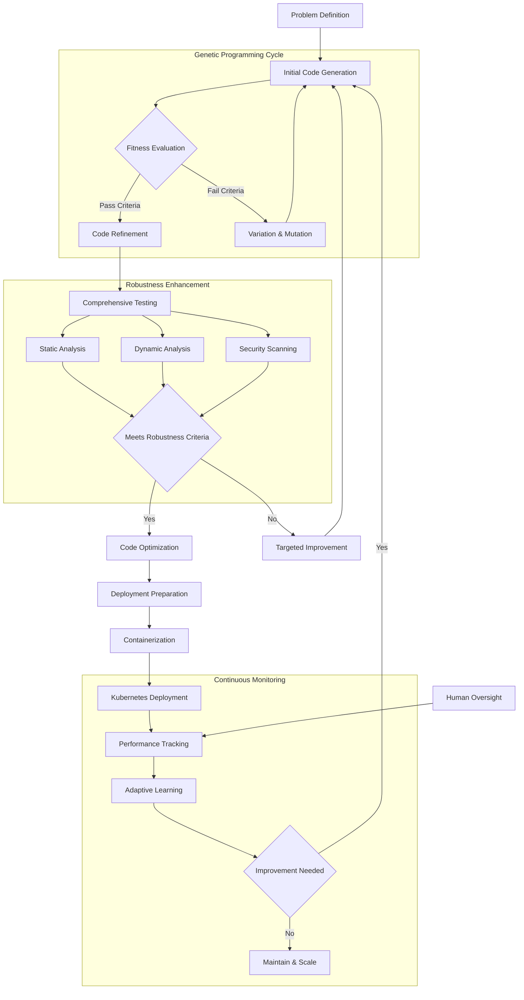

# &#x1F9EC; EADS: Evolutionary Autonomous Development System

## &#x1F680; Paradigm-Shifting Software Engineering

EADS represents a revolutionary approach to autonomous software development, leveraging advanced AI, genetic programming, and adaptive learning to create a self-evolving software engineering ecosystem.

### &#x1F52D; Core Innovation

At its heart, EADS is not just another development tool&#x2014;it's an intelligent, self-improving system that learns, adapts, and generates high-quality software with minimal human intervention.

## &#x2728; Key Features

### Intelligent Code Generation
- &#x1F9E0; LLM-powered code synthesis
- &#x1F9EC; Genetic programming for optimization
- &#x1F50D; Semantic understanding via advanced embeddings

### Robust Quality Assurance
- &#x1F4CA; Comprehensive testing frameworks
  - Unit Testing
  - Integration Testing
  - Performance Optimization
  - Security Hardening

### Advanced Learning Mechanisms
- &#x1F504; Recursive self-improvement cycle
- &#x1F4DA; Semantic knowledge base
- &#x1F916; Decentralized AI engine

## &#x1F3D7;&#xFE0F; System Architecture

### Components
1. **Genetic Programming Engine**
   - Population management
   - Variation operators
   - Fitness evaluation
   - Intelligent selection

2. **Knowledge Management**
   - Neo4j Knowledge Graph
   - Pinecone Semantic Embeddings
   - NLP-enriched code taxonomy

3. **Robustness Enhancement**
   - Static &amp; Dynamic Analysis
   - Formal Verification
   - Continuous optimization

4. **Deployment &amp; Monitoring**
   - Apache Airflow Orchestration
   - Docker Containerization
   - Kubernetes Scaling
   - Postgres Metadata Tracking

## &#x1F31F; Unique Selling Points

- &#x1F510; Self-securing code generation
- &#x1F4A1; Adaptive learning paradigms
- &#x1F680; Reduced human intervention
- &#x1F30E; Scalable, cloud-native architecture

## &#x1F6E0;&#xFE0F; Technology Stack

- **AI/ML**: 
  - TensorFlow
  - PyTorch
  - Scikit-learn
- **Genetic Programming**:
  - DEAP
  - PyGAD
- **Knowledge Management**:
  - Neo4j
  - Pinecone
- **Deployment**:
  - Docker
  - Kubernetes
  - Apache Airflow

## &#x1F4AC; Vision

To create a self-healing, continuously improving software ecosystem that autonomously adapts to emerging technological landscapes.

## &#x1F91D; Contribution

Passionate about autonomous systems? We're always looking for brilliant minds to push the boundaries of AI-driven software engineering!

### Prerequisites
- Strong understanding of machine learning
- Experience with genetic algorithms
- Python expertise
- Curiosity and passion for cutting-edge tech

## &#x1F4DC; License

[To be determined - Open-source, collaborative spirit encouraged!]

## &#x1F4E7; Contact

Reach out if you're as excited about autonomous software evolution as we are!

---

*Inspired by the boundless potential of artificial intelligence and the art of software craftsmanship.*

## &#x1F4BB; Project Diagrams

### EADS System Architecture Diagram

### EADS Autonomous Development Workflow

