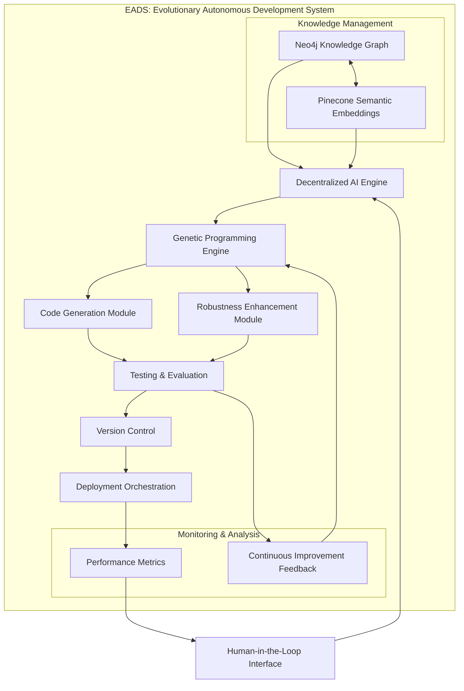
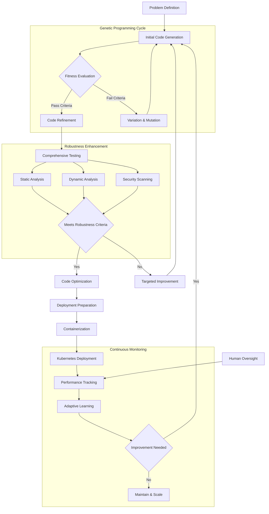
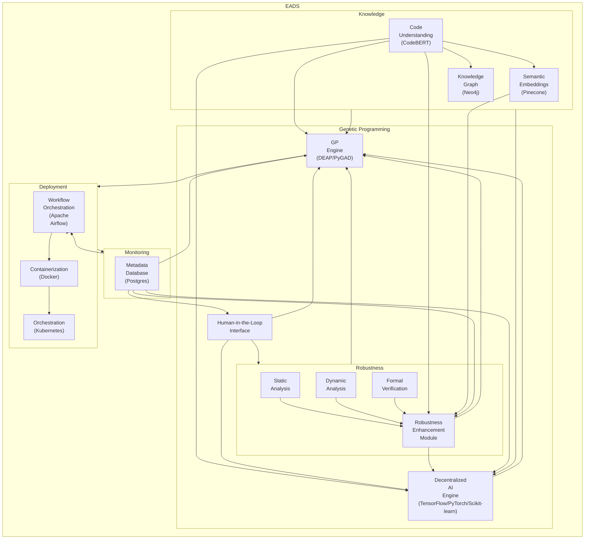
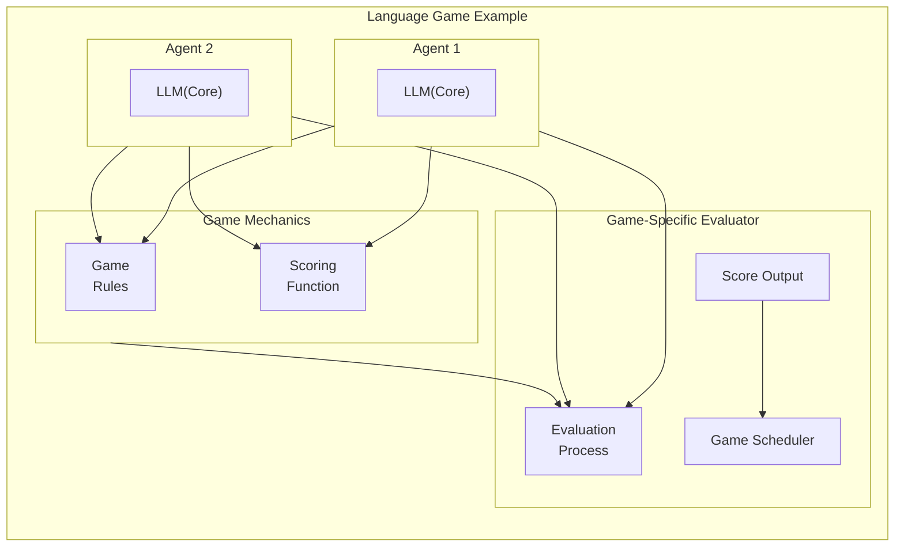
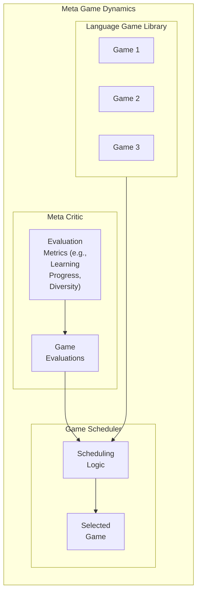
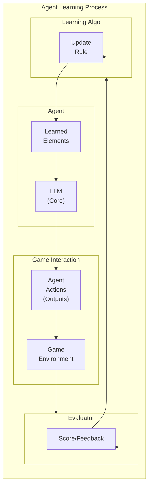
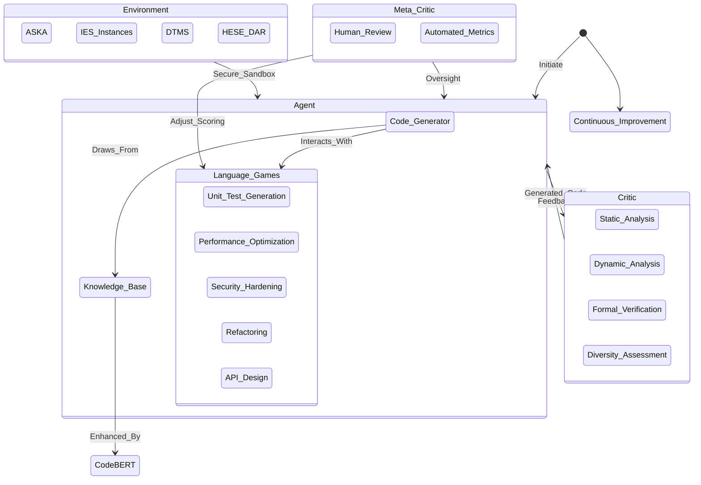
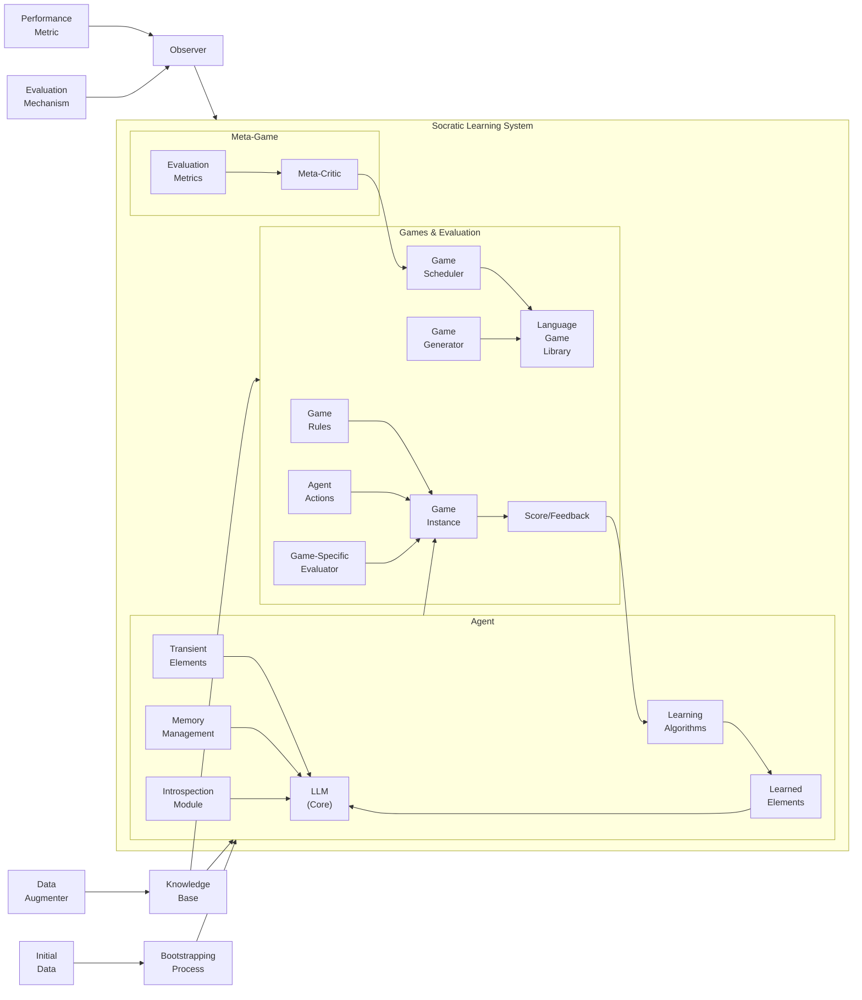

## Diagrams All

### EADS System Architecture Diagram

### EADS Autonomous Development Workflow

### System Diagram

### Language Game Example

### Meta Game Dynamics

### Agent Learning Process

### State Diagram (Boundless Socratic Learning)

### Architectural Diagram (Boundless Socratic Learning)

