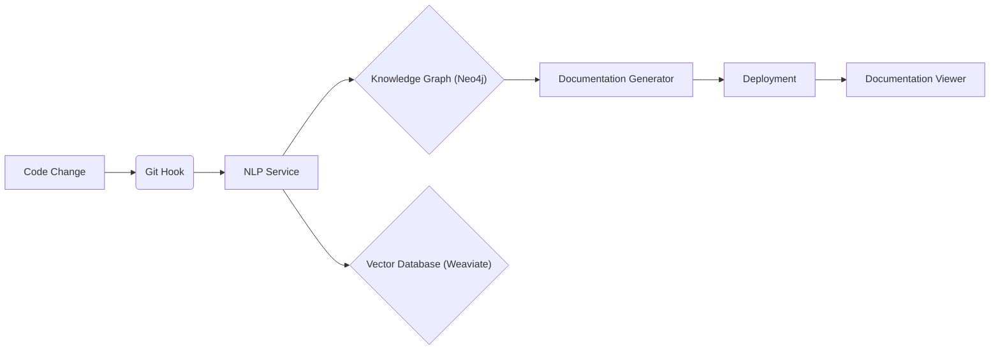
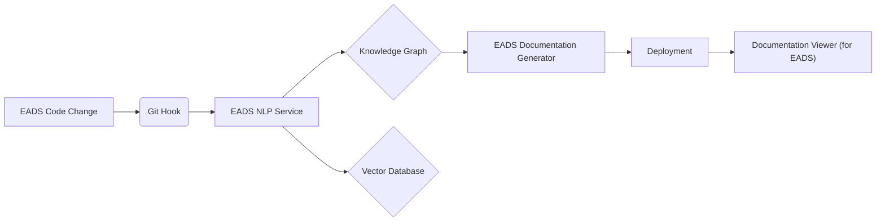
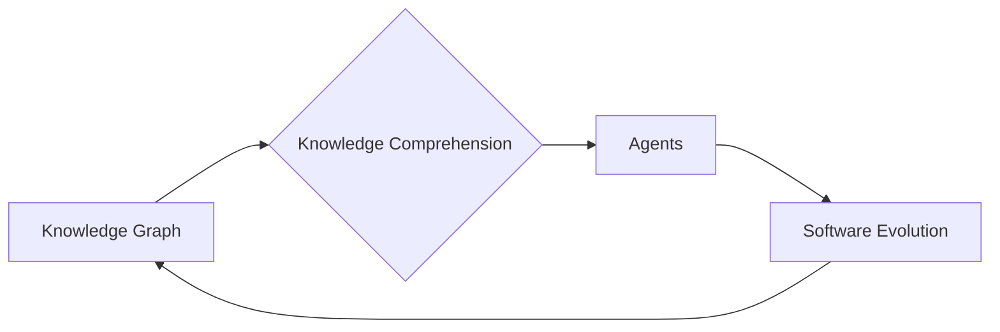
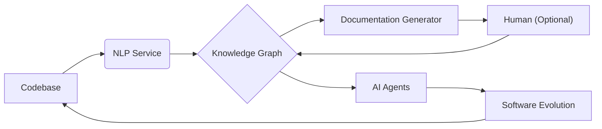

# Relevant GitHub libraries and projects

**1. Genetic Programming (GP) & Evolutionary Computation:**

* **DEAP (Distributed Evolutionary Algorithms in Python):** You're already using this, which is a great choice.  It's highly flexible and provides a solid foundation for building your GP engine. *Keep using this.*
* **PyGAD (Python Genetic Algorithm):**  A simpler alternative to DEAP.  If you find DEAP too complex for your initial needs, you might consider PyGAD. *Good alternative for simpler GP.*
* **gplearn:**  Focuses on symbolic regression using GP.  Might be too specialized if your goal is general code evolution.  *Potentially useful for specific subtasks.*
* **Evo-Suite:**  Specializes in automatic test case generation using genetic algorithms. This could be integrated into your testing and QA component. *Useful for augmenting your testing capabilities.*


**2. Large Language Model (LLM) Orchestration and Integration:**

* **LangChain:** *Highly recommended.*  LangChain provides powerful tools for building LLM workflows, managing prompts, integrating with various LLM providers, and implementing advanced techniques like chain-of-thought reasoning. *Integrate this for improved LLM management.*
* **LlamaIndex:** *Strongly consider.*  LlamaIndex specializes in connecting LLMs to external data sources (like your knowledge base). It offers efficient ways to use your data to enhance LLM responses. *Integrate this for knowledge base interaction.*
* **transformers (Hugging Face):**  You're already using sentence-transformers, which is part of the `transformers` library. Explore the broader capabilities of `transformers` for accessing and fine-tuning various LLMs. *Continue using and explore more features.*


**3. Vector Databases and Embeddings:**

* **Weaviate:** You're already using this, and it's a good choice. It provides a user-friendly interface and good performance. *Continue using this.*
* **FAISS (Facebook AI Similarity Search):**  If you need extremely high performance or have specialized requirements, consider FAISS. However, it has a steeper learning curve than Weaviate. *Alternative if performance is critical.*
* **Milvus:** Another popular open-source vector database.  Explore its features and compare them to Weaviate to determine which better suits your needs. *Good alternative to Weaviate.*
* **Qdrant:**  Relatively new, but gaining popularity for its performance and features.  Worth investigating. *Another potential alternative.*
* **sentence-transformers:** You're already using this.  Excellent for generating code embeddings.  *Continue using this.*
* **CodeBERT:**  A specialized model for code embeddings. Consider fine-tuning it on your target codebase for improved performance. *Consider for more specialized code embeddings.*


**4. Graph Databases:**

* **Neo4j:** You're already using this, which is an excellent choice for representing code structure and relationships. *Continue using this.*
* **NetworkX (Python library):** While not a database, NetworkX can be useful for in-memory graph processing and analysis if you have specific graph algorithms you want to implement. *Potentially useful for specific graph algorithms.*


**5. API and Web Frameworks:**

* **FastAPI:** You're already using this, which is a solid choice. It provides performance, ease of use, and automatic documentation. *Continue using this.*


**6.  Asynchronous Programming and Concurrency:**

* **`asyncio` (Built-in Python library):** You're already using `async` and `await`, which is the right approach. Deepen your understanding of `asyncio` for managing concurrent operations. *Continue using and explore advanced features.*
* **`aiohttp` (Asynchronous HTTP client/server):**  You're using this.  Good choice for asynchronous network operations. *Continue using this.*


**7. Testing and QA:**

* **Pytest:**  You're using this, which is excellent. *Continue using this.*
* **Hypothesis:**  A powerful property-based testing library that could be a valuable addition to your test suite. Consider using it for generating more comprehensive and robust tests. *Consider for advanced testing.*


**8. Monitoring and Logging:**

* **structlog:** *Highly recommended.*  A structured logging library that will make it much easier to analyze and manage your logs, especially in a distributed system.  *Integrate this for better logging.*
* **Prometheus:**  A popular open-source monitoring system. Consider integrating it for collecting and visualizing metrics from your EADS services. *Excellent choice for monitoring.*
* **Grafana:**  A powerful visualization tool that works well with Prometheus.  Use it to create dashboards for your EADS metrics. *Use with Prometheus for visualization.*


# EADS Internal Structure (Behind PyHyve/HyveAPI)

1. **Core Services:**  EADS's core services (GP Engine, NLP Service, etc.) interact with the persistence layer (databases) and LLM providers *exclusively* through the PyHyve/HyveAPI interface. They should have *no direct dependencies* on specific database clients or LLM APIs.

2. **PyHyve Adapters:**  The `PyHyve/adapters` directory contains specific adapter implementations for each database and LLM. These adapters handle the low-level details of interacting with the respective backends (e.g., constructing queries, handling connections, parsing responses).  Crucially, the core EADS services remain unaware of these implementation details.

3. **HyveAPI Service:** The HyveAPI acts as a central service, exposing the unified interface via a RESTful API. This allows other systems (including your client application) to interact with EADS's data and functionality in a standardized way.

**Decoupled External System (Your Client Application)**

Your client application (or any other external system) interacts with EADS through the HyveAPI's RESTful endpoints.  It uses the provided client library (`hyve/client.py` or an equivalent in another language) or makes direct HTTP requests to the API.

**Diagram:**

```
+-----------------------+     +-------------+     +-----------------+     +-----------------+
|    Client Application | <--> |   HyveAPI   | <--> |  PyHyve Core   | <--> | EADS Services  |
+-----------------------+     +-------------+     +-----------------+     +-----------------+
                                                    |
                                                    +--> PyHyve/adapters (DB, LLM)
```

**Benefits of this Separation:**

* **Modularity:** EADS's core services become more modular and easier to test, maintain, and evolve independently of the specific backend technologies.

* **Flexibility:**  You can easily switch databases or LLMs by changing the PyHyve adapters without modifying the core EADS services.

* **Standardized Interface:**  The HyveAPI provides a consistent interface for accessing EADS's functionality, regardless of the underlying implementation.

* **Decoupling:** The external system (your client application) is decoupled from EADS's internal structure, allowing both systems to evolve independently.

* **API-First Approach:**  Designing the HyveAPI first encourages a clear and well-defined interface, promoting better software design.


**Example Interaction (Conceptual):**

1.  The GP Engine needs to store a new code embedding.  It calls `hyve.vector_search("embeddings", query_vector=[...], k=0, upsert=True)`.  ("embeddings" is the registered name of the vector store).

2.  PyHyve's core routes this request to the appropriate adapter (e.g., `WeaviateAdapter`).

3.  The `WeaviateAdapter` constructs the necessary API call to Weaviate and handles the interaction.

4.  The GP Engine receives a standardized response from PyHyve, regardless of which vector database was used.


**Client Application Example:**

Your client application can use the HyveAPI client library:

```python
client = HyveClient("http://eads-api:8000")  # EADS API endpoint
results = await client.query(QueryType.GRAPH_TRAVERSE, graph_store_id, GraphQuery(query="..."))
# ... process the results ...
```


**Implementation Notes:**

* **Asynchronous Operations:** Use asynchronous programming (e.g., `async` and `await` in Python) throughout PyHyve/HyveAPI and your client application for better performance, especially for I/O-bound operations.
* **Error Handling:**  Implement robust error handling at each layer to gracefully manage potential issues (database errors, network problems, LLM API limits).
* **Authentication and Authorization:**  If needed, add authentication and authorization to the HyveAPI to control access to EADS's data and functionality.  Consider JWTs (JSON Web Tokens) for a standard approach.
* **Configuration:** Use a configuration file (YAML, JSON, etc.) to manage database connection details, LLM API keys, and other settings for both EADS and your client application.


By implementing this architecture, you create a highly modular and flexible system, promoting better code organization, easier testing, and a cleaner separation of concerns between EADS and any external systems that interact with it.  This is a robust foundation for a complex, evolving project.

## HyveAPI

```Python
# hyve/interfaces.py
from typing import Any, Dict, List, Optional, Union
from pydantic import BaseModel, Field
from enum import Enum
from uuid import UUID

class StoreType(Enum):
    VECTOR = "vector"
    GRAPH = "graph"
    RELATIONAL = "relational"

class QueryType(Enum):
    SIMILARITY = "similarity"
    GRAPH_TRAVERSE = "graph_traverse"
    SQL = "sql"
    HYBRID = "hybrid"

class VectorQuery(BaseModel):
    vector: List[float]
    k: int = 10
    filters: Optional[Dict[str, Any]] = None
    namespace: Optional[str] = None

class GraphQuery(BaseModel):
    query: str
    params: Optional[Dict[str, Any]] = None
    max_depth: Optional[int] = None

class SqlQuery(BaseModel):
    query: str
    params: Optional[Dict[str, Any]] = None

class HybridQuery(BaseModel):
    vector_query: Optional[VectorQuery] = None
    graph_query: Optional[GraphQuery] = None
    sql_query: Optional[SqlQuery] = None
    combine_strategy: str = "union"

class QueryRequest(BaseModel):
    query_type: QueryType
    store_id: UUID
    query: Union[VectorQuery, GraphQuery, SqlQuery, HybridQuery]
    timeout_ms: Optional[int] = 5000

class QueryResult(BaseModel):
    data: Any
    metadata: Dict[str, Any]
    latency_ms: float
    store_id: UUID

class StoreConfig(BaseModel):
    store_type: StoreType
    connection_params: Dict[str, Any]
    adapter_class: str
    namespace: Optional[str] = None

# hyve/api.py
from fastapi import FastAPI, HTTPException
from contextlib import asynccontextmanager

app = FastAPI()

@app.post("/v1/query")
async def query(request: QueryRequest) -> QueryResult:
    """Execute query across stores"""
    pass

@app.post("/v1/stores")
async def register_store(config: StoreConfig) -> UUID:
    """Register new store"""
    pass

@app.get("/v1/stores/{store_id}/health")
async def check_store_health(store_id: UUID):
    """Check store health"""
    pass

# hyve/client.py
class HyveClient:
    """Python client for Hyve API"""

    def __init__(self, base_url: str):
        self.base_url = base_url
        self.session = aiohttp.ClientSession()

    async def query(self,
        query_type: QueryType,
        store_id: UUID,
        query: Union[VectorQuery, GraphQuery, SqlQuery, HybridQuery]
    ) -> QueryResult:
        """Execute query via API"""
        async with self.session.post(
            f"{self.base_url}/v1/query",
            json=QueryRequest(
                query_type=query_type,
                store_id=store_id,
                query=query
            ).dict()
        ) as resp:
            return QueryResult(**await resp.json())

    async def register_store(self, config: StoreConfig) -> UUID:
        """Register new store"""
        async with self.session.post(
            f"{self.base_url}/v1/stores",
            json=config.dict()
        ) as resp:
            return UUID(await resp.json())

# Example usage
async def example():
    # Use as client
    client = HyveClient("http://localhost:8000")

    # Register stores
    vector_store_id = await client.register_store(StoreConfig(
        store_type=StoreType.VECTOR,
        connection_params={"url": "http://localhost:8080"},
        adapter_class="WeaviateAdapter"
    ))

    graph_store_id = await client.register_store(StoreConfig(
        store_type=StoreType.GRAPH,
        connection_params={"uri": "bolt://localhost:7687"},
        adapter_class="Neo4jAdapter"
    ))

    # Simple vector query
    results = await client.query(
        query_type=QueryType.SIMILARITY,
        store_id=vector_store_id,
        query=VectorQuery(
            vector=[0.1, 0.2, 0.3],
            k=5
        )
    )

    # Hybrid query
    results = await client.query(
        query_type=QueryType.HYBRID,
        store_id=vector_store_id,
        query=HybridQuery(
            vector_query=VectorQuery(
                vector=[0.1, 0.2, 0.3],
                k=5
            ),
            graph_query=GraphQuery(
                query="MATCH (n)-[:SIMILAR_TO]->(m) RETURN m",
                max_depth=2
            ),
            combine_strategy="intersection"
        )
    )

# Or use directly in FastAPI app
@app.post("/my/endpoint")
async def my_endpoint():
    client = HyveClient("http://localhost:8000")
    results = await client.query(...)
    return results
```

## PyHyve

```python
# PyHyve/interfaces.py
from abc import ABC, abstractmethod
from typing import Any, Dict, List, Optional, Union
from dataclasses import dataclass

@dataclass
class QueryResult:
    data: Any
    metadata: Dict[str, Any]
    latency: float

class VectorStore(ABC):
    @abstractmethod
    async def upsert(self,
        vectors: List[float],
        metadata: Optional[Dict[str, Any]] = None
    ) -> str:
        """Store vectors with optional metadata"""
        pass

    @abstractmethod
    async def search(self,
        query_vector: List[float],
        k: int = 10,
        filters: Optional[Dict[str, Any]] = None
    ) -> List[QueryResult]:
        """Search for similar vectors"""
        pass

class GraphStore(ABC):
    @abstractmethod
    async def add_node(self,
        node_type: str,
        properties: Dict[str, Any],
        id: Optional[str] = None
    ) -> str:
        """Add node to graph"""
        pass

    @abstractmethod
    async def add_edge(self,
        from_id: str,
        to_id: str,
        edge_type: str,
        properties: Optional[Dict[str, Any]] = None
    ) -> str:
        """Add edge between nodes"""
        pass

    @abstractmethod
    async def query(self,
        query: str,
        params: Optional[Dict[str, Any]] = None
    ) -> QueryResult:
        """Run graph query"""
        pass

class RelationalStore(ABC):
    @abstractmethod
    async def execute(self,
        query: str,
        params: Optional[Dict[str, Any]] = None
    ) -> QueryResult:
        """Execute SQL query"""
        pass

class LLMProvider(ABC):
    @abstractmethod
    async def complete(self,
        prompt: str,
        max_tokens: int = 100,
        temperature: float = 0.7,
        stop: Optional[List[str]] = None
    ) -> str:
        """Get completion from LLM"""
        pass

    @abstractmethod
    async def embed(self,
        text: str
    ) -> List[float]:
        """Get embeddings for text"""
        pass

# PyHyve/adapters/weaviate.py
class WeaviateAdapter(VectorStore):
    def __init__(self, client: Any):
        self.client = client

    async def upsert(self, vectors: List[float], metadata: Optional[Dict] = None) -> str:
        # Implement Weaviate-specific logic
        pass

    async def search(self, query_vector: List[float], k: int = 10,
                    filters: Optional[Dict] = None) -> List[QueryResult]:
        # Implement Weaviate-specific logic
        pass

# PyHyve/adapters/neo4j.py
class Neo4jAdapter(GraphStore):
    def __init__(self, driver: Any):
        self.driver = driver

    async def query(self, query: str, params: Optional[Dict] = None) -> QueryResult:
        # Implement Neo4j-specific logic
        pass

# PyHyve/adapters/openai.py
class OpenAIAdapter(LLMProvider):
    def __init__(self, api_key: str):
        self.client = OpenAI(api_key=api_key)

    async def complete(self, prompt: str, **kwargs) -> str:
        # Implement OpenAI-specific logic
        pass

# PyHyve/core.py
@dataclass
class StoreConfig:
    store_type: str
    connection_params: Dict[str, Any]
    adapter_class: type

class PyHyve:
    def __init__(self):
        self.stores: Dict[str, Union[VectorStore, GraphStore, RelationalStore]] = {}
        self.llm_providers: Dict[str, LLMProvider] = {}

    def register_store(self, name: str, config: StoreConfig) -> None:
        """Register a new store"""
        store = config.adapter_class(**config.connection_params)
        self.stores[name] = store

    def register_llm(self, name: str, provider: LLMProvider) -> None:
        """Register a new LLM provider"""
        self.llm_providers[name] = provider

    async def vector_search(self, store_name: str, query_vector: List[float], **kwargs) -> List[QueryResult]:
        """Unified vector search interface"""
        store = self.stores[store_name]
        if not isinstance(store, VectorStore):
            raise TypeError(f"{store_name} is not a VectorStore")
        return await store.search(query_vector, **kwargs)

# Example usage
async def example():
    hyve = PyHyve()

    # Register stores
    hyve.register_store("embeddings", StoreConfig(
        store_type="vector",
        connection_params={"url": "http://localhost:8080"},
        adapter_class=WeaviateAdapter
    ))

    hyve.register_store("knowledge", StoreConfig(
        store_type="graph",
        connection_params={"uri": "bolt://localhost:7687"},
        adapter_class=Neo4jAdapter
    ))

    # Register LLM
    hyve.register_llm("gpt4", OpenAIAdapter(api_key="..."))

    # Use unified interface
    results = await hyve.vector_search("embeddings",
        query_vector=[0.1, 0.2, 0.3],
        k=5
    )
```


The PyHyve/HyveAPI concept provides a valuable abstraction layer for EADS, promoting modularity and enabling a cleaner separation of concerns. Here's how I envision the structure and interactions:

EADS Internal Structure (Behind PyHyve/HyveAPI)

Core Services: EADS's core services (GP Engine, NLP Service, etc.) interact with the persistence layer (databases) and LLM providers exclusively through the PyHyve/HyveAPI interface. They should have no direct dependencies on specific database clients or LLM APIs.

PyHyve Adapters: The PyHyve/adapters directory contains specific adapter implementations for each database and LLM. These adapters handle the low-level details of interacting with the respective backends (e.g., constructing queries, handling connections, parsing responses). Crucially, the core EADS services remain unaware of these implementation details.

HyveAPI Service: The HyveAPI acts as a central service, exposing the unified interface via a RESTful API. This allows other systems (including your client application) to interact with EADS's data and functionality in a standardized way.

Decoupled External System (Your Client Application)

Your client application (or any other external system) interacts with EADS through the HyveAPI's RESTful endpoints. It uses the provided client library (hyve/client.py or an equivalent in another language) or makes direct HTTP requests to the API.

Diagram:
```
+-----------------------+     +-------------+     +-----------------+     +-----------------+
|    Client Application | <--> |   HyveAPI   | <--> |  PyHyve Core   | <--> | EADS Services  |
+-----------------------+     +-------------+     +-----------------+     +-----------------+
                                                    |
                                                    +--> PyHyve/adapters (DB, LLM)
```

Benefits of this Separation:

Modularity: EADS's core services become more modular and easier to test, maintain, and evolve independently of the specific backend technologies.

Flexibility: You can easily switch databases or LLMs by changing the PyHyve adapters without modifying the core EADS services.

Standardized Interface: The HyveAPI provides a consistent interface for accessing EADS's functionality, regardless of the underlying implementation.

Decoupling: The external system (your client application) is decoupled from EADS's internal structure, allowing both systems to evolve independently.

API-First Approach: Designing the HyveAPI first encourages a clear and well-defined interface, promoting better software design.

Example Interaction (Conceptual):

The GP Engine needs to store a new code embedding. It calls hyve.vector_search("embeddings", query_vector=[...], k=0, upsert=True). ("embeddings" is the registered name of the vector store).

PyHyve's core routes this request to the appropriate adapter (e.g., WeaviateAdapter).

The WeaviateAdapter constructs the necessary API call to Weaviate and handles the interaction.

The GP Engine receives a standardized response from PyHyve, regardless of which vector database was used.

Client Application Example:

Your client application can use the HyveAPI client library:

```python
client = HyveClient("http://eads-api:8000")  # EADS API endpoint
results = await client.query(QueryType.GRAPH_TRAVERSE, graph_store_id, GraphQuery(query="..."))
# ... process the results ...
```

Implementation Notes:

Asynchronous Operations: Use asynchronous programming (e.g., async and await in Python) throughout PyHyve/HyveAPI and your client application for better performance, especially for I/O-bound operations.

Error Handling: Implement robust error handling at each layer to gracefully manage potential issues (database errors, network problems, LLM API limits).

Authentication and Authorization: If needed, add authentication and authorization to the HyveAPI to control access to EADS's data and functionality. Consider JWTs (JSON Web Tokens) for a standard approach.

Configuration: Use a configuration file (YAML, JSON, etc.) to manage database connection details, LLM API keys, and other settings for both EADS and your client application.

By implementing this architecture, you create a highly modular and flexible system, promoting better code organization, easier testing, and a cleaner separation of concerns between EADS and any external systems that interact with it. This is a robust foundation for a complex, evolving project.


---


# Core Functionality:of EADS

This is where you implement the fundamental capabilities of EADS:

1. **Basic GP Operations:**
    * **Representation:**  Define how you represent individuals in your GP population (e.g., abstract syntax trees, lists of instructions, etc.).
    * **Initialization:** Implement population initialization (random generation, seeding with existing code, etc.).
    * **Fitness Evaluation:**  Create your fitness function based on the metrics you've defined (correctness, performance, cost).
    * **Selection:**  Implement selection operators (tournament selection, roulette wheel selection, etc.).
    * **Crossover:**  Implement crossover operators (e.g., subtree crossover for ASTs, single-point crossover for lists).
    * **Mutation:** Implement mutation operators (e.g., changing a node in an AST, swapping instructions).
    * **Evolution Loop:** Create the main loop that iterates through generations, applying selection, crossover, and mutation.

2. **NLP Analysis Patterns:**
    * **Code Parsing:** Implement or integrate a code parser (e.g., using `ast` module in Python, Tree-sitter).
    * **Embedding Generation:**  Use your chosen embedding model (sentence-transformers, CodeBERT) to generate embeddings for code chunks.  Consider fine-tuning the model on your target codebase.
    * **Pattern Matching:** Implement logic to identify specific code patterns (e.g., loops, function calls, specific library usage) in the parsed code.
    * **Similarity Search:** Implement or integrate a similarity search mechanism (using your vector database) to find code snippets similar to a given query or context.

3. **Initial Integrations:**
    * **GP Engine <-> NLP Service:** Integrate the GP engine with the NLP service. The GP engine can use the NLP service to analyze generated code, extract features for fitness evaluation, or suggest mutations.
    * **Persistence Layer:** Integrate both the GP engine and NLP service with the persistence layer (Neo4j, Weaviate, PostgreSQL).  Store code, embeddings, patterns, evolution history, etc.


**Enhancing Developer Experience:**

These improvements will make it easier and more efficient to work with EADS:

* **Workflows:** Define common workflows for using EADS (e.g., optimizing a given function, generating test cases for a module).  Create scripts or notebooks that demonstrate these workflows.
* **Debugging Tools:**  Implement tools or techniques for debugging the GP engine, NLP service, and their interactions. This might include visualizing the evolution process, inspecting intermediate code representations, or logging detailed information about model executions.
* **Data Generators:** Create data generators to easily generate synthetic code or test cases for experimenting with different EADS features. This will be invaluable for testing and evaluating different components of the system.


**Strengthening Quality Assurance (Brief Detail):**

* **CI/CD Pipeline:** Set up a continuous integration and continuous deployment (CI/CD) pipeline to automate the build, testing, and deployment of EADS. This will ensure that your code is always tested and ready to deploy.
* **Integration Tests:** Implement tests that verify the interactions between different EADS components (e.g., GP engine and NLP service).  This is where testing libraries like `pytest` are extremely valuable!
* **Automated Testing:** Automate the execution of your test suite as part of your CI/CD pipeline.


**Adding a Monitoring Stack, Logging, and Automation (Brief Detail):**

* **Monitoring Stack:** Implement a monitoring system using tools like Prometheus and Grafana.  Collect metrics from your services and visualize them on dashboards.
* **Logging:**  Use a structured logging library like `structlog` to create informative and easily analyzable logs.
* **Development Environment Automation:** Create scripts or tools to automate the setup and configuration of your development environment. This might include installing dependencies, configuring databases, and setting up environment variables.  Tools like `docker-compose` or `vagrant` can be beneficial here!


By focusing on these key areas, you'll build a solid, usable, and well-tested EADS system.  Remember to prioritize based on your project's current phase and gradually add complexity as you progress. This structured approach will help you make consistent progress and achieve your ambitious goals.


# FluxScribe - a truly next-generation documentation system—an AI-powered documentation assistant

You're envisioning a truly next-generation documentation system—an AI-powered documentation assistant that automatically keeps docs, diagrams, and even deployments in sync with your code. This is an ambitious but very exciting idea! While a fully realized, plug-and-play solution like this doesn't yet exist (to my knowledge), we can explore the key components and how they might be combined:

**1.  Code Change Analysis (The Foundation):**

* **Fine-grained Diffing:** The system needs to go beyond basic line-by-line diffs.  It needs to understand the *semantic* changes in the code—what functions were added, modified, or removed, how class hierarchies changed, which dependencies were updated, etc.  Tools like `semantic` can help with this.
* **AST (Abstract Syntax Tree) Diffing:**  Comparing ASTs of code versions provides a more structured way to analyze changes in code structure. Libraries like `gumtree` are specialized for AST diffing.
* **LLM-powered Change Summarization:**  Use an LLM to summarize the key changes in a human-readable format.  The LLM can be prompted with the diff or AST diff information.


**2. AI-driven Documentation Generation:**

* **Templated Documentation:** Use templates for different types of documentation (API docs, tutorials, explanations).  The AI can fill in the templates based on the code changes.
* **Diagram Generation:** Generate or update Mermaid, PlantUML, or other diagrams based on changes in code structure (e.g., class diagrams, module dependencies).
* **LLM-powered Narrative Generation:**  Use an LLM to generate explanatory text for code changes, new features, or updated functionalities.  This could be integrated into the templated documentation.

**3. Deployment and Synchronization:**

* **Git Hooks:**  Use Git hooks (pre-commit, post-commit) to trigger the documentation generation process automatically whenever code is committed.
* **CI/CD Integration:** Integrate the entire process into your CI/CD pipeline.  This ensures that documentation is always up-to-date with the latest code.
* **Companion Repository (or Branch):** Store the generated documentation in a companion repository (or a separate branch in the same repository).  This keeps the documentation separate from the codebase but synchronized.
* **Automated Deployment:** Automatically deploy the updated documentation to a web server or documentation platform (e.g., Read the Docs).

**4.  AI-driven Feedback Loop:**

* **Documentation Quality Metrics:**  Define metrics for documentation quality (completeness, clarity, consistency).  Use LLMs to assess the quality of the generated documentation and suggest improvements.
* **User Feedback Integration:** Collect user feedback on the documentation and use it to refine the AI models and templates.


**Challenges and Considerations:**

* **Complexity:** Building this system is a substantial undertaking.  It requires expertise in AI, NLP, code analysis, and software engineering.
* **Accuracy:**  Ensuring the accuracy and reliability of the automatically generated documentation is crucial.  Thorough testing and validation are essential.
* **Maintainability:**  The system itself needs to be maintainable and adaptable to changes in your codebase and documentation requirements.


**Tools and Libraries (Beyond the usual suspects):**

* **semantic:** For semantic code analysis.
* **gumtree:**  For AST diffing.
* **undoc:**  An experimental tool that uses LLMs to generate documentation from code. Still very much in development but points in the right direction.


**Phased Approach:**

1. **Automated Diagram Updates:** Start by automating the generation or updating of diagrams based on code changes.  This is a more manageable first step.

2. **Templated API Documentation:** Automate the generation of API documentation using templates and LLMs.

3. **LLM-powered Narrative:**  Integrate LLM-generated explanations for code changes.

4. **Full Documentation Automation:** Combine all the components into a fully automated system.


**EADS as the AI Documentation Engine**

Instead of a separate system, the AI documentation assistant becomes an integral part of EADS, leveraging its existing components:

* **Knowledge Graph (Neo4j):** The Neo4j graph database stores the core knowledge about your codebase – classes, functions, relationships, dependencies, documentation fragments, etc.  This acts as the single source of truth for generating documentation.
* **NLP Service:** The NLP service analyzes code changes, generates embeddings, and updates the knowledge graph accordingly.  It uses techniques like AST diffing and LLM-powered summarization to understand the semantic changes.
* **GP Engine:** The GP engine could be used to optimize the documentation itself – finding the best arrangement of content, generating optimal examples, or even evolving better documentation templates.
* **LLM Integration (LangChain/LlamaIndex):**  LLMs are used to generate text, summarize changes, and assess the quality of the documentation.
* **HyveAPI:**  The HyveAPI provides a unified interface for accessing the knowledge graph and the documentation generation capabilities.  This allows other tools and services (including your client application – the documentation viewer) to interact with the system.


**Workflow within EADS:**

1. **Code Change:** A developer commits a code change to the repository.

2. **NLP Service Triggers:** A Git hook triggers the NLP service.

3. **Code Analysis and KG Update:**  The NLP service analyzes the changes, updates the knowledge graph with the new information, and potentially generates or updates embeddings in the vector database (Weaviate).

4. **Documentation Generation:** The documentation generation process (potentially triggered by another service or scheduled task) queries the knowledge graph and uses LLM prompts to generate the updated documentation (text, diagrams, API docs).

5. **Deployment:** The generated documentation is deployed to a web server or documentation platform via your CI/CD pipeline.

**Diagram:**



**Advantages of Integrating with EADS:**

* **Single Source of Truth:** The knowledge graph acts as the central repository for all information about your code and its documentation, ensuring consistency.
* **Leveraging Existing Components:** You reuse the NLP service, GP engine, and LLM integrations already present in EADS.
* **AI-Driven Optimization:** You can use the GP engine to optimize various aspects of the documentation process.
* **Unified Interface:** The HyveAPI provides a consistent way to access the documentation generation capabilities.


**Example (Conceptual):**

1.  A developer adds a new function to the codebase.

2.  The NLP service analyzes the change, creates a new node in the knowledge graph for the function, and generates embeddings for its docstring.

3.  The documentation generator queries the knowledge graph for information about the new function and uses an LLM prompt like:  "Generate API documentation for the following function:  [function signature and docstring]."

4.  The generated documentation is added to the knowledge graph and deployed.


1. **EADS Code Changes:**  When you make changes to EADS's codebase (e.g., adding a new feature, modifying a service), the same process we've described is triggered.

2. **EADS's NLP Service Processes Its Own Code:**  EADS's NLP service analyzes its *own* code changes, updates the knowledge graph, and generates embeddings.

3. **EADS Generates Its Own Documentation:** The documentation generator, using LLMs and the knowledge graph, creates or updates the documentation for EADS itself.

4. **EADS Deploys Its Own Documentation:**  The updated documentation is deployed, just like for any other project.

**Diagram (Dogfooding):**




**Key Benefits of Dogfooding:**

* **Consistency:** Ensures that the tools and processes used to document EADS are the same as those used for other projects.
* **Improved Quality:**  By using EADS to document itself, you're more likely to identify and fix issues in the documentation generation process.  You directly benefit from improvements you make.
* **Efficiency:** Automates the documentation process for EADS itself, saving time and effort.
* **Meta-Level Learning:** EADS, by analyzing its own code and documentation, can potentially learn and improve its own documentation generation capabilities over time.  This is a form of meta-learning or self-improvement.


**Example:**

Let's say you add a new function to EADS's NLP service.  The NLP service would analyze this change, update the knowledge graph, and the documentation generator would automatically generate the API documentation for the new function.  This new documentation would then become part of EADS's own documentation, viewed through the same client application.


# Knowledge comprehension of EADS as glue

The knowledge comprehension and summarization capabilities of EADS are *crucial* for enabling your swarm of evolutionary AI agents to perform effective software engineering.  It's the glue that holds the whole system together.

Here's how it all connects:

1. **Knowledge Graph as the Shared Understanding:**  The knowledge graph (Neo4j) becomes the central repository of knowledge for your swarm of agents.  It stores information about:
    * **Codebase:** Code structure (classes, functions, modules), dependencies, relationships between code entities.
    * **Documentation:** API docs, explanations, examples, tutorials.
    * **Evolution History:**  Past evolution runs, successful strategies, performance metrics, etc.
    * **Agent Performance:**  Individual agent performance data, strengths, weaknesses, specializations.
    * **Software Engineering Best Practices:** Design patterns, coding standards, security guidelines.


2. **Knowledge Comprehension:**  EADS uses its NLP service and LLM integrations to *comprehend* this knowledge:
    * **Code Analysis:** Parses code, identifies patterns, extracts features, generates embeddings.
    * **Documentation Analysis:** Understands the meaning and relationships within the documentation.
    * **Summarization:**  Creates concise summaries of code changes, evolution results, or other relevant information.
    * **Reasoning:**  Potentially uses LLMs to reason about the code, documentation, and best practices.


3. **Sharing Knowledge with Agents:**  The HyveAPI provides a unified interface for agents to access and query the knowledge graph. Agents can:
    * **Retrieve context:**  Get relevant information about the code they're working on.
    * **Learn from past experience:** Access the evolution history to identify successful strategies.
    * **Collaborate:**  Share information and insights with other agents.


4. **Agents Use Knowledge to Evolve Software:**  The agents use the knowledge they've gained to perform software engineering tasks:
    * **Code Generation:**  Generate new code based on requirements, examples, and existing code patterns.
    * **Optimization:**  Use the GP engine to evolve and optimize code for performance, correctness, and other metrics.
    * **Testing:** Generate and execute tests based on the code and its specifications.
    * **Refactoring:** Improve the structure and quality of the code.
    * **Documentation:** Generate or update documentation based on code changes and knowledge graph information.


**Example Scenario:**

1.  An agent is tasked with optimizing a specific function.

2.  It queries the knowledge graph for:
    * The function's code.
    * Related documentation.
    * Past optimization attempts for similar functions.
    * Relevant performance benchmarks and best practices.

3.  The agent uses this information, along with its own specialized knowledge (e.g., expertise in a particular algorithm), to generate and evaluate different optimization strategies.

4.  It uses the GP engine to evolve and refine the code.

5.  It updates the knowledge graph with the results of the optimization process, including the improved code, performance metrics, and any learned insights.


**Crucial Role of Summarization:**

Summarization is essential because it allows the agents to efficiently process and understand large amounts of information.  Instead of having to analyze entire codebases or documentation, agents can access concise summaries that capture the most relevant details.


**Diagram:**




# Bionic Engineer

Here's how this "bionic software engineering platform" might work:

**1.  EADS as the Intelligent Assistant:**

EADS takes on the role of a highly intelligent assistant, automating tedious tasks, providing insights, and suggesting solutions:

* **Code Generation and Completion:**  EADS proactively suggests code completions, generates boilerplate code, and even creates entire functions or modules based on the engineer's intent.
* **Automated Testing and Refactoring:** EADS automatically generates test cases, performs code analysis, suggests refactorings, and identifies potential bugs.
* **Knowledge Retrieval and Summarization:** EADS provides engineers with instant access to relevant documentation, code examples, and best practices.  It summarizes complex codebases and research papers, saving engineers valuable time.
* **Evolutionary Optimization:**  Engineers can use EADS's GP engine to explore different design options, optimize code for performance, or generate creative solutions that they might not have considered otherwise.


**2.  Human-in-the-Loop Control:**

While EADS automates many tasks, the human engineer remains in control:

* **Guidance and Feedback:**  Engineers provide high-level guidance to EADS, specifying requirements, defining constraints, and providing feedback on generated code or suggestions.
* **Decision Making:**  Engineers make the final decisions about which code changes to accept, which design options to pursue, and how to integrate EADS's suggestions into their work.
* **Knowledge Curation:** Engineers contribute to the knowledge graph, adding new information, refining existing knowledge, and ensuring the accuracy and relevance of the data.


**3.  Seamless Integration with Development Workflow:**

EADS integrates seamlessly into the engineer's existing workflow:

* **IDE Integration:**  EADS provides code suggestions and other assistance directly within the engineer's IDE.
* **Version Control Integration:**  EADS is tightly integrated with version control systems, automatically tracking changes, generating documentation, and managing code reviews.
* **Collaboration Tools:**  EADS integrates with collaboration platforms, allowing engineers to share knowledge, discuss solutions, and work together more effectively.


**Example Scenario:**

1.  An engineer is tasked with implementing a new feature.

2.  They describe the feature's requirements and constraints to EADS using natural language or a structured format.

3.  EADS suggests several design options, generates code prototypes, and provides relevant documentation and examples.

4.  The engineer reviews the suggestions, provides feedback, and refines the requirements if necessary.

5.  EADS iteratively improves the code based on the engineer's feedback, using the GP engine to explore different solutions and optimize for performance.

6.  The engineer selects the best implementation, integrates it into the codebase, and commits the changes.

7.  EADS automatically generates tests, updates documentation, and performs other routine tasks.


**Key Benefits:**

* **Increased Productivity:**  Engineers can focus on high-level design and creative problem-solving, leaving tedious tasks to EADS.
* **Improved Code Quality:** EADS helps ensure code correctness, performance, and maintainability through automated testing, refactoring, and best practice enforcement.
* **Faster Development Cycles:** Automating routine tasks and providing intelligent assistance accelerates the overall development process.
* **Enhanced Learning and Knowledge Sharing:**  EADS facilitates knowledge sharing and helps engineers learn from each other and from the system's accumulated experience.


# A more autonomous approach

1. **Self-Improving Documentation Loop:** EADS generates documentation (including diagrams and summaries) for human consumption.  However, this documentation isn't just for humans; it's also fed back into EADS's knowledge graph.

2. **AI-Driven Evolution:**  The AI agents use the knowledge graph (populated by both code analysis and the generated documentation) to drive the evolutionary process.  They leverage the summarized information to understand the codebase, identify patterns, and generate new solutions.

3. **Minimal Human Intervention:** The system operates autonomously most of the time. Humans are primarily involved when the AI agents encounter situations they can't resolve on their own.

4. **Human Feedback as Training Data:**  When human intervention is required, the human's actions and decisions are recorded as training data.  This data is then used to improve the AI agents' abilities, reducing the need for future human intervention in similar situations.


**My Response and Elaboration:**

This is a powerful concept that takes EADS from a bionic assistant to a more truly autonomous system. Here's how we can make it even more robust:

* **Structured Knowledge Representation:**  The knowledge graph should be structured to capture not just code and documentation but also the *reasoning* behind design decisions, the *context* of different code components, and the *relationships* between different pieces of knowledge.  This richer representation allows the AI agents to reason more effectively and make more informed decisions.

* **Multi-Agent Collaboration:**  Design the AI agents to collaborate and share knowledge.  Agents could specialize in different areas (e.g., code generation, testing, refactoring) and work together to solve complex problems.  They can communicate through the knowledge graph, leaving behind a trace of their reasoning and decisions.

* **Reinforcement Learning (RL):**  Consider incorporating reinforcement learning (RL) techniques. The "stuck" situations where humans intervene provide a natural reward signal for the RL algorithms.  The agents can learn to avoid these situations in the future by maximizing their rewards (minimizing human intervention).

* **Active Learning:**  Implement active learning strategies. When the AI agents are uncertain about a decision, they can proactively request human feedback.  This focuses human intervention on the most valuable and informative situations, accelerating the learning process.

* **Explainable AI (XAI):** Make the AI agents' reasoning and decisions transparent to humans. This helps build trust in the system and makes it easier to understand why the AI agents get stuck in certain situations. This explainability also provides valuable insights for debugging and improving the system.


**Enhanced Diagram:**




# Synthesized knowledge

Synthesizing new forms of knowledge is key to making EADS truly effective. It's not just about *managing* existing knowledge but *creating* new, valuable insights. Here are some creatively speculative (but potentially very powerful) forms of synthesized knowledge:

1. **Executable Specifications:** Move beyond static specifications. Generate *executable* specifications using a domain-specific language (DSL) or even a subset of your target programming language. These specifications become testable and can be directly used by the GP engine to guide evolution.

2. **Synthetic Code Corpora:** Generate large synthetic code corpora based on the patterns and structures observed in your existing codebase and the knowledge graph. This augmented dataset can then be used to fine-tune LLMs or train specialized code analysis models, leading to improved performance on your specific codebase. For instance, we can synthesize variations of functions, classes, and even entire modules.  We'd want to inject both correct code, but importantly various flawed or vulnerable implementations which could provide data in order to detect anti-patterns to help EADS learn better than existing software analysis tools.&#x20;

3. **Evolutionary Histories as Knowledge:** Don't just store the *results* of past evolution runs; capture the entire evolutionary history – the mutations, crossovers, fitness scores over time, and the "decision-making" process of the GP engine.  This detailed history becomes a rich dataset for training meta-learning models that can predict which evolutionary strategies are likely to be successful in different contexts.

4. **Agent Interaction Graphs:** Capture the interactions *between* your AI agents as a graph.  Nodes represent agents, and edges represent communication or collaboration events. Analyze this graph to identify bottlenecks, optimize communication patterns, and even evolve more effective collaboration strategies between agents.

5. **Simulated User Interactions:** Generate simulated user interactions with the software being evolved.  Use these simulated interactions to gather feedback, identify potential usability issues, and guide the evolutionary process towards more user-friendly solutions.  This "synthetic user testing" can be performed much more rapidly and extensively than traditional user testing.

6. **Cross-Project Knowledge Transfer:** If you have multiple projects using EADS, synthesize cross-project knowledge by identifying common code patterns, shared functionalities, or similar design challenges. This shared knowledge can accelerate the evolution of new projects by leveraging the experience gained from previous ones. Create a "meta-knowledge graph" that connects the knowledge graphs of individual projects.

7. **Security Vulnerability Databases:**  Based on known vulnerabilities and your own synthesized code corpus, train an AI to generate data suitable for predicting new vulnerabilities, tailoring our approach to code that has higher probability of finding defects that existing approaches miss, because our models will continuously be re-tuned.

8. **Performance Benchmark Datasets:** Optimize existing test cases using another optimization algo like evolutionary computation (we'll do a survey to nail that down) that measures actual RAM/CPU to build a highly targeted dataset to optimize specific performance and resource requirements over time so your AI systems learn best practices.


# Evolutionary Historys as Knowledge with Synthetic Code Corpora Generation

The key innovation to make EADS truly autonomous with minimal oversight lies in combining **evolutionary histories as knowledge** with **synthetic code corpora generation**.  It's not just about generating synthetic code; it's about using the evolutionary history to guide that generation, creating a self-improving loop.

Here's how it works:

1. **Capture Rich Evolutionary History:**  EADS meticulously records every detail of its evolutionary runs:
    * Individual genomes (code representations).
    * Fitness scores for each individual.
    * Parent-child relationships (which individuals were created through crossover/mutation).
    * The specific mutations and crossovers applied.
    * Environmental factors (e.g., available resources, time constraints).

2. **Analyze Evolutionary History:**  Use machine learning (e.g., recurrent neural networks, reinforcement learning models) to analyze this history and identify:
    * Successful evolutionary pathways:  Sequences of mutations and crossovers that consistently lead to improved fitness.
    * Promising code patterns:  Code structures that frequently appear in high-fitness individuals.
    * Ineffective strategies:  Mutations or crossovers that tend to reduce fitness.

3. **Generate Targeted Synthetic Code:** Use the insights from the evolutionary history to generate *targeted* synthetic code:
    * **Perturb Successful Individuals:**  Create variations of high-fitness individuals by applying similar mutations or crossovers that have proven successful in the past.
    * **Recombine Promising Patterns:**  Combine code patterns from different high-fitness individuals to create new, potentially even better solutions.
    * **Avoid Ineffective Strategies:**  Don't waste time generating code based on mutations or crossovers that have consistently led to poor results.

4. **Incorporate Human Feedback:** When human intervention is required, analyze the human's actions and integrate those insights into the evolutionary history.  This allows EADS to learn from human expertise and further refine its synthetic code generation.

5. **Continuous Improvement Loop:**  The generated synthetic code is added to the training data for the AI agents, improving their ability to generate even better code in the future.  This creates a continuous improvement loop, where EADS becomes increasingly autonomous over time.


**Making Synthetic Data Effective:**

The key to effective synthetic data is *diversity* and *relevance*.  The generated code should:

* **Cover a wide range of possible solutions:** Explore different code structures, algorithms, and approaches.
* **Be relevant to the target domain:**  Focus on generating code that is similar in style and structure to the existing codebase.
* **Include both positive and negative examples:** Generate both correct and incorrect code to help the AI agents learn to distinguish between good and bad solutions.  This is where your idea of incorporating flawed or vulnerable code is particularly valuable.


**Executable Specifications (Clarification):**

Executable specifications are not just tests. They are formal, executable descriptions of the desired behavior of the software.  They can be written in a DSL or a subset of the target programming language.  These specifications can then be used:

* **By the GP engine:** To evaluate the fitness of candidate solutions.
* **By testing frameworks:** To automatically generate test cases.
* **By documentation generators:** To create accurate and up-to-date documentation.


# FIPS 203 ideas

Let's explore models and their relevance to building something like NIST FIPS 203 (Module-Lattice-Based Key-Encapsulation Mechanism Standard) with EADS.

**Model Categories and Examples:**

* **Universal Code Generation:**  These methods aim to generate code in any programming language for various tasks.
    * **ELM (Evolving Language Model):** Uses evolutionary algorithms to optimize LLM parameters for code generation.
    * **WizardCoder:** An LLM fine-tuned on a massive code dataset, demonstrating strong code generation capabilities.

* **Domain-Specific Code Generation:** These methods focus on generating code for specific domains or tasks.
    * **EUREKA, EROM, Zhang et al.:** Use reinforcement learning combined with LLMs to design rewards for specific code generation tasks.
    * **GPT4AIGChip:**  Employs LLMs and EAs to design AI accelerators.

* **Security in Code Generation:** These methods aim to enhance code security.
    * **DeceptPrompt:** Generates code containing specified vulnerabilities for security testing.
    * **G3P with LLM:** Enhances code security by combining genetic programming with LLMs.

* **Software Optimization, Testing, and Project Planning:**  These methods utilize LLMs and EAs to improve various aspects of the software development lifecycle.
    * **Kang et al., Brownlee et al.:**  Improve traditional genetic improvement using LLMs.
    * **TitanFuzz, CodaMOSA:** Use LLMs and EAs for test case generation.
    * **SBSE (Search-Based Software Engineering):**  Employs search algorithms (often evolutionary) to optimize various aspects of software development.

* **Neural Architecture Search (NAS):**  These methods use LLMs and EAs to automatically design neural network architectures.
    * **GPT-NAS, LLMatic, EvoPrompting:**  Employ various combinations of LLMs and EAs to guide the NAS process.

* **Reasoning Capability of LLM:** These methods focus on enhancing the reasoning capabilities of LLMs.
    * **Jawahar et al., ReStruct:** Use LLMs for performance prediction and structure selection.


**Relevance to Building NIST FIPS 203 with EADS:**

Building a complex standard like NIST FIPS 203 requires a combination of approaches:

1. **Formal Specification:** FIPS 203 is a formally specified standard. EADS can leverage LLMs to understand and reason about this specification, potentially converting parts of it into executable specifications.  This allows for automated validation and testing of generated code against the standard.

2. **Cryptographic Code Generation:**  Generating correct and secure cryptographic code is crucial.  EADS can use domain-specific code generation techniques, potentially guided by models like GPT4AIGChip, to generate implementations of the cryptographic primitives required by FIPS 203.  The "Security in Code Generation" methods are especially relevant here, potentially using techniques like DeceptPrompt to generate adversarial examples for security testing.

3. **Optimization and Verification:**  EADS can employ its GP engine to optimize the generated code for performance and security.  The "Software Optimization" and "Software Testing" methods from the table are directly applicable.  Formal verification techniques can be integrated to ensure the correctness of the implementation.

4. **Documentation Generation:** EADS can automatically generate documentation for the generated code, ensuring compliance with the standard's documentation requirements.

5. **Human-in-the-Loop:**  For complex cryptographic implementations, human expertise remains essential.  EADS can operate in a human-in-the-loop mode, where human cryptographers review and validate the generated code, providing feedback to refine the system.


**Specific Models and Techniques:**

* **WizardCoder or similar powerful LLMs:** For initial code generation based on the FIPS 203 specification.
* **Domain-specific code generation techniques (EUREKA, EROM):** To fine-tune code generation for cryptographic primitives.
* **DeceptPrompt or G3P with LLM:**  For security testing and vulnerability detection.
* **Evolutionary algorithms (DEAP, PyGAD):** To optimize code for performance and security.
* **Formal verification tools:**  To ensure correctness and compliance with the standard.


By combining these approaches, EADS can significantly automate the process of developing and verifying implementations of complex standards like FIPS 203, while still leveraging human expertise for critical aspects like security and correctness.  This human-in-the-loop, AI-driven approach represents a powerful new paradigm for software engineering.


# EADS as an autonmous engineer

You're envisioning EADS as a truly autonomous AI engineer, capable of taking a high-level prompt (like the one about calculating power generation) and working on it independently, using various resources, potentially seeking human intervention when needed, and ultimately providing a comprehensive solution.  This is an ambitious but compelling vision.  Let's explore how to make this a reality:

**1.  Prompt Decomposition and Planning:**

EADS needs to understand and decompose the prompt into sub-tasks:

* **Identify Key Requirements:** What is the ultimate goal? (Calculate power generation). What are the constraints? (Lens sizes, reflector size).
* **Generate Sub-Tasks:** Break down the problem into smaller, manageable steps (e.g., calculate individual lens area, determine concentration ratio, design reflector, combine calculations, simulate system, propose experiments).
* **Prioritize Tasks:** Determine the order in which the sub-tasks should be executed.  Some tasks might depend on the results of others.
* **Allocate Resources:** Assign sub-tasks to different AI agents based on their specializations (e.g., an optical design agent, a simulation agent, a knowledge retrieval agent).

**2.  Autonomous Execution:**

The AI agents work on their assigned sub-tasks autonomously, leveraging various resources:

* **Knowledge Graph:** Access relevant knowledge, formulas, and previous design examples.
* **LLMs:**  Use LLMs for tasks like code generation, knowledge retrieval, summarization, and even reasoning about the problem.
* **External Tools:** Integrate with external tools like optical modeling software, simulation engines, or CAD programs.
* **Collaboration:** Agents communicate and share information through the knowledge graph, enabling collaborative problem-solving.


**3. Human-in-the-Loop (as needed):**

* **Identifying Gaps:**  The AI agents should be able to identify when they lack the knowledge or capabilities to complete a sub-task.
* **Requesting Human Input:**  Develop a mechanism for the AI agents to request specific information or guidance from a human expert.
* **Learning from Human Feedback:**  Incorporate the human's input into the knowledge graph and use it to train the AI agents, reducing the need for future human intervention in similar situations. This is where active learning strategies are highly valuable.

**4. Solution Synthesis and Presentation:**

Once all sub-tasks are complete, EADS synthesizes the results into a comprehensive solution:

* **Generate Report:**  Create a report that summarizes the calculations, simulations, and proposed experiments.
* **Generate Code:**  Produce any necessary code for simulations, data analysis, or automation.
* **Generate Diagrams:** Create diagrams to illustrate the system design, optical paths, or other relevant information.
* **Present Results:**  Present the solution in a clear and accessible format for the human user.

**EADS Architecture Enhancements:**

* **Planning Agent:** Introduce a dedicated planning agent responsible for prompt decomposition, task prioritization, and resource allocation.
* **Task Queue:** Implement a task queue to manage the execution of sub-tasks, allowing agents to work concurrently.
* **Communication Framework:**  Develop a robust communication framework for agents to collaborate and share information effectively.
* **Human-in-the-Loop Interface:**  Design a clear and intuitive interface for human experts to interact with the system, provide input, and review the AI agents' work.


**Example Interaction:**

1. You provide the prompt about calculating power generation.
2. EADS's planning agent decomposes the prompt into sub-tasks and assigns them to different agents.
3. The optical design agent might struggle to determine the optimal lens arrangement.  It requests input from a human optical engineer.
4. The engineer provides guidance or suggests specific design patterns.
5. The agent incorporates this feedback and continues its work.
6. Once all sub-tasks are complete, EADS generates a report summarizing the calculations, including simulations, experimental design suggestions, and justification for its choices.


By implementing these enhancements, EADS becomes a much more powerful and autonomous AI engineering system.  It can handle complex prompts, manage resources effectively, and learn from human expertise, all while requiring minimal oversight. This moves you closer to your vision of an AI that can truly assist with, or even lead in certain respects, the engineering design process.


# Generating Synthetic Data

Creating synthetic data within EADS depends heavily on the *type* of data you're working with.  Here's a breakdown of approaches for different data categories within EADS:

**1. Code:**

* **Mutation-based Generation:**  Use the existing codebase as a starting point and apply various mutation operators (similar to those used in genetic programming) to create variations of functions, classes, and modules. These mutations could include:
    * Changing variable names, data types, or function arguments.
    * Inserting, deleting, or modifying code blocks.
    * Replacing function calls with equivalent implementations or different library functions.
* **LLM-based Generation:**  Use LLMs to generate new code snippets based on prompts derived from your codebase. Fine-tune LLMs on your codebase and provide specific examples to make them easier to train, while potentially improving model response accuracy and making them faster and more targeted for code completion. For example:
    * "Generate a function that performs the same operation as this function but uses a different algorithm."
    * "Create a new class that inherits from this class and adds these features."
* **Grammar-based Generation:**  Define a grammar for your target programming language and use it to generate syntactically correct but potentially semantically diverse code.
* **Combining Techniques:** Use a combination of mutation, LLM-based, and grammar-based approaches to create a rich and varied synthetic code corpus.


**2.  Documentation:**

* **Paraphrasing and Rewriting:**  Use LLMs to paraphrase or rewrite existing documentation, creating different variations while preserving the core meaning.
* **Example Generation:** Use LLMs to generate new code examples or use cases based on the existing documentation and code.  The documentation could also suggest changes based on simulated human edits or based on bug fixes etc.
* **Translation:** If your documentation is in multiple languages, use machine translation to generate synthetic translations.


**3. Evolutionary Histories:**

* **Simulation:** Create a simulation of the evolutionary process, using simplified models of the GP engine and fitness functions. This allows you to generate large amounts of synthetic evolutionary data under different conditions.
* **Perturbation:** Take existing evolutionary histories and introduce small perturbations (e.g., changing mutation rates, altering fitness scores) to create variations.


**4.  Other Data (e.g., Test Cases, Bug Reports):**

* **LLM-based Generation:** LLMs can be used to generate synthetic test cases, bug reports, or other textual data based on patterns observed in your existing data.
* **Data Augmentation Techniques:** Apply standard data augmentation techniques like random insertion, deletion, or swapping of words or characters.


**Integrating with EADS:**

1. **Data Generation Module:**  Create a dedicated module within EADS for synthetic data generation. This module should be configurable, allowing you to specify the type of data to generate, the generation methods to use, and any other relevant parameters.

2. **Knowledge Graph Integration:** Store the generated synthetic data in the knowledge graph, linking it to the original data and annotating it with information about its synthetic origin and generation method.

3. **AI Agent Training:** Use the synthetic data to train your AI agents, improving their ability to handle different code structures, documentation styles, and evolutionary scenarios.

4. **Evaluation and Refinement:**  Continuously evaluate the effectiveness of the synthetic data and refine the generation methods based on the AI agents' performance.


That's a good overview but let's make it more concrete and actionable through our HyveAPI interface. Here's how I'd structure it:

```python
# hyve/synthetic/interfaces.py
from enum import Enum
from pydantic import BaseModel, Field
from typing import List, Dict, Any, Optional, Union
from uuid import UUID

class SyntheticType(Enum):
    CODE = "code"
    DOCUMENTATION = "documentation"
    TEST = "test"
    EVOLUTION = "evolution"

class GenerationStrategy(Enum):
    MUTATION = "mutation"
    LLM = "llm"
    GRAMMAR = "grammar"
    HYBRID = "hybrid"

class CodeMutationConfig(BaseModel):
    mutation_rate: float = 0.1
    preserve_syntax: bool = True
    allowed_operations: List[str] = ["rename", "insert", "delete", "modify"]
    target_complexity: Optional[float] = None

class LLMConfig(BaseModel):
    model_id: str
    temperature: float = 0.7
    max_tokens: int = 1000
    few_shot_examples: Optional[List[Dict[str, str]]] = None

class SyntheticRequest(BaseModel):
    synthetic_type: SyntheticType
    strategy: GenerationStrategy
    source_id: UUID  # Original data reference
    config: Union[CodeMutationConfig, LLMConfig]
    quantity: int = 1
    constraints: Optional[Dict[str, Any]] = None

class SyntheticResult(BaseModel):
    original_id: UUID
    synthetic_data: List[Dict[str, Any]]
    metadata: Dict[str, Any]
    quality_metrics: Dict[str, float]

# hyve/synthetic/api.py
from fastapi import APIRouter
from .interfaces import *

router = APIRouter(prefix="/v1/synthetic")

@router.post("/generate")
async def generate_synthetic(request: SyntheticRequest) -> SyntheticResult:
    """Generate synthetic data based on request parameters"""
    pass

@router.post("/validate")
async def validate_synthetic(data_id: UUID) -> Dict[str, float]:
    """Validate quality of synthetic data"""
    pass

@router.post("/feedback")
async def record_feedback(data_id: UUID, feedback: Dict[str, Any]):
    """Record feedback on synthetic data quality"""
    pass

# Example usage
async def example_synthetic():
    client = HyveClient("http://localhost:8000")

    # Generate synthetic code through mutation
    code_result = await client.synthetic.generate(SyntheticRequest(
        synthetic_type=SyntheticType.CODE,
        strategy=GenerationStrategy.MUTATION,
        source_id=UUID("..."),  # Original code ID
        config=CodeMutationConfig(
            mutation_rate=0.2,
            preserve_syntax=True,
            allowed_operations=["rename", "modify"],
            target_complexity=0.8
        ),
        quantity=5,
        constraints={
            "max_lines": 100,
            "required_features": ["async", "error_handling"],
            "maintain_complexity": True
        }
    ))

    # Generate documentation using LLM
    doc_result = await client.synthetic.generate(SyntheticRequest(
        synthetic_type=SyntheticType.DOCUMENTATION,
        strategy=GenerationStrategy.LLM,
        source_id=UUID("..."),  # Original doc ID
        config=LLMConfig(
            model_id="gpt-4",
            temperature=0.8,
            few_shot_examples=[
                {
                    "original": "Example doc",
                    "synthetic": "Varied doc"
                }
            ]
        ),
        quantity=3,
        constraints={
            "style": "technical",
            "max_length": 1000,
            "include_examples": True
        }
    ))

    # Validate synthetic data
    quality_metrics = await client.synthetic.validate(
        data_id=code_result.synthetic_data[0]["id"]
    )

    # Record feedback
    await client.synthetic.feedback(
        data_id=code_result.synthetic_data[0]["id"],
        feedback={
            "quality": 0.9,
            "usefulness": 0.8,
            "issues": ["minor_syntax_error"]
        }
    )
```

## Key Features:

Flexible Generation Strategies
Mutation-based for code
LLM-based for documentation
Grammar-based for structured data
Hybrid approaches
Quality Control
Validation endpoints
Quality metrics
Feedback collection
Constraints enforcement
Integration with Core HyveAPI
Uses same client pattern
Consistent data models
Shared authentication
Common error handling
Extensible Design
Easy to add new synthetic types
Pluggable generation strategies
Configurable constraints
Custom quality metrics
This design:

Makes synthetic data generation a first-class feature
Provides clear interfaces for different strategies
Enables quality tracking and improvement
Integrates smoothly with existing systems
Want to implement this approach? We can:

Start with one synthetic type
Add basic mutation strategy
Implement quality metrics
Build out from there
This gives you a solid foundation for synthetic data generation that can grow with your needs.


# algos for generating Synthetic data

---

### **1. Random Sampling with Constraints**
**Description**: Randomly selects data points or entities from the EADS knowledge graph, adhering to predefined constraints like type, relationships, or properties.
- **Use Case**: Generating diverse but valid subsets of the data for testing.

---

### **2. Graph Expansion and Perturbation**
**Description**: Expands existing knowledge graph nodes by adding synthetic connections or modifying edges while preserving structural properties like ontology or schema.
- **Use Case**: Simulating the evolution of the knowledge graph over time.

---

### **3. Generative Adversarial Networks (GANs)**
**Description**: Uses GANs to generate synthetic data by training a generator-discriminator pair, where the generator creates fake data resembling real database entries.
- **Use Case**: Creating realistic data entries or filling gaps in incomplete datasets.

---

### **4. Knowledge Graph Embedding Models**
**Description**: Leverages embedding techniques (e.g., TransE, RotatE) to learn vector representations of entities and relations, then generates new synthetic triples by interpolating or extrapolating embeddings.
- **Use Case**: Creating plausible new relationships or expanding datasets with inferred knowledge.

---

### **5. Rule-Based Data Generation**
**Description**: Applies manually defined logical rules or inferred patterns to generate new data instances or relations.
- **Use Case**: Simulating edge cases or specific scenarios relevant to EADS applications.

---

### **6. Semantic Drift Simulation**
**Description**: Introduces controlled semantic drifts by altering entity definitions, relationships, or properties based on predefined rules or probabilistic models.
- **Use Case**: Testing AI agents’ adaptability to evolving data structures.

---

### **7. Template-Based Data Synthesis**
**Description**: Generates synthetic data using predefined templates or schemas for entities and relations, combined with randomly populated attributes.
- **Use Case**: Quickly generating realistic yet synthetic examples for testing or training.

---

### **8. Markov Chain Monte Carlo (MCMC)**
**Description**: Generates new data sequences by modeling probabilistic transitions between states in a Markov chain built from knowledge graph properties.
- **Use Case**: Simulating temporal or sequential data patterns.

---

### **9. Evolutionary Algorithm Simulation**
**Description**: Simulates the evolution of entities or relationships by applying evolutionary algorithms with mutation, crossover, and selection based on fitness functions derived from the knowledge graph.
- **Use Case**: Studying adaptive changes or hypothetical future states.

---

### **10. Probabilistic Graphical Models (PGMs)**
**Description**: Builds Bayesian or Markov networks from knowledge graph data and generates synthetic data by sampling these probabilistic models.
- **Use Case**: Generating data consistent with observed statistical dependencies.

---

### **11. Relational Autoencoders**
**Description**: Trains an autoencoder to encode entities and relationships into a latent space and then decodes variations of the embeddings to create synthetic data.
- **Use Case**: Producing novel combinations of existing entities and relationships.

---

### **12. Noise Injection**
**Description**: Introduces random or structured noise into existing data entries to simulate real-world inconsistencies or errors.
- **Use Case**: Testing robustness of systems against noisy or corrupted data.

---

### **13. Ontology-Based Augmentation**
**Description**: Uses domain ontologies to infer and generate new entities, attributes, and relationships consistent with domain-specific rules and hierarchies.
- **Use Case**: Expanding datasets in domain-specific contexts, like biology or finance.

---

### **14. Entity and Relationship Synthesis**
**Description**: Synthesizes new entities or relationships by blending features from multiple existing entities in the knowledge graph.
- **Use Case**: Expanding datasets with hybrid or hypothetical data points.

---

### **15. Simulation-Based Generation**
**Description**: Builds simulations based on underlying models derived from EADS data (e.g., agent-based or system dynamics) to produce synthetic events or logs.
- **Use Case**: Generating time-series data or complex interactions.


# Algorithms for Generating Synthetic Data from EADS Knowledge Databases

1. **Generative Adversarial Networks (GANs) for Code Generation**
   - **Description:** Use a GAN setup where one network generates synthetic code snippets, and another discriminates between real and synthetic code, refining the generation process until the discriminator can no longer distinguish between them. This can be tailored to mimic the style and patterns of code within EADS.

2. **Variational Autoencoders (VAEs) for Documentation**
   - **Description:** VAEs can learn the latent structure of documentation within EADS, allowing for the generation of new documentation entries by sampling from this learned distribution. This is particularly useful for creating diverse yet contextually relevant documentation.

3. **Markov Chain Monte Carlo (MCMC) for Evolutionary Histories**
   - **Description:** By modeling the evolution history as a sequence of state changes, MCMC can generate synthetic evolutionary paths by sampling from these distributions, ensuring that the synthetic data reflects plausible evolutionary scenarios.

4. **Mutation and Crossover Operators**
   - **Description:** Inspired by genetic algorithms, use mutation (randomly altering parts of the data) and crossover (combining parts of different entries) to generate new synthetic data entries. This can be applied to code, documentation, or evolutionary data to introduce variability while maintaining structural integrity.

5. **Grammar-Based Synthesis**
   - **Description:** Define grammars that encapsulate the syntactic rules of the data types in EADS (e.g., code syntax, documentation format). Use these grammars to generate new data that adheres to these rules, ensuring syntactic correctness.

6. **Contextual Language Models (CLMs)**
   - **Description:** Train or fine-tune a transformer-based model on the specific context of EADS data (like code comments, function names, etc.). Use this model to generate synthetic data by providing prompts or contexts from existing data.

7. **Synthetic Data via Decision Trees**
   - **Description:** Construct decision trees from existing data to understand decision pathways. Use these trees to generate new data points by traversing the tree with some randomness, ensuring that the synthetic data follows similar decision patterns.

8. **Simulated Annealing for Test Cases**
   - **Description:** Use simulated annealing to perturb existing test cases within certain constraints, gradually cooling the system to settle into a near-optimal state, generating new test cases that maintain the essence but vary in detail.

9. **Bootstrapping for Bug Reports**
   - **Description:** Use bootstrapping to resample with replacement from existing bug reports, creating synthetic reports by combining parts of different real reports to increase dataset diversity without losing key information.

10. **Rule-Based Systems for Data Augmentation**
    - **Description:** Define rules based on patterns observed in the EADS data (like common coding errors, documentation styles). Use these rules to augment existing data with synthetic entries that adhere to these patterns.

Each of these algorithms has the potential to be implemented within the EADS framework to generate synthetic data that can closely mimic the characteristics of the original data, thus providing more training or testing material for AI agents or for expanding the knowledge base itself. Remember, the effectiveness of these methods will depend on how well they are tuned to the specific nature and requirements of the data within EADS.


Here's a list of algorithms for generating synthetic data from EADS knowledge databases, along with short descriptions:

**For Code:**

1. **AST Mutation:**
    * Parses code into Abstract Syntax Trees (ASTs).
    * Randomly applies mutations to the AST (e.g., node insertion, deletion, replacement, swapping).
    * Converts the mutated AST back to code.
    * *Benefits:*  Preserves syntactic correctness, allows for fine-grained control over mutations.

2. **LLM-based Code Generation (with Context):**
    * Retrieves relevant code and documentation from the knowledge graph based on a specific context (e.g., a function's purpose, a class's interface).
    * Uses the retrieved information to prompt an LLM to generate new code snippets, variations of existing functions, or entire new modules.
    * *Benefits:* Can generate semantically meaningful and contextually relevant code.

3. **Grammar-Guided Genetic Programming:**
    * Defines a grammar for the target programming language.
    * Uses genetic programming to evolve programs based on the grammar, guided by fitness functions derived from the knowledge graph (e.g., code complexity, performance metrics).
    * *Benefits:* Combines the structure of formal grammars with the exploratory power of genetic programming.

4. **Hybrid Approach (AST Mutation + LLM):**
    * Uses AST mutation to generate initial variations of existing code.
    * Uses LLMs to refine the mutated code, ensuring semantic correctness and improving code style.
    * *Benefits:* Combines the strengths of both AST mutation and LLM-based generation.


**For Documentation:**

5. **Back-Translation:**
    * Translates existing documentation to another language and then back to the original language.
    * *Benefits:* Introduces slight variations in wording, potentially capturing nuances lost in direct paraphrasing.

6. **LLM-based Paraphrasing with Constraints:**
    * Uses LLMs to paraphrase existing documentation, but adds constraints to ensure that key information and technical terms are preserved.
    * *Benefits:* Creates diverse variations while maintaining accuracy and technical precision.

7. **Template-based Generation:**
    * Defines templates for different types of documentation (e.g., API docs, tutorials).
    * Uses information from the knowledge graph and LLMs to fill in the templates, generating new documentation for new or modified code.
    * *Benefits:* Ensures consistent structure and format, simplifies the generation process.


**For Evolutionary Histories:**

8. **Simulated Evolution:**
    * Creates a simplified model of the GP engine and fitness function.
    * Runs simulated evolution experiments, varying parameters like mutation rates, population size, and selection methods.
    * Records the complete evolutionary history of each simulation.
    * *Benefits:* Generates large amounts of diverse evolutionary data without the computational cost of full GP runs.

9. **Perturbation of Existing Histories:**
    * Takes existing evolutionary histories from the knowledge graph.
    * Introduces small, random perturbations to the histories (e.g., changing fitness scores, altering parent-child relationships).
    * *Benefits:* Creates realistic variations of real evolutionary processes.


**For General Data Augmentation:**

10. **Synonym Replacement:**
    * Replaces words in code comments, documentation, or other textual data with synonyms retrieved from a thesaurus or knowledge graph.
    * *Benefits:* Increases lexical diversity without changing the underlying meaning.

11. **Random Insertion/Deletion/Swap:**
    * Randomly inserts, deletes, or swaps words or code tokens within existing data.
    * *Benefits:*  Simple to implement, can introduce a variety of variations.

12. **Generative Adversarial Networks (GANs) for Code/Documentation:**
 * GANs involve the training of two neural networks to generate high-quality synthetic data.
 * This approach requires a larger and diverse amount of training data than simpler approaches and is computationally much more expensive.  It is also much harder to train these kinds of models effectively, and model training is notoriously more difficult and highly sensitive to input data characteristics.  But, it can be effective for generating data very similar to your real-world samples.
 * *Benefits:*  High quality synthetic data that is closely matched to real samples.


These algorithms, combined with careful data validation and evaluation, can provide a rich source of synthetic data for training and improving the AI agents within EADS.  Remember to tailor the chosen algorithms and parameters to the specific characteristics of your data and the goals of your synthetic data generation process.  Choosing the right algorithms and validation of the data can significantly impact what kinds of performance gains or improvements in knowledge-base quality can be achieved, or whether the project is ultimately useful.  The key is to assess how well each approach meets your current needs, and potentially combine various methods to provide the best quality training data.


# Synthetic Data Generation Algorithms for EADS

## 1. Graph Path Mutation
- Takes existing code paths from Neo4j
- Randomly walks and mutates relationships
- Preserves valid code dependencies
- Good for: Generating new code flows while maintaining project structure

## 2. Semantic Neighborhood Blending
- Finds similar code snippets in Weaviate
- Combines features from nearby vectors
- Uses weighted averaging of embeddings
- Good for: Creating new but semantically valid code variants

## 3. Pattern-Based Generation (PBG)
- Extracts common patterns from Neo4j
- Uses frequency analysis of subgraphs
- Generates new instances following patterns
- Good for: Creating structurally valid new code components

## 4. Cross-Domain Analogy Transfer
- Finds similar patterns across different domains in graph
- Maps concepts between domains using embeddings
- Generates new code by analogy
- Good for: Novel solutions based on existing patterns

## 5. Evolutionary Graph Recombination
- Takes successful code patterns from Neo4j
- Applies genetic operators on graph structures
- Uses embeddings for fitness scoring
- Good for: Optimizing existing code patterns

## 6. Vector Space Interpolation
- Identifies clusters in Weaviate
- Generates new points in embedding space
- Maps back to code using nearest neighbors
- Good for: Creating smooth variations of existing code

## 7. Knowledge Graph Completion
- Finds missing relationships in Neo4j
- Uses embedding similarity to predict connections
- Generates code to fill gaps
- Good for: Completing partial implementations

## 8. Constraint-Based Synthesis
- Extracts constraints from Neo4j relationships
- Generates valid combinations meeting constraints
- Validates using embedding space
- Good for: Generating valid configurations/settings

## 9. Template Extraction and Filling
- Mines common templates from graph
- Uses embeddings to find appropriate fillers
- Generates variations through substitution
- Good for: Creating new instances of common patterns

## 10. Multi-Modal Fusion
- Combines graph structure from Neo4j
- With semantic embeddings from Weaviate
- Generates data satisfying both
- Good for: Complex, contextually aware generation

## 11. Anomaly-Based Generation
- Identifies unusual patterns in both DBs
- Generates variations of anomalies
- Good for: Testing edge cases and error handling

## 12. Context-Preserving Mutation
- Uses graph context from Neo4j
- Maintains semantic similarity in Weaviate
- Mutates while preserving both
- Good for: Safe code modifications

## 13. Hierarchical Pattern Synthesis
- Builds from low-level patterns up
- Uses graph hierarchy in Neo4j
- Validates at each level using embeddings
- Good for: Building complex structures

## 14. Differential Privacy Generation
- Adds controlled noise to embeddings
- Preserves graph structure integrity
- Generates privacy-preserving variants
- Good for: Sensitive data synthesis

## 15. Time-Series Pattern Generation
- Uses temporal patterns in Neo4j
- Generates new sequences
- Validates using embedding similarity
- Good for: Evolution histories, log data
