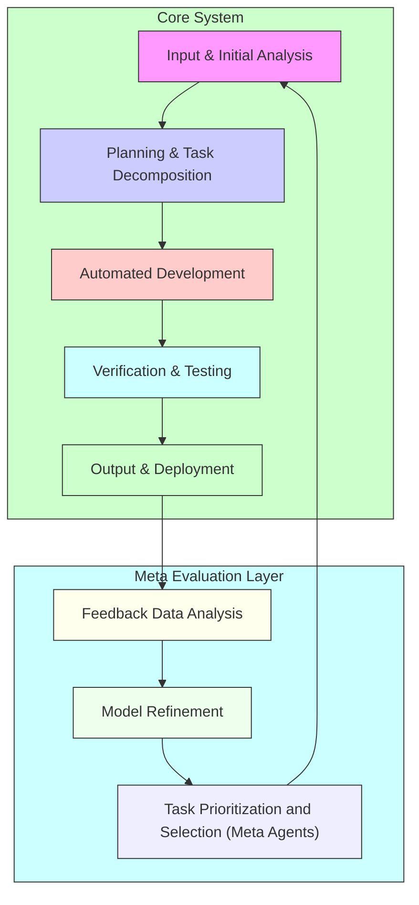
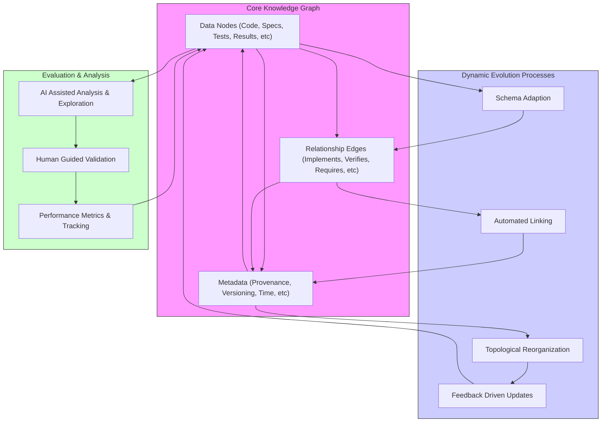

# Diagram 1

```mermaid
graph TD
    subgraph InputLayer["Input&nbsp;Layer"]
        A1["User Requirements (Formal & Informal) Data"]
        A2["Existing Code (Versioned, Provenance) Data"]
        A3["Validation Metrics & Benchmarks Data"]

        subgraph AnalysisAndModelingLayer["Analysis&nbsp;and&nbsp;Modeling&nbsp;Layer"]
            B1["Parsed Data & Features"]
            B2["Semantic Graphs & Mappings"]
            B3["Ontology Relations (Structured Context)"]
            B4["Formal Models (Math, Logic)"]
        end

        subgraph TaskPlanningAndDecompositionLayer["Task&nbsp;Planning&nbsp;&amp;&nbsp;Decomposition&nbsp;Layer"]
            C1["Decomposed Task Lists"]
            C2["Agent Assignment Data, Dynamic Workflow Plans (JSON), Prioritized Task Queues"]
        end

        subgraph AutomatedDevelopmentLayer["Automated&nbsp;Development&nbsp;Layer"]
            D1["Generated Code (Structured Formats)"]
            D2["Refined Code (Optimized)"]
            D3["Trained Model Parameters (Weights, biases)"]
            D4["External Tool Call Data"]
        end

        subgraph VerificationAndTestingLayer["Verification&nbsp;&amp;&nbsp;Testing&nbsp;Layer"]
            E1["Formal Proof Data (Verification Results), Runtime Test Results (JSON, Traces), Performance Metrics (Logs, Benchmarks)"]
            E4["Human Feedback Data (Ratings, Comments)"]
            E5["Security Analysis Data (Vulnerability Reports)"]
        end

        subgraph OutputAndDeploymentLayer["Output&nbsp;&amp;&nbsp;Deployment&nbsp;Layer"]
            F1["Code Artifacts (Compiled, Packaged)"]
            F2["Test Suites (Test Cases, Frameworks)"]
            F3["Documentation (Linked, Searchable)"]
            F4["Performance and Validation Reports (Structured)"]
        end
    end

    A1 --> B1
    A2 --> B1
    A3 --> B1
    B1 --> B2
    B2 --> B3
    B3 --> B4
    B4 --> C1
    C1 --> C2
    C2 --> D1
    D1 --> D2
    D2 --> D3
    D3 --> D4
    D4 --> E1
    E1 --> E4
    E4 --> E5
    E5 --> F1
    E5 --> F2
    E5 --> F3
    E5 --> F4

    F4 --> A3
    E4 --> B3
    D3 --> B4
    F3 --> B1
    E5 --> C1
    F4 --> C1
    F4 --> D1

    style InputLayer fill:#f9f,stroke:#333,stroke-width:1px
    style AnalysisAndModelingLayer fill:#ccf,stroke:#333,stroke-width:1px
    style TaskPlanningAndDecompositionLayer fill:#cfc,stroke:#333,stroke-width:1px
    style AutomatedDevelopmentLayer fill:#fcc,stroke:#333,stroke-width:1px
    style VerificationAndTestingLayer fill:#cff,stroke:#333,stroke-width:1px
    style OutputAndDeploymentLayer fill:#cfc,stroke:#333,stroke-width:1px
```

**Description:**

This revised diagram provides a more granular view of the core functions within EADS. It retains the high-level flow but breaks down each stage into more detailed sub-components, emphasizing the specific actions and processes involved. The diagram is organized into distinct layers, each with several key elements to show how that information is processed. This level of detail is more suited for a technically oriented audience that needs to see the various steps and how data flows, with explicit connections between components which allows a reader to focus on particular parts given its unique perspective.

1. **Input Layer:** This layer gathers all inputs from the external environment.

   *   **A1: User Requirements (Formal & Informal):** Represents the diverse forms of input from users. This includes both structured formal specifications (written in a formal language that can be parsed and processed) and less formal natural language descriptions of the objectives, constraints and desired system behaviour. The intention is to make this step explicitly represent the *range* and *diversity* of user requests that need to be integrated into the systems design.
   *   **A2: Existing Code (Versioned, Provenance):** Captures the availability of prior code that may be relevant for the model. This explicitly includes tracking for version numbers, source, licenses, and any prior testing results, etc. in a formal manner. It also represents that this source code is not perfect, but a starting point where its properties, limitations and test performance characteristics must explicitly be modeled given this specific approach and to validate also its inclusion as a part of the dataset. These are not simply raw "files" but a source of information with data about how that was previously tested and or deployed given known approaches, and also, to provide explicit traceability to these test parameters.
   *   **A3: Validation Metrics and Benchmarks** captures data about how to evaluate output, including test cases, performance benchmarks, and security testing data and related information from real or reliable and reputable source data. These datasets and test requirements are essential for evaluating if the systems are actually performing to expectations using reliable parameters as an essential quality control mechanism and is not simply a test against an "imagined" dataset. It also acts as a form of "bias detection" system (as these test sets themselves may have limitations or biases that then may cause the system to perform poorly) that also acts as an implicit test for new validation frameworks as they evolve based on this explicit and transparent structure.

2. **Analysis and Modeling Layer:** This layer is where the system understands and organizes the input data.

    *   **B1: Input Parsing & Feature Extraction:** Takes raw inputs and transforms them into a structured format. This involves parsing formal specifications (e.g., FIPS 203), natural language processing (NLP) for informal requirements, extracting code syntax and structure. The results are expressed as a data structure with specific properties derived from this step. All information is tagged for version and source for traceability and as a core part of that underlying data model.
    *   **B2: Semantic Analysis & Relationship Mapping:** Identifies the semantic meaning of input components and relationships between them. This would involve use of LLM, graph neural networks, and also other code analysis tools that reveal specific properties and characteristics between different sources of information. This output also gets stored with its provenance as explicit data, as well as a list of tools/approaches used for that step.
    *   **B3: Ontology Mapping & Contextualization:** This step involves mapping extracted information to a structured ontology (such as our formal knowledge graph), which makes relationships explicit, using explicit mappings and clear links between source and target data fields. It also involves extracting contextual data (such as time and source data) that adds deeper levels of understanding about what data means or represents.
	*   **B4: Model Formalization:** Translates the understood concepts into a formal model suitable for automated processing and analysis. The target is a format where automated systems can evaluate data in a measurable way.

3. **Task Planning & Decomposition Layer:** The system generates a plan based on analysis and modeling.

    *   **C1: Goal Decomposition & Task Generation:** This involves breaking down the main objective (e.g. "implement FIPS 203" or other user defined tasks using other approaches) into a series of smaller sub tasks that may also be further broken down.
    *   **C2: Resource Allocation & Agent Assignment:** Determining which tools, computational resources, agents, and human participants should address specific sub-tasks. This decision is dynamic, driven by data from prior attempts and where LLMs may also generate such approaches using measurable metrics based on their prior experience using that data and to select or recommend which tools should be used.
	*	**C3: Dynamic Workflow Planning (LLM):** LLM is then used to define what step should come next, given available data from prior steps. Workflow is not simply a set plan of operations but a dynamically constructed chain of operations that also includes human or other agent based intervention if required using formal models of their design constraints.
    *   **C4: Task Prioritization & Scheduling:** This step defines the order of operations and also how parallel tasks can be executed without compromising data integrity. This also includes automated methods that track which data is changed at what level, how it is changed, which agent was responsible and to indicate if any steps were missed or performed out of sequence.

4. **Automated Development Layer:** This layer is where specific tasks are generated based on the plan.

    *   **D1: Code Generation (LLM Guided):** This involves using the information from prior analysis to generate usable code that meets functional requirements (or some version of a prototype).
     * LLMs generate code but may also include formal proofs, documentation and performance data using templates that also use our database as a reference using high quality models derived from prior test data, to avoid known bad patterns or approaches. It is a combination of LLM code with what has been verified or validated or was shown to perform well in prior tests using measurable (explicit) test criteria which are all linked using that knowledge base.
    *   **D2: Code Refinement (Evolutionary Methods):** Uses genetic algorithms or similar iterative techniques to test, refine and improve the generated code based on metrics derived from its performance and formal verification.
    *   **D3: Model Training (RL):** For models that require learning parameters, RL training cycles provide an approach for fine-tuning, using the high-quality data that prior steps have already performed (so that LLM isn't simply doing "random" updates based on its own internal parameters but to respond to a measurable performance change, and what data suggests using clear and traceable links).
	*	**D4: External Tool Integration:** Where additional capabilities are required (such as specific compilers, analysis or profiling tools, formal method provers etc) this step integrates those via APIs, wrapping them as agents that can also be invoked by the LLM workflow. All External tools must also conform to the requirements for traceability as if they were also some form of high level "agent".

5.  **Verification & Testing Layer:** This layer ensures the model and its outputs meet the required standards for correctness, performance and security etc.

    *   **E1: Formal Verification (Proof Assistants):** Involves using formal methods (e.g., theorem provers like Lean or Coq) to prove that the generated artifacts satisfy their formal specifications and meet all criteria that was defined in prior steps. These tools themselves are also linked to prior versions with validation criteria also versioned etc., such that also, what did these tools "see" given each update to the system or to a specific component or test parameter?
    *   **E2: Runtime Testing (Unit, Integration):** The model components are all then also evaluated by running generated code or models in real time using both unit tests (isolated code blocks) and integration tests (interconnected system parts) using verifiable metrics that were also generated or implied using previous test data or using external data sources. It also includes tests to see if the results match the formal verifications in previous steps.
    *  **E3: Performance Evaluation & Benchmarking:** Real-world metrics such as execution time, latency, power consumption, and memory use that are relevant to specific target systems or hardware environments. Track also if that metric was the right one or if a new (and better one) also should be considered.
   *   **E4: Human Evaluation & Feedback Loop:** Involves human domain experts (or human test users in a BCI application) providing direct feedback on the performance and the quality of the model or tool, if it is meeting stated (or inferred) requirements and to see where that system might require additional development. Human feedback then also becomes part of the training data, and is also tracked via a graph structure and where new versions are built upon what was learned in each cycle of use and human review.
	 *   **E5: Security Analysis & Vulnerability Checks:** Using automated tools and penetration testing to evaluate whether models contain security flaws. Also, the meta data for all past tests are tracked so such properties are considered given all future steps to make the system more secure and to avoid predictable patterns.

6.  **Output & Deployment Layer:** This layer provides the output from our system with documentation, tests, and validation metrics.

    *   **F1: Deployable Code Artifacts:** This represents the high quality code, ready to deploy into real world systems, that also are designed with specific use cases and requirements in mind.
    *   **F2: Test Suites & Validation Tools:** A comprehensive suite of test cases that demonstrate properties of all components in a traceable form. Test tools for the target output (not for all data, but a clear method to test or validate a given system with all data linked to its tests). The tests must be consistent with prior test approaches.
     * They also include all metrics used to evaluate the system performance. These test suites include traceability of all data such as source code, formal specifications, data structures and also to specify why specific tests were included (or excluded) using a data driven approach using the data that the system created and validated.
     *   **F3: Comprehensive Documentation & Provenance:** The output has fully linked documentation, provenance tracking all the way back to source for its requirements and every step, parameter, or transform during its lifecycle including both code, models, validation tests and so on. Also include here the design decisions, testing results and what limitations and constraints exist, so users are also fully aware of how all data maps and what the limitations of that system might be. This data then forms a knowledge base with clear traceable data.
	*	**F4: Performance Metrics & Validation Reports:** A compilation of all data from all prior steps including human input and those other performance characteristics. If something failed then that must also be included. If something exceeded initial expectations then that must also be highlighted. If something failed a security test, or the approach seemed incomplete, then these also become parameters to use for future design improvements and also to ensure we are not creating "false confidence" in a model, system, or components, and to track that data with traceable properties.

# Diagram 2

**Description:**

This diagram provides a simplified view of the data flow in our prior diagrams, but it *specifically* highlights the self-improving nature of the overall EADS system. Instead of focusing on specific data types or individual components, it concentrates on *how feedback from all layers and all systems enables learning and system evolution*.

1.  **Core System (A, B, C, D, E):**

    *   This represents the high-level operations of EADS. Each element represents groups of data transformation operations that were previously described.
        *   **A: Input & Initial Analysis:** Takes user input and performs an initial extraction and transformation using a collection of tools and resources.
        *   **B: Planning & Task Decomposition:** Develops a plan, specifies tasks and assigns resources using an LLM, with each component explicitly mapped to the plan with a traceable graph structure that is verifiable at a later stage.
        *   **C: Automated Development:** Generates code, models, or other outputs to meet the requirements. This is where actions are performed, using other validation components.
        *   **D: Verification & Testing:** Tests, validates and evaluates all systems, using formal methods and real world data sets, all mapped using explicit graph data.
       *   **E: Output & Deployment:** Generates the final artifact with documentation and clear metrics that demonstrate its known testable properties.

    *   These steps also implicitly includes the data types for each transformation that were included in the prior diagram but they are abstracted for this view. It is meant to provide an alternate view of what EADS does. The emphasis is that these steps can produce test data which has the potential to be used for improving model performance.

2.  **Meta Evaluation Layer (F, G, H):**

    *   This is a new layer where data collected during previous operations is re-evaluated and then that is used to guide design decisions for the next action. This section specifically shows how the loop is then connected for self-improvement at those various levels of data collection:
        *  **F: Feedback Data Analysis**: Data is obtained from every layer from performance metrics of tests, validation of data, code and specification and from any human feedback. This meta-data is then also analyzed by new methods (often LLM driven) and are explicitly tracked. This process also creates data about all prior decisions with explicit source data links and versions and time information. It tracks *why* each step was performed based on prior data, and what information guided that decision, which is also itself, a form of testing that needs explicit validation.
        *   **G: Model Refinement:** Using data in F, EADS modifies its internal configuration, code generators, and models etc., to perform better in future test cycles.
        *   **H: Task Prioritization and Selection (Meta Agents):** Using data from G and F, EADS prioritizes which areas require the most attention, to focus its resources for maximum benefit. These meta agents also test how best to approach those limitations that have been identified to choose between exploring new avenues and refining existing models. All such choices become data points for future reference and analysis.

**Key Features of the Self-Improvement Loop:**

*   **Explicit Feedback:** The directed arrows emphasize the flow of feedback from the Output back to the core components and also to the Meta-Evaluation level.
*   **Cyclical Nature:** The diagram highlights the iterative nature of the process, showing how EADS continuously loops to improve itself.
*  **Meta Level Analysis:** All feedback data is also data that must be processed (for both humans and machines) and that those systems for processing, analyzing also are tested at the level of the system, rather than as individual tools that operate independently.
*   **Abstraction of Details:** The emphasis is on the self-improvement loop, rather than specific implementation details or data types, although it is implicit that these still exist (but are abstracted by those layers). This means, for example, that data from validation tests directly feed into models for future test cases as a core step, and is not an optional add-on.

**Why is this important?**

*   **Focus on Evolution:** The diagram clearly conveys the core concept of the design process, where EADS isn't just a system, but a self-evolving architecture that learns from its mistakes. The overall system learns and improves from each cycle.
*   **Clear Feedback Path:** It makes clear how that feedback loop is not an abstraction, but a verifiable part of how a system operates (or where it might fail if a feedback loop is broken), by modeling it explicitly as a core aspect of its implementation that all component parts must adhere to. This ensures that system always remains verifiable.
*   **Emphasis on Continuous Improvement:** It emphasizes that the goal is not a perfect single output but a continuous process of improvement.

# Diagram 3

**Summary of Our Self-Evolving Knowledge Graph Concept:**

Throughout our discussions, the concept of a self-evolving knowledge graph has emerged as a central mechanism for EADS to:

1.  **Represent Knowledge Holistically:** The knowledge graph is not just a static data store but a dynamic representation of all data (including specifications, code, test results, metrics, and human insights) and also to model its structure in explicit measurable terms. It is also used for linking components based on test results, design choices and other feedback mechanisms that evolve during the testing and validation lifecycle.
2.  **Facilitate Discovery and Relationships:** The knowledge graph is designed such that relationships between all its elements and parts (and those parts of our meta test systems), are made explicit (both automatically and also where there is explicit human input and domain expertise from real world data) and which are also traceable using explicit data properties.
3. **Provide a Framework for Understanding the Structure of Valid Information**: The topology is not simply for organization but also models properties that have meaning. If it exists, its properties then must then be used as evaluation points for other systems that might want to incorporate such validated and tested frameworks (if such a thing is even possible or measurable using current methods)
4.  **Enable Dynamic Adaptation:** The knowledge graph is intended to be continuously updated, and also self organized (given topological or other methods for organizing structure) based on feedback from all parts of the EADS system, from the performance metrics to the results of tests that uncover specific flaws or limitations.
5.  **Drive Automated Refinement:** The graph should be a key driver of automated planning, code generation, and testing and to make use of that explicit data that also measures its performance to directly affect those processes for how new systems are created with measurable improvements.
6. **Provide data for all systems in the model to understand and learn**: All components from LLMs to humans should interact with this graph and use its structural and topological properties for understanding, discovering and creating knowledge in a shared space that all have full access to.
7.  **Support Traceability and Provenance:** Every piece of data (every node and every edge) should have explicit links to its source, version number, creation time, test parameters, validation status, and explicit documentation that describes all of its known properties and where this model might also have limitations if such exist (and how we might also discover them by using what has been created to perform a range of new tests and validations, as the process matures).
8. **Enable Testing of Validity Properties:** By explicitly modeling everything (including the testing framework itself, and all the systems we will use for modeling) also makes the process (by necessity) one that must also always explicitly track all properties so these can be both tested and used in its design. The goal is that there should be no "black box" operation at any layer of this structure where the graph and its associated topological features also might point to areas that need additional exploration for refinement or design choices that may be required.
9. **Enable AI Guided Research and Discovery**: By integrating every type of component, every data structure, every system (with explicit interfaces), the overall framework can self evaluate itself as well as all other systems it is also integrating using a fully traceable methodology that also includes human validation when human expertise is also explicitly linked and integrated to also provide guidance to other AI or automated systems. All components are also designed to participate at any level using data from prior layers.

**Key Aspects of a Self-Evolving Graph:**

*   **Dynamic Schema:** The knowledge graph should not be constrained by a rigid schema. It must adapt its structure to accommodate new types of data and relationships as they emerge. New properties that were identified using our methods also should become a property of the schema. The ontology used should be able to change as new relationships, terms, and categories are discovered.
*   **Self-Organization:** The knowledge graph should be able to reorganize itself based on data flow patterns and semantic relationships. This might be driven by the LLM analysis of previously seen graph patterns given previous test cases that have been generated using prior design iterations as test data, to identify any latent properties or hidden structures that may become relevant and then made more explicit in the schema so these properties can also be validated.
 *   **Automated Linking:** The knowledge graph should automatically create links between related data points based on semantics, structure and/or those higher dimensional meta relationships.
  *   This must also trace every relationship (explicit or implicit) to demonstrate how a model's decisions were arrived at based on its data source as well as how new components of that model are generated.
*   **Topological Representation:** The graph's structure itself will have its own unique topological properties, which we can use to refine the models that process and generate it. The structural and data types that are also used might also then become data sets that LLMs also use for better performing outputs by testing which combination of data representations provide more robust results given validation criteria.
*   **Feedback Driven Evolution:** The knowledge graph must continuously evolve based on explicit data of performance and evaluation of all components and also the limitations of the system itself (which are now also, all explicitly mapped, linked and connected using traceable identifiers).

**Description:**

This diagram specifically focuses on how our knowledge graph evolves and improves over time using our core testing and validation methodology. It's also designed as an end-to-end framework such that human input also becomes a valid data set in our model:

1.  **Core Knowledge Graph (A, B, C):**
    *   **A: Data Nodes:** Represents all data elements (code, requirements, tests, results, documentation, etc.), using nodes within that graph data model with unique identifiers and traceable data. They also have explicit properties based on the explicit mapping of source or what model or test system produced the data. All data must conform to that schema.
    *   **B: Relationship Edges:** The graph's links. They represent the connections between data elements (semantic, version control, testing data, and formal proofs etc.), which are all also represented as structured data. Every type of relationship is defined.
     *   **C: Metadata:** The versioning, source and time information attached to each element as nodes and to those relationships between the nodes via edges, including all results from testing, evaluation and all other traceable meta data (also including all provenance data for all parts) which are also designed to be validatable using test criteria from various sources.

2.  **Dynamic Evolution Processes (D, E, F, G):** These represent the methods for self-improvement of our framework using different models and approaches.

    *   **D: Schema Adaption:** Represents how EADS adds new node or edge types to its model based on those needs discovered from real data. This is where we define new data properties that should be measured or tracked as explicit data fields based on real test data and not only from theoretical considerations.
    *   **E: Automated Linking:** Shows how connections between elements (nodes and data) are created based on analysis of all types of data (using LLM generated insights as well as through topological analysis), where the validation status of such connection links between data is also tracked, measured and evaluated using test metrics.
    *   **F: Topological Reorganization:** Shows how the graph is reorganized using TDA methods to cluster, group or isolate data based on their relationships. Those groupings can also be based on other dimensions or parameters (such as a project name, version number or data provenance or user ID etc.) so the model is also dynamic, and re configurable based on its observed data. The structural properties of the graph itself become a tool for analysis. The distances or topological clustering may have meaning for the user.
    *   **G: Feedback Driven Updates:** Captures how data from testing and also from validation (and also all other levels), explicitly modifies all prior layers as a part of that overall system loop, and how all components are linked, measured and evaluated as a single unit.

3. **Evaluation and Analysis (H, I, J):**

    * **H: AI Assisted Analysis and Exploration:** LLMs that have access to the whole graph (and all its data), provide insights about the overall quality of the information, and to show which parts are strong, or weak. It also provides prompts to help guide a human observer. AI performs automated analysis using topological or graph neural networks, and other data science tools and techniques using prior known or valid approaches but with metrics tracked by that system also.
    * **I: Human Guided Validation:** Experts provide input into specific areas that require additional evaluation and which also maps into parts of that model by using their own test procedures (or by accepting what has been tested and validated) so that the overall process is not simply an automated system, but something where the feedback from human observers and specialists become an active element which provides additional measurable insights or value.
    *   **J: Performance Metrics & Tracking:** Performance, reliability, security, and other evaluation metrics are collected from all steps. Also include human feedback scores, and also time to completion for each step, and their reliability scores using prior data and that also all traceability data from the design of the entire system itself including the tests, design, and code, with traceability links for each component. Data also includes all validation steps, metrics and how this was derived.

**Key Features for a Self-Evolving Graph:**

*   **Dynamic and Adaptive:** The graph's structure can change at any time, as new types of data and relationships are discovered. The graph also tracks versions, sources and test validation scores, so all parts can also be re-tested after any modifications.
*   **Data-Driven:** All aspects of graph organization and data inclusion, must have some verifiable data source that can be shown to demonstrate a real (and also demonstrable) benefit for use within the system.
 *   **Automated and Traceable:** The goal is to minimize manual intervention and instead to let the graph organize, update and also maintain its integrity automatically.
