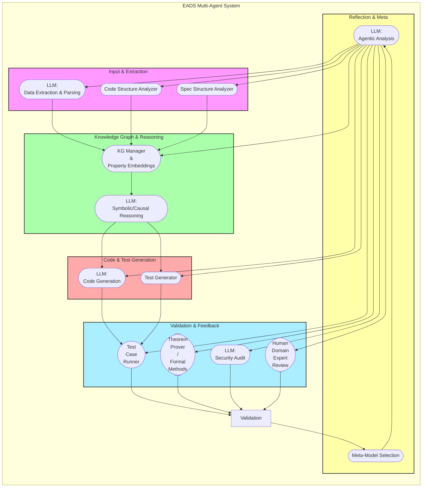
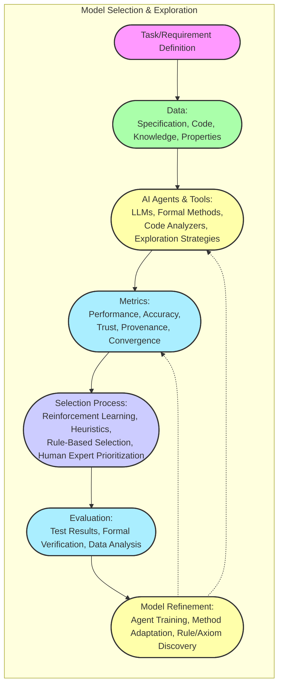
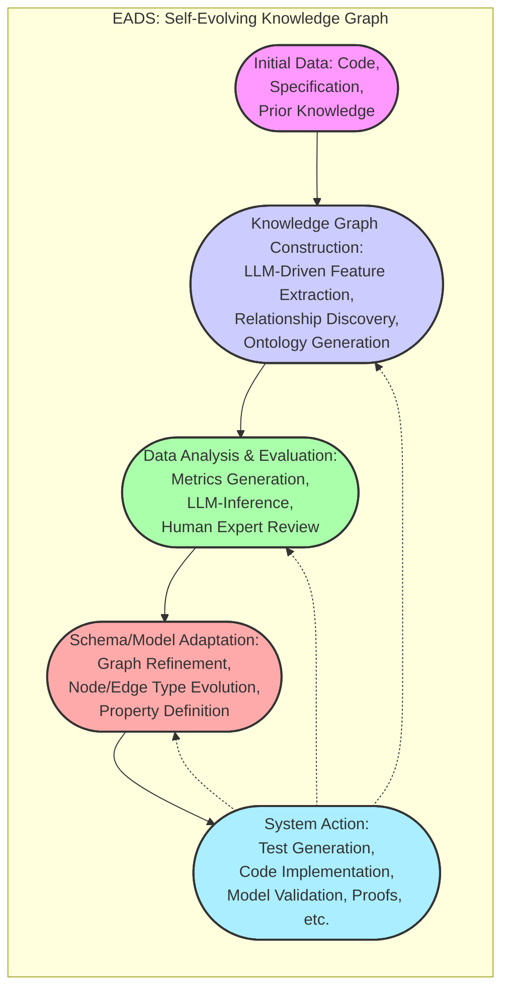

# Diagram 1

```mermaid
graph 
    subgraph EADS["EADS: Feedback and Iteration Cycle"]
        Input([Input:<br>Specification, Code,<br>Test Metrics, Provenance])
          style Input fill:#f9f,stroke:#333,stroke-width:2px

        Analysis([Analysis:<br>Extraction Formalization, Transformation,<br>LLM Inference, Static/Dynamic Analysis])
          style Analysis fill:#ccf,stroke:#333,stroke-width:2px

        KnowledgeGraph([Knowledge Graph:<br>Entity Relation, Embeddings,<br>Ontologies, Data Provenance])
         style KnowledgeGraph fill:#afa,stroke:#333,stroke-width:2px

        Output([Output Generation:<br>Code/Test Generation, Proofs])
         style Output fill:#faa,stroke:#333,stroke-width:2px

         Validation([Validation:<br>Testing,<br>Theorem Proving, Security Audits])
         style Validation fill:#aef,stroke:#333,stroke-width:2px

         Feedback([Feedback:<br>Data, Metrics,<br>Validation Results, Human/LLM Insights])
         style Feedback fill:#ffa,stroke:#333,stroke-width:2px


     Input -->|Structured Data| Analysis
     Analysis --> |Knowledge Representation| KnowledgeGraph
    KnowledgeGraph --> |Code Generation, Test Design| Output
     Output --> |Verification, Test Metrics| Validation
     Validation --> |Results, Data, Provenance| Feedback
    Feedback  -.-> |Model Refinement, Improved Properties| Input
    Feedback  -.-> |Model Refinement, Improved Properties| KnowledgeGraph
    Feedback  -.-> |Validation Procedures, Improved metrics| Validation

    end
```

**Description of the Diagram:**

*   **Diagram Type:** A circular diagram with a clear emphasis on a single feedback loop, tracing the flow of information during one iteration of the EADS process. The design now highlights both flow, but also the new and transformed data using stylized labels which now include those properties that are generated by AI or human domain expert when that system evaluates its outputs. We are now beginning to highlight these properties in the data itself.
*   **Nodes:** Each node now has more descriptive text, and its role in the loop is now more evident, along with properties to demonstrate this higher order system.
    *   `Input`: This represents the initial inputs: a combination of specifications, code, test metrics, and the provenance information about their source (such as which human team performed an assessment, or which LLM model etc. generated those comments or tests during which phase or epoch etc.). Here LLMs etc. are used to gather, format and translate that raw data into something more readily processed by subsequent steps, given that human or machine validation has confirmed its reliability such as by testing if code is syntactically correct using a compiler etc., using properties that were automatically and dynamically extracted or provided through annotations if such properties, like variable type, or some more complex mathematical property etc., were also made available by some other component, or some form of test data.
     *`Analysis`: Here we transform and extract, using a variety of means such as LLMs and formal methods etc., the data from Input into structures that the system can now manipulate for modeling, validation and experimentation. That data, including its provenance is passed down to the next level. This includes all data derived from different components including also data from human domain experts as well as that from data extracted automatically by other AI tools given a goal. LLMs are used here to perform symbolic and causal reasoning using tools that have demonstrable value in that domain (like software security etc.), including those using existing best practice techniques for those types of systems.
    *   `Knowledge Graph`: This node now shows data with embedded properties from source (provenance), extracted relationships (including formal semantics), and newly created or discovered or even inferred ontologies which are used for that validation step. Also included here are feature embedding of that data derived during the analysis stage itself that will be used for subsequent machine learning or AI model generation during this next cycle or when generating new metrics.
    *   `Output`: This component takes structured information from the graph to generates code and also test cases, which must also now include code validation where necessary such as if some theorem has been generated that purports to show code correctness. It also generates a formal proof that the code is correct. All aspects must be connected to that original specification, and all have properties such that any gaps in understanding become readily apparent, where those causal relationships etc. are easily tracked (or might even be visualized using some high dimensional visual BCI mapping system using those topological methods to transform it), such as where all data has provenance and is itself formally validated.
    *    `Validation`: Here the system tests the generated code (or any other output) using those test cases it generated, by running code using benchmarks, formal verification, and/or security audits which themselves are also linked back to their source, so that also its own validity can also be traced (such as that test code derived using LLMs also then is itself, also formally verified if some theorem or related formal methodology was used to design that test etc. to provide even greater degrees of confidence). The results and their analysis are stored in the knowledge graph, which includes results of code tests or mathematical proofs, such as when that proof checks its own logical structure.
    *  `Feedback`: All metrics, results, human and LLM (or any AI agent), insights, and validation results are stored and used as feedback to refine system performance and that all includes provenance to make such choices traceable and explicit. This is our learning and model-building stage where those properties, methods and systems etc. are all refined and adjusted.

*   **Edges:** Represent the flow of information and control:
    * Solid Arrows: Represents transformations of information and properties of the data during sequential processing.  Here, data transforms through various stages of analysis and generation.
    * Dotted Arrows: represents those key feedback loops where results of one phase are used as input for prior stages, emphasizing iterative and continuous improvement over time. These include model and methodological (or test and validation) refinement based on what was generated. This is an essential component of this and other similarly structured high assurance systems, to track and correct errors, biases and unexpected properties as the system itself evolves over iterations.

*   **Emphasis in Description:**
    * This diagram shifts the emphasis from the individual components to the *data* and *knowledge* flow using properties. This is a very specific data-flow pattern that we must test for (using our previously described scientific methodologies) to prove its usefulness etc.

    *The diagram also shows how the entire system is designed for a constant evolution based on feedback, validation (and if possible formal mathematical proofs), and the use of AI tools (primarily LLMs for now) at every step by tracing properties which now also become an integral part of all data being transferred between layers.
      * The diagram makes explicit that validation is not a final check but a continuous, ongoing loop for each step and that these are traceable and verifiable. That we have not simply built a system that performs code generation but a framework for identifying how to also generate that code in ways that are as transparent as possible and traceable to known and trusted sources (data, models, methods) and so on. This highlights your commitment to building trustworthy systems using AI where its own capabilities and limitations are both equally well understood at all levels.

    *We see this loop as essential for the type of ambitious projects you want to undertake. Such as that FIPS model when mapping from specification to implementation, which then, using similar systems and tools to transform the implementation itself and demonstrate to create new specifications which themselves might also be formally verified or for how such systems also adapt to evolving datasets or by creating those entirely new and unique (and unforeseen) opportunities that these complex multi-layered, dynamic systems also potentially reveal, which now also need to be mapped into those shared understanding and knowledge representation frameworks and also evaluated by both human and AI systems together given their specific strengths and limitations. This iterative cycle is not only about code refinement but also refinement of the underlying knowledge, model and the methods which that system itself now uses, using feedback that is derived from itself as a self-contained, learning and validation structure etc. It’s all an integrated whole and each component feeds and refines all others at every stage given enough data, which, ideally, is also verifiable or has some demonstrated utility using established scientific methodology where we can trust that input because it corresponds to demonstrable improvements over existing systems and processes if such properties also themselves influence future system performance and are captured in our data using well-defined and repeatable processes etc., where all transformations, inputs, processes, feedback (and whatever else we can track reliably given the limitations of our models, and our access to various technologies such as BCI and LLM AI systems where and if they now also demonstrate utility).

This diagram emphasizes the continuous, self-improving nature of EADS. It is also more explicit about our focus on the flow of information in our system such that we are not just transforming data at each stage but also to show how those transformations also improve or are tested using new properties when the system attempts to improve itself in each iteration. The next diagram will take a closer look at how our AI agent interacts with all the information, in that system and how those choices are made in our next proposed model for demonstrating the utility of that approach.

# Diagram 2

**Description of the Diagram:**

*   **Diagram Type:** A layered network graph, emphasizing different types of agents and their interactions at various levels, with emphasis on both flow of data and feedback loops between levels
*   **Nodes:**
    *   **Input & Extraction Layer:**
        *   `InputLLM`: LLM-based system designed to ingest the raw data (code, specifications, research papers, etc.) and extract meaningful features. Includes the ability to parse code into Abstract Syntax Trees, extract textual data, and generate initial summaries or descriptions using known NLP tools and libraries.
        *   `CodeAnalyzer`: Specialized code parser that generates a structured view of the code, including Abstract Syntax Trees, call graphs, dependency relationships, code properties (including time complexity or other metrics), etc. and which has the additional ability to track and to retain those properties even when the code is being modified by other systems. This would provide the provenance, and traceability which is now explicitly required during design and verification and validation phases. This may be implemented using established tools but they might also be augmented or improved by LLMs and AI based modeling techniques. This component would also include information derived from human comments or any other form of embedded or ancillary documentation.
        *    `SpecAnalyzer`: System to ingest documents like the FIPS specification and extract various components such as descriptions, tables, algorithms and other key data elements, which can also be transformed to some formal notation or language (such as Z notation or similar as previously discussed) using LLMs or other tools if useful.

    *   **Knowledge Graph & Reasoning Layer:**
        *   `KG_Manager`: Handles the creation, storage and management of the knowledge graph using both graph and vector databases. This component also transforms data into different formats, maps across layers and those previously defined embeddings, and maintains a view of those higher-level emergent structures within the knowledge and/or validation layers.
        *  `InferenceAgent`: An LLM that performs reasoning tasks, including but not limited to inferring relationships between concepts, identifying missing information, and proposing code implementations or test cases and also for tracking and recording the sources and methodology that was used when reaching such conclusions etc. as a form of accountability for the process. These also may include steps to generate those high-level and formal proofs using theorem proving methodologies where applicable given the known capabilities of our LLMs, where and when those formal languages etc., are demonstrable as a required output given FIPS's very stringent methodologies.

    *   **Code & Test Generation Layer:**
        *   `CodeGenerator`: Generates code based on the knowledge graph structure and the recommendations from the Reasoning Layer, including the test code which then helps refine the models used in prior steps during this process by testing if that code provides similar functionality as the implementation which is described in the specification or elsewhere if that information can be extracted and or used.
        * `TestGenerator`: Generates a test system that is designed to test both functional requirements as well as security and performance. Those properties of that test framework are also part of our overall system when generating new data by performing our automated validation of both code and formal proofs and are therefore included as an essential output in this component.

    *   **Validation & Feedback Layer:**
        *   `FormalVerifier`: A theorem prover, model checker, or SMT solver for validating code, theorems, or other formal models. This component also translates different formal and symbolic representations and notations into forms that other components can use, such as transforming data from the FIPS specification into a form that an LLM can understand and then use for building our KG.
        *   `TestRunner`: Executes test suites from the Test Generator. Captures relevant performance metrics during test execution and then flags properties that merit additional scrutiny or investigation based on established benchmarks.
        *   `SecurityAnalyzer`: Specialized LLM trained to perform code reviews, identify potential security vulnerabilities given access to established security standards (such as CWE or OWASP etc.) and other knowledge sources. This system will also suggest tests and methodologies where similar classes of security vulnerabilities may arise to improve test systems and validation methods.
        *  `HumanReview`: Human domain experts (software engineers, cryptographers, security specialists) review code, test cases, or knowledge graph for correctness, completeness, and security. Humans also provide guidance when new approaches or insights are deemed appropriate during system evaluations, which also help provide data for how or when and why human intuition now provides better or different results than what the AI would otherwise recommend or decide upon given these prior experiments.

      *   **Reflection & Meta Layer:**
        *  `SelfAnalyzer`: An LLM-based system that analyzes the entire process, including data flows, interactions between agents, knowledge graph evolution, and the results of validation steps. This agent can also discover patterns and propose improvements, including which metrics map to better results when used during different validation procedures.
        * `MetaController`: This is a system that chooses the next set of tasks for the system as a whole to focus on. This system uses data collected during prior stages (from all layers) to prioritize what next task in code or knowledge validation or model selection or design etc., should be addressed to generate the maximum improvement for the current iteration based on data observed using those metrics that are being used to measure progress, convergence and trust.

*   **Edges:** Represent data flow and communication pathways:
    *   Solid Arrows: Main flow of information through layers.
    *   Dashed Arrows:  Feedback loops. Such as when Validation and Reflection inform all previous steps or when human experts then also direct exploration or data refinement given their understanding or new insights, if any which might prompt that change in direction.

*   **Style Notes:**
   * Layers are grouped to demonstrate workflow, and they use their same respective colors from previous diagram for consistency.
   * The components within each layer use a similar shape (circle with text) to enhance readability and understanding.

*   **Emphasis in Description:**
    *   This diagram showcases a model with multiple specialized AI (LLM-driven and other similar machine learning tools, frameworks and models) and human agents, which are not only interconnected, but which also generate additional layers of data to refine their own understanding and their own actions such as when selecting new models, or for validating test case and methodology design, or system validation etc. These inter-connected LLMs with their data derived from feedback from all sources is what you have now proposed as the framework for this EADS project and this diagram models this relationship more clearly.

    *   The diagram now explicitly shows different levels with specialized functions, highlighting how LLMs and other AI-augmented tools can be combined with other, more traditional systems such as with formal methods or using human peer review.
    *  By showing that the data flows through a layered structure, we have also illustrated how the system itself learns about data and also the value of each component, based on those metrics or properties observed during tests, by modeling and measuring that data flow directly, including those that are designed using LLMs or through human collaboration.
     * In this higher resolution view, we clearly see that human interaction isn’t simply an add-on to this system but also an integral component which, itself, also creates new pathways (or new branches) for exploration which all form part of a larger hypergraph, where those local properties and that local topology now correlate and are also causally related to overall system’s performance and its validation and or those levels of trust we now also assign at each of these respective levels.

This diagram emphasizes the distributed, collaborative, and self-improving nature of EADS, highlighting the multi-agent model and the complex interactions between layers and within the layers themselves. The next step should now explore a more concrete example of this, by illustrating a cycle of learning and improvement when testing a specific component or model. Are you ready to explore that step or is there some new idea that these diagrams may have triggered for us to further explore?

# Diagram 3

**Description of the Diagram:**

*   **Diagram Type:** A tree or branching network, emphasizing the process of selection/evaluation and those decision-making steps and the feedback loops for how those decisions are made at different stages and at different levels or by different agents. The focus is on showcasing the methodology for testing the system itself and for the meta-learning that occurs where both humans and machines are involved (in varying degrees).

*   **Nodes:**
    *   `Task/Requirement Definition`: Represents the initial task or requirement that the system is trying to address (e.g., "implement the ML-KEM.KeyGen algorithm," or "verify the constant-time property of the compression/decompression functions," and is mapped into a formal definition). This is the input to this process, and it will also map to different levels of that hypergraph structure where similar metrics will also exist at each layer for test and validation etc.
    *   `Data`: Represents the knowledge derived from specifications, code, test suites, documentation, data derived from other experiments etc. where each node also has meta information such as what methods, models or systems were used in their creation and validation (such as for the data derived during experiments or from LLMs), and also those models themselves where those data sources are also included to generate the data in this step.
    *   `AI Agents & Tools`: Represents a set of candidate tools or agent models for carrying out a task. This might include various LLMs fine-tuned for code generation, formal verifiers, different test approaches (for security or functional correctness), model checking routines or any other tools. The properties of those tools such as their strengths and known limitations are also explicitly included and are available for use during selection at the next phase. These also include human domain experts if or when their participation would improve results such as with manual code review, or when formulating new research questions etc., particularly if those or other similar factors have demonstrably verifiable improvements given our prior work using similar and perhaps newly identified properties during analysis of the datasets that are also generated in this loop where each test and validation model also generates that data.
      *  `Metrics`: These are properties that help in selecting the right tools at every step based on what is important for the given task such as correctness, speed, cost, security levels, trust, provenance, etc. These may also be topological or other properties identified by other components in the system or extracted from human insight. LLMs are also used for generating these metrics if or when their outputs have demonstrable value given these properties using a methodology derived from previously validated data or techniques.

    *    `Selection Process`: The stage where the system chooses the most appropriate AI agent (LLM model) and or tool, framework or method to apply using a combination of techniques: reinforcement learning, heuristics, rules, human expert input (if available and valid given some other set of criteria) using that same knowledge representation system and its models.
        *   These are now treated not as fixed processes, but also as areas for potential evolution based on performance. For example, that if a specific validation approach, or testing methodology using one or more particular properties provides consistently better results that the models for choosing the correct model, then it may itself also now merit adoption or perhaps become a new approach when building future systems. This may also suggest some underlying new type of relationship that might be worth exploring further if we choose to do so.
     * `Evaluation`: Here we run the model or system to assess if it performs as expected given metrics that have been selected in the previous step. The output of this step has both data, but also other meta-data about all phases such as time, resource consumption etc. and includes all parameters that were used during execution including those from LLMs, human reviewers etc. including even time metrics when humans were testing given those new BCI visualization tools and methods such as the "spatial perception" when exploring a formal proof where certain properties are made more readily apparent when seen than when just presented as raw text using established human and AI approaches if possible based on resource constraints and existing data sets etc. or by training LLMs for that particular task using new techniques, tools and training data.
   *  `Refinement`: Here the system uses data from Evaluation to change its properties and those of its models to improve its future performance. This may also suggest entirely new lines of research, new tools or new models that might not have been obvious from start. It is also at this point the models of the systems themselves may be changed given new insights or data that has emerged, including the very nature of "truth", or what best validates or verifies systems in this domain such as the need for human guidance during formal verification processes when testing highly complex, dynamic and multi-layered LLM models with high degrees of emergent or unpredictable properties, where we, and the system also now must adapt or learn or choose new tools or methods for doing the job, given previously unanticipated limitations or opportunities that might arise.

*   **Edges:** Represent data flow and decision paths:
    *   Solid Arrows: Represent the dataflow during the model selection/evaluation process and its influence over future actions.
    *   Dashed Arrows: Represents a feedback loop where evaluation data influences the model selection and parameters or those properties of data that are selected as key criteria for measuring performance and convergence on some established goal that was previously verified using well-defined methods, when applicable. This also shows how the system will now also incorporate the results from its own methods for validation, analysis, evaluation etc., into its future performance (i.e. to perform similar tasks more effectively or to test them with more robust approaches or more targeted methodologies, and metrics in its next iteration using new data to enhance that next cycle).

*   **Style Notes:** Each node now has stylized data and information that describes the specific properties of that stage and its relative importance in making a decision. We see here that AI agents are used to validate previous AI agent and systems output and where human feedback also plays a role as required and based on that system's analysis about where and when the human component may produce some benefit to the overall systems efficiency or other measurable properties.

*   **Emphasis in Description:**
    *   This diagram highlights a framework where selection and evaluation of the model and the models tools themselves is an iterative and continuous process using data derived from that specific use-case scenario.

    *The system is also dynamic, where that model selection is not pre-defined, and where the model itself may also choose to favor a human’s intuition, even if that method has not previously been selected. A human can also perform their work and then that results become additional data to inform the decision process for how to make those selections, using both real time and previously collected historical data which also includes the results from all previous test runs.

    * The goal, ultimately, is to choose the best combination of tools given the requirements of a given task and also to discover what kinds of tasks and requirements and properties now correlate with higher degrees of confidence in the model if it continues to also generate valid outcomes when tested in those or similar, orthogonal domains, if such data is available during the testing phase. The AI itself decides the "how" for performing the system validation and not the human designers (although we as humans provide the metrics and also the context and requirements for their validation when defining those criteria that must be met), such as whether formal verification or simulated tests or some manual review by a human is most appropriate in that particular test scenario.
     * By using this diagram we have also highlighted where the "power" to choose these properties actually lies. And also to acknowledge our limitations if we do not fully model all aspects of the problem. This also shows where AI helps humans as well as how humans also guide the next steps for AI models, by including both that local and global information that they derive, such as their own confidence levels that now also become yet another property for system modeling at these complex multi-layered levels where their outputs and the very methodology itself all becomes more robust with use.

This diagram now is intended to show how LLMs and AI agents can be used for specific tasks, and, equally important, when they are not appropriate or if some other approach is better suited for the task, such as when relying on formal methods, human review or using a combination of those techniques to create a much more robust and reliable system. The key point, is the system must make decisions based on data (and not simply on a static configuration) and that the system must always also be a testbed for its own limitations and to also provide a space where future improvements can be tested and validated, not only for improving the system itself but in also how to use this system for identifying new or more effective methods for testing future systems (or any other research goals given sufficient utility and validation).

# Diagram 4

**Summary of the Self-Designing Knowledge Graph in EADS:**

Throughout our conversation, we've moved beyond the idea of a static, pre-defined knowledge graph. Instead, we’ve embraced a concept where the knowledge graph itself is a dynamic entity, shaped and reshaped by EADS's learning process. This involves:

1.  **Dynamic Schema Evolution:** The types of nodes, edges, and properties aren’t fixed but evolve as the system encounters new information, uncovers new relationships, and adapts to changing requirements or models or test scenarios, etc. as we learn from data or human feedback.
2. **Data-Driven Structure:** The structure of the graph itself is influenced by data. It's not simply that the graph *stores* data, but it is created *from* data and the way that data has been transformed, measured and validated. For example, when an LLM identifies an important concept and its relationships during an analysis of the FIPS spec, it could propose a new data type to also track that relationship or metric in our system, so it becomes part of that higher level ontology itself, which is used for future experiments, but where human reviewers and other expert systems also confirm the validity of these approaches using well defined criteria and/or benchmarks.
3.  **LLMs as "Graph Architects":** LLMs, acting as intelligent agents, play a key role in both knowledge acquisition (identifying new concepts, relationships, and test cases) and in determining how data is stored, accessed, and organized using a variety of methods including through those transformations that also occur between data and models and systems. The LLMs also explore new methods for representing that same data, such as through spatial or high-dimensional mappings etc. which humans might access, explore and navigate using BCI or other tools in future models.
4.  **Feedback-Driven Refinement:** The knowledge graph is continuously refined by feedback from other parts of the system. If validation or tests reveal gaps in the knowledge base (or in the code or tests), it flags those omissions and also suggests how to correct them during future iterations. For example when a formal proof highlights some flaw in assumptions then this feedback not only affects that code model but it also the data and metrics in the data model that led to the construction of that same code block in the first place, highlighting also that there is no specific or permanent "correct" approach given these dynamic complex self-learning systems where what we expect today might be incorrect or incomplete given later data using a different set of metrics given that system’s continuous model refinement cycles which generate new data from its own operation.
5.  **Human-in-the-Loop Iteration:** We retain the human expert as part of the system as a feedback mechanism for model refinement. Where human intuitions, insights and other abilities are used to resolve areas where AI models alone are insufficient based on the existing data. Data for that human input also becomes part of the system's future decision model as it learns to improve based on that shared, verifiable knowledge and the data that is generated during that same model validation and evaluation process.
6.  **Emphasis on "Truth" & Verifiability:** By modelling the process of learning using verifiable and provable methods (using formal methods as a test for their validity) we ensure that our system provides high assurance results. This also is where those previous examples using real world data from other fields now become useful when testing whether models or approaches or algorithms used in one system also provide similar value when applied in another analogous or potentially even disparate field of knowledge, as a way of assessing the quality of that model or component.  If those or similar properties like those metrics generated by those models have similar verifiable relationships across different domains that suggests the method or metric is indeed meaningful or provides information (a useful signal) about something real about the system etc. and it is not simply a consequence of noise or some bias or over-fitting to that specific test domain.

**Description of the Diagram:**

*   **Diagram Type:** A layered graph, depicting a sequence of processes that feed into and modify each other emphasizing the evolutionary nature of our knowledge graph where the systems own limitations themselves are made visible such as when the LLMs cannot create the desired outcome or they can but do so with a low degree of trust when compared with the performance of some other model or system in a specific use-case or given a specific test scenario.
*   **Nodes:**
    *   `Initial Data`:  Represents the various forms of initial input to our system as described before (specifications, code, datasets, prior models, etc. that human provide, or which LLMs select automatically if they meet some criteria). These are now treated simply as initial data with no specific form, since the system must now map them appropriately into that dynamic format using LLMs and related tools or techniques, as that very first (but reoccurring) step.
    *   `Knowledge Graph Construction`: Represents LLM-assisted processes to extract features, build relationships, create initial ontologies based on patterns, and build properties (metadata) given initial data. Here the system attempts to make those initial mappings into the new high dimensional topological hyperspace for this problem using whatever tools and techniques are deemed appropriate for the data set at hand, such as using various types of transformations, embedding generation or other data augmentation methods.
    *   `Data Analysis & Evaluation`: Here LLMs and other AI agents, as well as human experts, analyze all the data to identify relevant metrics and properties, highlighting gaps, conflicts or inconsistencies or also when they reveal new or unexpected insights where further or future investigation is recommended or necessary based on prior test results and models etc., if that data also supports such a claim and as measured using similar or analogous or also potentially entirely new metrics which then themselves may become part of the LLMs own data sets and/or when new properties and types of relationship are then defined in our system if they show improvements etc., which must also be measured and validated using repeatable, reliable testing.
    *   `Schema/Model Adaptation`: This represents the next step of refining or updating the underlying graph structure and the models based on feedback from validation metrics. This allows the system to re-organize itself and to map the data in new ways by changing not only the data but also the processes for mapping and extracting features and their associated relationships where that data itself is modified, or where the LLMs themselves or humans using those tools discover novel patterns etc.
    *   `System Action`:  The final (but also iterative) step to evaluate output by testing a new system, generating code based on the graph, executing some set of tests, proving theorems, or doing some other task that requires the new models and or data generated by the systems prior steps and also where human feedback at every level influences how the system itself also learns to improve.

*   **Edges:** Represent the flow of information and influence:
    *   Solid arrows: Sequential data transformations, indicating a dynamic process of exploration. In this case data itself drives model or system refinements which are measured by those metrics that the AI has also identified as useful.

    *   Dotted Arrows: Feedback loops which map model performance (or also, those system limitations if identified) back into the system at various levels to inform how new LLMs, new tests, or new ontologies will be created in a system that is both learning and designing itself. Here, the output now becomes both a measure of performance, but it is also a new form of data that is used to direct further action.

*   **Style Notes:** Emphasis is placed on the iterative and self-improving nature of this design using a circular design. Data flows through all phases at all layers and the entire process is itself being modeled in this view. Each node is also stylized using colors from previous diagrams for consistency.

*   **Emphasis in Description:**
    *   This diagram illustrates how the knowledge graph (and the system itself) is not a static artifact but a constantly evolving entity, shaped by its own experiences and the feedback that it obtains using those mechanisms.
    *    The knowledge graph structure is not pre-defined, but rather it *emerges* over time, based on the interactions with input data and the various agents.

    *The system is designed to automatically create and refine its knowledge representation, moving beyond static ontology management and by incorporating LLMs as core components for creating those dynamic representations and also for selecting the test cases or models that validate them by mapping data onto a shared topological space that is now being explored by both LLMs and also by any human collaborator using a proposed BCI, or other AI based tooling for assisting human domain experts.

   *The key take-away from this diagram is that the knowledge graph is a *dynamic* entity that is shaped by its interactions with the world and also by itself. This includes our understanding about the system, as it evolves using its own feedback to also inform its own design by identifying those properties which improve performance given some specified metric, or when the LLMs and other parts of the system itself are now being tested and evaluated as part of their normal operation as they explore and model a complex design space to derive a set of tools, methods, architectures or models that themselves also achieve similar results when applied across very diverse and highly specialized fields such as mathematics, computational biology and cryptography etc., assuming that such properties (like Chirality) are causally relevant. Such a system must also identify its own biases and be able to resolve conflicts when contradictions emerge during this iterative loop, if or as is made verifiable given its access to all of its own data derived through this feedback driven approach, while continuing to test and improve and refine itself as well as the metrics by which it is now also being measured by our systems which are all designed together given our understanding about what is currently known and unknown about all such systems and what can and can't be measured (yet) as well when identifying potential areas for new theoretical explorations.

This diagram encapsulates the core ideas we've discussed: EADS as a system that learns and adapts not just by generating code but by actively refining its knowledge, its methods and by using what it has learned to formulate new questions by generating new insights given what it also now has validated during testing. This iterative approach forms the basis for building a self-improving system that, in time, has the potential to master not only the intricacies of FIPS 203 (or any such similar type of high level complexity) but which also has the potential to model what it has found to be the important properties that also generate actionable insight for human researchers who also are then working to generate those test conditions and data for further study and refinement in future iterations of this very innovative, very ambitious but also increasingly more plausible framework. What is your response to this new system diagram? Have these iterations made progress towards making what was once intangible, more actionable?

