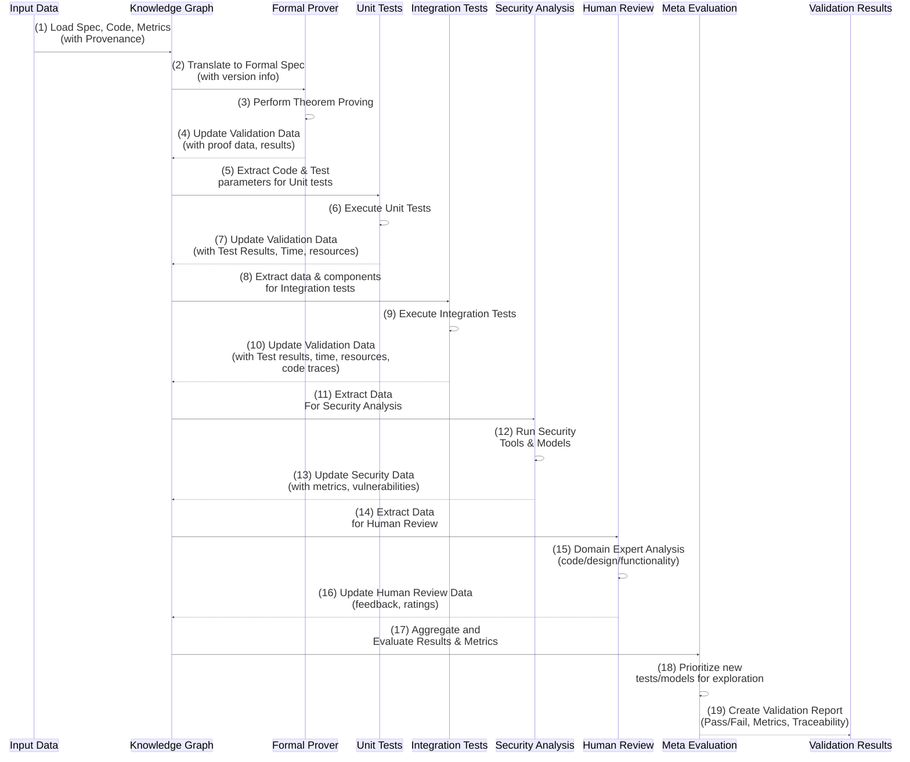
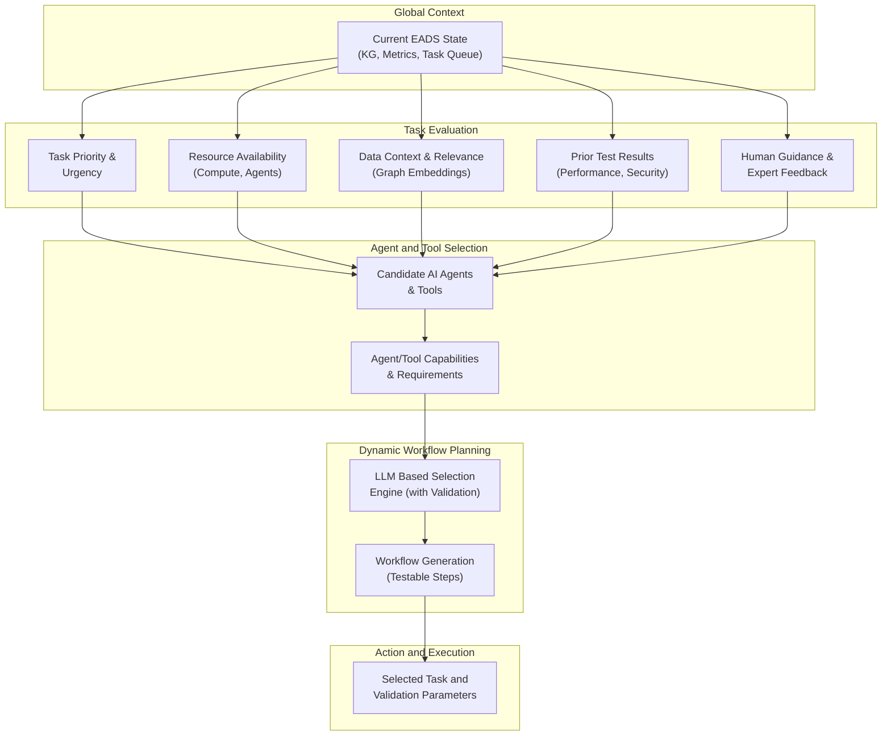
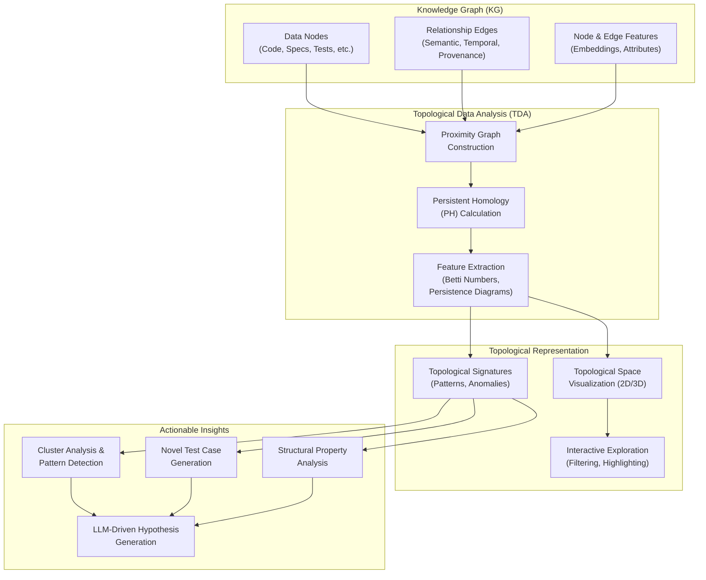

# Diagram 1

**Explanation:**

This diagram uses a sequence-based approach to make visible the steps involved in validating the core systems and components. In particular, those formal specifications (which are transformed), code, and associated metrics at various layers. It emphasizes the temporal order of operations, the data passed between components, and the key role each step plays in the overall process. It highlights a single path, through a chain of test and validation, given a single initial component. The aim is to make visible that process by explicitly modelling how such a system operates, and not just the end result of that operation.

1.  **Input Data:** (The diagram's starting point, not a component within the system itself)
    * This represents the specific artifact or data set that we're attempting to validate. In this model that might be a specific code function, a component, or some system that is to be verified. It includes not only its source code but also its prior specification and also any other metadata, metrics, or previous test data which have also been fully included in all prior steps.
2. **Knowledge Graph (KG):** (A Core system component):
    *   **Step 1: Load Spec, Code, Metrics (with Provenance):** The KG receives the initial input, which contains the code under evaluation along with any available specifications, test results, and provenance information. The knowledge graph stores this data using all models that were derived in prior steps. This now links that component with other data structures which might provide clues about its properties.
	*  **Step 4: Update Validation Data (with proof data, results):** The KG stores the results of the theorem proving attempt along with any proof-based metrics.
  *  **Step 7: Update Validation Data (with Test Results, Time, resources):** The KG receives test results, performance parameters and related information. The KG stores all such properties and metrics in their proper and designed data structures, using models and components, which must then have also been created using all prior methodology to demonstrate consistency across all levels of this system.
	*   **Step 10: Update Validation Data (with Test results, time, resources, code traces):** After Integration tests, KG stores test results, and links to performance data, code traces or other specific parameters that are tracked and modeled using properties of each and every component to build that validation data set.
	 *   **Step 13: Update Security Data (with metrics, vulnerabilities):** The KG stores all security analysis information, including any discovered vulnerabilities, their locations, and their severity metrics.
	  * **Step 16: Update Human Review Data (feedback, ratings):** The KG also captures any human expert feedback, as structured data (numerical scores, textual comments, and links to the specific regions of the code and models).
3.  **Formal Prover (FP):** A tool for performing formal methods, that also tracks its execution and all data used in its operations.
    *   **Step 2: Translate to Formal Spec (with version info):** The KG sends the relevant code (or other model) to the Formal Prover, along with instructions for what type of proof should be performed. Note that the Formal Prover also receives, as part of the data, links back to the source code, to verify that it is valid.
     * This is not simply "some data" it is all fully traced by provenance and versions to ensure data integrity.
	 *   **Step 3: Perform Theorem Proving:** The Formal Prover then attempts to prove if the code is correct, or that it meets a required property. Results of that proof (or failed attempt) is returned to the Knowledge Graph. Each step in this process also includes provenance metrics that are themselves also tracked for testing purposes.
4.  **Unit Tests (UT):** A component performing unit tests, again, also with traceable properties.
   *    **Step 5: Extract Code & Test parameters for Unit tests:** The KG provides all data to the unit test system. The data set includes version numbers, source and other relevant parameters so all tests are both traceable but are also all performed using components and tests that are all self verifiable using the knowledge that has been gathered during all prior steps.
	 *   **Step 6: Execute Unit Tests:** Using the provided test parameters, the Unit Tests are performed using the testing framework. Results are returned to the KG. All test frameworks must be similarly transparent and traceable.
5. **Integration Tests (IT):** Integration tests are designed to also test larger systems built from components to make sure they also are working given their specifications and all prior validation data.
  *    **Step 8: Extract data & components for Integration tests:** The KG provides all data and code components needed by the integration test system, along with a specific testing regime that maps to the source data for their validation based on what other components have reported previously when testing similar properties.
  * **Step 9: Execute Integration Tests:** Integration tests are run. Results of integration tests are also provided as data to the Knowledge Graph. The tests results and other test parameters (time, cost, energy etc.) that were measured during the tests also are linked back to the source code.
6.  **Security Analyzer (SA):** A specialized component for security analysis.
   *  **Step 11: Extract Data For Security Analysis**: The Knowledge Graph sends data to the security analysis module, (including source code, formal models, or other relevant details as are available) to perform those relevant security reviews. Each step in this process is also tracked for traceability.
    *  **Step 12: Run Security Tools & Models**: Security analysis is performed using LLMs (or other tools) using relevant standards and databases for comparison. Results are returned to the KG. The properties of this system are all tracked so the human may use the system to understand if the tool itself is providing correct results and to also explore areas where the tool itself might need to be modified or updated given a better understanding of a specific attack vector.
7.  **Human Review (HR):** An explicit component that represents the role of human expertise.
    *   **Step 14: Extract Data for Human Review:** The Knowledge Graph extracts all relevant information to be reviewed by human domain experts. This might include code, specifications, formal models, or test results, with explicit properties linked to the results of other tests.
    *   **Step 15: Domain Expert Analysis:** Domain experts then perform manual review (and use BCI if such technologies exist to make those hidden properties and patterns more explicit for human users or for future AI models that we might create), and provide structured feedback (scores, comments etc.) to the Knowledge Graph. This data then also becomes data that is used by other LLMs and AI powered tools for analysis. All comments are also explicitly linked back to source and or to particular regions of the code itself, such that also those prior tests can be re-examined if they are found to provide flawed data etc. (as this system evolves).
8.  **Meta Evaluation (Meta):** The final phase of validation.

    *   **Step 17: Aggregate and Evaluate Results & Metrics:** The KG takes all the data from the various tests, and sends it to the Meta Evaluation layer which aggregates, calculates and evaluates using all available data from all parts of the system based on metrics that are also derived from LLMs and that have traceable provenances. At this point the tests (and also the test data), and all analysis data used is included in this data set. These tests are run automatically but the results of each are used to generate new metrics for better data analysis in future test scenarios or to flag any component which is not behaving according to expectations and also to model that system’s response using its core architecture and operational procedures. The goal is to have a continuous flow of data where models also test their own model properties and where performance is tracked using explicit data.
	*  **Step 18: Prioritize new tests/models for exploration:** Based on all evaluation metrics the meta layer now selects or prioritizes what new test cases, new models or exploration criteria must be considered during the next cycle in the knowledge creation and validation loop. Any identified flaws, limitations or new possibilities for exploration are also now explicitly linked back to the original data source (all traceable using the system) for future revisions.

9.  **Output (Validation Results):** (The diagram's end point, not a component of the validation pipeline).
   *   **Step 19: Create Validation Report:** The Meta Evaluation Layer outputs a report summarizing the validation outcome, including whether the component passed or failed, metrics for testing, security, performance with full traceability links for all data, parameters, and decisions made during the validation process. The reports also include all data associated with the validation procedures so the entire process is fully auditable. The meta data links all pieces together with explicit connections to all sources of information.

**Key Features of this Pipeline:**

*   **Data Flow:** The diagram clearly shows how data from each step feeds the next in the validation process.
*   **Explicit Testing:** Each step represents a specific testing procedure (formal methods, unit tests, security analysis), and where humans play an active role in making evaluations based on data rather than conjecture.
*   **Traceability:** All steps and all data, and all test results are linked to the source via metadata, providing a complete audit trail.
*   **AI and Human Collaboration:** It is not merely AI that is doing the work, but also how AI also helps humans to perform these tasks to improve their efficiency and also to allow them to better assess complex situations.

**Emphasis:**

This diagram highlights that testing and validation in EADS is not just a final check, but a *pipeline* where data is transformed, interpreted, and verified at every stage. Every step should then have verifiable metrics to demonstrate its value. It also shows how formal proofs, tests and other data gathering methods and human expertise are all integrated into a system with high level organization and which all share common underlying datasets.

# Diuagram 2

**Description:**

This diagram depicts the dynamic decision-making process that an AI meta-planner uses to select and prioritize tasks and to choose the appropriate agents and tools within the EADS framework. It emphasizes the factors, data, and reasoning that guide the meta-planner’s choice of the “next best action”. It is a combination of a decision tree (showing branching and evaluation) and a more traditional block diagram (showing data flow and also structure) in an attempt to highlight both dimensions during system planning.

1.  **Global Context (A):**

    *   **A: Current EADS State (KG, Metrics, Task Queue):** Represents the overall state of the system. The system has full access to the knowledge graph, including metadata, all existing performance metrics (as generated by previous tests), the current state of all tasks, and all related information that might inform a higher level decision making step.

2.  **Task Evaluation (B1-B5):** This layer is where all various inputs are analysed and evaluated. These all influence a higher level decision.
    *   **B1: Task Priority & Urgency:** The meta-planner analyzes the importance of each task based on factors such as how long it has been in the queue, how it might impact other tasks, dependencies and other performance data, as well as the need for immediate human feedback. It also determines its importance based on the types of data that are related to that step and how critical that step is to the system's overall ability to produce reliable outputs (if those data sets demonstrate a strong ability to predict outcomes).
    *   **B2: Resource Availability (Compute, Agents):** This component checks if sufficient resources are available to perform a given task. That is, do we have the time, money, LLMs or other tools readily available? This is not merely if some component is active but if that component has the necessary type of resources needed. For example there may be three different LLM models but given the properties of the current task, then only one (or a particular set), is suitable and available. Other LLMs might be too costly for a particular step.
    *   **B3: Data Context & Relevance (Graph Embeddings):** The meta-planner analyzes topological relationships and embeddings in the KG to assess which type of data is the most relevant for a particular task using AI systems and its own knowledge of how to derive similar such metrics if it uses a new or untested method. What type of data is needed? Where do new insights arise? What type of test data is also recommended based on analysis of the prior models or test cases?
        *   Which data has a higher degree of confidence or reliability? Is this data consistent with all other parts of the model? Is the source verifiable? If not, what steps are needed to improve verification? What types of metrics, parameters, code properties might help solve or address these issues?
    *   **B4: Prior Test Results (Performance, Security):** This component looks at previous execution performance data from similar tasks or components and also reviews security audits when selecting a new step. The meta-planner looks at the performance, speed, security and other parameters that might influence how it should approach the next task. It may use past tests to guide the selection process. For instance, a specific implementation may provide high performance, but low security if prior test data shows that such a design choice does not also maintain security properties when other parameters are changed or are modified for new or future tests, etc.
    *   **B5: Human Guidance & Expert Feedback:** The meta-planner also includes any human comments or domain expertise as a part of this process if they are available. The human role is limited to specific areas where their expertise is both valid, traceable and also is used in a structured manner (as data).

3.  **Agent and Tool Selection (C1-C2):**

    *   **C1: Candidate AI Agents & Tools:** The set of agents and tools that are available in the system are considered. For each one it uses known properties (from previous test runs, metadata, provenances, etc). These are not simply interchangeable options, but each tool also has a unique data signature (or other verifiable properties) which have measurable effects when combined with specific types of test scenarios or validation steps.
        *   This node highlights the various types of LLMs with different strengths, capabilities and limitations, and also those various types of tooling and testing frameworks available to the system and which all need also to be selected dynamically.
    *   **C2: Agent/Tool Capabilities & Requirements:** The meta-planner checks if a tool meets the specific requirements of the current task. For example, some LLMs may be specialized in code review, whereas another might be more adept at code generation. Another may only produce formal proofs but does not provide any practical implementations. Tools might require data in specific formats, or have other limitations or biases which must then be also considered when selecting a suitable option to use in this selection process using traceability metrics. This also highlights how that data was validated by those systems that generated this data.

4.  **Dynamic Workflow Planning (D1-D2):**
   *  **D1: LLM Based Selection Engine (with Validation):** This component now uses all available data to select which models, testing processes and validation methods are more likely to produce high value results. The LLM is used to make this selection but it is also, itself, subjected to testing by the system using data from prior steps. A meta-LLM for selecting new LLMs and new testing frameworks with clear validation scores. The goal isn’t to use only one approach (such as human feedback) but to use all approaches as an ensemble, using the available data to choose the correct path given context and performance metrics.
     *   That choice of model should itself now also provide a summary of *why* it selected each model or approach (including LLM and humans) with explicit connections to the test data or source material. The model must select the type of action as well as the actual components for doing that step using all available data and also to note the limits if such data has limitations.
   *   **D2: Workflow Generation (Testable Steps):** It generates a workflow (a list of actions with parameters) that should perform the task. Each step must include also a method for validating its correctness, using all metrics available to that system, that might be derived from the system’s own operational data (or from third party test or validation systems, or from human reviewers and experts).

5.  **Action and Execution (E):**

    *   **E: Selected Task and Validation Parameters:** The chosen task, along with all selected components and required data is then executed. This is the output of this graph visualization and then those results become the inputs for the subsequent steps.

**Key Features of the Selection Process:**

*   **Data-Driven:** Decisions are driven by all available data (including the source and provenance of the input and all that meta data that it now contains).
*   **Context-Aware:** The selection process is specific to the current task, including what was learned during prior iterations and any other high-level evaluation feedback based on all prior test runs.
*  **Dynamic**: Models can be updated dynamically and also new models can be added to the selection pool or models can be removed if they do not provide actionable value. Models are not static and may need to also be continuously validated or modified or augmented with new features and properties.
*   **LLM as Planner:** LLM performs the core task of planning as a model that is also itself now validated by this process (with human inputs as one of several factors among many), given what it shows during test runs. All test results from each stage will also be used to refine subsequent choices.

**Why is this important?**

*   **Optimal Resource Utilization:** EADS is not simply running a static series of test procedures but actively chooses those tests and systems that are more likely to produce valuable results given the limitations of available resources.
*   **Enhanced Efficiency:** The dynamic workflow generation enables the system to adapt to different tasks and contexts and also to respond using feedback from those tests at runtime and to select new approaches given prior limitations or test data.
*   **Intelligent Agent Collaboration:** It shows how agents, tools and human insights are all combined and used by a meta-planning agent for more effective collaboration and how these choices are data-driven and are transparent. This is important for understanding how humans (or AI driven systems) learn or discover using this same approach.

# Diagram 3

**Description:**

This diagram visualizes how we use topological data analysis (TDA) to explore and understand our knowledge graph. It highlights how raw data is transformed into meaningful topological structures, which then enables new avenues for both human understanding (via visualization) and also for automated analysis and model selection and or design. It is also designed to hint at how that type of higher dimensional, topological information, may potentially be mapped to BCI.

1.  **Knowledge Graph (KG) (A, B, C):**

    *   **A: Data Nodes:** The foundation of our knowledge graph, consisting of various data points (code snippets, specifications, test results, etc.) all with traceable properties and version numbers and provenance and associated tests metrics as explicit data.
    *   **B: Relationship Edges:** Explicitly defined relationships between the data nodes including but not limited to semantic links, causal relationships, test dependencies or code call graphs as well as time and location when these were created, transformed, or validated.
    *  **C: Node & Edge Features:** Numerical attributes and high-dimensional feature embeddings of the nodes (and links), derived using various methods including LLM-based text embeddings, code properties or other methods that derive features from raw data.
       *  It is this combined data (graph, and all features associated with that structure) that will be the basis for our topological analysis. Each component (including testing results and code snippets) has its own set of associated data and its features are defined not just from that local region but from all data at every level.

2.  **Topological Data Analysis (TDA) (D, E, F):** This layer processes data to reveal topological properties.
    *   **D: Proximity Graph Construction:** The graph is transformed by constructing new links between nodes based on their proximity in that data space (using various metrics for data similarities). The resulting output also has a traceable representation as the graph topology with traceable provenance. The links then create a new underlying graph (and potentially a new topology) based on feature or properties from original graph but represented as a new entity in this transformation. These proximity graphs could also be based on different distance metrics and parameters or different feature embeddings.
   *   **E: Persistent Homology (PH) Calculation:** TDA algorithms (like Persistent Homology) compute topological features (connected components, loops, voids) at different scales from that proximity graph. This is where higher dimensional or non euclidean features are explicitly extracted.
   *   **F: Feature Extraction (Betti Numbers, Persistence Diagrams):** The results of the PH calculation (often in a barcode or persistence diagram form) are now transformed into numerical vectors that capture the topological features of the graph, using methods for topological feature vector extraction or also using other properties that have been derived during this process, to now also become a data structure that LLMs and humans may readily understand given previously defined metrics, models and test parameters.

3.  **Topological Representation (G, H, I):** Here, TDA data is transformed to a space which humans (and also models) can navigate.

    *   **G: Topological Space Visualization (2D/3D):** The topological data (often a complex, multi dimensional object), is projected onto 2D or 3D space using various techniques to make it more accessible for human observation (and for integration using BCI) while still preserving relevant topological properties. This may be a set of graphs or a high dimensional point cloud or other visual representation of that data structure derived through various transformations for various different purposes (or for different types of data).
        * This also is an explicit representation of that knowledge that might also form a basis for human expert driven decisions by leveraging BCI (or other similar methods for directly mapping data to a human cognitive system using direct sensor inputs).
    *   **H: Interactive Exploration (Filtering, Highlighting):** The visual representation of that data structure (or graph) allows human users to interact with the topological structure, filter or highlight specific features (using metrics from prior testing phases, for instance) or regions of that transformed graph data in real time to explore patterns or anomalies using interfaces which now may also be driven by LLMs. The data structures are not simply a static result, but a new interface.
    *    **I: Topological Signatures (Patterns, Anomalies):**  Specific patterns or deviations in the topological features (like loops or voids, or connected components), become a way to identify relevant relationships in the data, including any inconsistencies, unexpected connections or limitations which may not have been obvious from the original data structures.

4.  **Actionable Insights (J, K, L, M):** The data is now used to create new information and action.
     *    **J: Cluster Analysis & Pattern Detection:** The TDA data is now used to perform cluster analysis to identify groups of data with similar relationships or shared properties. It may also be useful in identifying outlier data sets that are not readily explained by the known models (or properties).
    *   **K: Novel Test Case Generation:**  The topological insights now suggest new test cases, which explore those specific regions of the data set, that now reveal unique properties. These also may test edges cases or other specific situations that were not considered when creating the prior models or test methodologies. The tests that are generated are also traceable and verifiable (and if generated by an LLM then that also requires further validation as previously discussed).
     *   **L: Structural Property Analysis:** Topological properties provide a set of techniques for analyzing the structure of the knowledge representation, potentially leading to new insights about its limitations, strengths, organization, or other properties that could be useful to refine systems design. This will also uncover implicit biases or assumptions that are also built in at various layers and that also need to be validated (or to be explicitly noted as potential limitations).
    *   **M: LLM-Driven Hypothesis Generation:** LLMs are used to analyze the topological features and other aspects of the graph and then propose new hypotheses or new research directions based on its interpretation and where a human or other agent can then decide which ones are worthwhile to test using similar methods. Those proposed directions themselves are new test parameters for the LLM or other AI agents (or even human experts) to use in this iterative model construction and validation process. All data are also tracked so we can look back to see why a specific recommendation was made and all data that influenced that selection decision.

**Key Features of Topological Exploration:**

*   **Data Driven:** This system does not rely on intuition, but real data that can be visualized, measured and modeled to guide its operations using metrics derived from the design itself as well as from human expert feedback.
*   **Visual Insights:** By making hidden relationships visible, topological exploration can provide intuitive visualisations to guide human analysis and understanding of complex problems.
*  **Uncovers Hidden Structures:** Reveals underlying patterns and relationships in data that are not readily apparent in other forms of representation.
*   **Supports Iterative Refinement:** The topological structure provides new ways to identify areas that might need modification to our models and methodologies, and for creating new test parameters using LLMs to generate novel and unforeseen test scenarios.
*   **Foundation for BCI:** This also provides a foundation for using brain-computer interfaces (BCI) to explore complex data structures, by mapping information into a topological space which also is structured to map onto human cognitive biases.

