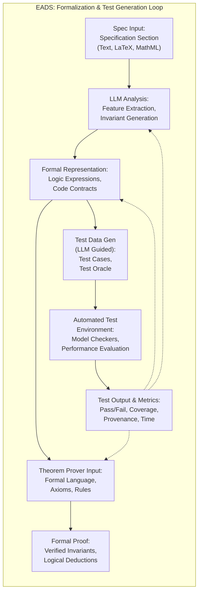
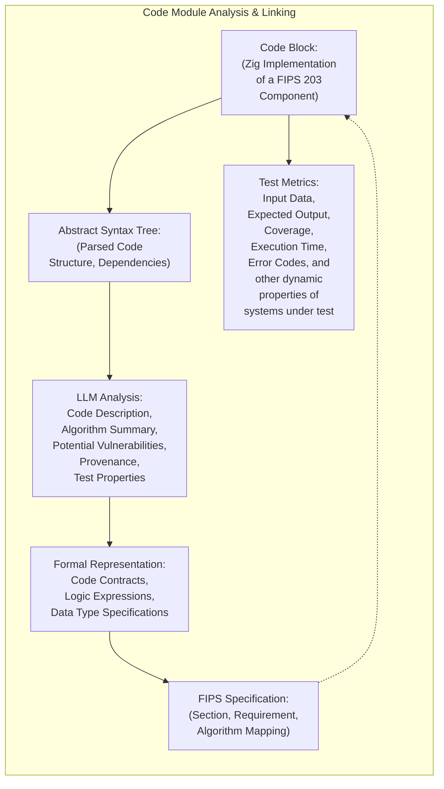
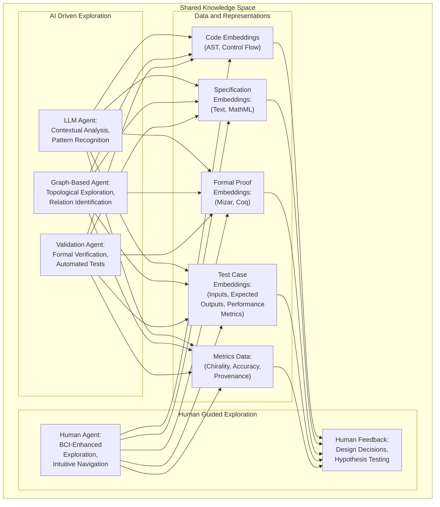

# Diagram 1

**Diagram Explanation:**

This diagram outlines a specific pathway for processing a well-defined input from a formal specification to a formal proof using automated testing procedures and models that also test that same system. It is designed to be highly detailed, highlighting how data is transformed, and also the types of properties that exist at each phase, using explicit labels. This example might be for a specific cryptographic function that has known limitations such as the generation of random numbers, to also highlight the need for a system which understands its own limitations and how those can influence that overall process:

1.  **`SpecInput`: Specification Input (Text, LaTeX, MathML)**: This represents a single, well-defined portion of the FIPS 203 specification (or some similar standard document) that our system must implement, test, or verify. This could be a specific algorithm, data structure definition, or a set of security requirements. The input can be in various structured formats such as LaTeX with mathematical typesetting, textual descriptions, or also with XML and those formal notations used in MathML. This also now tracks version control information or any other properties related to data provenance, or any information about prior systems or models which use this format or data. All are also available as properties of the node using those previously-defined and readily available data structures using those graph databases etc.

2.  **`LLM Analysis`: LLM Analysis (Feature Extraction, Formalization, Invariant Generation)**: Here the chosen LLM (based on its training and expertise in this specific area from previous or even parallel runs using some other test case, and which must also be traceable etc.) attempts to understand and extract data, identify relationships, then to transform that understanding into more structured representations to allow the formal testing that is performed in the subsequent step to generate actionable data:

     *   **Feature Extraction:** This involves techniques to extract important components including descriptions, tables, algorithms, data, mathematical expressions, parameters etc. that exist in the `SpecInput` and generate a structured format which that system understands. This also tracks the specific version or source if that is applicable.
     *   **Formalization:** The LLM translates extracted data from the spec into formal notations such as mathematical or logical statements that a formal prover or other automated systems such as a model checker etc., might then use for verification. This also must include those properties about that data which can then be used to track the performance of that system later.
     *   **Invariant Generation:** LLMs can attempt to generate key invariants (conditions that should always be true) for the algorithm and code using existing approaches or perhaps by designing new methods.

3.  **`FormalRep`: Formal Representation (Logic Expressions, Set-Theoretic Models, Code Contracts)**: The output of that earlier LLM analysis then becomes an explicit set of formalized statements or requirements, that represent the properties of a cryptographic function, or for any system that might be used, for how that data must be tested by that system at any given stage, for which those requirements are explicitly defined using those formal and verifiable methodologies and/or those logical or mathematical or other models that can be tracked using similar techniques. The data can be translated to an external language that is more readily understood by those formal verification tools like that of a theorem prover and which also includes that formal axiomatic structure that might or might not be explicit in the original FIPS 203 specification etc. and where such relationships can also be tracked in our data set.

4.  **`TheoremProver`: Theorem Prover Input (Formal Language, Axioms, Rules)**: This represents the step where that formalized model of what we understand and that needs to be tested is then used to then generate the inputs that a theorem prover or similar formal verification system uses. It must all come from verified, and tested and traceable sources, data and their models etc. It is in that stage that you must include all parameters (using some standard format or framework), for our system to have verifiable proof that some particular model or some aspect of that system meets its requirements. All data must flow through such a structure. This is not optional. It is the very criteria by which we determine its value and its correctness.
5.  **`FormalProof`: Formal Proof (Verified Invariants, Logical Deductions)**: Represents the output of the formal prover (such as Mizar), if and where that data is present. The actual code is still not part of this step (this is a validation stage), but this step will verify all properties of that code using formal proofs. Using those tools, if it finds that they now hold true (given input and transformation based on LLMs) given its axiomatic structure, then we are more confident. If it finds otherwise, we may now have insights into how to make better use of those LLMs at prior stages etc. where the output of this system, and those theorems or proofs they generated, may itself also become an input for future model testing or code implementation if the systems have also been shown to generalize or to transfer effectively across different tasks, and this is also a property we wish to measure and to incorporate directly in our testing framework.
6.   **`TestGen`: Test Data Generation (LLM Guided) (Test Cases, Test Inputs, Test Oracle)**: Using this formal representation, an LLM is used to generate a set of specific test cases that meet the requirements to test that component. These tests also have properties such as their inputs, expected outputs, the conditions for testing and all metadata linking them back to our knowledge graph and its associated structures. This is where some previously described AI or LLM tools might help to generate boundary or edge cases or to explore parts of the state space not explored using more traditional methods if that is deemed valid by those experts who perform independent testing of code using those systems.
7.  **`TestEnv`: Automated Test Environment (Model Checkers, Test Runners, Performance Evaluation)**: Here, the test cases are then all executed using test frameworks and other tools which can verify the system at every level using well established methodologies etc., with automated checks for coverage and also with additional specialized tests for specific data sets. All test data (including time, memory use and other key metrics), are recorded with their source data. These tools also must also produce data that is testable and can be measured using our system to ensure those same levels of performance are maintained for all tests generated by the framework and or LLMs. That test data, then, becomes the next input into our validation stage.
8.  **`TestOutput`: Test Output and Metrics (Pass/Fail, Coverage, Side Channels?, Provenance, Time)**: This final (but intermediate) stage captures results using formalized formats. Provenance is tracked, with links from the test results to the original FIPS specification and to the code itself. This is the result of testing and verification using various approaches. Here the code is tested against the known requirements. The results can also highlight properties or behaviours that were never included in those test cases or in the formal methods, such as when a side channel vulnerability is discovered, or if time or memory consumption is higher than specified and where those LLMs or those higher order multi agent systems might now reveal potential areas of improvement for our systems, either at low-level implementation or that in our models or methodologies, so we can then map those insights onto new testing methods to discover other potentially overlooked properties.

# Diagram 2

Okay, let's dive into **Diagram 6: A Specific Code Module (Focus on Reverse Engineering)**. This diagram will focus on a single, representative code module (or function) from a hypothetical FIPS 203 implementation, illustrating how EADS extracts information, links it to the specification, generates test cases, and tracks various properties through a reverse-engineering process.

Here's the Mermaid code for this diagram:

**Description of the Diagram:**

*   **Diagram Type:** A graph diagram, emphasizing relationships between different elements of a code module with explicit data to show how different methods all map back into verifiable claims and how we track those properties such as code complexity, source of validation, provenance of data, test parameters and data and metrics and so on.
*   **Nodes:**
    *   `CodeBlock`: Represents the core element – a code function (or module) written in Zig that is designed to implement part of a FIPS 203 specification, or any other piece of code that the system intends to evaluate. This is the raw material and also the initial (or current) state where transformations also must then be applied to that data in some meaningful way.
    *   `AST`: The abstract syntax tree of this `CodeBlock`, generated by a compiler's parser or by some LLM which is trained to reproduce this structure, which is itself a formalized output based on code parsing tools. It captures structural information of the code, identifying functions, variables, and control flow. It also includes data for how various steps are implemented and the relationships between all steps using those properties of code analysis tools, that LLMs can also now access or process, and that information must also then be mapped into the high dimensional space such that the LLMs also have access to this data as data which it uses to inform the actions or other behaviors which it is performing.
    *   `LLM_Comments`: Represents an LLM-based analysis of the `CodeBlock`. LLMs may summarize what code does and provides information about the algorithm it is designed to implement, or may suggest ways to create better or more comprehensive test frameworks, based on what has already been shown or exists in existing high quality software projects that have similar use cases.
       * This LLM may also help create an abstract view of the code in some formalized system by generating code contracts, preconditions and post-conditions, etc. from the source, which becomes a verifiable model which has all of its data explicitly recorded using those properties such as time, source of data, system used for its evaluation etc.
       * The LLM may also detect potential vulnerabilities, or those side channel properties where the code might be susceptible to some type of exploitation by identifying patterns which correspond with a set of known security guidelines such as CWE or by comparing with other similar high quality or highly secure open source systems or if there is a mismatch between specification and implementation. For instance by identifying areas where a formally verified model now does not correspond to real world implementation parameters etc. All such inferences must have provenance and traceability so all claims made by the system (or its LLMs) can also be further tested and validated (and potentially improved).
    *   `FormalRepresentation`: The extracted formal semantic model of the code module using LLMs and also from direct translation of that code using existing formal logic or mathematical modeling systems where code contracts, logical expressions, invariants, and other data type specifications may be tested and verified separately.
     *  Such models are a formalized representation of code using some form of logic (or mathematics) which makes assumptions clear and makes the code more readily verifiable and also traceable across various versions given those same types of automated formal verification tools, particularly when used in a high assurance or safety critical environments and systems where human lives may depend on their reliability. LLMs now become "tools" for generating these types of higher levels of abstractions.
    *   `FIPS_Link`: A mapping (using explicit identifiers) from the `CodeBlock` to the specific parts of the FIPS 203 specification it is supposed to implement. This provides traceability between code and its source. Data and metadata may now also track properties about that connection including its type, if there is a direct implementation, a related example, or a general model etc. as well as the LLM generated comments which also now demonstrate the model’s current level of understanding about that connection, or that LLMs level of trust. That mapping data may also suggest where there are gaps in understanding such as if it lacks a direct link, or if the source data itself (the specification) is incomplete or otherwise unclear or ambiguous if those conditions exist at higher levels as well.
	 *   `TestMetrics`: Represents a compilation of all test data derived from running and testing a CodeBlock (unit, integrated or system). It captures input and output data, code coverage data, time and memory usage data, error codes and also performance metrics, along with some higher-level metrics if any, such as the degree of trustworthiness or validity if the system and its LLMs or other AI based models, discover patterns which also map to the same types of patterns used during formal methods or other security/performance checks. All test data is traceable and also linked to specific tests for those modules such as performance benchmarks or edge case testing etc., to show what conditions have and have not been tested at every level of the system given existing tools, time and all other resource constraints that are now also included as properties.

*   **Edges:** Represent the flow of information and dependencies:
     * Solid Arrows: Represents the explicit relationships between data. It also shows how information flows such as when code maps to some formal model or when code is analyzed to extract AST or when code comments are generated etc., and also indicates that there is some implicit order of operations being used. It shows the direction for the information flow.
    * Dotted Arrows: Represent bi-directional connections where that information can also improve prior stages such as if that formal model of code is then used by the LLM to generate test cases to ensure certain code properties are always enforced. It also shows where higher-level properties now influence lower-level design decisions.
    * The `FIPS_Link` is a dotted arrow to show how this information provides a "ground truth" and also the origin of those initial inputs, such as which section of the specification directly corresponds to the currently tested function. This also highlights when the source itself might also be missing or have other types of problems or limitations given the results from this phase.
    *   Emphasis in Description:
        *   This diagram shows the process of reverse-engineering a code module by analyzing its code structure, its properties from human comments or other data extracted during code parsing and using formal methods where applicable and by mapping that data to the original FIPS spec, in order to better understand its purpose. All are explicitly included with traceable information such as their sources, properties and methods for their creation.

        * This model shows a combination of LLM capabilities with formal methods techniques and other tools for creating data that is both explicit and traceable.

        *   The diagram also emphasizes that tests or other data also are not considered secondary but as explicit components that are directly related to code by showing how test data is also linked to the specific components of code that are being tested or to the original FIPS specifications that the code intended to address as a requirement or goal.

        *   This diagram is intended to show that this complex system should be self-verifiable (to some degree) by mapping explicit relations from source, code, documentation, tests and human interaction (such as reviews), and also by using LLMs for generating properties from those outputs using a variety of methods. This also shows that that provenance information and those data properties are included in all parts of the system.

# Diagram 3

**Description of the Diagram:**

*   **Diagram Type:** A spatial network diagram, designed to visually suggest a shared space (a "hyperspace") that all different forms of knowledge (code, spec, validation and human insights) all share, where humans and AI both can interact, and transform that space by exploring its properties.

*   **Nodes:**
    *   **`SharedKnowledgeSpace`**: Represents the shared space itself (a high dimensional embedding or hypergraph structure) which is accessible by the AI and also the human. The precise nature is unimportant for the diagram. This also uses stylized background colors and borders to highlight this shared view.
       * **`HumanExploration`:** Represents the human component of this approach:
         *  `H_BCI`:  A human agent using a BCI or other similar system for exploring the space, directly sensing the structure of the multi-dimensional space and also using LLM-augmented systems to provide context.
            * It also highlights the ability to transform or otherwise modify this space using human intent. It also represents a new type of input data (that of human intuition and exploration), which can be used to validate or test other parts of the system as we move forward by mapping that human intuition onto verifiable data metrics etc.
         *   `H_Feedback`: Captures human feedback by modeling those areas where the human provides a novel solution or a way forward which the AI may not have been able to discover (or does not discover efficiently), and by providing insights, or by acting as that external validator for other models. It also provides that human-generated data for comparison against other models as we refine and evaluate what a "best path" might actually be using this approach to see where those metrics or properties also overlap such as when both LLMs and humans select the same models, or the same pathways in this shared knowledge/data space etc. using similar criteria for testing if they both converge on the very same points. We also then record the reasons why or why not given each test scenario and in this high-dimensional embedding which we all explore during our research.
      *  **`AIExploration`:** Represents the different types of AI agents and tools used in EADS:
          * `AI_LLM`:  An LLM agent acting as a core component in analysis, feature extraction, validation, etc. trained for this high-dimensional space to identify those meaningful patterns in this combined and interconnected dataset.
         *  `AI_Graph`: An LLM or similar AI that is trained to explore, modify or refine a topological structure, such as when LLMs traverse through this or a related knowledge space using graph or network analytics or similar data-driven approaches using high dimensionality, data sets to identify emergent relationships etc.
          * `AI_Validation`: A set of AI tools for conducting automated tests, formal verification procedures or to discover and test and identify new vulnerabilities etc. if that were the target test metric. For instance when a system must validate a formal proof.
     *  **`DataSpace`:** In this shared high-dimensional space, are a set of different types of data such that they are now also organized based on their underlying structure.
           *   `D_Code`: A representation of code modules (from source, or generated code) and their properties and the properties of their design and that also includes version information and all provenance data.
          *  `D_Spec`: Data about the input specification (text, equations, and any other related details extracted using LLMs or through manual processes).
          * `D_Proofs`: Data representing formal proofs (including links to the formal methods that were used, data used during proofs or for theorem validation) and any other related data, and provenance for all steps which led towards the claim, and using verifiable metrics, if any.
         *  `D_Tests`: Representation of various tests (unit, integration, security, performance) including what data was derived when running tests given a particular approach, what properties they were designed to address, and also all performance and validation metrics.
        *  `D_Metrics`: Representation of all metrics used to evaluate the data and systems within this model (time, memory, security scores, LLM confidence, test coverage, etc.). These are the core data points which measure if a model is better than any prior model that has been validated or rejected in prior tests. All these datasets are linked using their traceability and are available for analysis. This helps to establish "truth" by highlighting relationships between performance metrics for particular code or methods (and also those testing frameworks etc.,) when exploring this high dimensional graph space. This data itself can be modified and validated by other AI tools.

*   **Edges/Connections:**

    *   Bidirectional arrows indicate dynamic flow of information. LLMs, humans, and all layers can change the representation, structure and data, and its properties. In this way it is possible to demonstrate that the entire system is being tested, and is also itself a testbed. This is not a static set of components.
    *   Implicit spatial relationships within that multi-dimensional space might suggest how strongly those different parts are related.
     *  The emphasis is that all components now have access to a common shared data (which is stored and represented in that shared space) and that this representation itself is also testable by that same system which now also creates it using this framework and methodology.

*   **Style Notes:**
    *  Stylization is used to separate out distinct components and to show a spatial model where LLMs are also exploring data, not in a linear manner, but in some novel and potentially higher order or multidimensional hyperspace with explicit properties that human domain experts can also use if that approach itself proves useful.
    *   Nodes are given short, but descriptive labels to help keep the diagram from becoming cluttered, while still conveying what each component’s purpose or role is during these explorations.

*   **Emphasis in Description:**
    *   This diagram emphasizes collaboration between human and LLMs within a shared environment. The human, is not excluded or simply used to validate data at some future step, but is also an active participant.
    * It illustrates the potential for BCI-enhanced exploration using AI feedback, when that is available or if a better model etc. arises for doing similar types of tasks by exploring these various emergent properties, to identify those insights which become readily apparent using such tools, if they can translate or be mapped into human understanding.

    * The core point is that all components (human, AI, data and even that method and structure itself) are represented in a shared space, and all of them are now also actively transforming it. The system itself, as we've discussed, isn't only just a code or knowledge generator, but it is also, simultaneously, learning how best to do science and research, by also discovering the best methods for data representation and analysis (which may include new mathematical tools or a better understanding for what it means to have "trust" in a system etc.). Where that process itself and its outcomes may then also now suggest a new direction.

    * It also shows that this is not a linear process of transformation, but a highly complex, dynamic and interconnected system with many different levels where emergent properties may arise and that this might be very different than what is currently understood using traditional approaches. But what makes these kinds of approaches useful or not, still must be measured using traditional, verifiable models to understand where and why they also perform better, or fail or how we model truth in these complex scenarios where a single definitive answer to some problem may not exist, and/or where those very tools for validation also need to become more robust.

    * This model explicitly incorporates human interaction as an intrinsic part of this exploration rather than as some sort of post-hoc assessment or validation step and thereby also tests where LLMs may be sufficient versus where humans are better etc. given some well defined task, and the data and metrics to test that hypothesis using data generated from such combined models.

This diagram now presents a glimpse into a more transformative potential of your research. EADS is no longer simply a compiler or code generator. It is now also, and simultaneously a research tool where human and AI now both have unique but overlapping roles, and by which we and they together explore complex high-dimensional spaces using different tools and methodologies and where that exploration is driven by a shared goal to create a more efficient, safer and more reliable system for generating data that all participants can trust.

